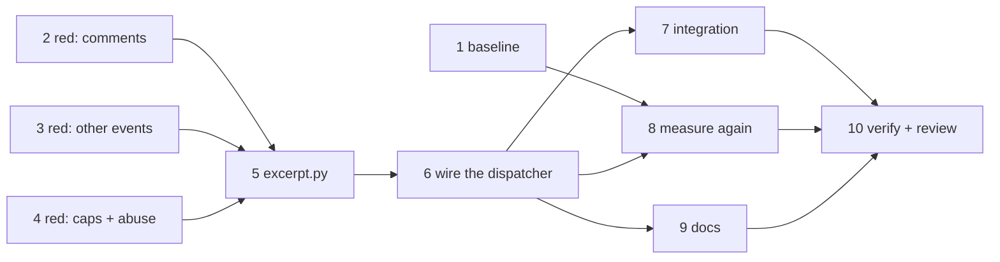

# Tasks: a forwarded event carries the instruction, not GitHub's metadata

> The last spec artifact. Derived from the approved [`design.md`](design.md) and
> [`testing-plan.md`](testing-plan.md).

## Task list

- [x] 1. Capture the baseline measurement
  - Commit `evidence/measure_prompt.py` (a realistic `issue_comment` webhook payload,
    rendered through the shipped event template) and its output as `evidence/baseline.md`.
  - This is the number the change is judged against; it must exist before the change.
  - _Depends on:_ none
  - _Requirements:_ non-functional (cost)
  - _Test:_ `T8 — uv run python docs/specs/issue-243/evidence/measure_prompt.py`

- [x] 2. Red: unit tests for the comment surfaces
  - `cli/tests/test_excerpt.py` — `issue_comment`, `pull_request_review_comment`,
    `pull_request_review`: the carried fields, the anchor-before-body order, the bare
    login, and the negative assertions (no `issue`, no `sender`, no `api.github.com`, no
    `avatar_url`).
  - _Depends on:_ none
  - _Requirements:_ R1.1–R1.5
  - _Test:_ `T1 — uv run pytest cli/tests/test_excerpt.py` (red→green)

- [x] 3. Red: unit tests for every other routed event
  - Lifecycle (`issues`, `pull_request`) with and without a `label`; `workflow_run`,
    `check_run` (including `output`), `check_suite`; `status`; an unknown event; an empty
    payload.
  - _Depends on:_ none
  - _Requirements:_ R2.1–R2.7
  - _Test:_ `T2 — uv run pytest cli/tests/test_excerpt.py` (red→green)

- [x] 4. Red: unit tests for the caps and the abuse cases
  - A 10 KB body: field-only truncation, parseable JSON, surviving `html_url`/anchor.
    Forged JSON inside a body. An unlisted hostile field. A malformed container.
  - _Depends on:_ none
  - _Requirements:_ R3.1–R3.3, abuse cases 1–4
  - _Test:_ `T3, T6 — uv run pytest cli/tests/test_excerpt.py -k "cap or abuse"` (red→green)

- [x] 5. Green: `cli/the_loop/webhook/excerpt.py`
  - The two tables, `event_excerpt(event, payload)`, the `payload_excerpt` alias, the
    per-field text cap and the defensive global cap.
  - _Depends on:_ 2, 3, 4
  - _Requirements:_ R1, R2, R3
  - _Test:_ `T1, T2, T3, T6 — uv run pytest cli/tests/test_excerpt.py`

- [x] 6. Green: wire it into `Dispatcher._render_prompt`
  - Pass `routed.event`; re-export `payload_excerpt` from `dispatcher` for compatibility;
    delete the old implementation and its now-unused key tuple.
  - _Depends on:_ 5
  - _Requirements:_ R4.2, R5.2
  - _Test:_ `T7 — uv run pytest cli/tests/test_routing.py cli/tests/test_interaction.py`

- [x] 7. Integration: ingress parity and the untouched gates
  - `cli/tests/test_excerpt_integration.py`, Gherkin-documented: the poller's synthesised
    comment event and the webhook event for the same comment render the same fields; and
    authorization / self-comment detection / control parsing / reaction targeting still
    decide correctly for an event whose excerpt omits their inputs.
  - _Depends on:_ 6
  - _Requirements:_ R4.1, R5.1
  - _Test:_ `T4, T5 — uv run pytest cli/tests/test_excerpt_integration.py` (red→green)

- [x] 8. Measure again and record the delta
  - Re-run task 1's script; commit `evidence/after.md`; reconcile the numbers quoted in
    `requirements.md` § Introduction and `design.md` with what was measured.
  - _Depends on:_ 6
  - _Requirements:_ non-functional (cost)
  - _Test:_ `T8 — uv run python docs/specs/issue-243/evidence/measure_prompt.py`

- [x] 9. Docs: capability doc, user-facing docs, decision record
  - `docs/capabilities/webhook-triggers.md` gains the distillation behaviour block and a
    history row; the decision log records the allow-list choice and the _deferred_ answer
    to the constant-text question.
  - _Depends on:_ 6
  - _Requirements:_ R6.1
  - _Test:_ `T7 — uv run pytest cli/tests/test_docs_parity.py` + `markdownlint`

- [x] 10. Verification, reviews, briefing
  - Execute `testing-plan.md` and fill its results; self-review rounds; security review;
    post the pros/cons analysis on the ticket for the owner (R6.2); reviewer briefing on
    the PR.
  - _Depends on:_ 7, 8, 9
  - _Requirements:_ R6.1, R6.2
  - _Test:_ `T7 — uv run pytest` (whole suite) + the full lint set

## Dependency graph (DAG)

Three independent red roots (2, 3, 4) plus the baseline (1), which is independent of all
of them and must land **before** task 5 changes what is measured.

## Checkpoints

- After tasks 2–4: the red run is captured to `evidence/red.md` **before** task 5 exists.
- After task 6: the whole existing suite runs — this is where a regression in an operator
  template contract or a delivery test would show.
- After task 8: the measured delta replaces every estimated number in the specs.
- After task 10: the ready-to-ship gate — green checks, evidence committed, capability doc
  updated, briefing posted, ticket carrying the R6 analysis.

## Review comments

_None yet._
