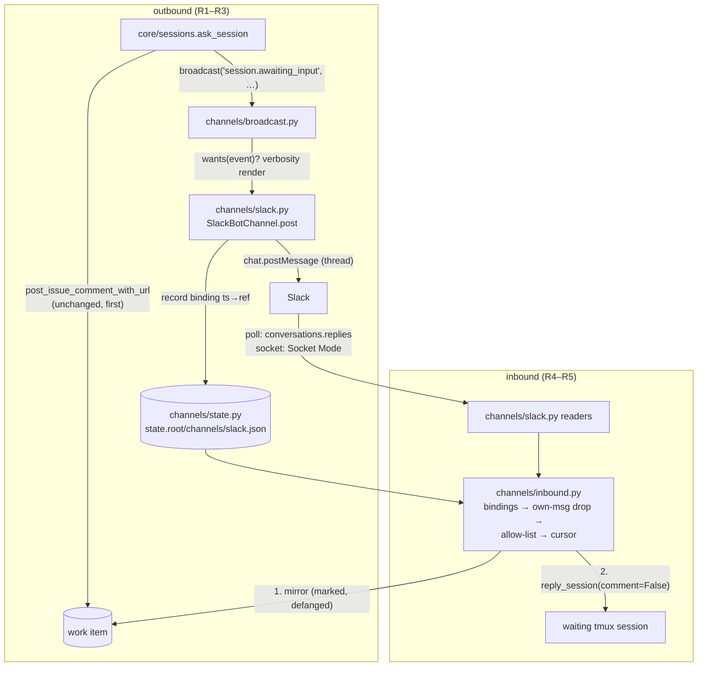

# Design: channels — back-and-forth user communication, starting with a Slack bot

> Phase 2. Derived from [`requirements.md`](requirements.md). Risk tier **4**: the CLI
> config schema is touched (`autonomy.sensitivePaths`), and inbound text gains a path
> into agent sessions — the security design section is the contract.

## Overview

One new package — `cli/the_loop/channels/` — owns the whole feature: the channel
contract, the Slack bot provider, the outbound broadcast, the inbound pipeline, the
thread-binding state, and the two read transports. Exactly three existing seams are
touched: `core/sessions.ask_session` gains a broadcast call after its work-item post,
the two daemon run-loops gain a `channels.start_watcher(...)` line beside the
self-diagnosis watcher they already start, and the CLI grows a `channels` verb.
Everything else — the marker contract, the reply path, the GitHub writer — is reused,
not modified.



## Components

### D1 — `channels/base.py`: the contract

A `Channel` is the integrations `Integration` protocol's shape, adapted to
conversation: `name`, `wants(event_type)`, `post(event) -> PostResult`, and (for
readable channels) `fetch_replies(...)`. An `OutboundEvent` dataclass carries
`event_type`, `work_item` (ref string), `text`, `url`, `detail` (mapping). Rendering by
verbosity (`quiet` | `normal` | `verbose`, R2.2) is one pure function in `base.py`, so
every future channel renders identically. `load_channels(config)` builds the enabled
channels from the `channels` config section — today that is zero or one
`SlackBotChannel`; a malformed section logs and yields nothing (fail closed, R6.1).

### D2 — configuration: a new top-level `channels` section (CLI config)

Fixed keys with `additionalProperties: false`, the `integrations` pattern:

```yaml
channels:
  slack:
    enabled: false                          # default off (R1.4)
    botTokenEnv: THE_LOOP_SLACK_BOT_TOKEN   # xoxb- token env var (R3.1)
    appTokenEnv: THE_LOOP_SLACK_APP_TOKEN   # xapp- token env var, Socket Mode (R4.2)
    channel: ""                             # Slack channel id the bot posts into (C…)
    events: [session.awaiting_input]        # event-type allow-list (R2.1)
    verbosity: normal                       # quiet | normal | verbose (R2.2)
    authorizedUsers: []                     # Slack member ids (U…) — empty = deny all (R5.1)
    read:
      mode: poll                            # poll | socket | off (R4)
      intervalSeconds: 30
```

Under `channels`, not `integrations`: an integration is a transport for the-loop's own
calls; a channel is a conversation surface with a filter, a verbosity, an allow-list
and inbound state. Conflating them would put `authorizedUsers` and `events` on a shape
whose other members are pure transports. *(Amended in review — R3.4/decision-094 D8:
`integrations.slack` is not kept beside this section; the graph's `notify` hook
broadcasts through channels, the webhook integration is removed, and
`the-loop migrate-config` (config version 0.5.0) retires an old section.)* Tokens are
named by env var, never held as values — the `secretEnv` arrangement, applied twice.

### D3 — outbound: `ask` broadcasts after the work item has the question

`ask_session` posts to the work item and emits `session.awaiting_input` exactly as
today, then calls `channels.broadcast(...)` best-effort: per enabled channel,
`wants()` filters (R2.1), the renderer applies verbosity (R2.2), `post()` posts, and
`channel.posted` / `channel.post_failed` is emitted. A channel error is caught per
channel — the ask's result dict and exit code are computed before and without regard to
broadcast outcomes (R1.2). The broadcast is invoked from `ask_session` (the core
function), not the CLI command, so the control-plane API route and the SDK binding get
it for free.

### D4 — thread bindings and cursors: `channels/state.py`

One JSON file per channel type under the state root:
`<state.root>/channels/slack.json` — `threads` (thread ts → `{workItem, channel}`),
`cursors` (thread ts → last-processed reply ts). Local, not portable (a conversation
belongs to the machine that had it), registered in `docs/cli/state.md`. Bounded: past
200 threads the oldest binding is dropped — a dropped binding only means replies in
that old thread stop being read (R4.4 makes unmapped threads inert). Atomic writes
(tmp + rename), the `WorkItemStore` pattern.

### D5 — inbound transports: poll and socket, one pipeline

- **Poll** (R4.1): `channels.start_watcher(cli_config, stop_event)` — a daemon thread
  looping `stop_event.wait(read.intervalSeconds)` → one fetch cycle, exactly the
  self-diagnosis watcher's shape, started in both daemon run-loops beside
  `selfdiagnosis.start_watcher`. A fetch cycle calls `conversations.replies` once per
  open thread with the persisted cursor. `the-loop channels poll` runs one cycle
  synchronously (cron / daemon-less deployments).
- **Socket** (R4.2): `the-loop channels listen` runs `slack_sdk`'s built-in
  `SocketModeClient` (no extra dependency) in the foreground: `message` events whose
  `thread_ts` matches a binding are fed to the same pipeline; everything else is
  ignored client-side. A dedicated verb rather than a daemon thread: a WebSocket's
  reconnect lifecycle does not belong inside the poller's cycle loop, and the operator
  choosing push explicitly runs the listener.
- Both transports converge on `channels/inbound.py` and share the cursor store, so
  switching modes cannot double-process a reply (R4.6).

### D6 — the inbound pipeline: map → drop own → authorize → mirror → deliver

Order is load-bearing (R5):

1. **Map**: `thread_ts` → work item via bindings; unmapped → `channel.dropped
   (reason: unmapped)`. The bot never reads outside its own threads (R4.4) — the poll
   transport structurally cannot (it only queries bound threads), the socket transport
   filters.
2. **Drop own**: any message carrying `bot_id`, or authored by the token's own user id
   (`auth.test`, cached per process) → dropped silently (R4.5).
3. **Authorize**: Slack **member id** in `channels.slack.authorizedUsers`; empty list
   denies all → `channel.dropped (reason: unauthorized-actor)`, not mirrored, not
   delivered (R5.1). Member ids, not display names — names are attacker-chosen.
4. **Record**: `channel.reply_received`, and the cursor advances **now** — a reply
   that fails downstream is recorded as failed, not replayed forever (the poller's
   give-up posture; the mirror/delivery emit their own failure events for the
   operator to act on).
5. **Mirror** (R5.2–5.3): compose the-loop's own report quoting the reply —
   `scrub()`-ed and `defang_control_keywords()`-ed (the issue-242 helpers, reused) —
   with a visible attribution (`via Slack from <member id>`), `mark_self_authored`,
   post through `comments.post_issue_comment`. Emit `channel.mirrored` /
   `channel.mirror_failed`.
6. **Deliver** (R5.4): `core_sessions.reply_session(ref, text, actor="slack:<id>",
   comment=False)` — `comment=False` because the mirror **is** the ticket record;
   `reply_session`'s own report would say "via the control plane", which this was not.
   Its fail-closed contract (never spawn, never resume, refuse paused) is inherited,
   not re-implemented. `LookupError`/`ValueError` → logged + `channel.dropped
   (reason: undeliverable)`; the mirror stands (R5.4).

Mirror before deliver: the work item is the source of truth, so the decision must land
there even when the session is gone; the reverse order could deliver an answer that
then never gets recorded.

### D7 — Slack SDK usage

`WebClient` constructed per call batch with the token read from the environment at
call time (the `_SlackBase._url()` rule: a provider outlives many transitions and must
see the environment as it is). The client class is injectable
(`SlackBotChannel(client_factory=...)`) so every test runs against a fake — no Slack
network in the suite. `SlackApiError` maps to `ChannelError`; rate-limit responses
surface as recorded failures and the next cycle retries naturally (poll) or Slack
redelivers (socket).

### D8 — observability: six event types

`channel.posted`, `channel.post_failed`, `channel.reply_received`, `channel.dropped`
(reasons: `unmapped` | `self-authored` | `unauthorized-actor` | `undeliverable`),
`channel.mirrored`, `channel.mirror_failed` — registered in `EVENT_TYPES`, mirrored in
`reference/observability.md`, failures at `warning` (R6.2). Payloads carry the work
item, channel name and Slack member id — never message text, never tokens.

### D9 — the `channels` CLI verb

`the-loop channels status` (resolved config — with token *presence*, never values —
plus binding/cursor counts), `the-loop channels poll` (one cycle, exit 0/1),
`the-loop channels listen` (Socket Mode foreground until signalled). Registered like
every command; exit codes 0/1/2 per the CLI convention.

## Security design

Every trust boundary from the requirements, enforced at a named place:

| Boundary | Enforcement | Where |
|----------|-------------|-------|
| Slack reply → agent session | fail-closed member-id allow-list; deliver via `reply_session`'s never-spawn contract | pipeline step 3; step 6 |
| Slack reply → ticket (operator credentials) | same allow-list before mirror; marker on the mirror; scrub + defang the quote | steps 3, 5 |
| Mirrored comment → ingress | `SELF_COMMENT_MARKER`, dropped before authz by both paths (issue-64/104, unchanged) | `authz.is_self_authored` |
| Bot's own posts → inbound | `bot_id` / own-user drop before any processing | step 2 |
| Operator's Slack at large → the-loop | bindings-only reads; socket filter | step 1, D5 |
| Tokens → disk/log | env-only at call time; status prints presence only | D2, D7, D9 |

## Alternatives considered

| Alternative | Why not |
|-------------|---------|
| Extend the poller's `PollProvider` with a Slack provider | The provider contract synthesises GitHub-webhook-shaped payloads (`event_actor`/`event_body`/reactions all read GitHub keys); a Slack reply forced into that shape would impersonate a GitHub comment — actor semantics and authz would silently lie. |
| Post Slack replies onto the ticket *unmarked* and let normal ingress process them | Violates the ticket's explicit magic-marker requirement; the comment would carry the operator's GitHub identity as the acting author, and the reply would round-trip through GitHub before reaching the session. |
| Slack Events API over HTTP (a second webhook receiver) | Needs a public endpoint + signing-secret verification for a transport Socket Mode provides over an outbound connection; deferred until a deployment needs it (out of scope). |
| Fold `channels.slack` into `integrations.slack` | An integration is a transport for the-loop's own calls; a channel adds an event filter, verbosity, an inbound allow-list and state. One schema shape cannot carry both without every key being conditional. |
| Target recipients via `collaborators[].notifications.channels` now | That structure is declared-but-unread today; wiring it up is real scope (role resolution, per-person routing) and orthogonal to the transport this item builds. Deferred, and the config shapes stay compatible. |
| A `channel` abstraction over the *delivery-into-session* seam too | `Dispatcher` → tmux is one implementation with no interface type; abstracting it is issue-scale work of its own and nothing here needs it. |

## Testing strategy

See [`testing-plan.md`](testing-plan.md). Everything runs against a fake Slack client
(D7's injection seam); the two integration flows (ask→broadcast→bind,
reply→mirror→deliver) carry Gherkin docstrings; the security rows assert the
fail-closed paths (empty allow-list, missing token, malformed section, marker on every
mirror).
