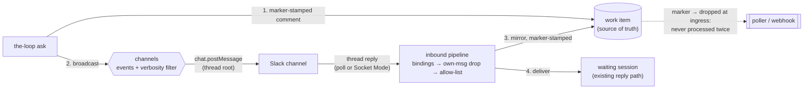

# Requirements: channels — back-and-forth user communication, starting with a Slack bot

> Phase 1 of the spec chain. This work item started from the owner's request in a cloud
> session (the ticket is the brief), so the artifacts arrive together on one PR for one
> human gate — see `execution-log.md` § Deviations from the standard gates.

## Introduction

the-loop can talk *at* Slack today, and cannot listen. The whole Slack integration is an
incoming-webhook `post-message` (issue-109's `integrations.slack`), fired by the graph's
`notify` hook — one direction, one message shape, no reply path. Every real back-and-forth
runs through exactly one surface: comments on the work item, forwarded by the poller or
the webhook receiver. An operator who lives in Slack sees "a decision is pending" there,
then has to walk to GitHub to actually answer it.

This work item ([#245](https://github.com/MadaraUchiha-314/the-loop/issues/245))
introduces **channels** as an abstraction: a named surface the-loop communicates through,
each choosing the event types it wants and the verbosity it gets. The first real channel
is a **Slack bot** (official `slack-sdk`, bot token in a configurable env var — the same
arrangement the webhook URL has today) that both **writes** (a question posted on the
work item is also posted to Slack, as a thread) and **reads** (replies in that thread
come back), with and without polling. The work item stays the **single source of truth**:
an answer given in Slack is mirrored onto the ticket as the-loop's own comment, carrying
the self-authored magic marker so ingress drops it and nothing is processed twice.

The diagram carries the two load-bearing rules: **the work item is written first and
last** (the question lands there before any channel hears of it; the answer lands there
whatever channel carried it), and **the mirror is marker-stamped**, so the existing
issue-64/104 loop-prevention contract — not new machinery — is what stops the mirrored
answer from re-entering the loop as fresh human input.

## Requirements

### Requirement 1 — channels are an abstraction; the work item stays the source of truth

**User story:** As the-loop's maintainer, I want every surface the-loop talks through to
be the same kind of thing behind one interface, so that adding the next channel (Teams,
e-mail, a second Slack workspace) is a new provider, not a new code path.

#### Acceptance criteria (EARS)

1. WHEN the-loop communicates outside the work item THEN the communication SHALL go
   through the channel interface — a named channel with its own event filter and
   verbosity — never through an ad-hoc integration call at the call site.
2. WHEN a question is asked (`the-loop ask`) THEN it SHALL land on the work item first,
   whether or not any channel is configured; channel delivery SHALL be best-effort, and
   a channel outage SHALL NOT change the ask's outcome or exit code.
3. WHEN a comment, reply or decision arrives through any channel THEN the-loop SHALL
   post it on the work item as the-loop's own mirror comment — carrying the
   self-authored marker (`<!-- the-loop:agent-comment -->`) plus a visible attribution
   naming the channel and the author — so both ingress paths drop it and the reply is
   never processed twice.
4. WHEN no `channels` section is configured THEN behaviour SHALL be exactly today's:
   nothing posted anywhere but the work item, nothing read from anywhere else.

### Requirement 2 — each channel chooses its events and its verbosity

**User story:** As an operator, I want my Slack channel to carry the events I care about
at the volume I can stand, so that the bot is a colleague, not a firehose.

#### Acceptance criteria (EARS)

1. WHEN an event's type is not in a channel's `events` allow-list THEN nothing SHALL be
   posted to that channel for that event.
2. WHEN a channel's `verbosity` is `quiet` THEN a posted message SHALL carry a one-line
   summary and the work-item link; WHEN `normal` THEN additionally the full question
   text; WHEN `verbose` THEN additionally the event's context detail (actor, comment
   URL).
3. WHEN `the-loop ask` records a `session.awaiting_input` event THEN the question SHALL
   be broadcast to every enabled channel whose `events` list includes
   `session.awaiting_input` — the ask command goes through all the channels.

### Requirement 3 — the Slack bot channel writes through the bot

**User story:** As an operator, I want the-loop's questions to arrive as Slack messages
from a bot I installed, so that answering is one thread reply away.

#### Acceptance criteria (EARS)

1. WHEN the Slack channel posts THEN it SHALL use the official `slack-sdk` `WebClient`
   (`chat.postMessage`) with a bot token read **at call time** from the environment
   variable named by `channels.slack.botTokenEnv` (default
   `THE_LOOP_SLACK_BOT_TOKEN`) — the same configurable-env arrangement as the webhook
   URL today, and the token value SHALL never appear in config files, state files or
   the event log.
2. WHEN a work-item question is posted THEN it SHALL start (or continue) a Slack thread
   for that work item, and the thread binding (Slack channel id + thread timestamp →
   work-item ref) SHALL be recorded in local state so replies can be attributed.
3. WHEN the bot token or the target Slack channel id is missing THEN the post SHALL
   fail closed for that channel with a recorded reason, without affecting the work-item
   post (R1.2).
4. The existing `integrations.slack` incoming-webhook notification path SHALL be
   unchanged — `channels.slack` is a separate, additive surface.

### Requirement 4 — the Slack bot channel reads, with and without polling

**User story:** As an operator, I want my thread reply in Slack to reach the waiting
session whether my deployment polls or listens, so that the transport is my choice, not
the feature's.

#### Acceptance criteria (EARS)

1. WHEN `channels.slack.read.mode` is `poll` THEN the long-running daemons (the poller
   and the gh-webhook receiver) SHALL fetch new thread replies on a background thread
   every `read.intervalSeconds` (via `conversations.replies`), and a fetch SHALL NOT
   block event dispatch or a poll cycle; WHEN `the-loop channels poll` is run THEN one
   fetch cycle SHALL run synchronously in the calling process, so deployments running
   neither daemon still have the capability.
2. WHEN `channels.slack.read.mode` is `socket` THEN `the-loop channels listen` SHALL
   receive replies push-fashion over Slack **Socket Mode** (the `slack-sdk` built-in
   client, app-level token from `channels.slack.appTokenEnv`, default
   `THE_LOOP_SLACK_APP_TOKEN`) — no polling, and no inbound HTTP endpoint to expose.
3. WHEN `channels.slack.read.mode` is `off` THEN nothing SHALL be read from Slack.
4. The bot SHALL read **only** replies in threads the-loop itself started (recorded
   bindings) — never the channel at large.
5. WHEN a fetched message is the bot's own (a bot-authored message) THEN it SHALL be
   dropped before any other check — the Slack-side half of the loop-prevention rule.
6. WHEN a reply has been processed once THEN it SHALL NOT be processed again (a
   persisted per-thread cursor), across process restarts and across the poll and
   socket transports.

### Requirement 5 — inbound replies are authorized, mirrored, then delivered

> Formal register: these criteria are the contract the security review gates on.

1. WHEN a reply's Slack author is not in `channels.slack.authorizedUsers` (Slack member
   ids) THEN the-loop SHALL drop the reply — not delivered, not mirrored — and record
   the drop; an **empty** allow-list SHALL deny every reply (fail closed), matching
   `routing.authorizedUsers`.
2. WHEN a reply is accepted THEN the-loop SHALL first mirror it to the work item
   (R1.3), so the decision lands on the source of truth even when no session is left
   to deliver to.
3. WHEN the mirror is composed THEN the reply text SHALL be quoted as untrusted
   content, and any control keyword in it SHALL be defanged so it can never parse as a
   command — defence in depth behind the marker.
4. WHEN a reply is accepted THEN the-loop SHALL deliver it into the waiting session
   through the existing reply path, which never spawns, respawns or resumes a session;
   WHEN delivery fails (no session, paused session, dead pane) THEN the failure SHALL
   be recorded and the mirror SHALL stand as the answer of record.

### Requirement 6 — configured, validated, observable

1. WHEN the CLI config carries a `channels` section THEN it SHALL validate against the
   CLI config schema on the surfaces that validate; WHEN a malformed section reaches a
   runtime reader anyway THEN the channel SHALL resolve to **disabled with a logged
   error** — fail closed, never half-enabled.
2. WHEN a channel posts, fails to post, receives a reply, drops one, mirrors one or
   fails to mirror THEN the-loop SHALL emit a registered event-log type for it
   (`channel.*` in `EVENT_TYPES`), at `warning` for failures — the same observability
   bar every other surface meets.

## Non-functional requirements

- **No new dependencies.** `slack-sdk` is already a required dependency of
  `the-loopy-one` (the `sdk` notification transport); Socket Mode uses its built-in
  WebSocket client. Nothing else is added.
- **State is local, not portable.** Thread bindings and read cursors are facts about
  this machine's conversations; they live under `state.root` beside the other local
  state, bounded in size (oldest bindings dropped past a cap).
- **Cost.** A poll cycle with no bindings is no API call at all; with bindings it is one
  `conversations.replies` call per open thread. Socket Mode is push — no idle cost
  beyond the connection.

## Security considerations

> Threat-model-lite per `security.threatModel.required`. This work item **adds attack
> surface**: it gives text written in Slack a path into an agent session and onto a
> GitHub ticket under the operator's credentials. Every mitigation below is a gate on
> that path.

- **Actors & trust boundaries.** Untrusted: anyone who can reply in the bot's Slack
  threads (workspace membership is not the-loop's trust boundary), and the text they
  write. Trusted: the operator's config, the bot/app tokens, and the environment. The
  boundaries are (1) Slack reply → agent session, and (2) Slack reply → work-item
  comment posted with the operator's credentials.
- **Prompt injection / unauthorized control.** A Slack reply delivered into a session
  is an instruction to an agent. Mitigation is R5.1: a **fail-closed allow-list of
  Slack member ids** — the exact `routing.authorizedUsers` posture, empty means nobody
  — checked before mirroring and before delivery. Slack ids, not display names: display
  names are attacker-chosen.
- **Ticket writes by proxy.** The mirror posts to GitHub with the operator's
  credentials. The same allow-list gates it (an unauthorized reply is not mirrored),
  the mirror is marker-stamped so it can never re-enter the loop as input (R1.3), and
  control keywords in the quoted text are defanged (R5.3) — three independent stops,
  any one of which suffices.
- **Loop closure, both sides.** Slack-side: the bot's own messages are dropped before
  any processing (R4.5), so the bot cannot answer itself. GitHub-side: the mirror
  carries the marker, and both ingress paths drop marked bodies before the
  authorized-actor check even runs (the issue-64/104 contract, unchanged).
- **Token handling.** Bot and app tokens are read from the environment at call time,
  never accepted as config values, never written to state or the event log (R3.1). The
  config names the *variable*, exactly as `webhooks.ghWebhook.secretEnv` does.
- **Scope of reads.** The bot reads only threads it started (R4.4) — a compromise of
  the-loop never becomes a reader of the operator's Slack channel at large.
- **Fail closed.** No `channels` section → off (R1.4). Malformed section → disabled
  with a logged error (R6.1). Missing token → that channel fails with a recorded
  reason (R3.3). Empty allow-list → every reply denied (R5.1).

## Out of scope

- **Re-pointing the graph's `notify` hook.** The harness-plane notification
  (`integrations.slack` incoming webhook) keeps working unchanged; folding it into
  channels is follow-up work once channels exist in the harness plane too.
- **Per-collaborator channel targeting.** `collaborators[].notifications.channels`
  (the `channel-list` structure) remains declared-but-unread, as today; this work item
  adds the transport it will eventually target.
- **Other channel types.** Teams, e-mail, a second Slack workspace: the interface is
  built for them, none is implemented.
- **A Slack Events-API HTTP receiver.** Socket Mode covers push without exposing an
  endpoint; an HTTP receiver (à la `gh-webhook`) can be added if a deployment needs
  it.
- **Slash commands / interactive blocks.** Replies are plain thread messages; richer
  Slack UX is deliberately deferred.

## Review comments

> Appended by the-loop's `record-feedback` hook when a human gate approves with comments.
