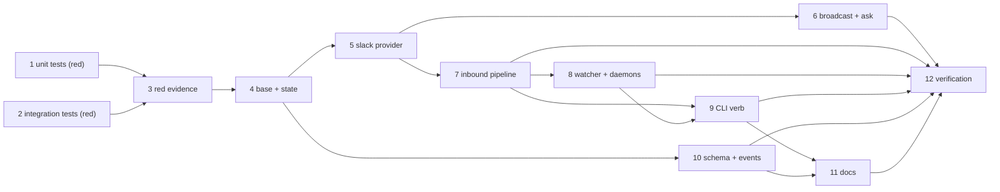

# Tasks: channels — back-and-forth user communication, starting with a Slack bot

> The last spec artifact. A DAG derived from the design and testing plan.

## Task list

- [ ] 1. Write the failing unit tests (`test_channels.py`)
  - Config parsing (absent/malformed → no channels, defaults match schema); event
    filtering; verbosity rendering; binding/cursor state (cap, atomicity, restart);
    Slack channel against a fake client (call-time token, thread reuse, missing
    token/channel fail closed); inbound steps (map, own-drop, allow-list, mirror
    compose with scrub + defang, cursor advance).
  - _Depends on:_ none
  - _Requirements:_ R1.4, R2.1–2.2, R3.1–3.3, R4.5–4.6, R5.1, R5.3, R6.1
  - _Test:_ `T1`, `T8` (red)

- [ ] 2. Write the failing integration scenarios (`test_channels_integration.py`)
  - Gherkin-documented, `Requirement:` links: ask → work-item first + broadcast +
    binding; thread reply → mirror (marker) → delivery (`comment=False`); socket event
    through the same pipeline; watcher on interval, stops with daemon; no-session reply
    still mirrored; empty-allow-list denial.
  - _Depends on:_ none
  - _Requirements:_ R1.1–1.3, R2.3, R4.1–4.4, R5.2, R5.4, R6.2
  - _Test:_ `T2`, `T8` (red)

- [ ] 3. Capture the red run as evidence
  - _Depends on:_ 1, 2
  - _Requirements:_ (process — `tdd.mode: standard`)
  - _Test:_ `evidence/red.md`

- [ ] 4. `channels/base.py` + `channels/state.py` — contract, rendering, bindings
  - `OutboundEvent`, `Channel` protocol, `ChannelError`, verbosity renderer,
    `load_channels`; the JSON state store (threads, cursors, cap, atomic replace).
  - _Depends on:_ 3
  - _Requirements:_ R1.1, R1.4, R2.1–2.2, R6.1
  - _Test:_ `T1` (green)

- [ ] 5. `channels/slack.py` — the Slack bot provider, both transports
  - `SlackBotChannel` (injectable client factory, call-time env token,
    `chat.postMessage` threading, `conversations.replies` fetch); the Socket Mode
    listener feeding the same handler.
  - _Depends on:_ 4
  - _Requirements:_ R3.1–3.3, R4.2, R4.4–4.5
  - _Test:_ `T1`, `T2 -k socket` (green)

- [ ] 6. `channels/broadcast.py` + the `ask_session` seam
  - Best-effort fan-out with `channel.posted`/`channel.post_failed`; `ask_session`
    broadcasts after its work-item post, outcome-neutral.
  - _Depends on:_ 4, 5
  - _Requirements:_ R1.2, R2.3
  - _Test:_ `T2 -k asked` (green)

- [ ] 7. `channels/inbound.py` — map → own-drop → authorize → mirror → deliver
  - The pipeline with its event emissions; mirror via `comments.post_issue_comment`
    (`mark_self_authored`, scrub, defang); delivery via
    `core_sessions.reply_session(..., comment=False)`.
  - _Depends on:_ 5
  - _Requirements:_ R1.3, R4.6, R5.1–5.4
  - _Test:_ `T1`, `T2`, `T8` (green)

- [ ] 8. `channels/watcher.py` wiring + the two daemon run-loops
  - `start_watcher(cli_config, stop_event)` beside the self-diagnosis watcher in
    `poller/daemon.py` and `webhook/daemon.py`; `None` when disabled or `read.mode`
    is not `poll`.
  - _Depends on:_ 7
  - _Requirements:_ R4.1, R4.3
  - _Test:_ `T2 -k watcher` (green)

- [ ] 9. The `channels` CLI verb (`commands/channels_cmd.py`)
  - `status` (token presence only), `poll` (one cycle), `listen` (Socket Mode
    foreground); registered in `commands/__init__.py`; exit codes 0/1/2.
  - _Depends on:_ 7, 8
  - _Requirements:_ R4.1–4.2, R6.2 (status shows no secrets)
  - _Test:_ `T1 -k status`, `T8 -k token` (green)

- [ ] 10. Config schema + instances + event types
  - `channels` section in `.the-loop/cli-config.schema.json`, byte-copied to
    `cli/the_loop/schemas/`; commented block in `.the-loop/cli-config.yaml` and the
    shipped template; six `channel.*` types in `EVENT_TYPES`.
  - _Depends on:_ 4
  - _Requirements:_ R6.1–6.2
  - _Test:_ `T12` (parity gates green)

- [ ] 11. Documentation
  - `docs/config/cli/channels-options.md` (every leaf, Type/Default); rows in
    `docs/config/cli/index.md` + `docs/config/index.md`; `docs/cli/commands/channels.md`
    + commands index row; `docs/cli/state.md` (bindings file); VitePress sidebars;
    `reference/observability.md` event catalog; `reference/collaboration.md` §
    channels; capability doc `docs/capabilities/channels.md` + index +
    `docs/capabilities/observability.md` history; `decision-094`; README channels
    mention.
  - _Depends on:_ 9, 10
  - _Requirements:_ (gates: capability-docs, documentation)
  - _Test:_ `T12` (docs parity P1–P5 green)

- [ ] 12. Verification — execute the plan, record results and evidence
  - Run T1, T2, T8, T12, T13; complete the plan's Verification results; commit
    evidence.
  - _Depends on:_ 6, 7, 8, 9, 10, 11
  - _Requirements:_ all
  - _Test:_ the plan itself

## DAG

