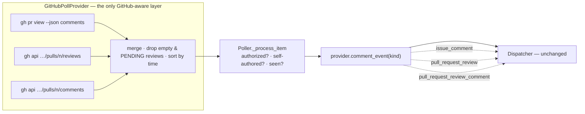

# Design: the poller reads all three PR comment surfaces

> Phase 2 of 3 (requirements → design → tasks). Derives from the approved requirements.
> MUST be reviewed and approved before moving to tasks breakdown.

## Overview

**The provider fetches two more streams and labels every comment with its kind; nothing
else changes.** The poller core, the dedup/retry ledgers, the authorization gate, the
dispatcher and the prompt templates all keep working on the input they already understand,
because reviews and review-thread comments arrive as ordinary `Comment` objects with a
stable id, an author, a body and a timestamp — which is all any of those layers reads.

Three edits carry the whole fix:

| Edit | File | Why |
|---|---|---|
| `Comment` gains a `raw` dict | `poller/base.py` | the kind and the anchor must survive from `list_comments` to `comment_event`, the same way `WorkItem.raw` carries a PR's head branch |
| `list_comments` merges three sources for PRs; `comment_event` shapes the event per kind | `poller/github.py` | the only place that may know about GitHub |
| the retained-id cap is raised | `poller/poller.py` | one ledger now holds ids from three streams (R4.3) |



An **issue** takes the left branch alone: one call, byte-identical to today (R4.1).

## Architecture

### Where the new reads come from, and why REST

`gh pr view --json` cannot answer this question. Its field list exposes `comments` (the
`IssueComment` connection) and `reviews` (review bodies), but **no review-thread
connection** — inline comments are simply not reachable through that command. So at least
one call must go elsewhere, and the choice is between a hand-written GraphQL query and the
REST endpoints, both through `gh` (R3.4).

**Chosen: REST via `gh api --paginate`,** for both new streams:

- `GET repos/{owner}/{repo}/pulls/{n}/reviews`
- `GET repos/{owner}/{repo}/pulls/{n}/comments`

| | REST via `gh api` | one GraphQL query |
|---|---|---|
| Calls per polled PR | 3 (1 existing + 2) | 2 (1 existing + 1), or 1 if the existing call is folded in |
| Pagination | `--paginate`, mechanical | hand-written cursors per connection, or a silent first-page-only read |
| Precedent in this file | yes — `fetch_item_state` uses `gh api repos/…` | none |
| Failure mode of a mistake | an HTTP error, surfaced | a query-shape error, or worse, a quietly truncated connection |
| Reviewability | two documented endpoints | ~30 lines of embedded query text |

The extra call is the price. It is bounded (R4.2) and it applies **per polled PR only** —
a source monitoring issues alone makes no additional call at all. `--paginate` is what
makes R4.2's "newest still get through" true: REST returns reviews oldest-first, so a
single capped page would permanently hide the newest ones on a heavily-reviewed PR, which
is the exact failure mode this work item exists to remove.

The existing `gh pr view --json comments` call is **left alone**. Folding it into REST
would change the conversation-comment ids from GraphQL node ids (`IC_…`) to REST numeric
ids, invalidating every operator's `seenComments` ledger and re-forwarding whole threads on
upgrade. The ids that already exist keep their shape; the new ones use the `node_id` REST
also returns, so all three streams key the ledger with GraphQL node ids and no migration
is needed.

### What is dropped before the poller ever sees it

Two filters live in the provider, because they express "this carries no instruction",
which is a GitHub fact, not a policy the core should hold:

- **Empty-body reviews** (R1.4). An Approve with no words. Dropped entirely rather than
  baselined — an id the poller never sees costs nothing and prunes itself.
- **`PENDING` reviews** (R1.5). A draft review, visible only to its author, that the human
  has not submitted. Forwarding it would deliver words nobody sent.

Everything else — authorization, the self-comment marker, dedup, retries — stays in the
poller, unchanged, and therefore applies to the new streams by construction. That is the
whole reason the new items are modelled as `Comment` rather than as events.

### Ordering

The merged list is sorted by timestamp ascending (`createdAt` / `submitted_at` /
`created_at`, all ISO-8601 `Z` strings, so lexicographic order is chronological). Python's
sort is stable, so items sharing a timestamp keep their source order.

Order matters for exactly one caller: `_pending_control_ids` forwards first-sight control
comments "in thread order (so the last command wins)". A merge that appended reviews after
comments would let a stale `stop` in a review override a later `start` in a comment. Sorted
merge preserves the invariant the existing behaviour depends on.

## Components & interfaces

### `poller/base.py` — `Comment.raw`

```python
@dataclass(frozen=True)
class Comment:
    id: str
    body: str
    author: str
    created_at: str
    url: str
    raw: Dict = field(default_factory=dict)   # provider extras, read by that
                                              # provider's comment_event
```

Positional construction is unchanged (the field is last and defaulted), so every existing
call site and test keeps compiling. The contract mirrors `WorkItem.raw`, which exists for
the same reason and carries the same warning: the core never reads it.

### `poller/github.py` — `GhComment` and the three fetches

`GhComment` gains the fields GitHub returns for the new kinds:

| Field | Conversation | Review | Review thread |
|---|---|---|---|
| `id` | `IC_…` | `PRR_…` (`node_id`) | `PRRC_…` (`node_id`) |
| `kind` | `conversation` | `review` | `review-thread` |
| `state` | — | `APPROVED` / `CHANGES_REQUESTED` / `COMMENTED` | — |
| `path` / `line` | — | — | file + line (`line`, else `original_line`) |

`list_comments(owner, repo, number, is_pr)` keeps its signature and its issue behaviour;
for a PR it returns the merged, sorted, filtered list.

### `poller/github.py` — `comment_event` shapes the event per kind

The event name and payload shape now match what a **real webhook would have delivered for
the same object**, which is what makes the two ingresses interchangeable downstream:

| Kind | `event` | `action` | Payload key |
|---|---|---|---|
| conversation | `issue_comment` | `created` | `comment` |
| review | `pull_request_review` | `submitted` | `review` |
| review thread | `pull_request_review_comment` | `created` | `comment` (+ `path`, `line`) |

This is not cosmetic. Three existing consumers read the event name to decide what a payload
means, and all three are already correct for these names:

- `router.event_actor` reads `review.user.login` for `pull_request_review` and
  `comment.user.login` for the other two — the authorization actor.
- `router.event_body` reads `review.body` / `comment.body` — the self-comment marker check
  and the control-keyword parse.
- `reactions.target_from_event` reacts on the comment's node id when there is one, and
  falls back to the PR itself otherwise — which is right, because GitHub's GraphQL
  `Reactable` includes `PullRequestReviewComment` but **not** `PullRequestReview`.

Emitting `issue_comment` for all three (the cheaper edit) would have broken the first two:
`event_actor` would look for `payload["comment"]` in a review payload, find nothing, and
resolve the actor to `None` — an actor-less event, which the dispatcher refuses to accept a
control command from. The kinds are distinguished precisely so nothing downstream has to be
touched.

`delivery_id` stays `poll-comment-<id>`; node ids are unique across types, so the
dispatcher's dedup and the poller's retry ledger need no change.

### What the kind-specific names activate downstream (found while implementing)

A `pull_request_review*` payload names a pull request where an `issue_comment` one does not
— `router._pr_entity` reads `payload["pull_request"]` only for events whose name starts
with `pull_request`. So these events reach a fourth consumer the design had not traced: the
**inner PR loop**. The dispatcher binds the PR as an *endpoint* of the work item's record
and, on the first event for a PR that has no session yet, spawns that PR's own session with
the event as its opening prompt (`sessionPerPr`, default on — issue-172, decision-064).

That is the intended architecture, and it is what a real `pull_request_review` webhook does
today; the poll path simply reaches it now too, which is the parity this work item is for.
Two consequences a reviewer should know:

- A review left on a polled PR that has no endpoint session **spawns one**, rather than
  delivering into the work item's outer session. The instruction is not lost — it is that
  session's first prompt — but the conversation it lands in differs from where a PR
  *conversation* comment lands today.
- Poll-path PR conversation comments still do **not** reach it, because the poller labels
  them `issue_comment` while putting the PR under `payload["pull_request"]`, a shape
  `_pr_entity` does not recognise (a real webhook carries `issue` with a `pull_request`
  key). That divergence predates this change and is left alone: fixing it would alter where
  every polled PR comment is delivered, which is a behaviour change needing its own ticket.

`test_a_pr_review_and_an_inline_comment_reach_the_session_once_each` asserts the behaviour
as it actually is — each instruction conveyed exactly once across spawn prompts and
deliveries, and the PR bound as an endpoint rather than as a second work item.

### `poller/poller.py` — the retained-id cap

`_SEEN_COMMENTS_CAP` goes from 500 to 2000, with the reasoning recorded at the constant.
The cap is **not** what bounds the ledger in normal operation — `finalize` prunes it to the
live thread every cycle, so a 30-comment PR keeps 30 ids whatever the cap says. The cap
only bites when a single live thread exceeds it, and when it bites it does something worse
than truncate: the oldest live ids fall out of `seenComments`, get re-forwarded next cycle,
resolve, and fall out again — a delivery loop, not a lost id. A merged thread reaches the
old bound roughly three times sooner (R4.3).

## Data models

No persisted schema changes. The ledger's `seenComments` / `commentAttempts` / `gaveUp`
keep holding opaque id strings; only their population widens. Existing per-item records
read forward unchanged: the new ids are simply absent from `seenComments`, which is exactly
what "not yet delivered" already means, so the first cycle after the upgrade forwards the
review backlog that is still live upstream — the intended repair for the reported case.

> **Upgrade consequence, stated deliberately.** On a long-lived PR with old reviews still
> present, that first cycle forwards them all. It is bounded by the live thread, it happens
> once, and the alternative — baselining them away — would hide the very instructions the
> bug swallowed. The reviewer briefing calls this out.

## Error handling

Unchanged and deliberate: both new calls go through `_run_json`, whose failures raise
`GhError` (a `ProviderError`). `Poller._poll_provider` already catches that per item, logs
`poll.item_error`, counts it in `summary.errors` and retries next cycle (R4.4). No `try:
… except: return []` anywhere in the new code — a swallowed failure here would reproduce
this very bug with a different cause.

The one degradation path considered and **rejected**: catching an error from the reviews
call and continuing with conversation comments only. It would make a broken read look like
a quiet PR, which is what made this bug invisible for eleven versions.

## Security design

Each boundary from `bugfix.md` § Security considerations, and the mechanism enforcing it:

| Boundary / abuse case | Mechanism | Proof |
|---|---|---|
| Unauthorized reviewer (R3.1) | the new items are `Comment`s, so `Poller._process_item`'s `is_authorized(comment.author, …)` gate runs on them unchanged; an empty allowlist authorizes nobody | T8 negative test — an unauthorized review is resolved, never forwarded |
| the-loop's own review (R3.2) | `is_self_authored(comment.body)` on the review body, same call, same place | T8 negative test |
| Control keyword in a review body | `event_body("pull_request_review", …)` returns `review.body`, so the dispatcher's named-actor re-check runs identically; the poller still decides only *which ids are unresolved* | T2 integration scenario |
| Prompt injection via body / path | untrusted-data framing in the prompt template is unchanged; `path` and `line` are JSON values, never opened, never joined to a filesystem path, never in an argv | design invariant + code review |
| Excerpt flooding | only the fields listed above are carried — the diff hunk is **excluded** (see Trade-offs) — and `_PAYLOAD_EXCERPT_MAX_CHARS` still truncates | T1 asserts the payload's key set |
| Credential creep (R3.4) | reads go through the operator's `gh`; no token is read, stored or passed | code review — no new config key, no env read |

**Fail-closed, and the one place it is not.** A review the API returns without an id is
dropped by the poller's existing `if not comment.id: continue`. A review whose author
GitHub does not name (`user: null`, a deleted account) yields `author == ""` — and
`is_authorized` **allows** that, because an actor-less action is allowed by design
(`the_loop.authz`: a CI event carries status, not instructions). The webhook path answers
identically for the same object, so this change introduces nothing; it inherits a residual
worth naming, because a review body *is* free-form text and a CI status is not.

Deliberately not narrowed here: the predicate is shared with every CI event on both
ingresses, so tightening it belongs to its own work item with its own tests, not to a
parity repair. `test_gh_review_without_a_user_is_authorized_exactly_as_the_webhook_path_is`
pins the current answer so a future change to it is a visible decision. Its exploitability
is thin — GitHub returns the `ghost` user rather than `null` in most responses, and an
attacker would have to get their account deleted *after* posting.

## Testing strategy

Unit tests drive `GhClient` with canned JSON through the injected runner — the established
pattern in `test_poller.py` — and cover the merge, the two filters, the ordering and the
per-kind event shapes. One integration test drives a **whole poll cycle** with a fake
provider-backed `gh`, asserting that a review body and an inline comment each reach the
dispatcher exactly once across two cycles, and that an unauthorized review and an
empty-body approval reach it never; it carries the Gherkin docstring
`testing.gherkinDocstrings` requires, linking back to R1/R2/R3. The executable detail —
rows, commands, evidence — is `testing-plan.md`.

## Trade-offs & decisions

- **Three calls per PR, not one.** Rejected folding all three streams into one GraphQL
  query: it would invalidate existing `seenComments` ledgers (id shape change) or require
  hand-written pagination for three connections. The cost is one extra round trip per
  polled PR per cycle, on a path whose default interval is 60s.
- **`diff_hunk` is not forwarded.** The anchor is `path` + `line` (R2.2). A diff hunk is
  up to ~30 lines of arbitrary text, and the payload excerpt is capped at 4000 characters —
  carrying it risks truncating the instruction it was meant to contextualise. The session
  can read the PR diff; it cannot read a review it was never told about.
- **Kind-specific event names.** Costs a branch in `comment_event`; buys correctness in
  three existing consumers that already branch on those names (see above).
- **Empty-body and `PENDING` reviews are dropped in the provider, not baselined.** They
  never enter the ledger, so they cost nothing and cannot leak into `live_ids`. The
  trade-off: a review edited later *from* empty *to* non-empty appears as new and is then
  forwarded — which is the desired behaviour, not a defect.
- **Cap raised rather than made structural.** A structurally correct fix ("never drop a
  live id") would let one pathological thread grow a record without bound. 2000 keeps a
  bound while putting it out of reach of any real PR.

No durable cross-cutting decision is created; this is a parity repair within the shape
issue-34 set, so nothing is added to `docs/decisions/`.

## Open questions

None. The one the requirements left open — which API surface supplies the new streams — is
settled above (REST via `gh api --paginate`), with the GraphQL alternative recorded as
rejected and why.

## Review comments

> Appended by the-loop's `record-feedback` hook when a human gate approves with
> comments (issue-109).

*None yet.*
