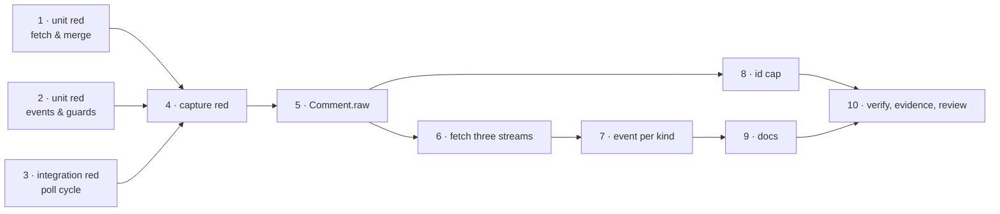

# Tasks: the poller reads all three PR comment surfaces

> The last spec artifact. A DAG derived from the approved design and testing plan.

## Task list

- [x] 1. Write the failing unit tests for fetch, merge and filtering
  - `list_comments` on a PR issues `gh pr view --json comments` **plus** the two
    `gh api …/pulls/<n>/{reviews,comments}` reads; on an issue it issues the one call it
    always did.
  - The merged list is time-ordered; empty-body and `PENDING` reviews are absent; an
    outdated inline comment falls back to `original_line`.
  - _Depends on:_ none
  - _Requirements:_ R1.3, R1.4, R1.5, R2.2, R2.3, R2.4, R4.1, R4.2
  - _Test:_ `T1 — uv run pytest cli/tests/test_poller.py -k "comments or review"` (red→green)

- [x] 2. Write the failing unit tests for the per-kind event shapes and the guards
  - `comment_event` emits `pull_request_review` / `pull_request_review_comment` /
    `issue_comment` with the payload key each name implies, and the anchor on the inline
    one; `router.event_actor` and `router.event_body` resolve on the produced payloads.
  - Negative: unauthorized reviewer, the-loop's own self-marked review, `user: null`.
  - _Depends on:_ none
  - _Requirements:_ R1.3, R2.2, R3.1, R3.2, R3.3
  - _Test:_ `T8 — uv run pytest cli/tests/test_poller.py -k "unauthorized or self_authored"` (red→green)

- [x] 3. Write the failing integration test (Gherkin) for a whole poll cycle
  - Two cycles over one polled PR: the review body and the inline comment are dispatched
    once each and not again; the empty approval and the unauthorized review never are.
  - _Depends on:_ none
  - _Requirements:_ R1.1, R1.2, R2.1, R2.2, R3.1, R5.2
  - _Test:_ `T2 — uv run pytest cli/tests/test_poller_integration.py -k review` (red→green)

- [x] 4. Capture the red run as evidence
  - _Depends on:_ 1, 2, 3
  - _Requirements:_ R5.1
  - _Test:_ `T12 — evidence/red.md`

- [x] 5. `Comment` carries provider extras
  - Add `raw: Dict = field(default_factory=dict)` to `poller/base.py`, documented as the
    provider's own channel (mirrors `WorkItem.raw`); the core never reads it.
  - _Depends on:_ 1, 2, 3
  - _Requirements:_ R1.3, R2.2
  - _Test:_ `T1`, `T13`

- [x] 6. Fetch and merge the three streams
  - `GhComment` gains `kind`, `state`, `path`, `line`; `GhClient` gains
    `list_reviews` / `list_review_comments` (both `gh api --paginate`), and
    `list_comments` merges/sorts/filters for a PR only.
  - _Depends on:_ 5
  - _Requirements:_ R1.1, R1.4, R1.5, R2.1, R2.3, R4.1, R4.2, R4.4
  - _Test:_ `T1` (green)

- [x] 7. Shape the event per kind
  - `GitHubPollProvider.list_comments` passes the extras through `Comment.raw`;
    `comment_event` branches on the kind.
  - _Depends on:_ 6
  - _Requirements:_ R1.3, R2.2, R2.4, R3.3
  - _Test:_ `T2`, `T8` (green)

- [x] 8. Raise the retained-id cap
  - `_SEEN_COMMENTS_CAP` 500 → 2000 with the reasoning at the constant.
  - _Depends on:_ 5
  - _Requirements:_ R4.3
  - _Test:_ `T10`

- [x] 9. Update the capability doc and the user-facing docs
  - `docs/capabilities/webhook-triggers.md`: which surfaces the poll ingress reads, plus a
    history row. Check `docs/config/cli/polling-options.md` and the README for statements
    this makes wrong.
  - _Depends on:_ 7
  - _Requirements:_ R5.3
  - _Test:_ `T14` (markdownlint) + `T13` (`test_docs_parity.py`)

- [x] 10. Verification, evidence, reviews
  - Execute `testing-plan.md`, commit evidence, run the self-review rounds and the
    security review, write the reviewer briefing.
  - _Depends on:_ 8, 9
  - _Requirements:_ all
  - _Test:_ `T13`, `T14`

## Dependency graph (DAG)

Tasks 1–3 are independent red roots; nothing production-side starts before task 4 has the
red on record.

## Checkpoints

- After task 4: the red run is committed as its own commit, before any fix.
- After task 7: targeted suites green (T1, T2, T8).
- After task 9: `uv run pytest` (T13) and the lint/typecheck/markdown set (T14).
- After task 10: the `verification` node fills `testing-plan.md` § Verification results,
  then the review phases run.

## Deviations

- Task 6 also **left `gh pr view --json comments` alone** rather than folding it into the
  REST reads. Anticipated in `design.md`; recorded here because the task text could be read
  as replacing the existing call.
- Task 2's `user: null` case is asserted at the `GhClient` parsing layer (author becomes
  `""`) plus the existing `is_authorized("")` unit coverage, rather than as a third
  end-to-end negative — the two halves compose, and a third cycle test would assert the
  allowlist, not this change.

## Review comments

> Appended by the-loop's `record-feedback` hook when a human gate approves with
> comments (issue-109).

_None yet._
