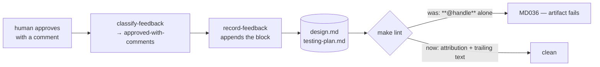

# Bugfix spec: record-feedback writes markdown that fails the project's own markdownlint

> Phase 1 of 3 for a bug (bugfix → design → tasks). This phase MUST be reviewed and
> approved before the design is derived from it.

## Summary

The first approval-with-comments on any work item leaves the approved artifact **failing
the project's own linter**. `record-feedback` writes the reviewer's handle as a paragraph
containing emphasis and nothing else, which is exactly what markdownlint's **MD036
(no-emphasis-as-heading)** rejects:

```python
# cli/the_loop/graph/hooks/feedback.py:140 — before this fix
entry.append(f"\n**@{comment['author']}**\n\n{comment['body'].strip()}\n")
```

The harness therefore hands the session a document the same project's `make lint` refuses,
and the only way out is to edit the paper trail until the linter is satisfied. Ticket:
[#247](https://github.com/MadaraUchiha-314/the-loop/issues/247).

Observed on [#239](https://github.com/MadaraUchiha-314/the-loop/issues/239): the
`design-approval` gate recorded `approved` into `design.md` and `testing-plan.md`, and
`make lint` then failed on both. It was unblocked by hand-reflowing the two blocks to
`**@handle** — approved`, which preserved the attribution and the body but is a workaround
per approval, not a fix.

## Steps to reproduce

1. In a repository whose `tooling.lint.markdown` is markdownlint (the-loop's own config),
   walk a work item to a human gate — `requirements-approval` or `design-approval`.
2. Approve with a comment, so `classify-feedback` returns `approved-with-comments` and
   `record-feedback` runs with `into: design.md`.
3. Read the appended block: `**@handle**` sits alone on its line.
4. `make lint` → `MD036/no-emphasis-as-heading Emphasis used instead of a heading
   [Context: "@handle"]` on every artifact the gate recorded into.

## Expected vs actual

- **Expected:** markdown the harness writes into a checked-in artifact passes the linter
  that same project is configured with. Recording an approval is not a lint event.
- **Actual:** every recorded approval fails `MD036`, once per comment per artifact. A
  `design-approval` with one comment fails two files, because that gate records into
  `design.md` and `testing-plan.md` both.

## Root cause (confirmed)

One line of machine-authored markdown, in the one hook that writes into a checked-in
artifact. `record-feedback` is the only `write_text` in `cli/the_loop/graph/hooks/` — the
defect has exactly one site, and no other hook is emitting the same shape.

MD036 fires on a **paragraph whose entire content is emphasized text**, on the theory that
the author meant a heading. `**@handle**` alone between two blank lines is precisely that
shape. Confirmed against the pinned linter (`markdownlint-cli2@0.18.1`, markdownlint
v0.38.0) with the repository's own `.markdownlint-cli2.jsonc`, which does not disable MD036
and should not: the rule is doing its job, and the harness is the thing writing a heading
where it meant an attribution.



A second, quieter case sits in the same expression: a comment whose body is **empty** —
a review submitted with an approval and no text — renders as
`**@handle**\n\n\n`, two consecutive blank lines, which is an MD012 failure rather than an
MD036 one. Same cause: the block is assembled without asking what it will look like to the
linter.

## Requirements

### Requirement 1 — a recorded approval passes the project's markdown linter

#### Acceptance criteria (EARS)

1. WHEN `record-feedback` appends a reviewer's comment to an artifact THEN the attribution
   line SHALL NOT consist of emphasized text alone, so MD036 does not fire on it.
2. WHEN a recorded comment carries an empty body THEN the appended block SHALL NOT contain
   consecutive blank lines, so MD012 does not fire on it.
3. WHEN `record-feedback` has appended one or more comments THEN the resulting artifact
   SHALL pass the repository's configured markdownlint invocation, given an artifact and
   comment bodies that passed it before.

### Requirement 2 — the attribution and the body survive the fix

#### Acceptance criteria (EARS)

1. WHEN a comment is recorded THEN the appended block SHALL name its author with the
   `@handle` form it uses today.
2. WHEN a comment is recorded THEN its body SHALL be appended verbatim apart from the
   surrounding whitespace `.strip()` already removes — the harness SHALL NOT reflow,
   re-indent, quote or otherwise rewrite a human's words to satisfy a linter.
3. The recording SHALL stay append-only, under the artifact's own `## Review comments`
   section, dated and grouped by outcome exactly as it is today.

### Requirement 3 — proven, and kept proven

1. The fix SHALL include regression tests that fail before it and pass after it, covering
   each acceptance criterion above.
2. The regression SHALL be caught by asserting the emitted **shape**, not by shelling out
   to the linter: the test suite runs without Node.js, and a test that silently skips when
   `npx` is absent is not a regression test. A single verification-time run of the real
   linter over a recorded artifact provides the evidence that the shape assertion is the
   right one.

## Security considerations

Not a security bug, and the fix neither adds nor removes attack surface.

- **Trust boundaries touched:** none. `_authorized_comments` already decides whose text is
  read at all — the allowlist, the self-authored marker and the authorization check are
  upstream of this code and unchanged. This fix changes only how already-accepted text is
  laid out on the page.
- **Untrusted input:** a comment body is attacker-reachable on a public repository, and it
  is written verbatim into a checked-in file today. That is unchanged and deliberate: the
  paper trail is the point, the file is data rather than an instruction, and every reader
  of it — human or agent — meets it inside a `## Review comments` section attributed to a
  named author. The one new piece of harness-authored text (the trailing `wrote:`) is a
  constant, not interpolated from the event.
- **The author handle** is interpolated into the attribution, as before. It arrives from
  the event payload but reaches this line only after matching `authorizedUsers`, so it is
  a login the operator has named. No new interpolation site is introduced.
- **Fails closed:** unchanged. A missing target, a missing artifact or no feedback still
  returns `skipped` and writes nothing.

## Out of scope

- **Linting the reviewer's body.** A comment body can fail markdownlint on its own — a
  `# heading` in it trips MD025, a `+` bullet trips MD004, a hard tab trips MD010 — and
  blockquoting it does not help (verified in [`evidence/shapes.md`](evidence/shapes.md) §3:
  all three fire identically inside a blockquote, and the quoting adds MD027 of its own).
  The harness must not rewrite
  a human's words to satisfy a linter, so this fix is confined to the text the harness
  itself authors. If body-induced lint failures become a real cost, the answer is a
  markdownlint-disable fence around the recorded region — a separate work item, and one
  that trades away lint coverage of the artifact.
- **Making `lint-artifacts` run markdownlint.** The ticket describes the graph hook as
  running the project's linter; it does not — it checks mermaid fences and an optional line
  length. Whether the graph gate should shell out to the configured markdown linter is a
  real question and a much larger one (a Node dependency on the gate path), and the failure
  in this ticket is `make lint` and CI, which do run it.
- **Reformatting artifacts already recorded into by the old code.** They are checked in and
  already hand-corrected where they blocked; nothing here rewrites history.

## Open questions

None blocking. One judgement call — the exact replacement shape — is recorded in
[decision-089](../../decisions/decision-089.md).

## Review comments

> Appended by the-loop's `record-feedback` hook when a human gate approves with
> comments (issue-109). Append-only and attributed: an approval never silently
> discards a reviewer's suggestions, and the feedback travels with the document
> it concerns rather than living in a side-channel tracker.
