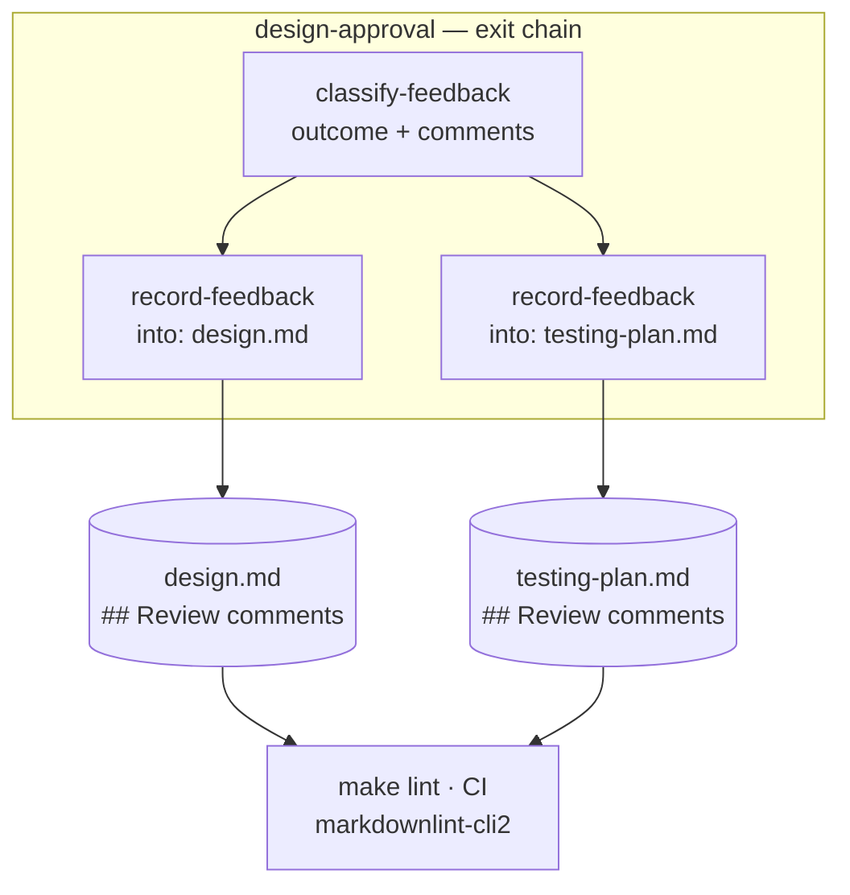

# Design: record-feedback writes markdown that fails the project's own markdownlint

> Phase 2 of 3 (requirements → design → tasks). Derives from the approved
> requirements. MUST be reviewed and approved before moving to tasks breakdown.

## Overview

Give the attribution line trailing text, and give an empty body a line of its own. Two
branches in one loop body, in one hook. Nothing else in the harness writes markdown into a
checked-in artifact, so there is nowhere else for the same defect to hide.

```python
# after
for comment in comments:
    body = comment["body"].strip()
    if body:
        entry.append(f"\n**@{comment['author']}** wrote:\n\n{body}\n")
    else:
        entry.append(f"\n**@{comment['author']}** left no comment text.\n")
```

That satisfies R1.1 (the attribution is no longer a paragraph of emphasis alone), R1.2 (an
empty body no longer produces two blank lines in a row) and all of R2 (the handle keeps its
`@` form, the body is still `.strip()`ed and otherwise verbatim, the block is still
append-only under `## Review comments`).

## Architecture

Unchanged. `record-feedback` keeps its place in the exit chain of both human gates, keeps
reading its comments from the preceding `classify-feedback` result, and keeps its
`into:` parameter.



## Components & interfaces

One function changes: `record_feedback` in `cli/the_loop/graph/hooks/feedback.py`.

- **Inputs:** unchanged — `ctx.params["into"]`, and the `comments` list carried on the
  preceding `classify-feedback` `HookResult`.
- **Output:** unchanged — `HookResult.ok(name, recorded=<n>, artifact=<into>)`, and the
  artifact on disk with one block appended.
- **The block's grammar** is what this work item fixes:

```text
### <date> — <outcome>
                                  <- blank
**@<handle>** wrote:              <- attribution: emphasis + trailing text (was: emphasis alone)
                                  <- blank
<body, verbatim after .strip()>
                                  <- blank, then the next comment's attribution
```

with the empty-body case collapsing to a single attribution line and no dangling blank:

```text
**@<handle>** left no comment text.
```

## Chosen shape, and the two it was chosen over

The ticket offered two fixes — trailing text on the attribution line, or a blockquote. Both
satisfy MD036; all three candidates below were run through the repository's own pinned
linter before choosing (evidence: [`evidence/shapes.md`](evidence/shapes.md)).

| Candidate | Passes MD036? | Why it was not chosen |
|-----------|---------------|-----------------------|
| `**@handle** wrote:` | yes | **chosen** — one paragraph, no rule quirk relied on, body untouched |
| `> **@handle**` | yes | passes only because MD036 does not descend into blockquotes; that is a linter implementation detail, not a promise, and the fix would silently regress if it changed |
| `**@handle** — <outcome>` | yes | the outcome is already on the `###` heading above, and per-comment it is a claim about a single comment that the gate never made |

The rejected middle row is the interesting one: it is the shape the ticket suggests, and it
works today, but the fix would then depend on a rule *not* firing rather than on the input
*not matching* it. `wrote:` makes the paragraph fail MD036's premise outright.

## Data models

None. No schema, no config key, no graph change, no persisted state.

## UI/UX design

N/A — a CLI/harness change with no user-facing surface.

## Error handling

Unchanged, and there is nothing new to fail: the change is string assembly between the
existing `path.read_text` and `path.write_text`. Every existing early return —
`skipped` for no `into:`, for a missing artifact, and for no feedback to record — is
untouched, and a raising hook still becomes a non-retriable `block` per the graph contract.

## Security design

The requirements' **Security considerations** identify one trust boundary near this code
and one piece of untrusted input. Both are enforced exactly where they were:

- **AuthN/AuthZ:** unchanged and upstream. `_authorized_comments` reads only comments whose
  author matches `config.authorizedUsers` and drops anything carrying the self-authored
  marker; `record_feedback` never sees the rest. This change touches no part of that path.
- **Input validation & injection surfaces:** the reviewer's body is untrusted text written
  verbatim into a checked-in file. That is the existing, deliberate behaviour — the paper
  trail is the point — and this fix does not widen it: the body is still `.strip()`ed and
  interpolated, and no new interpolation site is added. The one new piece of text
  (`wrote:` / `left no comment text.`) is a literal in the source, not derived from the
  event. **Prompt injection** deserves the explicit note the requirements gave it: a
  comment body could contain instructions aimed at a later agent reading the artifact. It
  could before this change too, byte for byte; the mitigation is unchanged and structural —
  the text sits inside a `## Review comments` section, attributed to a named author, and no
  code reads that section as configuration.
- **Secrets handling:** none read, none written, none logged. The `HookResult` still
  carries a count and a filename.
- **Least privilege:** unchanged — the hook writes one file inside `work_item.spec_dir`,
  resolved from `ctx.params["into"]` as before.
- **Fail-closed behaviour:** unchanged. Nothing is written unless a target, an artifact and
  at least one authorized comment are all present.
- **Abuse-case coverage:** the requirements raised no new abuse case, because the fix
  narrows what the harness itself writes and changes nothing about what it accepts. The
  negative tests that already guard the boundary (an unauthorized author's "lgtm" does not
  advance the node; a self-authored comment is not feedback) are unchanged and still run.

## Testing strategy

Two unit tests at the hook, one asserting the emitted shape against MD036's premise (no
line is emphasis and nothing else) and one asserting the empty-body case introduces no
blank-line pair; the existing integration scenario at the gate keeps asserting that the
attribution and the body both survive, and gains an assertion that the recorded artifact is
lint-clean by shape. Both new tests fail on the current code and pass on the fixed code —
recorded as red→green evidence per `tdd.mode: standard`.

The **real** linter runs once, at verification, over an artifact produced by the fixed hook
(`markdownlint-cli2@0.18.1`, the version `make lint` pins). It is evidence, not a test: the
suite must run without Node.js, and a test that skips when `npx` is missing would quietly
stop guarding the thing this ticket is about. The executable detail — the matrix, the
environment, the evidence — is in [`testing-plan.md`](testing-plan.md).

## Trade-offs & decisions

- **The harness's own markdown is the harness's problem; the human's is not.** This fix
  covers every line `record-feedback` authors and no line the reviewer authors. Recorded in
  [decision-089](../../decisions/decision-089.md), because it is the rule the next hook that
  writes markdown will be read against.
- **`wrote:` over the ticket's `— <outcome>`**, for the reason in the table above.
- **No shared "emit safe markdown" helper.** One call site, one shape (minimalism ladder:
  inline before abstraction). If a second hook ever writes into an artifact, the helper is
  the right answer then, and the decision doc says so.
- **No test that shells out to markdownlint.** Argued in the testing strategy; the cost is
  that a future markdownlint release could add a rule the shape assertion does not model,
  which is what the verification-time run is there to catch.

## Open questions

None.

## Review comments

> Appended by the-loop's `record-feedback` hook when a human gate approves with
> comments (issue-109). Append-only and attributed: an approval never silently
> discards a reviewer's suggestions, and the feedback travels with the document
> it concerns rather than living in a side-channel tracker.
