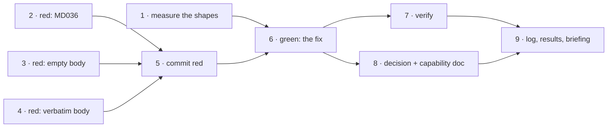

# Tasks: record-feedback writes markdown that fails the project's own markdownlint

> The last spec artifact (requirements → design → testing plan → tasks). A DAG of
> implementation tasks derived from the approved design and testing plan.

## Task list

- [x] 1. Capture the linter's verdict on all three candidate shapes
  - Write one markdown file per candidate (`**@h**` alone, `**@h** wrote:`, `> **@h**`)
    and run the pinned `markdownlint-cli2@0.18.1` over them.
  - This is what makes the design's rejection table a measurement rather than a claim.
  - _Depends on:_ none
  - _Requirements:_ R1.1
  - _Test:_ `T12 — npx --yes markdownlint-cli2@0.18.1 <candidates>`
- [x] 2. Red: assert no emitted line is emphasis and nothing else
  - New unit test in `cli/tests/test_graph_integration.py`, Gherkin-documented, citing
    `docs/specs/issue-247/bugfix.md#R1`. Fails on the current hook with the MD036 shape.
  - _Depends on:_ none
  - _Requirements:_ R1.1, R3.1
  - _Test:_ `T1 — pytest cli/tests/test_graph_integration.py::test_a_recorded_review_never_writes_emphasis_alone_on_a_line` (red→green)
- [x] 3. Red: assert an empty comment body records no blank-line pair
  - Second new unit test, same file. Fails on the current hook, which emits
    `**@owner**\n\n\n`.
  - _Depends on:_ none
  - _Requirements:_ R1.2, R3.1
  - _Test:_ `T1 — pytest …::test_a_comment_with_no_body_is_recorded_without_a_blank_line_pair` (red→green)
- [x] 4. Extend the existing gate scenario to assert the body is verbatim
  - `test_an_approval_with_comments_is_recorded_in_the_artifact` asserts the handle and a
    substring today; make it assert the body verbatim and the block lint-clean by shape.
  - _Depends on:_ none
  - _Requirements:_ R1.3, R2.1, R2.2
  - _Test:_ `T2 — pytest …::test_an_approval_with_comments_is_recorded_in_the_artifact` (red→green)
- [x] 5. Commit the red run as evidence
  - `evidence/red.md`, titled, one section per command, raw output fenced.
  - _Depends on:_ 2, 3, 4
  - _Requirements:_ R3.1
  - _Test:_ `T1, T2 — the same pytest invocation, captured failing`
- [x] 6. Green: rewrite the block assembly in `record_feedback`
  - The two branches from `design.md` §Overview, with the comment that says why the
    trailing text is there — so the next reader does not "simplify" it back.
  - _Depends on:_ 2, 3, 4
  - _Requirements:_ R1.1, R1.2, R2.1, R2.2, R2.3
  - _Test:_ `T1, T2 — the same pytest invocation, now passing` (red→green)
- [x] 7. Verify against the real linter, and against the whole repository
  - T12 over an artifact each shape recorded into, then `make check`.
  - _Depends on:_ 6
  - _Requirements:_ R1.3, R3.2
  - _Test:_ `T12, T13`
- [x] 8. Record the rule in the decision log and the capability doc
  - `decision-089` (the harness's own markdown lints; a human's words are never rewritten),
    the `record-feedback` bullet in `docs/capabilities/process-graph.md`, and its history
    row.
  - _Depends on:_ 6
  - _Requirements:_ R1, R2
  - _Test:_ `T13 — make check` (markdownlint over the edited docs)
- [x] 9. Complete the execution log, the testing plan's results, and the PR briefing
  - Tick the plan's activities against what actually ran, fill Verification results,
    Capability docs and Documentation, then post the briefing on the PR.
  - _Depends on:_ 7, 8
  - _Requirements:_ R3
  - _Test:_ `T13 — make check`

## Dependency graph (DAG)

## Checkpoints

Tasks 2–4 run together as one red root — a single failing pytest run captured as
`evidence/red.md` before task 6 makes it green. After task 6: the same run, green. After
task 7: `make check`, whole-repository. After task 9: the execution log carries the
verification summary and the capability-docs row, which is what the `capability-docs` and
`verification` gates read.

## Review comments

> Appended by the-loop's `record-feedback` hook when a human gate approves with
> comments (issue-109). Append-only and attributed: an approval never silently
> discards a reviewer's suggestions, and the feedback travels with the document
> it concerns rather than living in a side-channel tracker.
