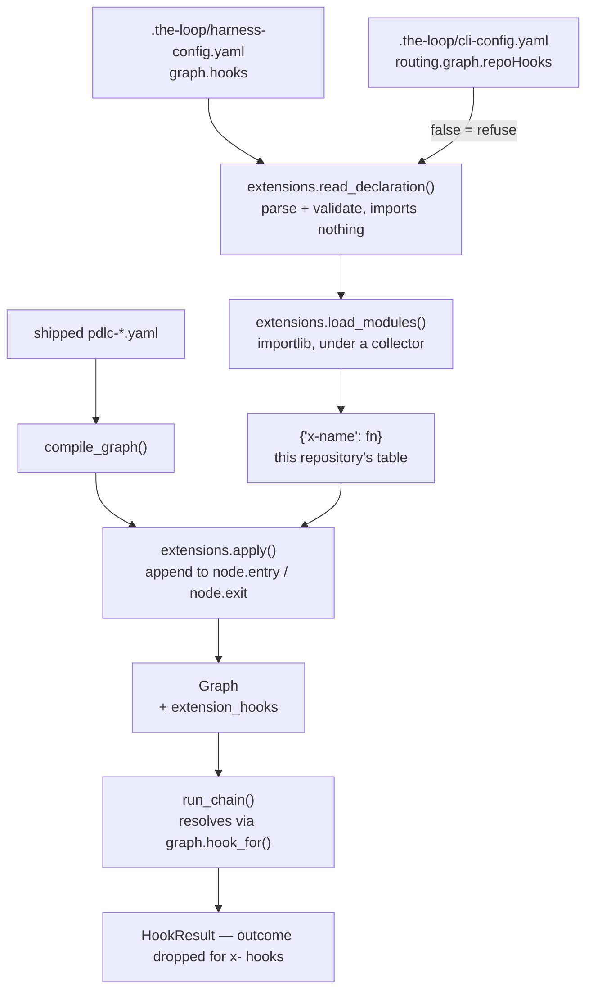
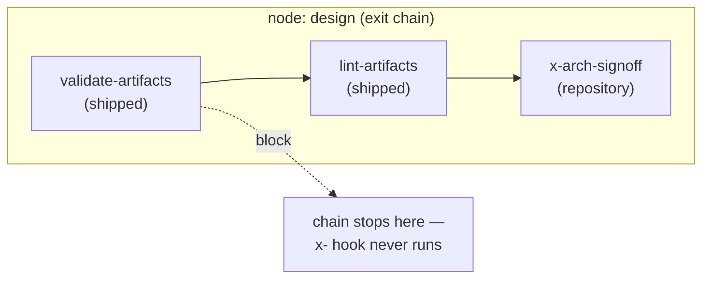

# Design: the graph stays the-loop's, the hooks at its boundaries can be yours

> Phase 2 of 3. Derived from the approved `requirements.md`. Reviewed together with
> `testing-plan.md` at one human gate.

## Overview

**One new seam, at the one place a repository is already known.** `load_graph(repo=…)` is
today the function that says *"a repository cannot define the process"* and warns when one
tries. It is also the only place in the runtime that holds both the compiled shipped graph
and the repository it will be walked in — so it is where a repository's own hooks are read,
loaded, validated and appended, and nowhere else. Every caller already goes through it:
`the-loop check`, every `graph` verb, and the daemon via `build_runtime`.

Four rules carry the whole design, and three of them are restrictions:

| Rule | Why it is the design |
|---|---|
| **Declared in the harness config** (`graph.hooks`) | A hook gating *this project's* artifacts is a property of the project, not the machine — decision-044's direction rule, and where `reviews.critics[]` already lives. |
| **Append-only** | A repository hook runs *after* everything the-loop declared, so a shipped gate always short-circuits first. The strongest thing a repository can do to the loop is stop it. |
| **`x-` namespace, resolved per repository** | A name tells you whose code it is, cannot shadow a shipped hook, and cannot leak between two repositories one daemon serves. |
| **No routing** | An attached hook's `data["outcome"]` is dropped. A gate classification stays a shipped hook's job, so no repository hook can approve anything. |

Nothing about the *contract* changes: an attached hook is `(HookContext) -> HookResult`, run
by the same `run_chain`, blocked-on-raise by the same `except`.

## Architecture



The static half (`read_declaration`) is deliberately separable from the loading half
(`load_modules`): `the-loop graph hooks` runs the first and stops, which is how an operator
inspects a repository's declarations without executing them (R5.1).

### Where a repository hook runs



## Components & interfaces

### New: `the_loop/graph/extensions.py`

```python
EXTENSION_PREFIX = "x-"

@dataclass(frozen=True)
class ModuleRef:
    path: str = ""          # repo-relative .py file
    dotted: str = ""        # importable module name
    def label(self) -> str: ...

@dataclass(frozen=True)
class Attachment:
    hook: str
    node: str
    boundary: str = "exit"          # entry | exit
    params: Mapping[str, Any] = ...  # the chain entry's `with:`

@dataclass(frozen=True)
class Declaration:
    modules: Tuple[ModuleRef, ...] = ()
    attachments: Tuple[Attachment, ...] = ()
    @property
    def empty(self) -> bool: ...
    def digest(self) -> str: ...     # cache key contribution

def read_declaration(harness: Mapping[str, Any]) -> Declaration: ...
def load_modules(repo: Path, declaration: Declaration) -> Dict[str, HookFn]: ...
def apply(graph: Graph, repo: Path, declaration: Declaration) -> Graph: ...
```

`read_declaration` raises `GraphConfigError` for a malformed block and imports nothing.
`load_modules` resolves and executes each module under the registry's collector and returns
the `x-` table. `apply` validates every attachment against the compiled graph and returns a
**new** `Graph` whose touched nodes carry the appended chain entries and whose
`extension_hooks` is the table.

### Changed: `the_loop/graph/registry.py`

The registry gains a collector, so a repository module registers with the same decorator a
shipped hook uses and still never lands in the process-global registry:

```python
@contextmanager
def collecting() -> Iterator[Dict[str, HookFn]]: ...
```

While collecting, `@hook(name)` requires the `x-` prefix and writes into the collector;
outside it, `@hook(name)` **refuses** an `x-` name (R3.2). `is_registered`/`get_hook` are
unchanged — the shipped registry is exactly what it was.

### Changed: `the_loop/graph/model.py`

- `Graph.extension_hooks: Mapping[str, HookFn]` and `Graph.hook_for(name)` — the table first,
  the shipped registry second.
- `_validate_chain(..., known=is_registered)` — one extra parameter so `apply` can validate an
  appended entry with the same code that validates a shipped one.
- `load_graph(path, repo, name, allow_repo_hooks=True)` — after `compile_graph`, when `repo`
  is given and hooks are allowed, read/load/apply. The cache key becomes
  `(target, repo, declaration.digest())`, because two repositories no longer compile to the
  same graph.

### Changed: `the_loop/graph/chain.py`

```python
resolve = getattr(ctx.graph, "hook_for", None) or get_hook
fn = resolve(name)
...
if name.startswith(EXTENSION_PREFIX) and result.data.pop("outcome", None) is not None:
    logger.warning("%s declared an outcome; repository hooks do not route", name)
```

Two lines of behaviour, both stated in R2.3/R2.4. A `run_chain` call with no graph in context
(unit tests, direct callers) still resolves from the shipped registry, so an `x-` name there
fails with the registry's own "unknown hook" message.

### Changed: `the_loop/graph/bootstrap.py`

`build_runtime` already reads the CLI config; it resolves `routing.graph.repoHooks` and
passes `allow_repo_hooks` into both `load_graph` calls. The `Runtime` fallback keeps the
default `True`, so a caller constructing a runtime without the daemon's config is unchanged.

### Changed: `the_loop/harness_config.py`

`READS` gains `graph.hooks` — the CLI reads a repository's hook declarations to execute that
repository's policy, and H1–H4 make the schema and the documentation follow.

### New CLI action: `the-loop graph hooks`

```
$ the-loop graph hooks --repo .
shipped hooks (10): classify-feedback, lint-artifacts, log-entry, mcp-call, notify, …

this repository declares 1 module and 2 attachments (nothing has been imported):
  module  .the-loop/hooks/house_rules.py
  attach  x-licence-header   → implementation (exit)
  attach  x-arch-signoff     → design (exit)  with: {board: platform}

`the-loop check <work item>` is what loads them; a declaration that cannot load fails there.
```

`--format json` for scripting, as the other actions have.

## Data models

The harness config's new top-level block — sibling to the existing `hooks:` block, which is
the pre-commit/pre-push gate list and a different thing entirely:

```yaml
graph:
  hooks:
    modules:
      - path: .the-loop/hooks/house_rules.py     # repo-relative .py file
      - module: acme_loop_hooks.compliance       # importable dotted name
    attach:
      - hook: x-licence-header
        node: implementation
        boundary: exit                            # entry | exit (default exit)
      - hook: x-arch-signoff
        node: design
        with: {board: platform}                   # typed params, as a shipped chain entry
```

And the module a repository writes:

```python
# .the-loop/hooks/house_rules.py
from the_loop.graph import HookContext, HookResult, Message, hook

@hook("x-licence-header")
def licence_header(ctx: HookContext) -> HookResult:
    missing = [p for p in ctx.repo.glob("src/**/*.py") if "SPDX" not in p.read_text()]
    if missing:
        return HookResult.blocked(
            "x-licence-header",
            [Message(text="missing SPDX header", path=str(p)) for p in missing],
        )
    return HookResult.ok("x-licence-header")
```

The one new CLI-config key, `routing.graph.repoHooks` (boolean, default `true`), sits beside
the existing `routing.graph.specDir`.

## UI/UX design

**n/a — no product UI.** The surfaces this work item touches are a YAML block, a CLI action
and a log line; `design.uiArtifacts` applies to user-facing work items and this is not one.

## Error handling

| Condition | Behaviour |
|---|---|
| `graph.hooks` absent or empty | Nothing is read, imported or appended. Today's behaviour, byte for byte. |
| `graph.hooks` malformed (not a mapping, `modules` not a list, an entry with neither `path` nor `module`, both at once) | `GraphConfigError` naming the offending entry, at load. |
| `path:` escapes the repository, is absolute, or is not `.py` | `GraphConfigError` naming the path and the rule it broke. |
| Module missing / unreadable / raises on import | `GraphConfigError` naming the module and quoting the underlying error. |
| Module registers nothing | `GraphConfigError` — a module that registers no hook is a declaration that silently does nothing. |
| Module registers a non-`x-` name | `GraphConfigError` naming the module and the name. |
| Two modules register the same `x-` name | `GraphConfigError` naming both — a repository's own collision is an authoring slip. |
| `attach.hook` was never registered | `GraphConfigError` listing what *was* registered. |
| `attach.node` is not in the loop being walked | `GraphConfigError` listing the loop's nodes. This fires per loop: a node that exists in the outer loop and not the inner one is a real error for the inner walk, so an attachment is declared against the loop it belongs to. |
| `attach.boundary` is neither `entry` nor `exit` | `GraphConfigError`. |
| An attached hook raises at run time | `block`, `retriable=False` — the shipped `except` in `run_chain`, unchanged. |
| An attached hook declares `data["outcome"]` | Dropped, with a warning naming the hook. |
| `routing.graph.repoHooks: false` with a declaring repository | Nothing is imported; a warning names the repository and the count it refused. |

The one deliberate asymmetry with the rest of the loader: a **repository's** declaration
failing stops the load with an error, while a repository's *graph* file is ignored with a
warning. Ignoring is right for something the-loop never promised to honour, and wrong for a
gate the repository asked for — R4.4.

## Security design

Requirements § Security considerations states the boundaries; this is how each is held.

- **Boundary 1 — configuration → code execution.** The YAML still names hooks; code still
  arrives as code. What is new is whose code, and the answer is *the repository's own,
  committed, reviewed* — the `reviews.critics[]` precedent (decision-043), with the same
  consequence: `graph.hooks` is executable configuration and belongs in
  `autonomy.sensitivePaths` alongside the rest of the harness config, where this repository
  already has it.
- **Boundary 2 — the CLI process.** Attached hooks run in-process, so a checkout's contents
  can reach the daemon's environment; an **agent** that can write the checkout can open that
  route by committing a hook module. Held by: the operator's kill switch
  (`routing.graph.repoHooks: false`), the no-import inspection command, the repo-tracked
  declaration a reviewer sees in the diff, and the documentation stating plainly that adopting
  a repository's hooks is adopting its code. Not held by a sandbox — deliberately out of
  scope, and said so. The residual risk is written up for the tier-4 sign-off in
  `evidence/security-review.md`.
- **Boundary 3 — repository hook → movement.** Append-only + short-circuit + outcome-dropped.
  The three together mean an attached hook cannot advance, approve or reroute anything.

| Abuse case | Mechanism | Negative test |
|---|---|---|
| 1. repository hook passes where a shipped hook blocked | append-only + `run_chain` short-circuit | `test_a_repository_hook_cannot_rescue_a_blocked_chain` |
| 2. repository hook declares `outcome: approved` | outcome dropped for `x-` hooks | `test_a_repository_hook_cannot_declare_an_outcome` |
| 3. module path escapes the repository | resolved and containment-checked before import | `test_a_module_outside_the_repository_is_refused` |
| 4. module shadows a shipped hook name | `x-` prefix required under the collector | `test_a_module_registering_a_shipped_name_fails_to_load` |
| 5. two repositories, one `x-` name | per-repository table on the `Graph` | `test_two_repositories_keep_their_own_implementations` |
| 6. attached hook raises | shipped `except` → `block`, `retriable=False` | `test_a_raising_repository_hook_blocks` |
| 7. operator refuses repository hooks | `allow_repo_hooks=False` short-circuits before any import | `test_the_operator_kill_switch_imports_nothing` |

**Fail closed.** Every malformed, unresolvable or ambiguous declaration stops the load. No
path degrades to "no hooks".

**Risk tier 4** — `security.review.humanSignOffMinTier: 4`, so a named human security
sign-off is required before this work item completes.

## Testing strategy

Unit tests for `extensions.py` and the registry collector (pure functions over a `tmp_path`
repository — no network, no subprocess). Integration tests with Gherkin docstrings under
`cli/tests/test_graph_extensions_integration.py`, driving a real repository tree through
`load_graph` and `run_chain`, including every negative in the table above. `testing-plan.md`
carries the matrix and the trace.

## Trade-offs & decisions

- **Harness config, not CLI config.** Costs the operator a central place to see every
  repository's hooks; buys the direction rule (decision-044) and one source of truth per
  project. The operator keeps a veto (`routing.graph.repoHooks`) rather than a registry.
  → recorded as `decision-096`.
- **Append-only rather than an insertion index.** Costs the ability to run a repository check
  *before* an expensive shipped one; buys the property that no repository hook can ever
  relax a shipped gate, which is what makes the feature safe to default on.
- **`x-` prefix rather than automatic namespacing by module.** Costs four characters per name;
  buys chains that read honestly (`validate-artifacts, lint-artifacts, x-arch-signoff`) and a
  collision rule that needs no resolution logic.
- **Per-repository table, not the global registry.** Costs one field on `Graph` and one lookup
  helper; buys correctness for the daemon, which walks several repositories in one process —
  the alternative silently runs repository A's `x-check` for repository B.
- **A collector context manager rather than a `register(name, fn)` call the module makes.**
  Costs a little import-time machinery; buys **one** authoring API: a repository hook is
  written exactly like a shipped one, which is what the `docs/cli/extending.md` page can then
  say in one sentence.
- **Load failure, not warn-and-continue.** Costs a repository the ability to limp along with
  a broken hook file; buys the guarantee that a declared gate either runs or is loudly
  absent. A compliance gate that silently stopped running is the failure mode worth being
  strict about.
- **Modules imported once per process, no hot reload.** Costs an operator a daemon restart
  after editing a hook; buys no filesystem watching and no partially-reloaded module state.

## Open questions

None outstanding.

## Review comments

> Appended by the-loop's `record-feedback` hook when a human gate approves with comments.
