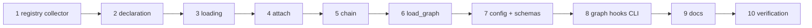

# Tasks: a repository may bring its own graph hooks

> The last spec artifact (requirements → design → testing plan → tasks). Derived from the
> approved design and testing plan.

## Task list

- [x] 1. The registry learns to collect
  - `collecting()` context manager in `graph/registry.py`; `@hook` writes into the collector
    while one is active and requires the `x-` prefix there, and refuses an `x-` name outside
    it. `EXTENSION_PREFIX` exported.
  - _Depends on:_ none
  - _Requirements:_ R3.1, R3.2, R3.3
  - _Test:_ `T1 — pytest cli/tests/test_graph_extensions.py -k collector` (red→green)
- [x] 2. Declaration parsing, with no imports
  - `graph/extensions.py`: `ModuleRef`, `Attachment`, `Declaration`, `read_declaration`,
    `digest`. Every malformed shape raises `GraphConfigError` naming the entry.
  - _Depends on:_ 1
  - _Requirements:_ R1.1, R1.2, R1.3, R4.1, R5.1
  - _Test:_ `T1 — pytest cli/tests/test_graph_extensions.py -k declaration` (red→green)
- [x] 3. Module resolution and loading
  - `load_modules`: repository containment for `path:` (absolute, `..`, symlink-out, non-`.py`
    all refused), `importlib` for both forms, one collector per module, per-source cache,
    duplicate-name and empty-module errors.
  - _Depends on:_ 2
  - _Requirements:_ R1.1, R1.2, R3.4, R4.1, R5.3 · abuse 3, 4
  - _Test:_ `T1/T8 — pytest cli/tests/test_graph_extensions.py -k load` (red→green)
- [x] 4. Attaching to the compiled graph
  - `Graph.extension_hooks` + `Graph.hook_for`; `_validate_chain(..., known=…)`;
    `extensions.apply` appending validated entries to `node.entry`/`node.exit`.
  - _Depends on:_ 3
  - _Requirements:_ R1.3, R1.4, R2.1, R2.5, R4.2 · abuse 5
  - _Test:_ `T1/T8 — pytest cli/tests/test_graph_extensions.py -k apply` (red→green)
- [x] 5. The chain resolves and de-fangs repository hooks
  - `run_chain` resolves through `ctx.graph.hook_for` when present; an `x-` hook's
    `data["outcome"]` is dropped with a warning.
  - _Depends on:_ 4
  - _Requirements:_ R2.2, R2.3, R2.4 · abuse 1, 2, 6
  - _Test:_ `T1/T8 — pytest cli/tests/test_graph_extensions.py -k chain` (red→green)
- [x] 6. `load_graph` reads the repository, and the cache key follows
  - Read the harness config when `repo` is given, apply the declaration, key `_CACHE` by
    `(path, repo, digest)`; `allow_repo_hooks=False` short-circuits before any read.
  - _Depends on:_ 5
  - _Requirements:_ R1.5, R1.6, R4.4, R5.2 · abuse 7
  - _Test:_ `T1/T2/T10 — pytest cli/tests/test_graph_extensions_integration.py` (red→green)
- [x] 7. Config plumbing: `READS`, the operator's switch, the schemas
  - `harness_config.READS` gains `graph.hooks`; `build_runtime` resolves
    `routing.graph.repoHooks` and passes it down; `.the-loop/harness-config.schema.json`
    gains the `graph` block (+ `x-onboarding` group); `.the-loop/cli-config.schema.json`
    gains `routing.graph.repoHooks`, copied byte-identically into `cli/the_loop/schemas/`.
  - _Depends on:_ 6
  - _Requirements:_ R1.1, R5.2
  - _Test:_ `T12 — pytest cli/tests/test_harness_config.py cli/tests/test_config_schema_parity.py`
- [x] 8. `the-loop graph hooks`
  - The static inspection action (text + json), importing nothing.
  - _Depends on:_ 7
  - _Requirements:_ R5.1
  - _Test:_ `T2 — pytest cli/tests/test_graph_extensions_integration.py -k inspect` (red→green)
- [x] 9. Documentation and capability docs
  - `docs/capabilities/process-graph.md` (new subsection), `docs/cli/extending.md`
    (§ Adding a hook), `docs/config/harness-config.md` (sections table + CLI-read table),
    `docs/config/cli/routing-options.md` (the new key), `docs/cli/commands/graph.md`
    (the new action), `decision-096`, and a commented example in both copies of the default
    harness config.
  - _Depends on:_ 8
  - _Requirements:_ R1, R5
  - _Test:_ `T12 — pytest cli/tests/test_docs_parity.py cli/tests/test_harness_config.py`
- [x] 10. Verification
  - Execute `testing-plan.md`: run the matrix, tick the activities, record results and commit
    evidence under `docs/specs/issue-248/evidence/`.
  - _Depends on:_ 9
  - _Requirements:_ all
  - _Test:_ `T1/T2/T8/T10/T11/T12 — make test && make lint && make typecheck`

## Dependency graph (DAG)

## Checkpoints

After tasks 5, 7 and 9: run `make test`, `make lint`, `make typecheck` and update
`execution-log.md`. Task 10 is the `verification` node executing the plan; the review chain
and the **security review gate** (risk tier 4 — a named human sign-off) run after it.

## Review comments

> Appended by the-loop's `record-feedback` hook when a human gate approves with comments.
