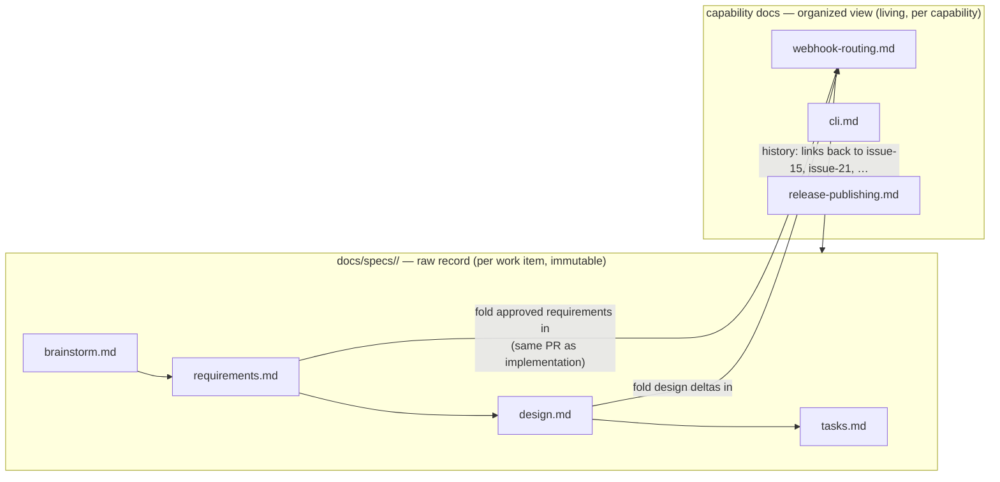

# Brainstorm: specs organization and capability documentation

> The root artifact for issue-25. Specs today are per-work-item folders
> (`docs/specs/issue-<n>/`) — a chronological record, not the shape humans (or AI) read
> a product in. This scratchpad explores how the-loop should organize specs so the
> *current truth* of the system is readable by capability, without breaking the
> per-work-item paper trail. Iterated with feedback in PR review until locked.

## Problem / opportunity

Specs are generated work item by work item as `requirements.md`, `design.md` (and
related files) and `tasks.md` under `docs/specs/issue-<n>/`
(e.g. https://github.com/MadaraUchiha-314/the-loop/tree/main/docs/specs). That is the
right shape for *producing* a change, but not for *reading* the product:

- Humans (and AI) read by **topic** — the architecture of the system, or a product
  feature/capability — not by ticket number or chronology.
- The current behaviour of any one capability is **smeared across every spec that ever
  touched it**. To answer "how does webhook routing behave today?" a reader must find
  issue-15, then every later issue that amended it, and mentally merge them in order.
- Each new work item makes this worse: per-issue folders grow linearly and the merge
  cost grows with them. Nothing in the repo holds the *consolidated, current* statement
  of what the product does.

The opportunity: the-loop already maintains living knowledge (`docs/architecture/`,
`docs/decisions/`, `learnings/`). Specs deserve the same split between the **raw
record** (what happened, per work item) and an **organized view** (what is true now,
per capability) — with the organization itself reviewable in PRs like everything else.

## Context & constraints

- Existing raw record: `docs/specs/<id>/` — the chain
  `brainstorm → requirements → design → tasks → execution-log` per work item. Seven
  work items exist today (issue-1 … issue-21). This is also what makes the loop
  **resumable**, so it cannot be reshaped casually.
- Existing organized knowledge: `docs/architecture/architecture.md` (index →
  sub-component docs as they are added), the decision log, and learnings. Notably, the
  architecture doc already *is* a capability-shaped view — but it is narrative-only and
  nothing in the loop forces it current when a spec lands.
- **Single source of truth** is a core rule (reference, don't duplicate). Any organized
  layer must not create a second place where the same requirement is *normatively*
  stated, or the two will drift.
- Feedback must flow through **PR review**: users give feedback on the structure and
  organization of specs the same way they review everything else — as diffs.
- Backwards compatible: existing per-issue specs stay where they are; ticket links into
  them must not break.

## Ideas & options

- **Option A — two layers: raw specs (per work item) + living capability docs
  (organized).** `docs/specs/<id>/` stays exactly as-is: the immutable, append-mostly
  record of how each change was specified and executed. Separately, the loop maintains
  **one living document per capability** that states the *current* behaviour and links
  back to every raw spec that shaped it. Completing a work item includes folding its
  approved requirements/design into the affected capability doc(s) — in the same PR, so
  reviewers see (and can push back on) both the change *and* how it is filed.
  *Pros:* readers get current truth by topic; the paper trail is untouched; taxonomy
  evolves as ordinary reviewed diffs; matches the existing decisions/learnings pattern.
  *Cons:* one more artifact to keep honest — needs a gate, or it rots. ✅ **leaning**.
- **Option B — physically reorganize raw specs by category**
  (`docs/specs/<capability>/<id>/`). *Pros:* one hierarchy, no second layer.
  *Cons:* a work item often spans capabilities (issue-21 touched CI *and* the CLI);
  taxonomy churn forces mass file moves that break ticket/PR links; lookup by ticket id
  gets harder; and it still doesn't produce a *merged* current view — the reader still
  reads N specs, just grouped. ✗
- **Option C — index only.** Keep flat per-issue specs and add a generated
  capability → work-items table (a "spec map"). *Pros:* cheap, zero duplication risk.
  *Cons:* solves discovery, not comprehension — the merge burden stays with the reader.
  Worth having *inside* Option A as each capability doc's history table, not as the
  whole answer. ~ (subsumed by A)
- **Option D — no organized layer; extend the architecture docs and stop there.**
  Answer the issue's closing question with "yes, it's just documentation" and rely on
  `docs/architecture/<component>.md` alone. *Pros:* no new concept. *Cons:* as-is,
  nothing *requires* those docs to be updated per work item, and they carry no
  traceability back to requirements — this is Option A minus the discipline that makes
  it trustworthy. ✗ as stated, but it sharpens the real insight below.

### The sharp question in the issue: is an "organized spec" just documentation?

Working answer: **yes — and that is the design, not a reason to skip it.** The raw
specs are *deltas* (like commits); the organized layer is *state* (like the working
tree). Nobody learns a codebase by reading `git log`, and nobody should have to learn a
product by reading spec folders in ticket order. So the-loop should not invent a third
artifact kind called "organized specs" — it should treat **capability documentation as
the organized view of specs**, generated and maintained *by the loop* with two
properties plain documentation lacks:

1. **Traceability** — every capability doc links the raw specs (and decisions) that
   produced each behaviour, so "why is it like this?" is one hop away.
2. **A gate** — updating the affected capability doc(s) is part of finishing a work
   item (a ready-to-ship item, like the PR briefing), so the view cannot silently rot.

## Sketches & notes

- Analogy that keeps recurring: raw spec : capability doc :: commit : working tree ::
  decision-nnn.md : architecture.md. The repo already lives this pattern twice.
- A capability doc probably wants: what it is (narrative), current behaviour
  (consolidated requirements), pointers into design, and a history table
  (work item → what it changed → links). The exact template is a requirements-phase
  question.

## Open questions

Raised for the human to answer (paper trail on issue #25); resolved answers get folded
back here before this artifact locks.

1. **Where does the organized layer live?** Unify with the architecture sub-component
   docs (`docs/architecture/<capability>.md` — one topical view, no new tree) or a new
   `docs/capabilities/` (keeps "how it's built" separate from "what it does")?
2. **What is the taxonomy, and who owns it?** Architecture-shaped, product-feature-
   shaped, or both? Emergent (a doc is minted when a spec first touches a capability,
   reviewed in that PR) or curated up-front in an index?
3. **How normative is a capability doc?** Does it *carry* the current consolidated
   EARS requirements (becoming the single source of truth for *current* behaviour,
   with raw specs demoted to history), or is it narrative + links only? This is the
   single-source-of-truth fork in the road.
4. **When does the fold-in happen?** In the same PR as the implementation (gate it in
   the ready-to-ship checklist, like the PR briefing) or as a periodic consolidation
   pass (like learnings)? Same-PR keeps feedback-on-organization inside PR review —
   which the issue explicitly asks for.
5. **Migration:** backfill capability docs from the seven existing specs in this work
   item, or let them accrete as future work items touch each area?

## Leaning / working hypothesis

**Option A.** Keep `docs/specs/<id>/` untouched as the raw, per-work-item record.
Maintain living **capability documentation** as the organized view — one doc per
capability, stating current behaviour with links back to the raw specs and decisions
that produced it (the issue's own answer: the organized spec *is* the capability
documentation, so no third artifact kind is invented). Fold-in happens in the same PR
as the work item and is gated in the ready-to-ship checklist, so the structure and
organization of specs is itself reviewable — and correctable — during PR review.

## Hand-off → requirements

When locked, `requirements.md` should assert: the raw/organized split (specs stay
per-work-item; capability docs are the organized view); the capability-doc template and
its traceability links; the fold-in step and its gate in the loop (skill + workflow
reference + config where needed); the answers adopted for the open questions above
(location, taxonomy ownership, normativity, timing, migration); and the corresponding
decision record. Options B/C/D stay here as the record of what was considered.
