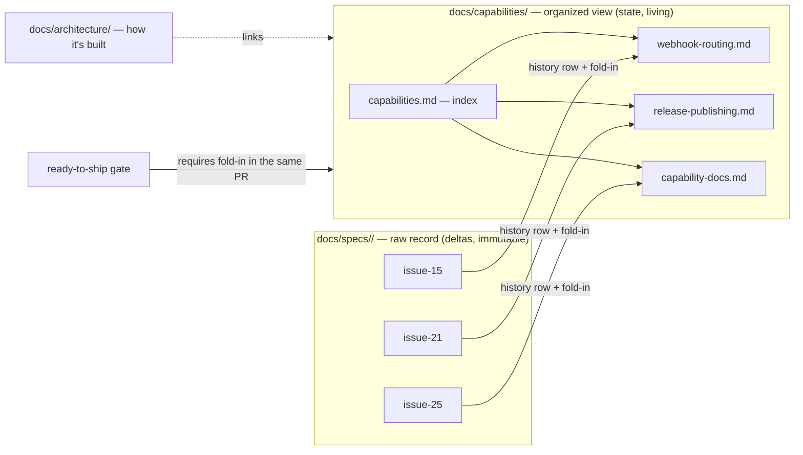

# Design: specs organization and capability documentation

> Phase 2 of 3. Derived from the approved [`requirements.md`](requirements.md). This is
> plugin-content work (markdown, config, templates) — no runtime code.

## Overview

Add a second knowledge layer next to the per-work-item specs: **capability docs** under
`docs/capabilities/` (configurable via `workflow.capabilitiesDir`). Raw specs stay the
immutable delta record; each capability doc is the living, normative statement of a
capability's *current* behaviour, with a history table tracing every behaviour back to
the spec (and decision) that produced it. The loop maintains the layer through a new
ready-to-ship gate item: affected capability docs are updated **in the same PR** as the
work item.

## Architecture

Three views, one product: `docs/specs/` (what happened, per work item),
`docs/capabilities/` (what is true now, per capability — product-feature and
architecture shaped), `docs/architecture/` (how it is built). The decisions/learnings
pattern already in the repo (`decision-<nnn>.md` index + records) is reused for the
index + per-capability files.

## Components & interfaces

| Component | Responsibility |
|-----------|----------------|
| `.the-loop/templates/capability.md` | Defines the capability-doc structure (R2.3): narrative, current behaviour, design pointers, history table. |
| `docs/capabilities/capabilities.md` | Index: capability → doc → one-liner. Updated whenever a doc is minted/renamed (R4.4). |
| `docs/capabilities/<capability>.md` | One living doc per capability; single source of truth for current behaviour (R2). |
| `workflow.capabilitiesDir` (config) | Location of the layer; default `docs/capabilities`. Added to `config.schema.json`, `config.yaml`, `templates/config.yaml` (R6.2). |
| `.the-loop/manifest.yaml` | Tracks the template and the knowledge files (R6.3). |
| Skill + `reference/workflow.md` + `README.md` | State the split, the fold-in rule and the new gate item (R5, R6.4). |

The fold-in **interface** is prose-level (this is a process capability): a work item's
implementation phase ends with "update affected capability docs (or record 'none
affected' in the execution log)", checked by the ready-to-ship gate.

## UI/UX design

N/A — docs/config only; no user-facing surface.

## Data models

Capability doc structure (mirrored in the template):

- **Header** — capability name + one-line purpose.
- **What it is** — short narrative of the capability.
- **Current behaviour** — consolidated, normative requirement statements (the single
  source of truth; each statement traceable to a history row).
- **Design** — pointers into `docs/specs/<id>/design.md`, `docs/architecture/`,
  reference docs (link, don't duplicate).
- **History** — table: work item → what changed → links (spec folder, decision, PR).

## Error handling

The failure mode is **drift** (capability doc no longer matches behaviour). Mitigation
is the gate (R5): the loop cannot request review without the fold-in recorded, and
reviewers see the capability-doc diff next to the change it documents.

## Testing strategy

No runtime code, so no unit/integration tests and `tdd.mode` does not bite (no
production code is written). Verification is the doc/config gates, same as CI:
markdownlint over all markdown, `scripts/validate_config.py` for the schema change,
and pre-commit parity (`pre-commit run --all-files`).

## Trade-offs & decisions

- **Normative capability docs vs "reference, don't duplicate".** Deliberately moves
  the single source of truth for *current* behaviour to the capability doc (reviewer's
  call, PR #26); raw specs are demoted to history. The duplication risk is bounded by
  the same-PR gate. Recorded as `docs/decisions/decision-020.md`.
- **Emergent taxonomy over curated.** Docs are minted when first needed and reshaped
  through PR review — organization feedback arrives as diffs, which is exactly what
  issue #25 asked for.
- **New `docs/capabilities/` over extending `docs/architecture/`.** Keeps "what it
  does" (capabilities, both product- and architecture-shaped) apart from "how it's
  built"; the two link to each other (rejected Options B/C/D stay in the brainstorm).
- **No generation tooling yet** (minimalism/YAGNI): authored markdown first; extraction
  tooling can come later if the layer proves heavy to maintain by hand.

## Open questions

None.
