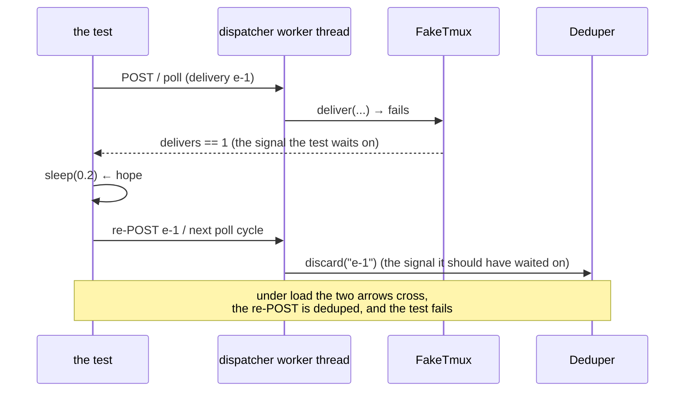

# Bugfix spec: integration tests that wait on the attempt and assert on its outcome

> Phase 1 of 3 for a bug (bugfix → design → tasks). This phase MUST be reviewed and
> approved before the design is derived from it.

## Summary

Three integration tests failed roughly one run in three whenever anything slow ran before
them, and each failed for the same reason: it waited for one thing and then depended on a
*different* thing that the dispatcher writes a step later, on its own worker thread.
[PR #244](https://github.com/MadaraUchiha-314/the-loop/pull/244) fixed those three
because a red CI on that PR was that PR's problem. It left ticket
[#251](https://github.com/MadaraUchiha-314/the-loop/issues/251) open for the part it did
not do: **sweep the suite for the same pattern.**

This work item is that sweep, its two findings, and the two things that stop the pattern
coming back — a rule the harness reads before it writes an async test, and a committed way
to *find* the shape rather than argue about it.

The sweep found **two** remaining instances in 2224 tests, both of a variant the ticket
had not named. Neither asserts too early; both **act** too early:

| Test | Waits on | Depends on |
|------|----------|------------|
| `test_webhook_routing_integration.py::test_delivery_error_is_isolated_and_redelivery_retries` | the failed `tmux.deliver` | `Deduper.discard`, which the dispatcher runs after the failed deliver |
| `test_poller_integration.py::test_an_abandoned_comment_is_reported_on_the_work_item` | the failed `tmux.deliver` | the same discard, read through `Dispatcher.delivery_status()` |

Both currently paper over the gap with a fixed `time.sleep(0.2)` — time standing in for a
signal, which is the tell the ticket's own examples share.



## Steps to reproduce

The failure is a lost race, so reproducing it by waiting for load is a coin toss. It is
made deterministic by delaying the write the test really depends on:

1. `pytest --dispatch-lag=0.5 cli/tests/test_webhook_routing_integration.py::test_delivery_error_is_isolated_and_redelivery_retries`
2. `pytest --dispatch-lag=0.5 cli/tests/test_poller_integration.py::test_an_abandoned_comment_is_reported_on_the_work_item`

`--dispatch-lag` (this work item, R2) delays every dispatcher write that follows the
spawn or delivery it was asked for. Both tests fail on every run under it and pass
without it. The organic reproduction is the ticket's: run the suite after something that
burns wall-clock across a few threads.

## Expected vs actual

- **Expected:** a test that depends on state written by a background thread waits for
  *that* state. Its outcome is decided by the code under test, never by how the scheduler
  feels about the machine that minute.
- **Actual:** two tests wait for the *attempt* (`len(tmux.delivers) == 1`) and then act on
  its *outcome* (the delivery id having been released for retry). Under `--dispatch-lag=0.5`:

  ```text
  FAILED cli/tests/test_webhook_routing_integration.py::test_delivery_error_is_isolated_and_redelivery_retries
      assert wait_until(lambda: len(tmux.delivers) == 2)
  E   assert False

  FAILED cli/tests/test_poller_integration.py::test_an_abandoned_comment_is_reported_on_the_work_item
      assert summary.failures == 1
  E   assert 0 == 1
  ```

## Root cause (confirmed)

A dispatch is two events, not one: the **attempt** (`tmux.spawn` / `tmux.deliver`, which
the `FakeTmux` double records) and the **outcome** (the registry, deduper, event-log,
announcer and graph writes the dispatcher makes afterwards, on the worker thread). The
double is the visible one, so it is the one tests reach for — and everything the dispatch
*means* is written after it.

```python
# cli/the_loop/webhook/dispatcher.py — the failure tail of _dispatch_one
result = self.tmux.deliver(endpoint, prompt, ...)   # <- the test's signal
...
eventlog.emit("dispatch.failed", ...)
if routed.delivery_id:
    self.deduper.discard(routed.delivery_id)         # <- what the test depends on
```

For the poller test the dependency runs through production code rather than an assertion:
`Dispatcher.delivery_status()` reports `"inflight"` while the id is still in the deduper,
and the poller deliberately does not spend a retry on an in-flight delivery. So a cycle
run too early sees nothing to retry, gives up on nothing, and `summary.failures` is 0.

The three instances PR #244 fixed were the assertion-shaped variant of the same root
cause; these two are the action-shaped variant. The lesson generalises past both:
**the attempt is not the outcome.**

## Requirements

### Requirement 1 — a test waits for the state it depends on

#### Acceptance criteria (EARS)

1. WHEN a test depends on state a dispatcher worker thread writes after the spawn or
   delivery THEN the test SHALL wait on **that state**, and SHALL NOT wait on the
   spawn/delivery record instead.
2. WHEN a test's next step depends on a dispatch **outcome** THEN it SHALL NOT use a
   fixed `time.sleep` as a stand-in for that outcome.
3. The two tests named above SHALL pass under `--dispatch-lag=0.5`, and SHALL still fail
   under it if their waits are reverted — the regression test for this fix is the lag
   itself.
4. No test in `cli/tests/` SHALL fail under `--dispatch-lag=0.5` after this work item.

### Requirement 2 — the pattern is findable, not only documented

#### Acceptance criteria (EARS)

1. The suite SHALL offer `pytest --dispatch-lag=<seconds>`, which delays every dispatcher
   write that follows a spawn or a delivery.
2. WHEN `--dispatch-lag` is absent or `0` THEN the suite SHALL behave exactly as before —
   no patching, no measurable cost.
3. The option SHALL be documented where somebody would look for it (the testing
   reference), naming what it delays and what a failure under it means.

### Requirement 3 — the harness stops writing the shape

#### Acceptance criteria (EARS)

1. `skills/the-loop/reference/testing.md` SHALL carry the rule as a RULE section:
   wait on the state you depend on, never on a signal that precedes it.
2. `docs/capabilities/testing-and-contracts.md` SHALL record the rule as current
   behaviour with a history row, in the same PR as the change.

## Security considerations

Not security-relevant, and it opens no attack surface. The change touches test code, a
pytest option that is off unless asked for, and documentation; it adds no dependency,
no network path, no filesystem path derived from input, and no production code.

One thing worth stating rather than implying: `--dispatch-lag` monkeypatches production
classes **within a test process only**, through pytest's `monkeypatch` fixture, which
unwinds per test. It cannot be reached from the CLI, the daemon or the service — there is
no runtime flag, environment variable or config key that turns it on outside pytest.

## Out of scope

- **Rewriting the passing tests.** 2222 tests already wait correctly; the ones using
  `dispatcher.stop()` as a barrier (it queues a sentinel and joins) are correct as they
  stand and are left alone.
- **The `time.sleep(...)` calls that guard a negative assertion** ("give a would-be
  dispatch time to wrongly happen"). They can only produce a false *pass*, never the
  intermittent failure this ticket is about. Removing them would need a different design
  — a way to prove a thing did not happen — and that is not this work item.
- **`test_stream_integration.py`'s `time.sleep(TICK_SECONDS * 2)`.** Read during the
  sweep and left: `broker.subscribe()` runs inside the route handler, before the 200
  reaches the client, so the state those sleeps wait for is already there. They make the
  file slower, never wrong.
- **The UI (vitest) suite.** No dispatcher, no background writer of this kind.

## Open questions

None. The one judgement call — shipping `--dispatch-lag` rather than only writing the
rule down — is argued in `design.md` and recorded as
[decision-089](../../decisions/decision-089.md).
