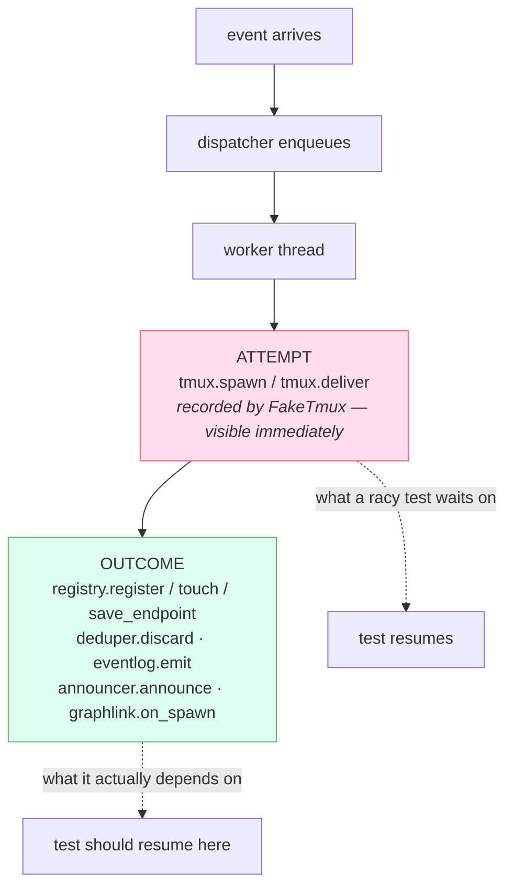

# Design: wait on the outcome, and make the shape findable

> Phase 2 of 3. Derived from the approved `bugfix.md`; reviewed together with
> `testing-plan.md` at one human gate.

## Overview

Three changes, in increasing order of how long they last.

1. **Two test fixes.** Each replaces "wait for the attempt, then sleep" with "wait for the
   outcome". Local, mechanical, and each proved by the lag that made it fail.
2. **`pytest --dispatch-lag=<seconds>`.** The sweep, committed. It turns a one-in-three
   flake into a certainty, so this class of bug is *found* rather than argued about — by
   CI, by the next work item, and by whoever inherits this suite.
3. **The rule, written down** in `reference/testing.md` and the capability doc, so the
   harness stops generating the shape in the first place.

Two and three are the reason this ticket stayed open after PR #244 fixed the symptoms.
Fixing two more tests without them would leave the same defect free to reappear on the
next async test anybody writes.

## Architecture

The defect lives in one seam: a dispatch is an **attempt** the test double records and an
**outcome** the dispatcher writes afterwards. Everything else follows from which of the
two a test observes.



`--dispatch-lag` widens the gap between the two boxes, on purpose, for every write in the
lower one. A test that resumes at the wrong arrow then fails deterministically.

## Components & interfaces

### The two fixes

| Test | Was | Becomes |
|------|-----|---------|
| `test_delivery_error_is_isolated_and_redelivery_retries` | `wait_until(len(tmux.delivers) == 1)` then `time.sleep(0.2)` | `wait_until("e-1" not in server_factory.dispatcher.deduper)` |
| `test_an_abandoned_comment_is_reported_on_the_work_item` | `wait_until(len(tmux.delivers) >= 1)` | `wait_until(dispatcher.delivery_status("poll-comment-IC_2", [ref]) == "unhandled")` |

Both predicates name the exact fact the next line needs. The delivery-attempt assertions
survive as **assertions** underneath, where they were always the right shape: `wait` for
what gates you, `assert` what you mean.

The webhook test needs the dispatcher, which `ServerFactory.__call__` does not return —
it returns `(port, registry, tmux)`, and widening that tuple would touch every one of the
file's twenty-odd call sites for the benefit of one. It already keeps
`self.started` as `(httpd, dispatcher)` pairs for teardown, so a `dispatcher` property
over the most recent entry is the whole change.

The poller test spells its delivery id literally (`poll-comment-IC_2`). That id is
`GitHubProvider.comment_event`'s own format, `f"poll-comment-{comment.id}"` — a contract
between the poller and the dispatcher's retry accounting, not an incidental string, and
the sibling test one function above already asserts against comment ids the same way.

### `--dispatch-lag`

A pytest option in `cli/tests/conftest.py` plus one autouse fixture:

```python
def pytest_addoption(parser): ...          # --dispatch-lag, default 0.0
@pytest.fixture(autouse=True)
def _dispatch_lag(request, monkeypatch):
    lag = request.config.getoption("--dispatch-lag")
    if lag <= 0:
        return                              # the default costs one float compare
    for cls, name in _LAGGED:               # patch through monkeypatch: unwinds per test
        ...
```

`_LAGGED` is the lower box of the diagram: `SessionRegistry.register`, `.touch`,
`.save_endpoint`, `.link_pull_request`, `.close`; `Deduper.discard`;
`SessionAnnouncer.announce`; `GraphLink.on_spawn`, `.on_event`; `ControlStore.record`.

Two properties matter more than the list:

- **Off by default, and cheap.** No patching, no import-time work, one comparison per test.
- **Per-test teardown.** `monkeypatch` unwinds each patch, so a lagged run cannot leave a
  slowed class behind for the next test.

`ControlStore.record` is in the list although it runs *before* the enqueue: lagging it
delays everything downstream, which is exactly the load this is imitating, and a write
that is on the safe side of the seam is worth including for the day it moves.

## UI/UX design

**None — this work item has no user-facing surface.** It changes test code, a pytest
option and documentation (`design.uiArtifacts` applies to product UI; the-loop's own
control plane is untouched here).

## Data models

None. No schema, config key, on-disk format or wire format changes.

## Error handling

The failure mode this introduces is a false *positive* from `--dispatch-lag`: a test that
fails under lag for a reason other than a wait-ordering bug — because the lag pushes a
whole cycle past a genuine timeout, say. It is handled by the option being **opt-in and
parameterised**: the reader compares against the same test at lag 0, and the reference
documents that a failure under lag is a lead, not a verdict.

The option validates nothing beyond pytest's own float parsing. A negative or absurd
value is the operator's business: `lag <= 0` disables, and a large one simply makes the
run slow, which is visible.

## Security design

**No new attack surface, and here is the argument rather than the claim.**

- No production code path changes. `cli/the_loop/` is untouched by this work item except
  for documentation the harness reads.
- `--dispatch-lag` monkeypatches production classes **inside a pytest process only**, via
  a fixture that unwinds per test. There is no environment variable, config key or CLI
  flag that reaches it from the daemon, the service or the SDK, and the patch cannot
  outlive the test that requested it.
- No trust boundary is touched: no authorization decision, no untrusted payload parsing,
  no path derived from input, no credential, no network call.
- The committed evidence is test output from a hermetic suite (tmp paths, fake GitHub
  state, a `FakeTmux`). Pytest's tmp paths appear in it and are `/tmp/pytest-of-…` only —
  no tokens, no hostnames, no personal data.

The one thing a reviewer should confirm rather than take on faith: that
`_dispatch_lag` really is inert at the default. It is one `if lag <= 0: return` before any
patching.

## Testing strategy

The lag **is** the regression test. A conventional regression test for "this test does not
race" would have to be a test about a test; `--dispatch-lag=0.5` proves the property
directly, on the real tests, and the same command proves the whole suite has the property.

- Red before green: both fixes were reproduced under lag first (the failures are quoted in
  `bugfix.md` and captured in `evidence/`), then fixed, then re-run under the same lag.
- The full suite runs twice: clean, and at `--dispatch-lag=0.5`.
- `--dispatch-lag=0` (i.e. absent) must leave the suite's runtime unchanged — the clean
  run is that check.

See `testing-plan.md` for the matrix and the activities.

## Trade-offs & decisions

**Ship the lag option, or only write the rule down?** Shipping it — recorded as
[decision-091](../../decisions/decision-091.md). The rule alone is what the loop had
before: PR #244 wrote the lesson into three code comments and two more instances were
still there for this sweep to find. `--dispatch-lag` is ~25 lines, off by default, and it
is the difference between a convention people mean to follow and one a command checks.

**Rejected: a lint rule over the test sources.** A checker that flags
`wait_until(... delivers ...)` followed by an assertion on the registry would have caught
the three instances PR #244 fixed and **neither** of the two here — both of which fail on
what they *do* next, not what they assert. It would also fire on the many correct sites
that wait on the attempt and then assert on the attempt. Wrong tool: this is a
happens-before property, and the way to test one is to move time, not to grep.

**Rejected: making the dispatcher expose a `quiesce()`/idle barrier for tests.** Tests
already have a real barrier in `dispatcher.stop()`, and most of the suite uses it. Adding
a second one would be production API existing for tests, and — worse — would let a test
keep waiting on the wrong signal and still pass, which teaches nothing.

**Rejected: raising the sleeps.** `time.sleep(0.2)` → `time.sleep(2)` trades a flaky suite
for a slow one and keeps the defect: there is no value that is correct, only values that
are unlucky less often.

**Rejected: running the lagged sweep in CI on every PR.** It is nine minutes against two,
for a property that changes only when async tests are added. The reference names the
command for a targeted or periodic run; making it a standing gate is a decision for
whoever owns the CI budget, not one to take inside a bugfix.

## Open questions

None.

## Review comments

*None yet.*
