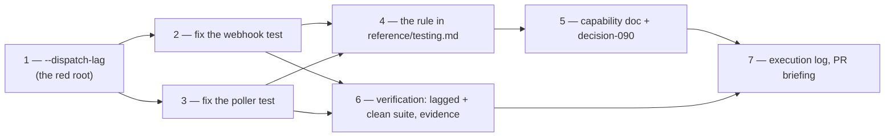

# Tasks: wait on the outcome, and make the shape findable

> A DAG, not a list. Task 1 is the red root: it is what makes tasks 2 and 3 provable, so
> it lands first even though it is the newest code here.

- [x] **1. `pytest --dispatch-lag=<seconds>`** — `pytest_addoption` plus an autouse
      fixture in `cli/tests/conftest.py` that delays every dispatcher write following a
      spawn or a delivery. Inert (one comparison) at the default.
      _Requirements:_ R2.1, R2.2
      _Test:_ T9a — the two named tests must fail under it before anything is fixed.

- [x] **2. `test_delivery_error_is_isolated_and_redelivery_retries` waits for the release** —
      wait on `"e-1" not in server_factory.dispatcher.deduper`; drop the `time.sleep(0.2)`;
      add the `ServerFactory.dispatcher` accessor the wait needs.
      _Requirements:_ R1.1, R1.2, R1.3
      _Test:_ T2, T9b

- [x] **3. `test_an_abandoned_comment_is_reported_on_the_work_item` waits for the outcome** —
      wait on `dispatcher.delivery_status("poll-comment-IC_2", [REF]) == "unhandled"`, the
      same call the next poll cycle makes.
      _Requirements:_ R1.1, R1.2, R1.3
      _Test:_ T2, T9b

- [x] **4. The rule in `skills/the-loop/reference/testing.md`** — a RULE section: wait on
      the state you depend on, never on a signal that precedes it; the attempt/outcome
      distinction; `--dispatch-lag` as the way to check.
      _Requirements:_ R3.1, R2.3
      _Test:_ T13

- [x] **5. Capability doc and decision** — `docs/capabilities/testing-and-contracts.md`
      current behaviour + history row; `docs/decisions/decision-090.md` and the index row.
      _Requirements:_ R3.2
      _Test:_ T13

- [x] **6. Verification** — the lagged suite (before and after), the clean suite, lint,
      format, typecheck; evidence committed under `evidence/`.
      _Requirements:_ R1.4, R2.2
      _Test:_ T2, T8, T9, T13

- [x] **7. Paper trail** — `execution-log.md` (phases, progress, capability docs,
      documentation), the reviewer briefing on the PR, phase label kept in sync.
      _Requirements:_ the loop's own rules
      _Test:_ n/a — reviewed, not executed.
