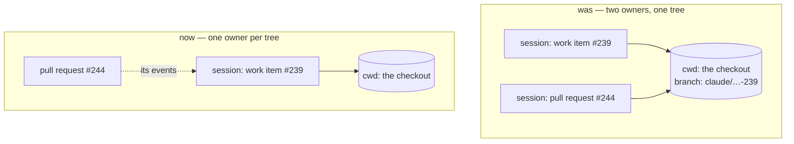

# Bugfix spec: a work item and its pull request had two sessions in one working tree

> Phase 1 of 3 for a bug (bugfix → design → tasks). This phase MUST be reviewed and
> approved before the design is derived from it.

## Summary

A work item delivered by a pull request **in its own repository** ended up with two live
harness sessions — the work item's, and the pull request's endpoint session
(`routing.tmux.sessionPerPr`, on by default) — spawned with the **same `cwd`**. Two agents,
one git worktree, one branch, no lock and no owner.

Nothing in the-loop prevented it, detected it, or reported it. Ticket:
[#253](https://github.com/MadaraUchiha-314/the-loop/issues/253).

The harm is not hypothetical. On `github:MadaraUchiha-314/the-loop#239` both sessions ran
the *same four verification activities* against a tree each was changing under the other:

- one session's services were restarted under the other's running measurement;
- the session registry was repointed mid-test;
- `ui/src` changed while it was being measured against;
- a commit landed in the shared worktree mid-flight, from the other session;
- the work was done twice, and only noticed because a file one session was about to
  create turned out to be committed already.

The two runs happened to agree. Had they disagreed, the branch would carry two
contradictory evidence files and no way to tell which tree each was measured against.
Recorded on
[PR #244](https://github.com/MadaraUchiha-314/the-loop/pull/244#issuecomment-5309264856).

## Steps to reproduce

1. `routing.tmux.sessionPerPr: true` (the default), `spawnOnUnmatched: labeled`.
2. `the-loop start` on an issue; let its session open a pull request in the same repository.
3. Comment on that pull request as an authorized user.
4. `tmux ls` shows two `loop-…` sessions. `the-loop sessions list --format json` shows the
   pull request's endpoint carrying the **same `cwd`** as the record. Both are live, both
   answer, and both write to the same branch.

## Expected vs actual

- **Expected:** a work item delivered by a pull request in its own repository has exactly
  one session. That session owns the work item, its branch, its checkout and its pull
  request conversation.
- **Actual:** two sessions, two harness conversations, one working tree, no arbitration.

## Root cause (confirmed)

`sessionPerPr` (issue-172, [decision-064](../../decisions/decision-064.md) D3) is
documented as giving each pull request "its **own** tmux session with its **own** harness
conversation" — but it never gave one its own **checkout**:

```python
# cli/the_loop/webhook/dispatcher.py — _spawn_endpoint, before this fix
self._prepare_environment(adapter, endpoint.work_item, record.cwd)
result = self.tmux.spawn(endpoint.work_item, adapter, prompt,
                         cwd=record.cwd, ...)   # the work item session's tree
endpoint.cwd = record.cwd
```

`_spawn_endpoint` never called `_prepare_workspace`, and calling it would not have helped:
`Workspace.prepare` keys both strategies on the **work-item slug**, so a pull request of
that item resolved to the same worktree anyway. `SessionRegistry.link_pull_request` seeded
the endpoint from `record.cwd` for the same reason.

So under **every** configuration — `spawnWorkdir` or a workspace root, `worktree` strategy
or `clone` — an endpoint session ran in the work item session's tree. No setting separated
them.



Three things were missing, and each would have caught this alone:

1. **No ownership rule.** Nothing said a work item has one session. `_endpoint_for` picked
   a conversation per event and never asked whether the record's own session was already
   the one collaborating on that pull request.
2. **No worktree lock.** No comparison of one session's `cwd` against another's existed at
   any spawn seam.
3. **The `outer-loop-on-pull-request` surface was invisible to routing.** When an item
   freezes that surface (issue-183) its outer-loop session *is* the one posting to and
   reading that pull request, so a second session for it is guaranteed to double up. The
   frozen `surface` is recorded in `graph-state.json` and never consulted by the dispatcher.

## Requirements

### Requirement 1 — a work item's own pull request is worked by the work item's session

A pull request in the repository the ticket lives in is that work item's own delivery: same
branch, same checkout, and — under `outer-loop-on-pull-request` — the same conversation
that is already posting its spec chain there.

#### Acceptance criteria (EARS)

1. WHEN an event carries a pull request whose repository is the work item's own THEN the
   system SHALL deliver it into the work item's session, and SHALL NOT spawn a session for
   the pull request.
2. WHEN such a pull request already has an endpoint session — spawned by an older the-loop,
   or by hand — THEN the system SHALL still deliver into the work item's session, so a
   pre-existing second owner stops being fed rather than being left in place.
3. The system SHALL continue to record the pull request on the work item's record
   (`pullRequests[]`): which pull requests deliver a work item is a fact about the work
   item and is independent of how many conversations it has.
4. WHEN the recorded binding is the only remaining evidence that a pull request delivers a
   work item — its closing keyword edited out, its Development-panel link removed — THEN
   the event SHALL still reach that work item's session (issue-172's guarantee, unchanged).

### Requirement 2 — a session is given only when there is a checkout to give it

A pull request in **another** repository is the case the inner loop exists for (issue-172,
issue-183): a contribution this work item makes elsewhere, which genuinely needs a session
and a checkout of its own.

#### Acceptance criteria (EARS)

1. WHEN an event carries a pull request in another repository AND `routing.workspace.root`
   is configured THEN the system SHALL spawn that endpoint's session in a checkout of
   **that repository**, keyed on the pull request's own slug and seeded from its head
   branch.
2. WHEN an event carries a pull request in another repository AND no workspace is
   configured THEN the system SHALL NOT spawn a session for it — there is no checkout to
   give it, and the work item's own tree is both the wrong repository and already occupied
   — and SHALL deliver the event into the work item's session instead.
3. WHEN a workspace checkout cannot be prepared THEN the refusal SHALL be recorded and the
   event SHALL still be delivered, never dropped.
4. Every refusal SHALL be observable as `session.pr_session_declined` carrying its reason.

### Requirement 3 — proven, and kept proven

1. The fix SHALL include regression tests that fail before it and pass after, covering each
   acceptance criterion above at the dispatcher seam and at the webhook→session seam.

## Security considerations

Not a security bug, and the fix removes attack surface rather than adding it.

- **Trust boundaries touched:** none. Authorization, the self-authored marker, the
  spawn/control policy and the `authorizedUsers` allowlist are all upstream of
  `_endpoint_for` and unchanged. The fix only decides *which already-authorized
  conversation* receives an already-accepted event.
- **Attack surface removed:** one fewer spawned process per work item in the default
  configuration, and one fewer path that writes to a shared working tree without a lock.
- **Untrusted input:** the repository identity the ownership rule compares comes from the
  event payload, which is remote-controlled. It is compared as `(provider, path)` from an
  already-parsed `WorkItemRef` — never string-matched, never used to build a path. A
  payload naming an unexpected repository can therefore only cause the *stricter* outcome
  (delivery into the work item's own session), never a spawn somewhere new.
- **Checkout paths:** the new endpoint checkout is produced by `Workspace.prepare`, whose
  `_SAFE_COMPONENT_RE` guard on host/owner/repo is unchanged and still the only thing
  deriving a path from remote data.
- **Fails closed:** every new branch that cannot proceed delivers into the work item's
  existing session rather than spawning; no branch spawns anything the old code would not
  have spawned.

## Out of scope

- **A general worktree lock across *different* work items.** With the default
  `spawnWorkdir: "."` every work item shares one directory, so refusing on a shared tree
  would break the common deployment. The ownership rule here is per work item, which is
  what the ticket asks for; a machine-wide lock is a larger design question.
- **Consulting the frozen `outer-loop-on-pull-request` surface in the dispatcher.** It
  would reach the same verdict as the same-repository rule for every case observed, and
  the same-repository rule needs no graph read on the dispatch path.
- **Retiring `routing.tmux.sessionPerPr`.** It still means what it says for the case that
  still splits; `false` still collapses everything. No config change, no schema change.
- **Cleaning up sessions already spawned by the old behaviour.** `the-loop cleanup` already
  ends a work item's endpoints; routing simply stops feeding them.

## Open questions

None blocking. One judgement call is recorded for the reviewer in
[decision-088](../../decisions/decision-088.md): the same-repository rule is stated as an
ownership rule rather than as a new configuration knob, so there is no setting that restores
two owners in one tree.
