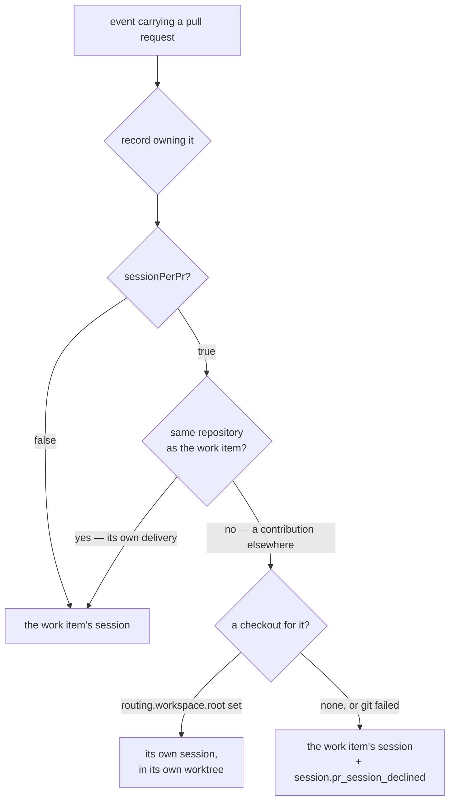

# Design: one owner per work item, one session per working tree

> Phase 2 of 3 (bugfix → design → tasks). Derives from `bugfix.md`. MUST be reviewed and
> approved before moving to tasks breakdown.

## Overview

Two changes at two seams, expressing one rule: **an endpoint gets a harness conversation
only when it has a working tree of its own, and a pull request in the work item's own
repository never does.**

| # | Seam | Change | Requirement |
|---|---|---|---|
| D1 | `Dispatcher._endpoint_for` | a pull request in the work item's **own repository** routes to the work item's session | R1 |
| D2 | `Dispatcher._spawn_endpoint` | an endpoint spawns in **its own checkout**, or does not spawn | R2 |

D1 is the ownership rule and fixes the reported defect. D2 makes the rule true rather than
assumed at the one seam that could still violate it, and — as a side effect — gives the
cross-repository inner loop the checkout it was always missing.

Nothing else moves. No configuration key is added, removed or reinterpreted; no schema
changes; no state migration; the registry's shape, the binding, the close rules and the
inner-loop graph state are untouched.

## Architecture



The decision stays where it already was — `_endpoint_for`, before the graph consult — so
`inner` is still computed once and the prompt still matches its destination. A collapsed
pull request renders as an ordinary work-item event (no `--pr <n>` claim command), because
it *is* one: the work item's own loop is the loop being walked.

## Components & interfaces

### D1 — the ownership rule (`_endpoint_for`)

```python
if not self.config.tmux.session_per_pr:
    return record
pr = pr_work_item(routed.event, routed.payload)
if pr is None or pr.ref == record.work_item.ref:
    return record
if _same_repository(pr, record.work_item):     # new
    return record
endpoint = record.endpoint_for(pr)
return endpoint if endpoint is not None and endpoint.is_live else record
```

`_same_repository` compares `(provider, path)` on two parsed `WorkItemRef`s. Provider **and**
path together, never path alone: `path` carries the host only when it is not the provider's
default, so two providers' identically-named repositories would otherwise compare equal.

The check sits **before** `record.endpoint_for(pr)` on purpose. An endpoint that already
carries a `tmuxTarget` — spawned by an older the-loop, or by hand — is a second owner that
already exists; testing the repository first is what stops routing feeding it (R1.2).
Nothing is torn down: `the-loop cleanup` already ends a work item's endpoints, and killing
a live conversation to enforce a routing rule would destroy in-flight work.

### D2 — a checkout, or no session (`_endpoint_cwd` → `_spawn_endpoint`)

`_spawn_endpoint` took its `cwd` from `record.cwd`. That value was never a checkout *for the
endpoint*: it was a second occupant of the work item's. It is replaced by
`_endpoint_cwd(record, endpoint, routed) -> Optional[str]`, where `None` is a refusal:

| Situation | Result | Event |
|---|---|---|
| a workspace is configured | `_prepare_workspace(endpoint.work_item, routed)` — a worktree keyed on the **pull request's** slug, seeded from its head branch, in a clone of the repository the event came from | `session.pr_spawned` |
| no `routing.workspace.root` | refuse; deliver into the work item's session | `session.pr_session_declined` (`no-separate-checkout`) |
| `WorkspaceError` | refuse; deliver into the work item's session | `session.pr_session_declined` (`workspace-failed`) |
| the prepared checkout **resolves to the record's own tree** | refuse; deliver into the work item's session | `session.pr_session_declined` (`shared-worktree`) |

The last row is the invariant **enforced** rather than inferred. `_prepare_workspace` has a
fallback — a payload naming no repository gets `spawnWorkdir` — that can land on the
record's tree, and "two sessions never share a tree" must not depend on the workspace's
layout happening to keep them apart. `_same_path` resolves both sides, so `.` and an
absolute path to the same directory are recognised as one occupant.

Both refusals land the event through the existing `_deliver_into(record, record, …)` path —
the same fallback an unavailable adapter and a failed spawn already use — so an event is
never lost to this decision. A `WorkspaceError` is caught rather than propagated for the
same reason: the spawn path lets it raise so redelivery can retry the *work item's* spawn,
but an endpoint refusal has somewhere better to go than a retry.

`endpoint.cwd` is then recorded as the checkout actually used, so resume and cleanup find
it. The inner loop's own state stays under the **work item's** spec directory, so
`graphlink.on_pr_spawn` keeps taking `record.cwd` — that argument is where the spec chain
lives, not where the session runs.

## Data models

None changed. `Session.cwd` on an endpoint now holds the endpoint's own checkout when it
has one; every record written before this change reads forward unmodified, and a record
whose endpoint still carries the work item's `cwd` is simply an endpoint routing no longer
sends events to.

## Error handling

| Failure | Behaviour | Why |
|---|---|---|
| workspace git failure preparing an endpoint checkout | warn, emit `session.pr_session_declined`, deliver into the work item's session | the event is already accepted; a lost instruction is worse than a missing session |
| adapter unavailable | unchanged — deliver into the work item's session | pre-existing path |
| tmux spawn fails | unchanged — `session.spawn_failed`, deliver into the work item's session | pre-existing path |

Every new branch fails **closed**: it delivers into the session that already exists, and no
branch spawns anything the old code would not have spawned.

## Security design

The trust boundaries in `bugfix.md` § Security considerations are unchanged, and the
enforcement points are all upstream of both seams:

| Boundary | Enforced at | Touched? |
|---|---|---|
| is this actor allowed to steer the-loop | `is_authorized`, before dispatch | no |
| may this work item run autonomously | control record + spawn policy | no |
| is this the-loop's own comment | self-authored marker, at ingress | no |
| may this path be derived from remote data | `Workspace._SAFE_COMPONENT_RE` | no — same guard, now also reached for an endpoint's checkout |

The repository identity the rule compares is remote-controlled, and is used only to choose
between two already-authorized destinations. A hostile or malformed payload can therefore
only push the decision toward the **stricter** outcome — delivery into the work item's own
session — never toward a spawn in a new place.

**Risk tier: 3.** No file matching `autonomy.sensitivePaths` is touched: no schema, no
workflow, no harness config. Routing behaviour changes, which is why the tier is not lower.

## Testing strategy

Four regression tests, each red before the fix and green after, plus two existing
integration scenarios rewritten to assert the new destination. See `testing-plan.md`.

## Alternatives considered

| Alternative | Why not |
|---|---|
| **Give every pull request its own worktree** (including same-repo ones) | Strictly more machinery, and it leaves a single-pull-request work item with two owners — the thing being complained about. A same-repo pull request is worked *on the work item's branch*; a second worktree on the same branch is a git error, not a design. |
| **A machine-wide lock: never two live sessions in one tree** | The default `spawnWorkdir: "."` puts *every* work item in one directory, so this would break the common deployment. Out of scope, stated in `bugfix.md`. |
| **Read the frozen `outer-loop-on-pull-request` surface in the dispatcher** | Reaches the same verdict as the repository rule for every observed case, while adding a graph read to the dispatch path and leaving the `work-item` surface still able to double up. |
| **A new config key to choose the behaviour** | Two owners in one tree has no correct configuration. A knob for it would be a documented way to reproduce this bug — and it would touch `cli-config.schema.json`, taking the change to risk tier 4 for the privilege. |
| **Set `sessionPerPr: false` in this repo's config and close the ticket** | Fixes one machine, leaves the default broken for everyone, and the toggle also disables the cross-repository case that genuinely works. |
