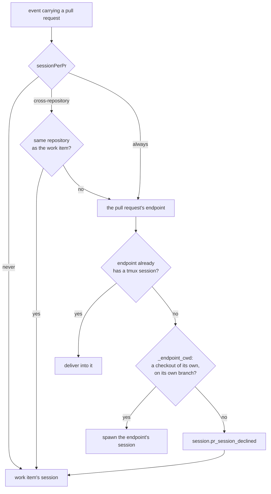

# Design: three named choices, and a tree the endpoint can actually work in

> Phase 2 of 3. Derived from the approved `requirements.md`. Reviewed together with
> `testing-plan.md` at one human gate.

## Overview

**One key grows a third value, and one seam learns to say no more often.**

The routing decision already has the shape this needs. `_endpoint_for` answers "which
conversation receives this event?" and `_endpoint_cwd` answers "is there a tree worth
spawning into?" — decision-088 put both in place. What issue-253 did was *hard-code* the
first one's answer for a same-repository pull request. This work item turns that hard-coded
answer into the third value of the existing key, and hardens the second seam so the new
value cannot land two agents on one branch.

Nothing else moves: no state migration, no new event name, no change to `pullRequests[]`, no
change to how an endpoint is closed or cleaned up.



## Architecture

Three call sites read the key today. Each gets the value it actually needs, and neither of
the two that are not about the same-repository rule changes behaviour:

| Call site | Question it asks | Reads |
|---|---|---|
| `Dispatcher._endpoint_for` | which conversation receives this event? | the full three-valued mode |
| `Dispatcher.delivery_status` | could a pull request's own endpoint hold this delivery id? | *does anything split at all* — `mode != never` |
| `SessionRegistry.session_for` | which live endpoint owns this ref? | its caller's boolean, unchanged |

`SessionRegistry` is deliberately left boolean. Its docstring already states the rule —
"policy is the caller's: the store is told which it wants and never reads configuration
itself" — and the registry has no repository comparison to make: it resolves a ref to the
endpoint that exists, and an endpoint only exists for a pull request the dispatcher decided
to split. Teaching the store a three-valued policy would put the same decision in two
places.

## Components & interfaces

### C1 — the three values (`TmuxConfig`)

`TmuxConfig.session_per_pr` becomes a `str` holding one of three constants, parsed from
either a string or the legacy boolean:

```python
SESSION_PER_PR_NEVER = "never"
SESSION_PER_PR_CROSS_REPOSITORY = "cross-repository"   # the default
SESSION_PER_PR_ALWAYS = "always"
```

Parsing is a small, total function — every input produces one of the three:

| Configured value | Resolves to | Why |
|---|---|---|
| absent | `cross-repository` | the shipped default is unchanged |
| `true` | `cross-repository` | R3.1 — what `true` has meant since issue-253 |
| `false` | `never` | R3.2 |
| `"never"` / `"cross-repository"` / `"always"` | itself | R1.1–R1.3 |
| anything else | `cross-repository`, with a warning | R1.5, and it fails toward the narrower split |

Two derived properties keep the call sites reading intent rather than string equality:

- `splits_pull_requests` — `mode is not never`. What `delivery_status` passes to the
  registry, and what any future "does this deployment use endpoints at all?" question asks.
- `splits_same_repository` — `mode is always`. The one new fact in the system.

This mirrors `routing.interaction.mode`, which is the precedent in this file for a named
mode that falls back to its default with a warning rather than raising.

### C2 — the routing rule (`Dispatcher._endpoint_for`)

One clause changes. Before:

```python
if not self.config.tmux.session_per_pr:
    return record
pr = pr_work_item(routed.event, routed.payload)
if pr is None or pr.ref == record.work_item.ref:
    return record
if _same_repository(pr, record.work_item):
    return record            # issue-253: unconditional
```

After, the same-repository test is the operator's:

```python
if not tmux.splits_pull_requests:
    return record
...
if _same_repository(pr, record.work_item) and not tmux.splits_same_repository:
    return record
```

Decision-088 D3 — the repository test runs **before** `record.endpoint_for(pr)` — is
preserved: under `cross-repository` an endpoint a previous configuration spawned stops being
fed rather than being torn down, which is what makes the setting safe to turn back off.

### C3 — a checkout on the pull request's own branch (`Workspace.prepare`)

This is the seam that makes `always` safe rather than merely available, and it is the one
place where the same-repository case is genuinely harder than the cross-repository case it
reuses.

`ensure_worktree` currently **swallows** a failed branch checkout and falls back to a
detached worktree at the default branch:

```python
except WorkspaceError as exc:
    logger.warning("worktree on branch %r failed (%s); using detached default branch", ...)
```

For a cross-repository pull request that fallback is a tolerable degradation: the tree is in
the right repository, and the head ref may genuinely not be on origin yet. For a
**same-repository** pull request under `always` it is a trap. The work item's own session
already has that branch checked out in a sibling worktree of the same clone, so `git
worktree add -B <branch>` fails *by construction* — and the fallback then hands the endpoint
a **distinct path** (so `_endpoint_cwd`'s existing `_same_path` guard passes) holding
**`main`**. The-loop would announce a session for pull request #N that is not on pull
request #N's code.

So `prepare` grows one keyword-only argument:

```python
def prepare(self, target, slug, *, branch=None, require_branch=False, timeout=None) -> Path
```

`require_branch=True` re-raises the `WorkspaceError` instead of degrading — in both
strategies, since `ensure_workitem_clone` swallows its checkout failure the same way. The
default is `False`, so every existing caller is byte-for-byte unchanged in behaviour.

`_endpoint_cwd` passes `require_branch=True` for a same-repository endpoint only, and the
existing `except WorkspaceError` arm turns the raise into the decline the requirements ask
for (R2.2 → R2.1). The asymmetry is deliberate and narrow: it is the case where the fallback
tree is knowably wrong, not merely imperfect.

### C4 — what `always` implies for the operator

Under `strategy: worktree`, a same-repository endpoint declines as soon as the work item's
session holds the branch — which is the normal case. `always` is therefore served by
`strategy: clone`, where the endpoint gets a full clone of its own keyed on the pull
request's slug and can hold the branch. This is a documentation obligation, not a code one:
it is recorded in the schema description, in `routing-options.md`, and on the capability
page, because an operator who sets `always` and sees one session must be able to find out
why in one hop.

## Data models

Unchanged. `Session`, `Session.pull_requests[]`, the registry's file-per-work-item layout
and the portable/local split are all untouched. A record written before this change is read
after it, and a record written after it is read by an older the-loop.

The only serialized surface that changes is the **config schema**, whose `sessionPerPr` leaf
goes from `{"type": "boolean"}` to a `type` union plus an `enum`:

```json
{ "type": ["string", "boolean"], "enum": ["never", "cross-repository", "always", true, false] }
```

Not `anyOf`, deliberately. `configschema.py` is a hand-written validator whose `SUPPORTED`
keyword set is asserted by a test, so `anyOf` would mean implementing a new combinator to
express something two existing keywords already say. Both keywords are enforced by the
hand-written validator *and* by the differential check against `jsonschema`, and the union
accepts every file that validated before.

## Error handling

| Condition | Behaviour | Surface |
|---|---|---|
| unrecognised `sessionPerPr` | resolve to `cross-repository` | `logger.warning`, naming the rejected value |
| no `routing.workspace.root` | decline the endpoint, deliver into the work item's session | `session.pr_session_declined`, `reason: no-separate-checkout` |
| checkout prepared but on the wrong branch (new) | decline | `session.pr_session_declined`, `reason: workspace-failed`, `error` naming the branch |
| checkout resolves onto the record's own tree | decline | `session.pr_session_declined`, `reason: shared-worktree` |
| harness unavailable | deliver into the work item's session | existing warning |

No new event name and no new `reason` value: the wrong-branch case *is* a workspace failure,
and it arrives with a `git` error message that names the branch and the worktree already
holding it. A fourth reason would have to be documented, tested and matched on, to say
something the `error` field says better.

## Security design

Every boundary from `requirements.md` § Security considerations, and what enforces it:

- **The payload's repository is routing, never authorization.** `_endpoint_for` runs after
  authorization (`authorizedUsers`, the arming label, the control keywords) and after the
  session lookup. A payload cannot invent an endpoint: `record.endpoint_for(pr)` only
  resolves a pull request already linked to *this* work item's record, and
  `link_pull_request` is written by the-loop's own routing, not by the payload.
- **A hostile head ref reaches `git` as an argument.** `Workspace._git` builds an argv list
  and runs it without a shell; `require_branch` changes only whether a failure raises. A
  crafted ref therefore fails the checkout, and the failure is now *louder* than before —
  it declines the session instead of silently spawning onto `main`.
- **Fail closed, twice.** An unparseable mode resolves to the shipped default rather than to
  the most permissive value; an unprovable checkout declines rather than shares. Both are
  asserted by tests, not left to reading.
- **No new attack surface, stated rather than implied.** This work item reads no new payload
  field, opens no port, adds no dependency, touches no credential, and writes no new file.
  The one widened capability — more concurrent harness sessions — is bounded by the existing
  `maxConcurrentDispatches` and reachable only by an operator editing their own config.

Risk tier **4** (`autonomy.sensitivePaths` matches `**/*schema*`): human approves the pull
request. Below `security.review.humanSignOffMinTier`'s threshold for a *named security*
sign-off? No — tier 4 meets it, so the security review is recorded in the evidence and the
pull request carries it for sign-off.

## Testing strategy

Unit tests own the mode table and the routing rule; an integration test owns the end-to-end
claim that `always` produces a second tmux session for a same-repository pull request while
`worktree` declines. The full matrix is `testing-plan.md`.

The red-first roots are two: a mode-parsing test that fails on the boolean-only config
object, and a routing test that fails because `_endpoint_for` collapses regardless.

## Trade-offs & decisions

Recorded in [decision-092](../../decisions/decision-092.md). In brief:

| Chosen | Rejected | Why |
|---|---|---|
| one three-valued key | a second boolean beside `sessionPerPr` | two booleans give four states, one of which (`sessionPerPr: false` + `sameRepo: true`) is meaningless and would have to be documented away |
| booleans keep working | a clean break to strings only | R3; a config that silently changes meaning on upgrade is the worst kind of release note |
| `require_branch` on the same-repository path only | require it everywhere | changes cross-repository behaviour that nobody reported and issue-183 deliberately made tolerant |
| decline to the single session | fail the dispatch | an event is never lost to a routing preference; decision-088 D5 |

## Open questions

None.

## Review comments

> Appended by the-loop's `record-feedback` hook when a human gate approves with comments.
