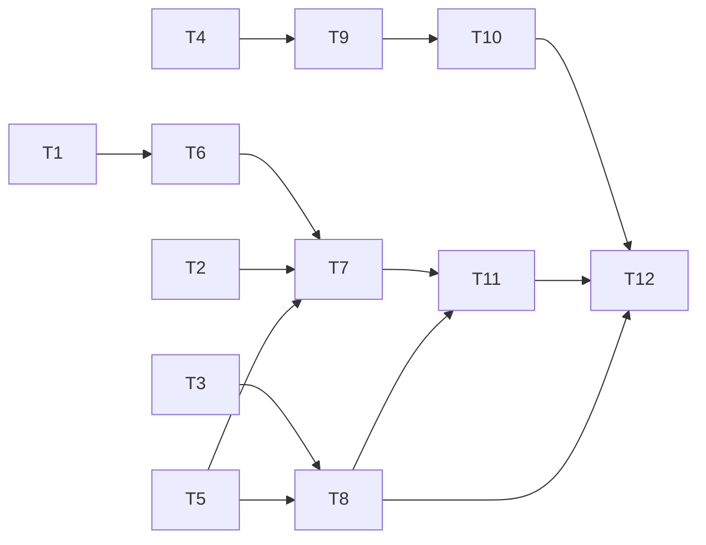

# Tasks: three named choices, and a tree the endpoint can actually work in

> Phase 3 of 3. A DAG of small, verifiable tasks. Each task references the requirements it
> serves and names the testing-plan row that proves it. `tdd.mode: standard` — the red tests
> come first and their failure is captured as evidence.

## Task list

- [x] **T1 — red: the mode table.** Assert every row of `design.md` §C1 against
  `TmuxConfig.from_mapping` — absent, `true`, `false`, the three names, and a value the
  system does not recognise. Fails today: the field is a `bool`.
  _Requirements: R1.1–R1.5, R3.1–R3.2_ · _Test: T1, T10_
- [x] **T2 — red: the routing rule.** Assert `_endpoint_for` under all three modes for both
  a same-repository and a cross-repository pull request. Fails today: `always` is not a
  value, and the same-repository collapse is unconditional.
  _Requirements: R1.1–R1.3_ · _Test: T1_
- [x] **T3 — red: `require_branch`.** Assert that `Workspace.prepare(require_branch=True)`
  raises `WorkspaceError` when the head branch cannot be checked out, and that the default
  still degrades to a detached default-branch worktree. Fails today: no such argument.
  _Requirements: R2.2_ · _Test: T1, T8_
- [x] **T4 — red: the schema.** Assert the schema accepts `true`, `false` and the three
  names and rejects `"sometimes"`. Fails today: `{"type": "boolean"}`.
  _Requirements: R3.3_ · _Test: T3_
- [x] **T5 — red: the integration scenarios.** Two Gherkin-documented scenarios through the
  receiver: `always` + a per-pull-request clone spawns a second tmux session for a
  same-repository pull request; `always` + `strategy: worktree` declines to one.
  _Requirements: R1.3, R2.1–R2.3_ · _Test: T2_
- [x] **T6 — green: the three values.** Add the mode constants and `_session_per_pr_mode`
  to `dispatcher.py`; make `TmuxConfig.session_per_pr` a `str` with
  `splits_pull_requests` / `splits_same_repository`. Turns T1 green.
  _Requirements: R1.1–R1.5, R3.1–R3.2_ · _Test: T1, T10_ · _Depends: T1_
- [x] **T7 — green: the routing rule.** `_endpoint_for` consults
  `splits_same_repository`; `delivery_status` passes `splits_pull_requests`. Turns T2 green.
  _Requirements: R1.1–R1.3_ · _Test: T1_ · _Depends: T2, T6_
- [x] **T8 — green: the branch requirement.** `Workspace.prepare` /`ensure_worktree` /
  `ensure_workitem_clone` take `require_branch`; `_endpoint_cwd` passes it for a
  same-repository endpoint and turns the raise into the existing decline. Turns T3 and the
  declining half of T5 green.
  _Requirements: R2.1–R2.3_ · _Test: T1, T2, T8_ · _Depends: T3_
- [x] **T9 — green: the schema.** a `type` union plus an `enum` in
  `.the-loop/cli-config.schema.json`, copied byte-for-byte to
  `cli/the_loop/schemas/`. Turns T4 green. _Requirements: R3.3_ · _Test: T3_ · _Depends: T4_
- [x] **T10 — docs: the configuration reference.** `docs/config/cli/routing-options.md`
  rewrites the `tmux.sessionPerPr` section for three values, states the
  `always` + `strategy: clone` obligation, and keeps the docs-parity gate green.
  _Requirements: R1, R2, R3_ · _Test: T12_ · _Depends: T9_
- [x] **T11 — docs: the capability page and the decision.** `docs/capabilities/webhook-triggers.md`
  (behaviour + a history row), `docs/cli/state.md`, `docs/capabilities/process-graph.md`,
  the `pdlc-pr-loop.yaml` header comment, `decision-092.md` + the decisions index, and this
  repository's own `.the-loop/cli-config.yaml` commentary.
  _Requirements: R1, R2_ · _Test: T12_ · _Depends: T7, T8_
- [x] **T12 — verification.** Run every activity in `testing-plan.md`, commit the evidence,
  fill Verification results. _Test: all_ · _Depends: T6–T11_

## Dependency graph (DAG)

Two independent red roots — the config/routing chain (T1, T2, T4) and the workspace chain
(T3) — so the branch requirement can be proved without the mode existing yet, and vice
versa.

## Checkpoints

- After T5: the full red run is captured to `evidence/red.md` and committed **before** any
  production line changes. That commit is the TDD record.
- After T9: `make test` is green and `make validate` accepts this repository's own config
  unchanged — proof that R3 holds before any documentation is written against the new value.
- After T12: the ready-to-ship gate — green checks, capability docs updated in this pull
  request, reviewer briefing posted.

## Review comments

> Appended by the-loop's `record-feedback` hook when a human gate approves with comments.
