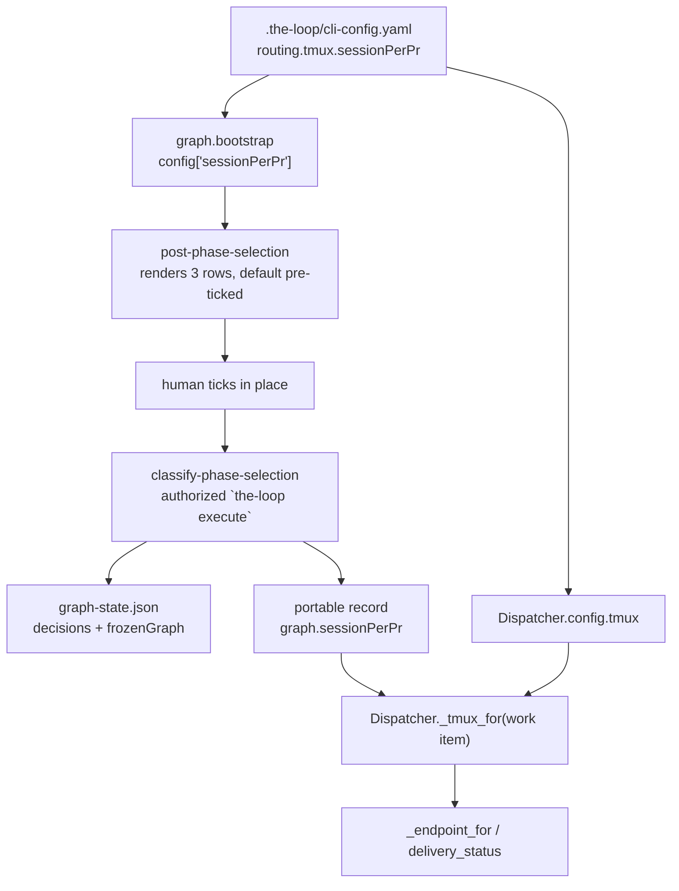

# Design: the checklist asks, the config answers when nobody did

> Phase 2 of 3. Derived from the approved `requirements.md`. Reviewed together with
> `testing-plan.md` at one human gate.

## Overview

The choice already has a home; it was put in the wrong one. `phase-selection` is where a work
item's process shape is decided, signed and frozen, and it already carries exactly this kind
of row — `outer-loop-on-pull-request`, a *non-phase* question the same reply answers
(issue-183). This work item adds a second such question and wires its frozen answer into the
one place routing asks it.

The whole change is a **default-and-override chain** with three links:

```
routing.tmux.sessionPerPr      the operator's default — unchanged, still parsed by
   │                           decision-092 D2/D3
   ▼
phase-selection checklist      the default is pre-ticked; an authorized `the-loop execute`
   │                           freezes whatever is ticked at that moment
   ▼
portable record `graph`        the frozen mode travels with the work item
   │
   ▼
Dispatcher._endpoint_for       reads the frozen mode; falls back to the operator's default
```

Two properties do the work, and neither is new:

- **The vocabulary is fixed and shared.** The same three names the config uses are the
  checklist's tokens, so the operator's value and the work item's answer are directly
  comparable. They move to a module both the daemon and the graph hooks can import.
- **Every unreadable path lands on the operator's default.** Absent row, no row ticked, two
  rows ticked, unreadable comment, hand-edited record — all resolve to
  `routing.tmux.sessionPerPr`. Fail closed means "the operator's stated value", not "the
  widest one".

## Architecture



The two arrows into `_tmux_for` are the whole feature: the portable record wins where it
carries a mode, the config answers where it does not.

## Components & interfaces

### C1 — the shared vocabulary (`the_loop/prsessions.py`, new)

`SESSION_PER_PR_NEVER | _CROSS_REPOSITORY | _ALWAYS`, the `SESSION_PER_PR_MODES` tuple, the
shipped default, and `session_per_pr_mode(value)` — the total resolver decision-092 D2/D3
specifies (booleans parse; anything else warns and lands on `cross-repository`).

This is a **move, not a rewrite**: the constants and the resolver are lifted verbatim out of
`webhook/dispatcher.py`, which now imports them. The reason for the move is that a second
importer exists — `graph/hooks/selection.py` — and it cannot import the dispatcher (the
dispatcher imports `graphlink`, which imports the graph package: a cycle). Two copies of a
three-name vocabulary is how the config file and the checklist come to disagree about what
`always` means.

### C2 — the operator's default reaches the gate (`graph/bootstrap.py`)

`build_runtime` already loads the CLI config to find `routing.control.keywords.execute` for
this same gate. One more read, resolved through C1, lands in the hook config as
`sessionPerPr`. A missing CLI config, an unreadable one, or an absent key all yield the
shipped default — the existing `try/except` around that load is unchanged.

### C3 — the rows (`graph/hooks/selection.py`)

**Tokens.** `pr-sessions-never`, `pr-sessions-cross-repository`, `pr-sessions-always` — one
per mode, derived from the mode names rather than spelled twice, and prefixed so a reader
unticking boxes can never mistake one for a phase.

**Rendering.** A section of its own, after the surface question, with the deployment's
default pre-ticked and named in prose. Three rows rather than one box because the question
has three answers; a boolean box cannot express `never`, `cross-repository` and `always`, and
collapsing two of them is what this ticket is about.

**Parsing.** `_parse_pr_sessions(body, default)` collects the ticked mode rows: exactly one
ticked is the answer, anything else (none, several) is the default. Ambiguity resolving to
the operator's stated value is the fail-closed direction — it is the value that was in force
before the reply.

**Not a phase.** `_parse_selection` skips these tokens exactly as it skips `SURFACE_TOKEN`,
via one `_NON_PHASE_TOKENS` set the two rules share, so an unticked mode row is neither a
declared skip nor a refusal.

**Freezing.** The resolved mode rides out on the hook result (`sessionPerPr`) and inside
`frozenGraph`, so it is frozen by the same signed reply, in the same record, as the phases
and the surface.

### C4 — recording (`graph/runtime.py`, `control.py`)

`_record_decisions` copies the mode into the `phase-selection` decision beside `surface` and
`graph`. No new `GraphState` field: unlike `surface`, no hook reads this value back — the
frozen graph is the record, and it is already published to the portable half through the
existing `frozenGraphSink`. `ControlStore` gains the reader that mirrors its existing
`record_frozen_graph` writer.

### C5 — routing (`webhook/dispatcher.py`)

```python
def _tmux_for(self, work_item) -> TmuxConfig:
    """The operator's tmux policy with THIS work item's frozen sessionPerPr applied."""
```

`dataclasses.replace` on the operator's `TmuxConfig`, with the frozen mode substituted when
the portable record carries a valid one. Everything downstream is unchanged: `_endpoint_for`
still asks `splits_pull_requests` / `splits_same_repository`, and `TmuxConfig.__post_init__`
re-validates the substituted value, so a hand-edited record cannot smuggle a fourth mode past
the properties.

Two call sites, and they are the two that ask the question today:

| Call site | Before | After |
|---|---|---|
| `_endpoint_for(record, routed)` | `self.config.tmux` | `self._tmux_for(record.work_item)` |
| `delivery_status(...)` | `self.config.tmux.splits_pull_requests` | the owning record's work item, same helper |

`delivery_status` is in the list because it must resolve a ref the way dispatch resolved it:
a linked-but-never-spawned endpoint is `active`, so asking with `session_per_pr=True` for a
work item that chose `never` would look past the session that actually recorded the delivery
and report a handled comment as `unhandled` — which the poller answers by re-forwarding it.

## Data models

The portable record's existing `graph` section gains one optional key:

```json
{
  "graph": {
    "loop": "pdlc-work-item-loop",
    "workItem": "…#260",
    "surface": "work-item",
    "sessionPerPr": "always",
    "nodes": [ … ]
  }
}
```

Absent means "never answered" — every record written before this change — and reads as the
operator's default. `graph-state.json` carries the same value twice, in
`decisions["phase-selection"]["sessionPerPr"]` and inside the frozen graph, exactly as
`surface` is carried today. No session-registry field changes; `pullRequests[]` is untouched.

## Error handling

| Condition | Behaviour | Signal |
|---|---|---|
| checklist comment unreadable at execute time | the reply's own text is parsed; no mode rows there either → default | existing warning from `_checklist_state` |
| no mode row ticked | operator's default | confirmation comment names the mode |
| two or more mode rows ticked | operator's default | confirmation comment names the mode |
| frozen value is not one of the three | operator's default | `TmuxConfig` never sees it (membership test first) |
| portable record unreadable | operator's default | `ControlStore` already degrades to "nothing recorded" |
| CLI config unreadable at gate time | shipped default (`cross-repository`) | existing `except` in `build_runtime` |

Nothing here raises, and nothing here can block the gate: a work item whose mode could not be
resolved runs on the operator's default, which is what it would have done before this change.

## Security design

- **Authorization is unchanged.** The rows are read from the same body, through the same
  `_authorized_comments` filter and the same execute keyword, as the phase rows. the-loop's
  own comments are dropped before authorization is considered, so the harness cannot answer
  its own gate — including this new part of it.
- **Fixed vocabulary.** Three literal tokens; anything else is ignored. No payload-derived
  string reaches a path, an argv, a prompt or a work-item ref, and the frozen value is
  re-validated on read.
- **No widening.** The mode decides *routing*, never *authorization*. `always` still spawns
  only what `_endpoint_cwd` will give a tree to (decision-092 D4), still under
  `maxConcurrentDispatches`, still only for an armed work item.
- **The blast radius is one work item.** The frozen mode is read per record, so a hostile or
  mistaken value in one work item's portable record cannot change how any other work item
  routes.

## Testing strategy

Unit tests at the two seams (`selection.py` rendering/parsing/freezing; `prsessions`
resolution) and dispatcher tests for the override, the fallback and the isolation between
work items — see `testing-plan.md` for the matrix and the requirement trace.

## Trade-offs & decisions

| Choice | Alternative | Why |
|---|---|---|
| three checkbox rows | one `pr-sessions-always` box | a box has two states and the question has three; the two collapsed rows are precisely what #260 objects to |
| the frozen value wins over a later config change | re-read the config on every event | a frozen selection is a recorded agreement (issue-177); a work item whose routing silently changed under it would be the same complaint one level down |
| `dataclasses.replace` on `TmuxConfig` | thread a mode string through `_endpoint_for` | keeps `splits_pull_requests` / `splits_same_repository` the single expression of the rule, and re-validates through `__post_init__` |
| a new `prsessions` module | import the dispatcher from the hook | `dispatcher → graphlink → graph` makes that a cycle; a function-level import to dodge it hides a dependency the reader should see |
| no new `GraphState` field | mirror `surface` | nothing reads it back through `HookContext`; the frozen graph is already the durable, published record |
| ask on every loop that reaches the gate | ask only on the work-item loop | a contribution's pull request is usually in *another* repository, which is the case the modes differ most about |

## Open questions

None.

## Review comments

> Appended by the-loop's `record-feedback` hook when a human gate approves with comments.
