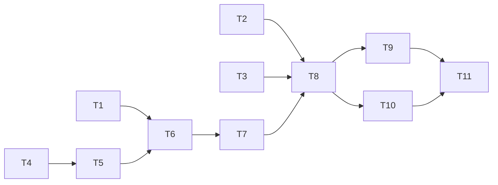

# Tasks: the checklist asks, the config answers when nobody did

> Phase 3 of 3. A DAG of small, verifiable tasks. Each task references the requirements it
> serves and names the testing-plan row that proves it. `tdd.mode: standard` — the red tests
> come first and their failure is captured as evidence.

## Task list

- [x] **T1 — red: the gate renders and freezes a mode.** Assert the posted checklist carries
  the three `pr-sessions-*` rows with the configured default pre-ticked; that ticking one
  freezes it into the decision, the frozen graph and the published record and names it in the
  confirmation; that none/several fall back to the default; and that a mode row is never read
  as a phase. Fails today: no such rows.
  _Requirements: R1.1–R1.5, R3.1, R3.3_ · _Test: T1, T10_
- [x] **T2 — red: routing honours the frozen mode.** Assert `_endpoint_for` under a frozen
  `always` / `never` / absent / invalid mode on a daemon configured `cross-repository`, that
  two work items resolve independently, and that `delivery_status` resolves through the same
  mode. Fails today: only `self.config.tmux` is consulted.
  _Requirements: R2.1–R2.5, R3.4_ · _Test: T3, T10, T12_
- [x] **T3 — red: the integration scenario.** One Gherkin-documented scenario through the
  receiver: a work item frozen to `never` on a daemon configured `cross-repository` keeps a
  cross-repository pull request's events in the work item's session.
  _Requirements: R1.2, R2.1_ · _Test: T4_
- [x] **T4 — green: the shared vocabulary.** Move the mode constants and the resolver out of
  `webhook/dispatcher.py` into `the_loop/prsessions.py`; the dispatcher imports them. No
  behaviour change — T2 of the testing plan proves the resolver from its new home.
  _Requirements: R3.2_ · _Test: T2_
- [x] **T5 — green: the operator's default reaches the gate.** `graph/bootstrap.py` reads
  `routing.tmux.sessionPerPr` from the CLI config it already loads and puts the resolved mode
  in the hook config. _Requirements: R1.1, R3.2_ · _Test: T1_ · _Depends: T4_
- [x] **T6 — green: the rows.** `graph/hooks/selection.py` renders the three rows, parses
  them into a mode, keeps them out of the phase vocabulary, states the result in the
  confirmation, and carries it on the hook result and inside `frozenGraph`. Turns T1 green.
  _Requirements: R1.1–R1.4, R3.1, R3.3_ · _Test: T1, T10_ · _Depends: T5_
- [x] **T7 — green: recording.** `graph/runtime.py` copies the mode into the
  `phase-selection` decision beside `surface`; `ControlStore` gains the reader that mirrors
  `record_frozen_graph`. _Requirements: R1.3_ · _Test: T1, T3_ · _Depends: T6_
- [x] **T8 — green: routing.** `Dispatcher._tmux_for(work_item)` substitutes the frozen mode
  into the operator's `TmuxConfig`; `_endpoint_for` and `delivery_status` use it. Turns T2
  and T3 green. _Requirements: R2.1–R2.5, R4.1–R4.3_ · _Test: T3, T4_ · _Depends: T7_
- [x] **T9 — docs: the configuration reference.** `docs/config/cli/routing-options.md` states
  that `tmux.sessionPerPr` is the **default** and that `phase-selection` overrides it, with
  the token names. Keeps the docs-parity gate green.
  _Requirements: R1, R2, R3_ · _Test: T14_ · _Depends: T8_
- [x] **T10 — docs: capabilities, skill and decision.**
  `docs/capabilities/process-graph.md` (the gate's second and third questions),
  `docs/capabilities/webhook-triggers.md` (routing reads the frozen mode first),
  `docs/cli/state.md` (the portable record's new key), the two `cli-config.yaml` commentaries
  and both schema descriptions, `skills/the-loop/reference/workflow.md` +
  `skills/the-loop/SKILL.md` (the checklist's other box), and `decision-093.md` + the
  decisions index. _Requirements: R1, R2_ · _Test: T14_ · _Depends: T8_
- [x] **T11 — verification.** Run every activity in `testing-plan.md`, commit the evidence,
  fill Verification results. _Test: all_ · _Depends: T9, T10_

## Dependency graph (DAG)

The three red roots are independent: the gate (T1), routing (T2) and the end-to-end
scenario (T3) each fail for their own reason before any production line moves.

## Checkpoints

- After T3: the full red run is captured to `evidence/red.md` and committed **before** any
  production line changes. That commit is the TDD record.
- After T8: `make test` is green — proof that R3 holds (the default path is untouched)
  before any documentation is written against the new behaviour.
- After T11: the ready-to-ship gate — green checks, capability docs updated in this pull
  request, reviewer briefing posted.

## Review comments

> Appended by the-loop's `record-feedback` hook when a human gate approves with comments.
