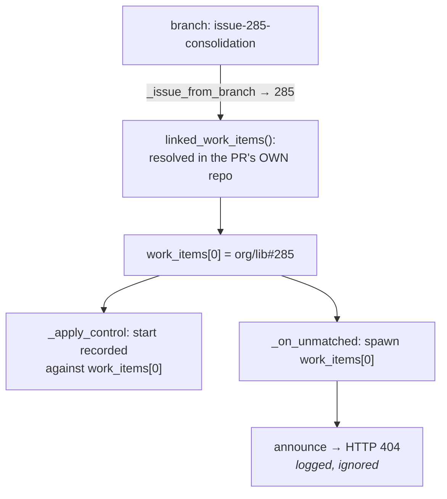

# Bugfix spec: a branch name invented a work item, and the daemon obeyed it

> Phase 1 of 3 for a bug (bugfix → design → tasks). This phase MUST be reviewed and
> approved before the design is derived from it.

## Summary

`issue-285` in a branch name became `org/lib#285` — **a work item that does not exist** —
and nothing between the regex and the tmux session asked whether it did. The ghost then
took the two decisions that matter most: it became `work_items[0]`, so it absorbed the
operator's `the-loop start`, and it was the ref a full session spawned against — clone,
registry entry, tmux session — while the real work item, with the whole spec chain, sat in
another repository being ignored.

The daemon was told. `session.announce_failed` carried `gh: Not Found (HTTP 404)` on the
work item's own ref, seconds after spawning for it, and the spawn carried on. Ticket:
[#269](https://github.com/MadaraUchiha-314/the-loop/issues/269).

## Steps to reproduce

Two repositories under one org: `org/planning` holds tickets and specs, `org/lib` delivers
code. One poller watches both, `spawnOnUnmatched: labeled`, `requireStartCommand: true`.

1. The work item is `org/planning#285`, with its spec chain. `org/lib` has no issue #285.
2. A pull request `org/lib#48` is opened from branch `issue-285-consolidation` — the-loop's
   own branch convention, pointing at the *planning* repository's issue. Its body links the
   ticket as a plain URL (no closing keyword), so `closingIssuesReferences` is empty.
3. `org/lib#48` carries `the-loop: auto-execute`.
4. An authorized user comments `the-loop start` on the pull request.

## Expected vs actual

- **Expected:** the start binds to something that exists — the pull request itself, or a
  linked work item that was verified — and the session that spawns has a real ticket
  underneath it.
- **Actual:** the router emits `[org/lib#285, org/lib#48]`; the start is recorded against
  `org/lib#285`; a session spawns for `org/lib#285` (`workspace.prepared`,
  `session.registered`, `session.spawned`), then `session.announce_failed` reports
  `gh: Not Found (HTTP 404)` and nothing acts on it; the session runs without a spec chain
  (`graph.skipped` / `no-spec-dir`) because the real one is in `org/planning`.

## Root cause (confirmed)

Three independent layers each fail open, and the ghost walks through all three.

1. **The weakest source is treated as the strongest.** `linked_work_items`
   (`cli/the_loop/webhook/router.py`) reads three linkage sources. Two of them *state* a
   repository — `closingIssuesReferences` carries one, a qualified closing keyword names one
   — and the third, the branch convention, does not. issue-183 settled that correctly ("the
   branch convention stays local: `issue-12` on a branch says nothing about a repository"),
   but *local* is a guess, and a guess with no existence check is a fabrication. Ordering
   then promotes it: the loop emits linked items before the entity's own number, so the
   fabricated ref is `work_items[0]`.
2. **`work_items[0]` is the target for decisions that had a better answer available.**
   `_spawn_refusal`, `_apply_control`, `_on_unmatched` and `_record_graph_command`
   (`cli/the_loop/webhook/dispatcher.py`) all bind to `routed.work_items[0]`. For an event
   carrying a pull request, two better answers already exist in the process: the durable
   PR → work-item binding the registry records (issue-172), and `pr_work_item()`, which
   names the pull request itself. Neither is consulted before the list's head.
3. **The 404 is evidence, and it was filed as decoration.** `SessionAnnouncer` is
   best-effort by design (an announcement must never fail a dispatch), so it degrades every
   failure identically — a missing `gh`, a rate limit, and *this work item does not exist*
   all become one warning-level `session.announce_failed`.

## Requirements

### Requirement 1 — a work item invented from a branch name is verified before it is used

The branch convention is the only linkage source that supplies a repository the pull request
never stated. It is therefore the only one that can name a work item nobody created, and it
must earn its place in `work_items` before anything acts on it.

#### Acceptance criteria (EARS)

1. WHEN a routed event yields a work-item ref derived **only** from the `issue-<n>` branch
   convention AND that ref has no session record on this machine THEN the system SHALL ask
   the ticketing provider whether the ref exists before that ref is used as a spawn target
   or a control-command target.
2. WHEN that check answers **definitively that the ref does not exist** (HTTP 404) THEN the
   system SHALL remove the ref from the event's work items, SHALL record the removal
   (`routing.linkage_dropped`, with the ref, the source and the reason), and SHALL continue
   routing the event on the refs that remain.
3. WHEN the check cannot be made — no `gh` on PATH, a timeout, a transport error, any
   non-404 failure — THEN the system SHALL keep the ref and SHALL NOT drop the event: an
   unavailable check is not evidence of absence, and a daemon that stops routing when
   GitHub is unreachable is a worse failure than the one this fixes.
4. WHEN a ref is corroborated by `closingIssuesReferences` or by a closing keyword in the
   pull request body THEN the system SHALL NOT subject it to the check: those sources state
   their repository, and issue-183's cross-repository routing must not acquire a network
   dependency.
5. WHEN **any** of the event's refs is owned by a live session record on this machine THEN
   the system SHALL NOT consult the check at all: internal tracking has already answered
   which work item this event belongs to, no external answer may drop a live session's ref,
   and a ghost sitting beside a matched record is inert anyway (nothing spawns while an
   event matches, and R2.1 binds the command to the record).
6. WHEN the same ref is checked again THEN the system SHALL answer from a bounded in-process
   cache rather than asking again, so a repeatedly-commented pull request costs one call.
7. WHEN every one of an event's work items is dropped by this rule THEN the system SHALL
   drop the event with reason `work-item-not-found` and SHALL NOT release its delivery id:
   a nonexistent work item is a permanent condition, and releasing the id would have GitHub
   redeliver — and the poller re-forward — the same event every cycle.

### Requirement 2 — what a pull request delivers is read from the-loop's own record first

*(the owner's direction on the ticket: "whenever user responds to a PR, the-loop should
check what work item that PR is linked to — not through GitHub, but through internal
tracking mechanisms")*

#### Acceptance criteria (EARS)

1. WHEN a control command arrives on an event whose refs include one this machine holds a
   live session record for THEN the command SHALL act on **that record's work item**,
   whatever order the router emitted the refs in.
2. WHEN no live record owns any of the event's refs THEN the command SHALL act on the first
   ref that survived Requirement 1 — which, for a pull request whose only other linkage was
   a branch-derived ghost, is the pull request itself.
3. WHEN an unmatched event spawns a session THEN it SHALL spawn against the same ref the
   control path would have acted on, so "what was started" and "what is running" cannot
   name different work items.
4. The `start`-was-requested test (`requireStartCommand`) SHALL be asked about that same
   ref, so a start recorded on one ref is never read back from another.
5. Which tmux session an event is then delivered into SHALL remain the existing decision —
   the operator's `routing.tmux.sessionPerPr` as overridden by the work item's frozen
   `phase-selection` answer (issue-260) — unchanged by this work item.
6. WHEN a comment on a pull request arrives through the **poll** ingress THEN the system
   SHALL resolve that pull request the way a webhook comment does, so the binding is
   recorded and the R2.5 decision is actually taken. The poller reuses the pull request's
   own payload (key `pull_request`) and renames the event to `issue_comment`;
   `pr_work_item` reads only `payload["issue"]` for that event name, so on the ingress the
   ticket was reported from, **every** pull-request comment answered "this event carries no
   pull request" — no binding written, no endpoint chosen.

### Requirement 3 — a 404 on the work item is reported as what it is

#### Acceptance criteria (EARS)

1. WHEN the session announcement fails because the work item itself is **not found** THEN
   the system SHALL record `session.work_item_missing` at error level, naming the ref and
   the remedy, rather than only the generic best-effort `session.announce_failed`.
2. WHEN that happens THEN the ref SHALL be recorded as missing in the same cache
   Requirement 1 consults, so the next event carrying it as a branch-derived ref is dropped
   without a second call.
3. The announcement SHALL remain best-effort: a 404 SHALL NOT fail the dispatch, and SHALL
   NOT kill the session that was just spawned (see `design.md` §Alternatives — a private or
   permission-scoped repository answers 404 for items that do exist, and killing a live
   agent on that evidence destroys work).

### Requirement 4 — a regression test per layer

1. The fix SHALL include tests that fail before it and pass after it, covering: the ghost
   ref being dropped, the control command binding to the surviving ref, the spawn target,
   the unknown-answer fail-open path, the corroborated-ref exemption, the live-record
   exemption, and the announce-404 record.
2. The reproduction in this document SHALL be covered end-to-end by an integration test
   carrying a Gherkin docstring (`testing.gherkinDocstrings: required`).

## Security considerations

**The bug itself is not exploitable, and the fix opens one new surface: payload-derived
coordinates reaching a `gh` argv.**

| Boundary | Where | How it fails closed |
|---|---|---|
| Payload → command line | the new existence check builds `gh api repos/<owner>/<repo>/issues/<n>` from a `WorkItemRef` whose owner/repo/number came from a webhook payload | the same validation `the_loop.comments` already applies at this seam: owner and repo matched against `^[A-Za-z0-9._-]+$`, the number is an `int` by construction, the process is spawned from an argv **list** with no shell, and a ref failing validation is answered "unknown" (kept, not dropped) |
| Non-GitHub / GitHub Enterprise refs | a ref on a non-default host | the check passes `--hostname` for a non-default host and answers "unknown" for a non-GitHub provider — never a 404 from the wrong GitHub, which would drop a real work item |
| Availability | one network call on the ingress thread | bounded timeout, bounded LRU cache, asked only for a branch-only ref with no local record; every failure mode answers "unknown" in bounded time |
| Authorization | unchanged | the check runs **after** the router's self-marker and `authorizedUsers` guards and touches neither; it can only ever *remove* a ref from an event, never add one, never widen which events arrive, and never arm a work item |

An attacker who can open a pull request in a watched repository could already name any
branch they liked; today that fabricates a work item and spawns a session for it. After this
change the fabrication is dropped, so the change **narrows** the reachable surface. The
reverse abuse — forcing the check to fail so a ghost survives — buys exactly today's
behaviour and nothing more.

## Out of scope

- **Pre-start comments are never replayed** (the ticket's "related casualty"). A comment
  dropped with `dispatch.dropped reason: awaiting-start` keeps its delivery id in the dedup
  cache forever, so it is not delivered even after the work item is started. That is a
  deliberate, documented refusal in the current code with its own trade-off (releasing the
  id would have every unstarted labelled item re-forwarded every cycle), and changing it is
  a product decision about replay semantics, not part of restoring linkage correctness. The
  reporter flagged it as "possibly its own issue"; it is filed as one and linked from the
  execution log.
- **Verifying the other two linkage sources.** A closing keyword naming a nonexistent issue
  (`Closes org/typo#9`) is a human typo in a source that *states* its repository; it is
  caught by Requirement 3's report rather than by a pre-emptive call on every event.
- **A configuration key for the check.** It is a correctness fix, not a preference: it costs
  one cached call for the one ref shape that can be fabricated, and it degrades to a no-op
  where `gh` is unavailable.

## Open questions

None. The ticket states the expected behaviour as three alternatives ("some combination
of"); this spec adopts the first two as the fix and the third as a report, with the reason
in `design.md` §Alternatives considered.
