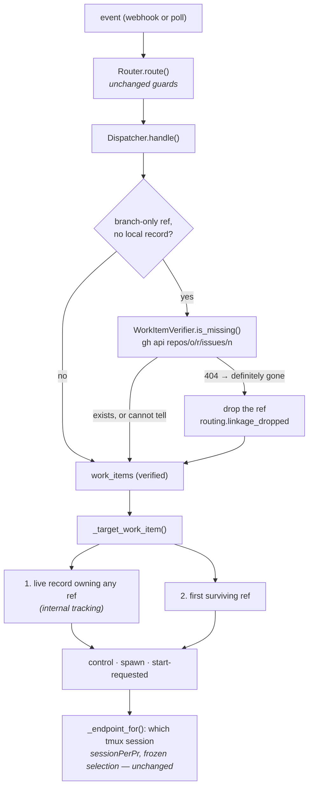

# Design: a branch-derived work item must exist, and the record decides who owns the event

> Phase 2 of 3 (bugfix → design → tasks). Derives from the approved `bugfix.md`. MUST be
> reviewed and approved before the tasks breakdown.

## Overview

**Provenance, then one check, then one target.** The router already knows *how* it learned
about each ref; it just never said so. Once it does, the dispatcher can hold the one source
that invents a repository — the branch convention — to the one test that can falsify it, and
then take every "which work item is this about?" decision from a single seam that asks the
local record before it asks a list index.

Three changes, in the order the bug happens:

| # | Where | What changes |
|---|---|---|
| A | `webhook/router.py` | one traversal now records each ref's **sources**; `branch_derived_refs()` names the refs that rest on the branch convention *alone* |
| B | `the_loop/linkage.py` (new) + `webhook/dispatcher.py` | those refs are checked for existence at intake; a definitive 404 drops the ref, everything else keeps it |
| C | `webhook/dispatcher.py`, `the_loop/announce.py` | one `_target_work_item()` seam — the live record first, the surviving refs second — and the announcement's 404 becomes evidence instead of decoration |

Nothing widens. The check can only remove a ref; the target seam can only choose among refs
the router already emitted; neither touches ingress, arming or authorization.

## Architecture



The seam order is the design: **the record answers before GitHub is asked, and GitHub is
asked before a list index is trusted.**

## Components & interfaces

### C0 — a polled pull-request comment is a pull-request event (`webhook/router.py`)

One line, and it is the reason the rest of this design is reachable from the ingress the
ticket was reported on. `_pr_entity` answers "which pull-request-shaped entity is this event
about?" by reading `payload["issue"]` for an `issue_comment` — GitHub's own shape. The poll
path synthesises that event over the **pull request's** payload (key `pull_request`, carrying
the head branch) and renames it, so `_pr_entity` found nothing and `pr_work_item` answered
`None`: no `session.pr_linked` binding was ever written from a polled comment, and
`_endpoint_for` never chose a pull request's endpoint for one. `_pr_entity` now falls back to
`payload["pull_request"]` for the comment event names, which no real webhook carries, so the
webhook path is bit-for-bit unchanged (R2.6).

### C1 — ref provenance (`webhook/router.py`)

`extract_work_items` and `linked_work_items` keep their signatures and their results. Both
become thin views over one traversal that also records where each ref came from:

```python
SOURCE_REFERENCE = "closing-reference"   # GitHub's own closingIssuesReferences
SOURCE_BRANCH    = "branch"              # the issue-<n> head-branch / CI branch convention
SOURCE_KEYWORD   = "keyword"             # a closing keyword in the PR body
SOURCE_ENTITY    = "entity"              # the issue/PR the event is about, or a CI run's PRs

def work_item_sources(event: str, payload: dict) -> "OrderedDict[str, Tuple[WorkItemRef, FrozenSet[str]]]"
def extract_work_items(event: str, payload: dict) -> List[WorkItemRef]        # unchanged contract
def branch_derived_refs(event: str, payload: dict) -> List[str]               # sources == {"branch"}
```

`branch_derived_refs` is **pure and payload-only**, so both ingresses get the same answer
from the same function and nothing new has to be plumbed onto `RoutedEvent` (the poller
builds its own `RoutedEvent`s; a new field would have had to be populated in two places and
would have been wrong in the third — a hand-built one in a test or an SDK embedding).

A ref is weak only when the branch is its **whole** justification. `closingIssuesReferences`
listing `#285` and the branch saying `issue-285` yields `{closing-reference, branch}` — not
weak, not checked.

The CI branch sources (`workflow_run` / `check_run` / `check_suite` / `status`, which read
`head_branch` and `branches[].name`) carry the same fabrication risk and are marked the same
way. A CI event's `pull_requests[]` numbers are `entity`-sourced: GitHub stated them.

### C2 — the existence check (`the_loop/linkage.py`, new)

```python
class WorkItemVerifier:
    def __init__(self, gh_binary="gh", runner=subprocess.run, timeout=10.0, cache_size=256)
    def is_missing(self, item: WorkItemRef) -> bool   # True ONLY on a definitive 404
    def record_missing(self, item: WorkItemRef) -> None
```

Built in the mould of `the_loop.comments` — the operator's own `gh`, an injectable runner,
never raises — with one deliberate difference: it answers a **question** rather than
performing an action, so its failure mode is "unknown", not "failed".

- `gh api repos/<owner>/<repo>/issues/<n>` — the endpoint that answers for issues *and*
  pull requests, the same one `GhClient.fetch_item_state` uses for the closure question. It
  is not reused directly: `poller.github` imports `webhook.router`, so importing it from the
  dispatcher would close an import cycle. A ~90-line module both sides can import is the
  smaller answer of the two.
- `--hostname <host>` for a ref whose host is not `github.com`, so a GitHub Enterprise ref is
  never declared missing on the strength of a 404 from the public GitHub.
- **Definitive means definitive.** `is_missing` returns `True` only when `gh` exits non-zero
  *and* its output names an HTTP 404. Missing binary, timeout, `OSError`, 401/403/5xx, a
  non-GitHub provider, coordinates failing `^[A-Za-z0-9._-]+$` — all `False`, all logged,
  and the missing-`gh` case warns exactly once per process (the `SessionAnnouncer` pattern).
- **Bounded LRU cache, positive and negative**, keyed on `ref` (host-qualified). A pull
  request commented on ten times costs one call; a ghost is answered from the cache on every
  later event.
- `record_missing` is how C4's 404 evidence enters the same cache.

### C3 — intake filtering (`webhook/dispatcher.py`)

`Dispatcher.handle` gains one step, immediately after the duplicate-delivery check and
**before** control parsing (a control command must be targeted at a verified list):

```python
routed = self._verify_linkage(routed)
if not routed.work_items:
    # every ref was a branch-derived ghost
    eventlog.emit("dispatch.dropped", reason="work-item-not-found", ...)
    return                       # delivery id deliberately NOT released
```

`_verify_linkage` returns the same `RoutedEvent` object when nothing was dropped (the common
path allocates nothing), and a `replace()`d copy when something was. Two conditions gate the
call, in this order:

1. **The ref is branch-only.** `branch_derived_refs(...)` names the candidates; every other
   ref is left alone.
2. **Nothing local can answer.** When any of the event's refs is owned by a live record
   (`_live_session_for`), the filter returns immediately — no call, for any ref. The routing
   decision is already made by the-loop's own record, a ghost beside a matched record is
   inert (nothing spawns while an event matches, and C4 binds the command to the record),
   and an established work item's every comment would otherwise pay for a network question
   whose answer changes nothing.

Both must hold; they are evaluated in that order because the first is a pure computation and
the second reads the registry, so the common event — an issue comment, a pull request with a
stated link — pays no I/O at all.

Dropping the last surviving ref is R1.7's event-level drop, decided by `handle`, not
silently inside the filter.

### C4 — one target seam (`webhook/dispatcher.py`)

```python
def _target_work_item(self, routed: RoutedEvent) -> Optional[WorkItemRef]:
    session = self._live_session_for(routed)          # the record: bindings included
    if session is not None:
        return session.work_item
    return routed.work_items[0] if routed.work_items else None
```

Four call sites stop reading `routed.work_items[0]` directly: `_spawn_refusal` (the
`start_requested` test), `_apply_control`, `_on_unmatched` (the spawn target) and
`_record_graph_command`. `_apply_control` already did the record-first lookup for its own
target; the seam makes the other three agree with it, which is the property R2.3/R2.4 ask
for — *"what was started" and "what is running" cannot name different work items*.

`_live_session_for` already resolves through the durable PR → work-item bindings
(`record_owning`, issue-172), so this is the owner's "internal tracking mechanisms" with no
new store: the record the-loop wrote when it first routed this pull request is what answers.

### C5 — the announcement's 404 (`the_loop/announce.py`)

`SessionAnnouncer` gains one optional sink, in the shape `GraphLink` already uses:

```python
SessionAnnouncer(config, on_work_item_missing: Optional[Callable[[WorkItemRef], None]] = None)
```

When `post_issue_comment` fails with an error naming HTTP 404, the announcer emits
`session.work_item_missing` at **error** level (ref, tmux target, the remedy) *in addition
to* the existing `session.announce_failed`, and calls the sink. The dispatcher wires the sink
to `verifier.record_missing`, so the daemon's own direct evidence updates the cache that
would have prevented the spawn.

The announcement stays best-effort and the session stays alive — see §Trade-offs.

## Data models

No persisted state changes. The session record, the portable record, `graph-state.json` and
every config schema are untouched; the only new state is a process-local LRU that dies with
the daemon.

Two new event types (`eventlog.EVENT_TYPES`, which the parity test gates):

| Event | Level | Fields |
|---|---|---|
| `routing.linkage_dropped` | warning | `work_item`, `source` (`branch`), `reason` (`not-found`), `gh_event`, `delivery_id` |
| `session.work_item_missing` | error | `work_item`, `tmux_target`, `error` |

`dispatch.dropped` gains one documented `reason` value, `work-item-not-found`.

## Error handling

| Failure | Behaviour |
|---|---|
| `gh` not on PATH | one process-lifetime warning, every ref answered "unknown" (kept) |
| `gh` times out / `OSError` | logged at debug, answered "unknown" (kept); the timeout bounds the ingress thread |
| 401 / 403 / 5xx | answered "unknown" (kept) — an authorization failure is not an absence |
| 404 | the ref is dropped, `routing.linkage_dropped` recorded |
| every ref dropped | the event is dropped (`work-item-not-found`); the delivery id is **kept** marked, as `awaiting-start` does, because the condition is permanent |
| a live record owns the ref | never checked, never dropped |
| non-GitHub provider / bad coordinates | answered "unknown" (kept) |

## Security design

Each boundary from `bugfix.md` §Security considerations, and how it is enforced:

- **Payload → command line.** `WorkItemVerifier` validates `owner`/`repo` against
  `^[A-Za-z0-9._-]+$` and refuses anything else *before* building an argv; the number is an
  `int` on `WorkItemRef` by construction; the process is spawned from a list, never a shell;
  a refused ref answers "unknown", so a validation failure can never *drop* a work item.
  Abuse case (tested): a payload whose repository is `evil;rm -rf /` yields no `gh` call and
  no dropped ref.
- **Wrong-GitHub 404.** A non-default host is passed with `--hostname`; a non-`github`
  provider is answered "unknown" without a call.
- **Authorization.** The check runs after the router's self-marker and `authorizedUsers`
  guards, reads no comment text, and cannot add a ref, arm a work item, or change which
  events reach the daemon. It is strictly subtractive.
- **Injection into the prompt.** Nothing this component produces reaches a prompt: it only
  removes refs and emits events built from already-parsed `WorkItemRef` fields.
- **Fail-open, deliberately.** The one direction this guard fails open in (unknown ⇒ keep)
  restores exactly today's behaviour rather than opening anything new, and is what stops a
  GitHub outage from silently muting the daemon. The fail-*closed* direction is the one that
  matters for the bug: a ref that GitHub says does not exist never becomes a spawn target.

## Testing strategy

Unit tests per component (provenance, the verifier's five answer classes, the filter, the
target seam, the announcer's 404 path), plus a Gherkin-documented integration test that
replays the ticket's exact reproduction against a fake `gh` and asserts the two facts that
were wrong: the start is recorded against the pull request, and the session spawns for it.
Full matrix in `testing-plan.md`.

## Trade-offs & decisions

Recorded as [decision-095](../../decisions/decision-095.md).

| Decision | Chosen | Why not the alternative |
|---|---|---|
| Verify **only** branch-derived refs | yes | Checking every ref would put a network call on the routing path for links GitHub itself stated, and would make issue-183's cross-repository routing depend on an API that can be down. |
| Unknown ⇒ keep the ref | yes | Fail-closed here means "route nothing when GitHub is unreachable". The guard exists to delete a fabrication, not to gate real work. |
| Flag the announce 404; do **not** kill the session | yes | GitHub answers **404 for items that exist** when the credential cannot see the repository. Killing a live agent — with its checkout and uncommitted work — on an ambiguous signal is a worse bug than the one being fixed. The pre-spawn check is where a ghost is stopped; the 404 is the belt-and-braces record, and it feeds the cache so the *next* event acts on it. |
| Bind a PR's control command via the **record**, not `pr_work_item()` | yes | The ticket's second bullet ("bind to the PR's own ref") would regress issue-93: a `the-loop start` on a PR that legitimately delivers issue #100 must still start #100. With the ghost dropped, `work_items[0]` *is* the pull request in the ticket's scenario — the outcome asked for, without the regression. |
| A `routing.*` config key for the check | no | Correctness, not preference; it is one cached call for the one ref shape that can be fabricated, and it no-ops where `gh` is absent. Adding a key would also touch `cli-config.schema.json`, a declared sensitive path. |
| Reuse `poller.github.GhClient` | no | `poller.github` imports `webhook.router`; importing it from the dispatcher closes an import cycle. A small shared module is the smaller change (the same reasoning that moved the `sessionPerPr` vocabulary to `prsessions.py` in issue-260). |

## Open questions

None.

## Review comments

*(Populated during review; findings recorded per `reference/reviewing.md`.)*
