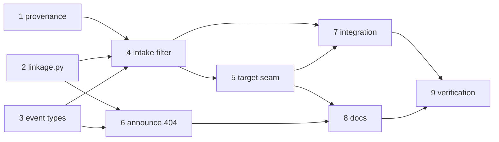

# Tasks: a branch-derived work item must exist, and the record decides who owns the event

> The last spec artifact (bugfix → design → testing plan → tasks). Derived from the approved
> `design.md` and `testing-plan.md`.

## Task list

- [x] 1. Ref provenance in the router
  - `work_item_sources()` — one traversal recording each ref's sources; `linked_work_items`
    and `extract_work_items` become views over it, contracts unchanged.
  - `branch_derived_refs(event, payload)` — the refs whose only source is the branch
    convention (PR head branch, and the CI `head_branch` / `branches[].name` sources).
  - _Depends on:_ none
  - _Requirements:_ R1.1, R1.4
  - _Test:_ `T1 — uv run pytest cli/tests/test_routing.py -k provenance` (red→green)
- [x] 2. `the_loop/linkage.py` — the existence check
  - `WorkItemVerifier.is_missing()` (definitive 404 only), `record_missing()`, the bounded
    LRU, `--hostname` for a non-default host, coordinate validation, the one-shot missing-`gh`
    warning.
  - **Security task** (payload → argv boundary): the negative test is a ref whose
    owner/repo fail `^[A-Za-z0-9._-]+$` — no `gh` call is made and the answer is "unknown".
  - _Depends on:_ none
  - _Requirements:_ R1.2, R1.3, R1.6, Security design
  - _Test:_ `T1, T8 — uv run pytest cli/tests/test_linkage.py` (red→green)
- [x] 3. New event types in the catalogue
  - `routing.linkage_dropped`, `session.work_item_missing`, and the new
    `dispatch.dropped` reason documented.
  - _Depends on:_ none
  - _Requirements:_ R1.2, R1.7, R3.1
  - _Test:_ `T1 — uv run pytest cli/tests/test_eventlog.py` (the emitted-vs-catalogued parity test)
- [x] 4. `_verify_linkage` at dispatcher intake
  - Filter before control parsing; skip refs with a live record; drop the event with
    `work-item-not-found` when nothing survives, without releasing the delivery id.
  - _Depends on:_ 1, 2, 3
  - _Requirements:_ R1.2, R1.5, R1.7
  - _Test:_ `T1 — uv run pytest cli/tests/test_routing.py -k linkage` (red→green)
- [x] 5. `_target_work_item` — one seam for four call sites
  - `_spawn_refusal`, `_apply_control`, `_on_unmatched`, `_record_graph_command`.
  - _Depends on:_ 4
  - _Requirements:_ R2.1, R2.2, R2.3, R2.4
  - _Test:_ `T1 — uv run pytest cli/tests/test_routing.py -k target` (red→green)
- [x] 6. The announcement's 404 becomes evidence
  - `SessionAnnouncer(on_work_item_missing=…)`, `session.work_item_missing` at error level,
    the dispatcher wiring the sink into the verifier's cache.
  - _Depends on:_ 2, 3
  - _Requirements:_ R3.1, R3.2, R3.3
  - _Test:_ `T1 — uv run pytest cli/tests/test_announce.py -k missing` (red→green)
- [x] 7. The reproduction, end to end
  - Gherkin-documented integration scenarios: the ticket's repro, and the unverifiable-ref
    fail-open path.
  - _Depends on:_ 4, 5
  - _Requirements:_ R1.2, R1.3, R2.1, R2.2, R2.3, R4.2
  - _Test:_ `T2 — uv run pytest cli/tests/test_webhook_routing_integration.py -k linkage` (red→green)
- [x] 8. Docs fold-in
  - `docs/capabilities/webhook-triggers.md` (behaviour + history row),
    `docs/decisions/decision-095.md` + the index, `docs/capabilities/observability.md` if it
    enumerates event types, and the execution log's `## Capability docs` / `## Documentation`
    sections.
  - _Depends on:_ 4, 5, 6
  - _Requirements:_ R1, R2, R3
  - _Test:_ `T12 — make lint` (markdownlint + link checks)
- [x] 9. Verification
  - Execute `testing-plan.md`: tick each activity, record commands, outcomes and committed
    evidence under `evidence/`.
  - _Depends on:_ 7, 8
  - _Requirements:_ R4
  - _Test:_ `T1, T2, T8, T12 — make test && make lint`

## Dependency graph (DAG)

## Checkpoints

Tests run at every task boundary; the execution log records each task's red→green
transition. Tasks 1–3 are independent and land together with their unit tests; 4–7 are the
behaviour change and run the full suite; 8 runs `make lint`; 9 is the `verification` node
executing the plan.
