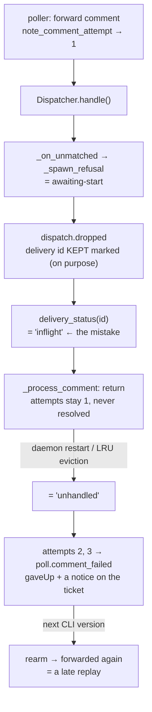

# Bugfix spec: a comment refused on purpose is filed as a delivery still in flight

> Phase 1 of 3 for a bug (bugfix → design → tasks). This phase MUST be reviewed and
> approved before the design is derived from it.

## Summary

A comment posted before an authorized `the-loop start` is refused on purpose — that part is
settled, and the owner confirmed it on the ticket: **option 3, the session re-reads the
thread.** What is broken is everything the refusal leaves behind. The poller records the
comment as *attempt 1 of 3, in flight*, and nothing ever finishes it. So the same ledger
entry that means "we are still trying" now means "we decided not to", and the two are
indistinguishable — to an operator reading the portable record, to
[`docs/cli/state.md`](../../cli/state.md), and to the poller itself, which on a restart
takes it literally: it spends attempts 2 and 3, declares a **terminal delivery failure**,
and posts a notice on the ticket telling the human their comment never reached the session
after three attempts. Nothing was attempted. Nothing failed. The-loop refused it.

Ticket: [#270](https://github.com/MadaraUchiha-314/the-loop/issues/270), split out of
[#269](https://github.com/MadaraUchiha-314/the-loop/issues/269) § *Related casualty*.

## Steps to reproduce

A labelled work item, `requireStartCommand: true` (the default), nobody has started it, and
the **poll** ingress (the ingress that keeps a ledger):

1. An authorized user comments on the item — anything that is not a control keyword.
2. `poll --once`. The poller forwards it (`poll.comment_forwarded`, `attempt: 1`); the
   dispatcher refuses it (`dispatch.dropped`, `reason: awaiting-start`) and **keeps** the
   delivery id marked, deliberately.
3. `poll --once` again, any number of times. `commentAttempts` still reads `{<id>: 1}`.
4. Restart the daemon (or let `dedupCacheSize` deliveries evict the id), then poll twice
   more.

## Expected vs actual

| | Expected | Actual |
|---|---|---|
| after step 3 | the record says the comment was refused, or says nothing pending | `commentAttempts: {<id>: 1}` — indefinitely, for as long as the comment exists on the thread |
| after step 4 | nothing, the refusal already resolved it | attempts 2 and 3 are spent, `poll.comment_failed` (`will_retry: false`) is emitted at **error** level, `gaveUp` records the comment, and `_report_giveup` posts *"the-loop never delivered this comment … after 3 attempts"* on the ticket |
| after a later upgrade | nothing | `rearm_gave_up_comments` un-resolves the comment (a give-up by a *different* CLI version is re-armed, issue-146) and it is forwarded again — **delivered late** if the item has been started by then |

The last row is the sharp end. Today's behaviour is not the documented "never replayed": it
is *usually* never replayed, and *accidentally* replayed on the first upgrade after a
spurious give-up. Replay-on-start is the option the owner declined; replay-on-upgrade is the
same semantics arrived at by accident, on a schedule nobody chose.

The webhook ingress keeps no ledger, so it only ever loses the comment — silently, which is
what the ticket asks to have written down.

## Root cause (confirmed)

Five deliberate outcomes, one honest mistake: the dispatcher **tells nobody** that it is done
with an event, so the only signal reaching the poller is the shape of the dedup mark — and
that shape says *in flight*.

`Dispatcher.delivery_status` (`cli/the_loop/webhook/dispatcher.py`) has three answers —
`done`, `inflight`, `unhandled` — and a *deliberate refusal* is none of them. It resolves to
`inflight` because the mark is there, and to `unhandled` once the mark is gone. Both are
wrong in the same way: they describe a delivery that is still on its way.

Five sites end an event this way, and every one of them keeps the id on purpose. The two
*suppressions* carry the same documented promise in the code — *nothing is replayed; the
harness re-reads the thread itself* — and the three *control* sites never had a delivery to
account for in the first place:

| Site | Where | Why the id is kept |
|---|---|---|
| `awaiting-start` | `_on_unmatched` | "a deliberate refusal, not a transient failure: releasing it would have GitHub redeliver … every comment on every labelled work item nobody has started yet" |
| `session-paused` | `handle`, `_dispatch_one` | "Suppressed on purpose (issue-106), not a transient failure … Nothing is replayed on resume; the harness re-reads the thread itself." |
| a control command applied | `_apply_control` | the comment **was** the instruction; it is executed here and "never forwarded to the harness" |
| a control command refused | `_reject_control` | `control.rejected` — a decision about the command (unauthorized actor, nothing to resume, an unarmed item) |
| conflicting keywords | `handle`, `control.ambiguous` | "nothing was executed and nothing was forwarded" |

A `the-loop stop` before any start is the ticket's own scenario reached through the control
path, and it is the more common one: the operator's *first* comment on a labelled item is
often a keyword. Its ledger entry is stuck identically, and the restart tail is worse than a
false give-up notice — the poller re-forwards the comment and the-loop **executes the command
again**. For `cleanup`, executing again means releasing local resources a second time.

So the fix is not a new policy. It is the existing policy, said out loud on the one channel
that was left to infer it.

## Requirements

### Requirement 1 — a delivery the dispatcher is finished with is **settled**, not pending

A delivery id has always had three fates: *enqueued* (a session will get it), *released*
(the dispatch failed, retry it), or **kept marked with nothing more to come**. The third is
the one with no name, so the poll path reads it as one of the first two. Naming it is the
whole fix. Two families reach it, and neither can be improved by a retry:

- **suppressed** — the event was refused on purpose: `awaiting-start`, `session-paused`;
- **consumed** — the event *was* the instruction: a control command the-loop executed,
  refused, or found ambiguous. It is not a delivery at all, so counting delivery attempts
  for it is meaningless — and re-forwarding it after a restart **re-executes** it, which for
  `cleanup` means destroying local resources twice.

#### Acceptance criteria (EARS)

1. WHEN the dispatcher finishes with an event by suppressing it (`awaiting-start`,
   `session-paused`) or by consuming it as a control command (executed, rejected, or
   ambiguous) THEN it SHALL record the delivery id as **settled**, with which of those
   outcomes it was, in the same bounded store that holds the id's dedup mark.
2. WHEN the poll path asks about such a delivery id THEN the answer SHALL be `settled`
   rather than `inflight` or `unhandled`, and the outcome SHALL be readable by the caller.
3. WHEN a delivery id is settled **and** a session has already recorded it as delivered THEN
   the answer SHALL remain `done`: a suppression on one endpoint SHALL NOT undo a delivery
   that happened on another.
4. WHEN a delivery id is not settled THEN every existing answer SHALL be bit-for-bit what it
   is today. Settling is additive, and the paths that are **not** settled keep their present
   behaviour exactly: `spawn-policy` (which releases the id for a retry), `session-occupied`,
   `session-vanished`, `work-item-not-found`, and every `dispatch.failed` /
   `dispatch.error` path.
5. The settled record SHALL be bounded and process-local, evicted with the dedup mark it
   belongs to, so it can never grow without limit and can never outlive the mark it
   qualifies.

### Requirement 2 — the ledger stops implying a retry that will never come

*(the ticket's words: "`commentAttempts` should stop implying a pending retry")*

#### Acceptance criteria (EARS)

1. WHEN a forwarded comment's delivery is settled THEN the poller SHALL resolve it in the
   work item's ledger — baselined in `seenComments`, absent from `commentAttempts` — SHALL
   NOT count it against `polling.maxRetries`, and SHALL NOT forward it again.
2. WHEN the delivery is settled **synchronously** by the dispatch call the poller just made
   THEN the comment SHALL be resolved on that same cycle, so **no** attempt is ever recorded
   for it and `poll.comment_forwarded` is not emitted for a comment nobody attempted to
   deliver.
3. WHEN the delivery is settled **after** the poller recorded an attempt — a session paused
   between enqueue and dispatch, a settlement on an earlier cycle — THEN the next cycle that
   reads the delivery SHALL resolve the comment and clear its attempt counter.
4. WHEN a comment is resolved as settled THEN it SHALL NOT be recorded in `gaveUp`: a give-up
   is a statement about a *failing environment*, which a later CLI version may invalidate
   (issue-146), and re-arming a settled delivery would replay it — the semantics the owner
   declined.
5. WHEN a comment is resolved as settled THEN the poller SHALL NOT post the give-up notice
   `_report_giveup` writes: telling a human "the-loop tried three times and could not deliver
   this" is false, and the true statement — the item has not been started — is what the
   operator already sees in `dispatch.dropped`.
6. WHEN a **presence** (spawn) delivery is settled THEN the poller SHALL treat the spawn
   ledger as resolved rather than in flight: the settlement SHALL NOT accumulate toward
   `polling.maxRetries` and SHALL NOT produce a terminal `poll.spawn_failed`.
7. WHEN a comment is resolved as settled THEN the system SHALL emit one event naming the work
   item, the comment, its author and the outcome, with `will_retry: false`.

### Requirement 3 — the semantics are written down where a reader meets them

The ticket's option 3 is only complete if the answer is *stated*. "The content is not lost
because the session reads the thread" is load-bearing, and today it is nowhere: not in the
capability doc that describes the start gate, not in the state reference that documents
`commentAttempts`, and not in the prompt the spawning session actually receives.

#### Acceptance criteria (EARS)

1. The capability doc covering execution control (`docs/capabilities/webhook-triggers.md`)
   SHALL state that events arriving while a work item is unstarted (or its session paused)
   are refused and **never replayed**, and that the thread itself is how the session learns
   what was said — with the same history-row provenance every other behaviour there carries.
2. The state reference (`docs/cli/state.md`) SHALL describe `commentAttempts` as counting
   only deliveries that may still be retried, and SHALL say that a refused comment is
   baselined rather than left pending.
3. The prompt a spawned session receives SHALL tell it, in the prompt's own trusted voice,
   to read the work item's **whole** thread — including anything posted before the start,
   which was never delivered as an event. Both copies of that template (the built-in
   fallback and the bundled file, which a test holds byte-identical) SHALL say it.
4. The event catalogue (`eventlog.EVENT_TYPES`) SHALL carry the new event and SHALL document
   that a deliberately suppressed delivery is reported to the poll path as refused.

### Requirement 4 — a regression test per layer

1. The fix SHALL include tests that fail before it and pass after it, covering: the settled
   record and `delivery_status`'s new answer, `done` still winning over a settlement, the
   same-cycle resolution, the later-cycle resolution, no `gaveUp` entry, no give-up notice,
   the control-comment outcomes, the presence path, and the untouched behaviour of every
   drop reason that is not settled.
2. The reproduction in this document SHALL be covered end-to-end by an integration test
   carrying a Gherkin docstring (`testing.gherkinDocstrings: required`), including the
   upgrade-replay tail: after the fix, an upgrade re-arms nothing.

## Security considerations

**No new surface. The change is one process-local bookkeeping field and a poller branch that
does strictly less work.**

| Boundary | Where | How it fails closed |
|---|---|---|
| Untrusted comment text → the record | a settled comment is resolved by **id** only | nothing from a comment body is stored, parsed or interpolated; the outcome is one of five fixed literals the dispatcher owns, never payload-derived |
| Settled record → authorization | `Deduper` gains a value beside a key it already held | the record cannot arm a work item, cannot start a session, cannot widen who may issue a command, and cannot cause a delivery — it can only stop the poller from re-forwarding something the dispatcher has already finished with |
| Memory / availability | one bounded LRU, the existing one | the outcome lives in the dedup entry, so `dedupCacheSize` bounds it exactly as it bounds the mark; it cannot leak past eviction |
| Silent muting | the risk direction that matters: could a *deliverable* comment be baselined and lost? | only a settlement the dispatcher itself recorded resolves a comment, only for the five named outcomes, and `done` still wins over a settlement (R1.3). Every failure path — `dispatch.failed`, `dispatch.error`, a released id — keeps today's retry behaviour (R1.4) |
| Re-executing a destructive command | a `cleanup` keyword re-forwarded after a restart | baselining the comment on the cycle it is consumed closes most of that window; it does not claim to close all of it (the mark is process-local — see `design.md` §Trade-offs) |

The abuse case worth stating: an attacker who can comment on a watched work item gains
nothing. Before this change their pre-start comment is refused and re-evaluated every cycle
forever; after it, it is refused and baselined. The change **removes** per-cycle work an
unauthorized commenter could otherwise accumulate — one permanent ledger entry per pre-start
comment, on every polled item nobody has started — and removes one path to executing a
control command twice.

## Out of scope

- **Replaying pre-start comments** (the ticket's option 1) and **a durable "gave up before
  the start" marker** (option 2). The owner chose option 3; a durable per-item refusal ledger
  is precisely the bounded-state cost option 3 exists to avoid.
- **`session-occupied`, `session-vanished`, `work-item-not-found`.** They also keep their
  delivery ids, and they also leave a poll ledger entry in flight — but they are neither
  "suppressed, read the thread instead" nor consumed. `session-occupied` in particular can be
  *fixed by the operator* (kill the stale tmux session), and today's stuck entry is the one
  thing that lets a later redelivery succeed afterwards; baselining it would take that away.
  They keep today's behaviour exactly (R1.4) and are a separate judgement.
- **A `poll.cycle` counter for settled deliveries.** The per-comment event is the record; a
  new summary field would change a documented event's shape for a number nobody asked for.
- **The webhook ingress.** It keeps no per-comment ledger, so there is nothing there to
  mis-state; R3 covers what it needs, which is documentation.

## Open questions

None. The product decision the ticket asked for was answered on the ticket itself
([option 3](https://github.com/MadaraUchiha-314/the-loop/issues/270#issuecomment-5323197311)),
and this spec implements that answer's two named consequences: write it down, and stop
`commentAttempts` implying a pending retry.
