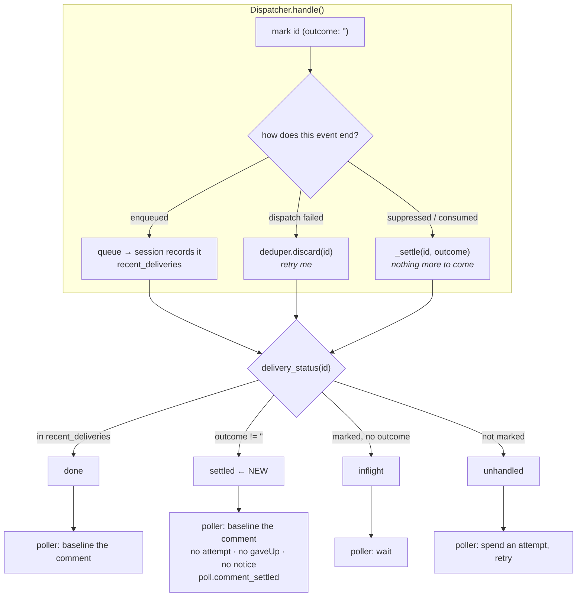

# Design: name the third fate of a delivery id

> Phase 2 of 3 (bugfix → design → tasks). Derives from the approved `bugfix.md`. MUST be
> reviewed and approved before the tasks breakdown.

## Overview

**One word where there was none.** The dedup cache already holds every delivery id the
dispatcher has seen; it just holds nothing *about* them. Give each entry an **outcome**
string — empty for "dispatched, still in play", a fixed literal for "the dispatcher is done
with this" — and the poll path stops having to infer intent from the presence of a mark.

Three changes, and the third is the one the ticket actually asked for:

| # | Where | What changes |
|---|---|---|
| A | `webhook/router.py` (`Deduper`) | the LRU's value stops being `None` and becomes the delivery's **outcome**; two accessors |
| B | `webhook/dispatcher.py` | the five sites that finish with an event record their outcome; `delivery_status` gains the answer `settled` |
| C | `poller/poller.py` | a settled delivery **resolves** its comment — baselined, no attempt, no give-up, no notice — and a settled presence resets the spawn ledger |
| D | docs + the spawn prompt | option 3 written down where a reader (and the spawned session) meets it |

Nothing is replayed, nothing new is delivered, and no persisted format changes. The poller
does strictly less work than before.

## Architecture



The ordering in `delivery_status` is the design: **a delivery that happened outranks a
settlement** (R1.3 — a work item's session may have taken the event while a second endpoint
was paused), and a settlement outranks the bare mark.

## Components & interfaces

### A — the outcome lives in the dedup entry (`webhook/router.py`)

```python
class Deduper:
    def add(self, delivery_id: str, outcome: str = "") -> None
    def mark_settled(self, delivery_id: str, outcome: str) -> None   # add(id, outcome=…)
    def outcome(self, delivery_id: str) -> str                       # "" when unmarked
    def discard(self, delivery_id: str) -> None                      # unchanged
    def __contains__(self, delivery_id: str) -> bool                 # unchanged
```

`OrderedDict[str, None]` becomes `OrderedDict[str, str]`. That is the whole storage change,
and it is deliberately *not* a second cache:

- **the outcome cannot outlive the mark it qualifies.** One eviction, one `discard`, one
  bound (`dedupCacheSize`). A parallel dict would need its own bound and could disagree with
  the deduper about whether an id is known — which is the class of bug being fixed.
- **`Router` is unaffected.** It shares the dispatcher's deduper and uses only
  `__contains__` (the early duplicate check), so it reads the same marks it always did.
- `mark_settled` on an id the deduper never held **adds** it. That is the correct reading of
  every call site: settling keeps the id marked, exactly as the code already does by *not*
  discarding it.

`add()` keeps its default so every existing caller is untouched; `handle()`'s intake call
means "dispatched, outcome unknown".

### B — five sites, one helper (`webhook/dispatcher.py`)

```python
SETTLED_SUPPRESSED = ("awaiting-start", "session-paused")   # a delivery refused on purpose
SETTLED_CONTROL_EXECUTED = "control-executed"
SETTLED_CONTROL_REJECTED = "control-rejected"
SETTLED_CONTROL_AMBIGUOUS = "control-ambiguous"

def _settle(self, routed: RoutedEvent, outcome: str) -> None:
    """This event is finished with: keep the id marked, and say why."""
```

| Site | Outcome | Note |
|---|---|---|
| `_on_unmatched`, refusal branch | the refusal itself (`awaiting-start`) | gated on membership of `SETTLED_SUPPRESSED`, so `spawn-policy` — which *releases* the id — is untouched, and a future refusal reason has to opt in |
| `handle`, matched-but-all-paused | `session-paused` | recorded only when **no** session was enqueued: a mixed match (one live, one paused) is a delivery, not a settlement |
| `_dispatch_one`, paused before dispatch | `session-paused` | the asynchronous case — the poller has already recorded an attempt, so this is what the next cycle reads |
| `_apply_control`, after the command is applied | `control-executed` | the comment *was* the instruction |
| `_reject_control` | `control-rejected` | one method, every rejection reason |
| `handle`, `control.ambiguous` | `control-ambiguous` | nothing executed, nothing forwarded |

`delivery_status` gains one branch:

```python
if delivery_id in a matched session's recent_deliveries:  return "done"
if self.deduper.outcome(delivery_id):                     return "settled"   # NEW
if delivery_id in self.deduper:                           return "inflight"
return "unhandled"
```

plus `delivery_outcome(delivery_id) -> str` so the caller can name the outcome in its own
record without a second vocabulary.

### C — the poller resolves instead of waiting (`poller/poller.py`)

`_process_comment` learns the new answer in **two** places, because a settlement can be
synchronous or asynchronous:

```python
status = self.dispatcher.delivery_status(event.delivery_id, refs)
if status == "done":     …unchanged…
if status == "settled":                       # an EARLIER cycle settled it (or a worker did)
    self._settle_comment(ref, comment, self.dispatcher.delivery_outcome(event.delivery_id),
                         event.delivery_id)
    return
if status == "inflight": return
…budget check unchanged…
self.dispatcher.handle(event)
outcome = self.dispatcher.delivery_outcome(event.delivery_id)
if outcome:                                   # settled synchronously by the call above
    self._settle_comment(ref, comment, outcome, event.delivery_id)
    return                                    # ← no attempt recorded, R2.2
attempt = self.state.note_comment_attempt(ref, comment.id)
…unchanged…
```

`_settle_comment` is small and deliberately dull — resolve, say so once, emit:

```python
def _settle_comment(self, ref, comment, outcome, delivery_id) -> None:
    self._attempted.pop(delivery_id, None)
    self.state.resolve_comment(ref, comment.id)      # gave_up=False — NOT an abandonment
    eventlog.emit("poll.comment_settled", work_item=ref, comment_id=comment.id,
                  actor=comment.author, outcome=outcome, will_retry=False)
```

`gave_up=False` is the load-bearing argument (R2.4). `resolve_comment(..., gave_up=True)`
writes the comment into `gaveUp` with the CLI version, and `rearm_gave_up_comments` un-resolves
anything a *different* version abandoned — which would re-forward the comment after the next
upgrade. That is replay-on-upgrade: the semantics the owner declined, arriving by accident.
A settlement is not an abandonment, so it is baselined and nothing re-arms it.

`_try_spawn` gets the same answer for a **presence** delivery, next to the `done` branch it
already has:

```python
if status == "settled":
    self._attempted.pop(last_did, None)
    self.state.reset_spawn(ref)      # resolved: not in flight, and no attempt was spent
    return
```

Reset rather than `mark_spawn_gave_up`: a settlement says *this presence event was refused*,
not *spawning here is hopeless*. Resetting leaves the ledger clean, and `_try_spawn` is only
reached again on genuinely new activity or an attempt already in progress — so nothing spins.
This branch is near-unreachable today (the poller refuses to arm a presence for an unstarted
item, and a paused session counts as a session), and it exists because
`delivery_status` gained a value: without it, `settled` would fall through to the retry
budget and turn a refusal into a terminal `poll.spawn_failed` — strictly worse than today.

### D — writing it down (R3)

| Surface | What it gains |
|---|---|
| `docs/capabilities/webhook-triggers.md` | the replay rule stated once for both suppressions ("refused, never replayed — the thread is how the session learns what was said"), the settled-delivery accounting, and a history row |
| `docs/cli/state.md` | `commentAttempts` counts only deliveries that may still be retried; a settled comment is baselined into `seenComments` |
| `skills/the-loop/reference/observability.md` | the question the new event answers, beside `poll.comment_failed` (`docs/capabilities/observability.md` enumerates no event types, so it needs nothing) |
| `docs/config/cli/polling-options.md` | `maxRetries` counts only deliveries that could still succeed |
| `skills/the-loop/templates/webhook-autoexecute-prompt.md` **and** `DEFAULT_SPAWN_TEMPLATE` | one sentence, in the prompt's trusted voice, telling the session to read the **whole** thread including anything posted before the start, because those comments were never delivered as events. A test holds the two byte-identical (issue-36), so they change together |
| `eventlog.EVENT_TYPES` | `poll.comment_settled`, and a sentence on `dispatch.dropped` saying a suppressed delivery is reported to the poll path as settled |

The prompt sentence is the part that makes option 3 *true* rather than merely stated: the
existing prompt frames the thread as untrusted content but never asks the session to read it.

## Data models

No persisted state changes: the portable record, the session registry, `graph-state.json` and
every config schema are untouched. The only new state is one string per live dedup entry,
process-local, bounded by `routing.dedupCacheSize`, gone on restart.

One new event type (the `eventlog` parity test gates the catalogue):

| Event | Level | Fields |
|---|---|---|
| `poll.comment_settled` | info | `work_item`, `comment_id`, `actor`, `outcome`, `will_retry` (false) |

`dispatch.dropped` and `control.*` keep their shapes; only their catalogue descriptions grow.

## Error handling

| Situation | Behaviour |
|---|---|
| a settled id is later evicted from the LRU | the answer degrades to `unhandled` — but by then the poller has already baselined the comment, so nothing re-forwards it |
| the dispatcher settles an event with no delivery id | `_settle` is a no-op (hand-built events and CLI-sourced commands carry none) |
| an outcome the poller does not recognise | it is recorded verbatim in `poll.comment_settled` and the comment is still resolved — the vocabulary is the dispatcher's, and the poller never branches on its value |
| a session recorded the delivery **and** another endpoint was paused | `done` wins (R1.3); the comment is baselined either way, and no `poll.comment_settled` is emitted |
| a dispatch fails after being enqueued | unchanged: the id is discarded, the status is `unhandled`, the attempt is spent and retried |
| the poller is killed between the settlement and the ledger write | the ledger is written before the process can be asked to do anything else with the comment; a kill in that window leaves today's behaviour (one more forward, settled again, resolved) |

## Security design

Every boundary from `bugfix.md` §Security considerations, and how it is enforced:

- **No untrusted text enters the record.** A settlement stores a delivery id (GitHub's, or
  the poller's synthesised one) and one of five literals the dispatcher owns. No comment
  body, author, ref or label is read, and nothing settled reaches a prompt, a path or an
  argv.
- **Strictly subtractive.** The record can only stop the poller from re-forwarding. It cannot
  deliver an event, spawn or resume a session, arm a work item, widen `authorizedUsers`, or
  change which events the ingress accepts. Every authorization guard runs upstream and is
  untouched.
- **Fail-safe direction.** The dangerous direction is *muting a deliverable comment*. Three
  things fence it: only the dispatcher's own settlement resolves a comment (never a timeout,
  a heuristic or an absence of evidence), `done` outranks a settlement, and every failure
  path keeps its retry (R1.4). A missing settlement is harmless — it reverts to today's
  behaviour exactly.
- **Bounded by construction.** The outcome shares the dedup entry, so `dedupCacheSize` is its
  bound; an attacker commenting in a loop cannot grow it beyond the cache they could already
  fill, and each pre-start comment now costs the poller *less* per cycle than before.
- **One destructive path narrows.** A `cleanup` keyword re-forwarded after a restart
  re-executes a destructive command. Baselining the comment on the cycle it is consumed
  closes that window except for a process death before the first ledger write; the design
  does not claim more (see §Trade-offs).

## Testing strategy

Unit tests per component: the `Deduper` value and its eviction, each of the five settlement
sites, `delivery_status`'s precedence, `delivery_outcome`, the poller's synchronous and
asynchronous branches, the absence of a `gaveUp` entry and of a give-up notice, and the
presence path. One Gherkin-documented integration test replays the ticket's reproduction on
the poll ingress across several cycles and a simulated restart, asserting the ledger and that
an upgrade re-arms nothing. Full matrix in `testing-plan.md`.

## Trade-offs & decisions

Recorded as [decision-097](../../decisions/decision-097.md).

| Decision | Chosen | Why not the alternative |
|---|---|---|
| Option 3 (the session re-reads the thread), not replay | yes — owner's call on the ticket | Replay needs a bounded per-item record of what was refused; a durable marker (option 2) needs the same state for a status line. Option 3 needs no state at all — but it is only honest if the prompt actually says "read the whole thread", which is why R3.3 is part of the fix and not a doc chore. |
| The outcome lives **in** the dedup entry | yes | A parallel cache needs its own bound and can disagree with the deduper about what is known — the same class of bug as the one being fixed. |
| Settle the three **control** outcomes too, not just the ticket's `awaiting-start` | yes | A `the-loop stop` before any start is the ticket's scenario reached through the control path, with the same stuck ledger entry and a worse tail (a re-forward *re-executes* the command). Fixing the one and leaving the other would make the rule arbitrary. |
| Leave `session-occupied`, `session-vanished`, `work-item-not-found` alone | yes | They keep their ids for a different reason, and `session-occupied` is *operator-fixable*: today's stuck entry is what lets a redelivery succeed after the stale tmux session is killed. Baselining it would remove a recovery path to fix a cosmetic one. |
| A settled comment is baselined, not recorded in `gaveUp` | yes | `gaveUp` means "a failing environment beat us", and a later version re-arms it. Using it here would build replay-on-upgrade out of the give-up machinery. |
| Resolve synchronously, on the same cycle | yes | Letting the next cycle do it would leave one real `commentAttempts: 1` entry and one misleading `poll.comment_forwarded` per refused comment — a smaller version of the reported bug. |
| A new `poll.comment_settled` event rather than reusing `poll.comment_forwarded` | yes | The forward event means "handed to the dispatcher, attempt N". A settlement is the opposite of an attempt; overloading it would make `attempt` mean two things. |
| No config key, no schema change | yes | It is an accounting correctness fix. There is no deployment that wants the ledger to lie. |
| Accepted limit: the mark is **process-local** | yes | A settlement is bookkeeping about a delivery, not a durable fact about the work item, and the durable half already exists — the baselined comment id. Persisting outcomes would put a per-delivery write on the ingress path to shorten a window the first poll cycle already closes. |

## Open questions

None.

## Review comments

*(Populated during review; findings recorded per `reference/reviewing.md`.)*
