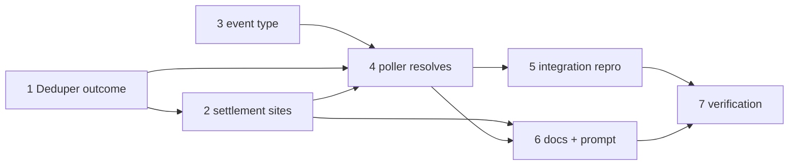

# Tasks: name the third fate of a delivery id

> The last spec artifact (bugfix → design → testing plan → tasks). Derived from the approved
> `design.md` and `testing-plan.md`.

## Task list

- [x] 1. `Deduper` carries the delivery's outcome
  - `OrderedDict[str, str]`; `add(id, outcome="")`, `mark_settled(id, outcome)`,
    `outcome(id)`. `discard` and `__contains__` unchanged; the `Router` (which only uses
    `__contains__`) untouched.
  - _Depends on:_ none
  - _Requirements:_ R1.1, R1.5
  - _Test:_ `T1 — uv run pytest cli/tests/test_routing.py -k deduper` (red→green)
- [x] 2. The five settlement sites and the new status
  - `_settle()`; the `SETTLED_SUPPRESSED` gate in `_on_unmatched`; the all-paused case in
    `handle`; `_dispatch_one`'s pre-dispatch pause; `_apply_control`; `_reject_control`;
    `control.ambiguous`. `delivery_status` → `settled` (after `done`, before `inflight`);
    `delivery_outcome()`.
  - _Depends on:_ 1
  - _Requirements:_ R1.1, R1.2, R1.3, R1.4
  - _Test:_ `T1, T8 — uv run pytest cli/tests/test_routing.py -k "settle or settled"` (red→green)
- [x] 3. The new event type in the catalogue
  - `poll.comment_settled`; `dispatch.dropped` and the `control.*` descriptions note that a
    suppressed or consumed delivery is reported to the poll path as settled.
  - _Depends on:_ none
  - _Requirements:_ R2.7, R3.4
  - _Test:_ `T1 — uv run pytest cli/tests/test_eventlog.py` (the emitted-vs-catalogued parity test)
- [x] 4. The poller resolves a settled delivery
  - `_settle_comment()` (baseline, no attempt, `gave_up=False`, no notice, emit); the
    `status == "settled"` branch and the post-`handle` synchronous branch in
    `_process_comment`; the `settled` branch in `_try_spawn`; `PollState`'s docstring on what
    `commentAttempts` means.
  - _Depends on:_ 1, 2, 3
  - _Requirements:_ R2.1, R2.2, R2.3, R2.4, R2.5, R2.6, R2.7
  - _Test:_ `T1 — uv run pytest cli/tests/test_poller.py -k "settled"` (red→green)
- [x] 5. The reproduction, end to end
  - Gherkin-documented integration scenarios over several cycles and a simulated restart:
    the ledger never holds a pending attempt, no give-up notice is posted, and an upgrade
    re-arms nothing.
  - _Depends on:_ 4
  - _Requirements:_ R2.1–R2.5, R4.2
  - _Test:_ `T2, T10 — uv run pytest cli/tests/test_poller_integration.py -k settled` (red→green)
- [x] 6. Write the semantics down (R3)
  - `docs/capabilities/webhook-triggers.md` (behaviour + history row), `docs/cli/state.md`,
    `docs/capabilities/observability.md`, `docs/decisions/decision-097.md` + the index, and
    **both** spawn-prompt copies (`skills/the-loop/templates/webhook-autoexecute-prompt.md`
    and `DEFAULT_SPAWN_TEMPLATE`, held byte-identical by `test_interaction.py`).
  - _Depends on:_ 2, 4
  - _Requirements:_ R3.1, R3.2, R3.3, R3.4
  - _Test:_ `T1, T12 — uv run pytest cli/tests/test_interaction.py && make lint`
- [x] 7. Verification
  - Execute `testing-plan.md`: tick each activity, record commands, outcomes and committed
    evidence under `evidence/`.
  - _Depends on:_ 5, 6
  - _Requirements:_ R4
  - _Test:_ `T1, T2, T8, T10, T12 — make test && make lint`

## Dependency graph (DAG)

## Checkpoints

Tests run at every task boundary; the execution log records each task's red→green
transition. Tasks 1–3 are mechanical and land with their unit tests; 4–5 are the behaviour
change and run the poller suites plus the full suite; 6 runs `make lint` and the template
parity test; 7 is the `verification` node executing the plan.
