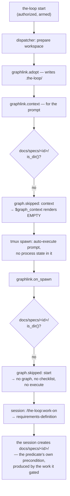

# Bugfix spec: the gate that runs before any work was keyed on a directory only the work creates

> Phase 1 of 3 for a bug (bugfix → design → tasks). This phase MUST be reviewed and
> approved before the design is derived from it.

## Summary

`phase-selection` is the one node of `pdlc-work-item-loop` that is `required: true`. Every
other phase — the spec chain, the testing plan, the reviews, the security review, the
approval gate — became declarable at [issue-179](https://github.com/MadaraUchiha-314/the-loop/issues/179),
and [decision-068](../../decisions/decision-068.md) accepted that trade on one stated
condition: *the act of choosing itself cannot be routed around*. That single invariant is
what replaced the old protected floor.

It was routed around by default. Not by a declaration, not by a forged state file, and not
by an unauthorized comment — by a directory check. `GraphLink._guarded` refused **every**
graph action, `start` included, for a work item with no `docs/specs/<id>/` in the checkout.
That folder is created by the requirements work `phase-selection` exists to gate, so for
every work item minted as a plain GitHub issue the graph declined to start, no checklist
was ever posted, no `the-loop execute` was ever asked for, and the spawned session — reading
an auto-execute prompt whose process-state block rendered **empty** — went straight into
`requirements-definition`.

Work items minted by `/create-ticket` commit their spec folder up front, which is why the
loop's own dogfooding never hit this.

Ticket: [#273](https://github.com/MadaraUchiha-314/the-loop/issues/273).

## Steps to reproduce

A deployment with `graph.enabled: true`, the default `workflow.specDir: docs/specs`, and
GitHub ticketing:

1. Open a GitHub issue directly — **not** through `/new-requirement` + `/create-ticket` — so
   no `docs/specs/<id>/` exists anywhere in the repository.
2. Add the auto-execute label and comment `the-loop start` as an authorized user.
3. Let the daemon spawn the session, and post nothing further.

## Expected vs actual

| | Expected | Actual |
|---|---|---|
| at spawn | the graph starts; the work item stands at `phase-selection` | `graph.skipped` × 2 (`context`, then `start`), reason `no-spec-dir` |
| on the ticket | the selectable-phase checklist, and the loop waiting for `the-loop execute` | nothing — the next comment is a requirements review request, ~11 minutes later |
| in the prompt | a process-state block naming the node the session stands on | `$graph_context` renders empty, and the prompt's own sentence — *"the block below states where this item stands"* — describes nothing |
| in the session | wait: `phase-selection` is a human gate | sets the phase label, creates `docs/specs/<id>/`, drafts `requirements.md`, opens the spec PR, requests review |
| afterwards | a frozen graph in `graph-state.json` and the portable record | no `graph` section at all, so `the-loop check` can attribute no skip to anybody |

## Root cause (confirmed)

One predicate, applied to one action too many.

Two things make it worse than a single missed gate:

- **It is sticky.** `start` is retried only on a later event delivery. In the quiet case —
  nobody comments after the session creates the spec folder — the graph never starts for
  the work item's whole life. In the noisy case somebody does comment, the predicate now
  passes, and `phase-selection` fires *after* requirements work already happened: the right
  gate on the wrong side of the work.
- **The prompt could not have stopped it.** The dispatcher resolves the graph context
  **before** it spawns and enters the graph **after** ([issue-148](https://github.com/MadaraUchiha-314/the-loop/issues/148),
  D5 — a failed spawn must not leave a labelled ticket pointing at a node nobody stands
  on). So even with the graph starting correctly, the prompt that launches the session is
  written at the one moment the work item has no pointer, and `_context_from` answered that
  moment with `None`: *"never entered — a fresh item starts, it doesn't resume."* True, and
  the wrong thing to say to a session that is about to start working.

## Requirements

### Requirement 1 — the graph starts for a work item that has no spec folder

The directory is an artifact of the process, not a precondition for it. `_awaiting_start`
(an authorized human armed this item) and `_checkout_belongs_to` (the `origin` remote proves
this is the work item's own repository) are the gates that decide whether the-loop may act
here; the spec folder never decided anything a plain ticket could satisfy.

#### Acceptance criteria (EARS)

1. WHEN the coupling is asked to **start** a graph for an armed work item in its own
   checkout, and `<specDir>/<id>/` does not exist, THEN it SHALL start the graph, and SHALL
   record no `graph.skipped`.
2. WHEN that start enters `phase-selection` THEN the node's entry chain SHALL run in full —
   the `loop:phase-selection` label, the selectable-phase checklist on the ticket, and the
   assignment delivered into the session — and `graph-state.json` SHALL be written under
   `<specDir>/<id>/`, creating the directory as it goes.
3. WHEN the graph has started this way THEN every existing authorization SHALL be unchanged:
   `phase-selection` SHALL still hold until an **authorized** user replies `the-loop
   execute`, and an unauthorized reply SHALL leave the pointer where it is. This bugfix
   removes a directory check, never a permission one.
4. WHEN the action is `advance` or `clean` and `<specDir>/<id>/` does not exist THEN the
   present behaviour SHALL be unchanged: skip, recorded as `graph.skipped` with
   `reason: no-spec-dir` and the action named. Neither can be the first thing that happens
   to a work item, so for them a missing directory still means the graph was never placed
   here — and keeping the check there preserves the module's invariant that **no input moves
   an unplaced work item forward**.
5. WHEN the spec directory is resolved THEN the exemption SHALL apply to the **declared**
   directory (`workflow.specDir`) exactly as the check did, so a repository that moved its
   specs is neither gated on nor written to a stale path (issue-123 R2.1 stands).
6. WHEN the checkout is not the work item's own repository, the coupling is disabled, the
   ref carries no spec-id convention, the declared spec directory escapes the checkout, or
   nobody has started the item THEN the graph SHALL still not be started. The exemption is
   one predicate, not the gate order.

### Requirement 2 — a work item that has not been placed yet still gets a process-state block

`$graph_context` is rendered from a read that precedes the write, so for a spawn prompt the
*normal* case is a work item with no pointer. An empty block there is not a neutral absence:
it deletes the only sentence in the auto-execute prompt that tells the session it is not in
charge of choosing its own phase.

#### Acceptance criteria (EARS)

1. WHEN a graph context is resolved for a work item that has not entered the graph THEN it
   SHALL name the graph's own `start` node, with status `pending`, and the node's phase and
   actor.
2. WHEN a `pending` context is rendered THEN the block SHALL state that the-loop has not
   placed the work item on any node, that the session SHALL NOT start a phase, write a spec
   artifact, set a phase label or open a pull request, and that the loop delivers the node's
   assignment into the conversation when it enters the node. WHEN that node's actor is
   `human` THEN the block SHALL additionally name it as a gate for an authorized person, not
   the session's to answer or claim. The block SHALL also tell the session to say so on the
   work item if no assignment arrives — an **event** prompt can carry a pending context too
   (a session predating the coupling, or one whose entry faulted), and there no assignment is
   coming, so the block must produce an escalation rather than a silent wait.
3. WHEN a work item **has** entered the graph THEN its context SHALL be exactly what it is
   today — node, phase, status, reason, gate messages, resume command, claim command,
   surface line. `pending` SHALL never mask a work item in flight.
4. WHEN a context is `pending` THEN it SHALL NOT count as a waiting human gate: nothing has
   been entered, so the dispatcher's consult-first ordering SHALL be untouched and no event
   SHALL be handed to a gate on its account.
5. WHEN a `pending` node declares a `command` THEN the block SHALL NOT render it as a resume
   command, and SHALL NOT render the `the-loop graph complete` claim line: a node nobody
   entered is not a node to resume or to claim.
6. WHEN there is no graph to read at all — the coupling disabled, a foreign checkout, a ref
   with no spec-id convention, an unreadable or uncompilable graph — THEN the block SHALL
   render empty and the prompt SHALL be byte-identical to today's (issue-148 R3.4). A
   deployment that runs no graph SHALL NOT be told to wait for one.

### Requirement 3 — the behaviour is written down where a reader meets it

#### Acceptance criteria (EARS)

1. [`docs/capabilities/process-graph.md`](../../capabilities/process-graph.md) SHALL state
   which actions require the spec directory and which do not, and why the split falls
   there; and SHALL state the `pending` context and what its block says.
2. [`docs/capabilities/webhook-triggers.md`](../../capabilities/webhook-triggers.md) SHALL
   correct its own list of when `$graph_context` renders empty — "fresh item" and "no spec
   directory" are no longer members of it.
3. Both SHALL carry a history row with the same provenance every other behaviour there has.

### Requirement 4 — a regression test per layer

1. The fix SHALL include tests that fail before it and pass after it, covering: a start with
   no spec directory (started, no skip recorded), an `advance` with none (still skipped,
   still recorded, action named), the declared-directory parity, the `pending` context and
   its rendered block, and a started graph reporting its real node.
2. The reproduction SHALL be covered end-to-end against a **real** `Dispatcher` and a real
   `graph.Runtime` over the shipped graph, with a Gherkin docstring
   (`testing.gherkinDocstrings: required`), including the authorization tail: an
   unauthorized `the-loop execute` on the freshly started graph moves nothing.

## Security considerations

**The change removes a check that was never a security control, and touches no other.**

| Boundary | Where | How it fails closed |
|---|---|---|
| Untrusted comment text → the graph | unchanged | `classify-feedback` is still the only route from a comment to an edge, still filters by `authorizedUsers`, and `phase-selection` is still `required: true`. R1.3 is a test |
| A foreign checkout → a write | `_checkout_belongs_to`, unchanged and still **ahead** of every checkout read | the exemption is applied after the ownership proof and after the containment check, so no reordering widens what may be written where |
| An operator's disk | the coupling may now create `<specDir>/<id>/` in a checkout it previously left alone | strictly smaller than what already happens at the same seam: `adopt` writes `.the-loop/harness-config.yaml` into that same checkout, behind the same four gates, one step earlier. The directory is inside the checkout by construction (`_is_contained`), and `graph-state.lock` is already git-ignored |
| A repository that never adopted the-loop | `Runtime.start` excludes the spec root from git when `repoInitialized is False` | that path is unchanged and now runs where it previously never got the chance: a guest's spec tree still stays out of its history |
| Prompt injection via the new block | the `pending` block | composed from the-loop's own vocabulary plus the compiled graph's node id, phase and actor. No payload text, no comment body, no repository-supplied string reaches it — the same rule the rest of `render_graph_context` follows (R3.6 of issue-148) |
| Availability | `_pending_context` | pure reads (`GraphState.load`, `graph.node`), inside the module's blanket `except`; an unreadable graph renders the empty block, which is exactly today's behaviour |

The abuse direction worth stating plainly: could this let an attacker get a graph started —
and phases labelled, checklists posted — on a work item nobody armed? No. `_awaiting_start`
is untouched and runs **before** the predicate this change relaxes, so an unarmed work item
is refused before the spec directory is ever considered.

## Out of scope

- **Pre-creating `<specDir>/<id>/` at workspace preparation** (the ticket's suggested fix 2).
  It makes the predicate pass by satisfying it rather than by fixing it, leaves an empty
  directory behind for every work item that never starts a graph, and would put a write into
  the workspace path for a reason the workspace path has nothing to do with.
- **Reordering the spawn so the graph is entered before `tmux.spawn`.** That is issue-148 D5,
  and it is right: a failed spawn must not leave a labelled ticket pointing at a node nobody
  stands on. R2 closes the same window from the other side, with a read.
- **Changing the auto-execute prompt template.** The guard belongs in the block that knows
  whether there *is* a graph; putting "wait to be placed" in the template would deadlock
  every deployment running with `graph.enabled: false`.
- **`advance` / `clean` without a spec directory.** R1.4 keeps them exactly as they are.
- **Anything about how `phase-selection` itself behaves** — the checklist, the tick-in-place
  channel, the freeze. This work item is about the gate being *reached*, not about what it
  does once it is.

## Open questions

None. The ticket named two candidate fixes and this spec takes the first, for the reason the
ticket itself gives: starting the graph needs no spec folder. The third paragraph of its
suggested-fix section — the auto-execute prompt walking the work-on flow unguarded — is
Requirement 2.
