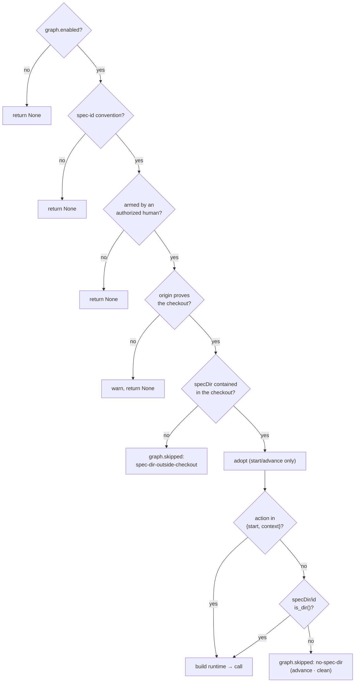

# Design: let the gate that precedes the spec run before the spec exists

> Phase 2 of 3 (bugfix → design → tasks). Derives from the approved `bugfix.md`. MUST be
> reviewed and approved before the tasks breakdown.

## Overview

Three changes, two of them in one module.

| # | Where | What changes |
|---|-------|--------------|
| A | `graphlink._guarded` | the `no-spec-dir` predicate stops applying to `start` and `context` |
| B | `graphlink._context_from` / `render_graph_context` | a work item with no pointer resolves to its graph's `start` node with status `pending`, and that renders a block that forbids beginning a phase |
| C | `docs/capabilities/{process-graph,webhook-triggers}.md` | the split, and the new block, written down |

No new configuration, no schema change, no persisted format change, no new event type. A
deployment that runs no graph renders byte-identical prompts.

## Architecture

The seam is one gate order, and A moves exactly one predicate out of it for two of the four
actions:



Everything above `AD` is untouched, and that is the whole security argument: the ownership
proof, the containment check and the arming gate all still precede any write, and the
exemption sits **below** all three.

B closes the other half — the window between the prompt being written and the graph being
entered:

```mermaid
sequenceDiagram
  participant D as Dispatcher
  participant G as GraphLink
  participant T as tmux session
  participant H as the ticket
  D->>G: adopt(work_item, cwd)
  D->>G: context(work_item, cwd)
  G-->>D: pending @ phase-selection  ← was None
  D->>T: spawn(auto-execute prompt + pending block)
  Note over T: reads the thread; the block<br/>forbids starting a phase
  D->>G: on_spawn(...)              ← was skipped
  G->>H: loop:phase-selection + the checklist
  G->>T: assignment: HUMAN gate, do not claim
```

## Components & interfaces

### A — the predicate names its exempt actions (`graphlink.py`)

```python
_SPEC_DIR_OPTIONAL_ACTIONS = frozenset({"start", "context"})
...
if action not in _SPEC_DIR_OPTIONAL_ACTIONS and not (root / spec_dir / item_id).is_dir():
    ...
    self._skipped(action, work_item, "no-spec-dir", spec_dir)
    return None
```

A named frozenset rather than an inline `action != "start"`, for the same reason
`_ADOPTING_ACTIONS` beside it is one: the *set* is the decision, and the reasoning for each
member (and for each non-member) belongs on the constant where the next reader will look for
it, not scattered across a conditional.

Why the two members, and why not the other two:

- **`start`** places the work item. It produces no artifact, and both writers it reaches —
  `state_lock` and `GraphState.save` — already `mkdir(parents=True, exist_ok=True)`, so the
  directory is created by the write that needs it rather than pre-created by anyone.
- **`context`** is a pure read, documented as mutating nothing and excluded from
  `_ADOPTING_ACTIONS` for that reason. It is also **required** for B: without the exemption
  the `pending` block would be unreachable for exactly the work items it exists for.
- **`advance`** stays gated. It cannot be a work item's first contact with the graph, so a
  missing directory there means the graph was never placed — and this module's stated
  asymmetry ("no input can move a work item forward") is precisely what would erode if an
  arriving comment could start a graph.
- **`clean`** stays gated. It runs as the checkout is being released; creating a directory
  in a tree about to be removed is litter, and issue-186 already documents a work item with
  no spec directory as a cleanup no-op.

### B — a node the work item is *about to* stand on (`graphlink.py`)

`_context_from` returned `None` for a work item with no `current_node`. It now delegates to
a sibling:

```python
@staticmethod
def _pending_context(rt, state) -> Optional[GraphContext]:
    try:
        node = rt.graph.node(rt.graph.start)
    except Exception:
        return None
    return GraphContext(current_node=node.id, phase=node.phase, status="pending", ...)
```

Three deliberate choices:

- **The graph's `start`, not a re-derived route.** `Runtime.start` runs declared skips
  through `_route_skips` before entering, and this does not. It cannot matter for the outer
  loop — declared skips are made *at* `phase-selection`, which is `required: true` — and
  re-deriving a route here would be the one module documented never to move a work item
  guessing at the walk it is about to take. When the answer would differ, the honest one is
  the node the loop starts at.
- **`None` on any failure.** A fake runtime, a graph that failed to compile, an
  extension-hook table that would not load: all render the empty block, which is what
  rendered before. The degradation direction is unchanged.
- **`pending` is not `at_human_gate`.** That property drives the dispatcher's consult-first
  ordering — run the gate over the event *before* delivering. There is no gate to run: the
  node has not been entered, its entry chain has not fired, and handing it an event would
  evaluate an exit chain over a node nobody stands on. So the routing above it is untouched.

`render_graph_context` short-circuits on the status, before the lines that describe an
entered node:

```
the-loop process state for issue-273:
  node: phase-selection (phase: phase-selection) — status: pending
  NOT ENTERED YET — the-loop has not placed this work item on any node. Do not start a
  phase, write a spec artifact, set a phase label or open a pull request: the loop
  delivers this node's assignment into this conversation when it enters it
  this node is a HUMAN gate — the loop waits for an authorized person on the work item.
  Do not claim it, do not answer it on their behalf, and do not start the work it gates
  if no assignment arrives, say so on the work item — never start the phase yourself
  (this block is the-loop's own state, not part of the event payload)
```

The wording carries **both** prompts, which self-review round 1 caught. At a spawn the entry
follows within moments — that is the case this block exists for. But an *event* prompt can
carry a pending context too, for a session that predates the coupling or one whose entry
faulted, and there no assignment is ever coming: an earlier draft that said "until that
assignment arrives" would have parked such a session indefinitely, which is a worse failure
than the empty block it replaced. The last line makes the stall speak instead.

What is **not** rendered is as load-bearing as what is: no `resume with:` line (a node
nobody entered is not a node to resume), no `the-loop graph complete` claim (nor a node to
claim), no surface line (where the artifacts are iterated is the work item's own choice,
made at the very gate this block is announcing — stating a default here would pre-empt it).

Every string is the-loop's own vocabulary plus the compiled graph's node id, phase and
actor. No payload text, no comment body, no repository-supplied value reaches it.

## Data models

`GraphContext.status` gains one value, `pending`, documented on the field. Nothing is
persisted: the context is derived per call and never written, and `graph-state.json` is
unchanged — a work item with no pointer has no state file at all, which is exactly how
`pending` is detected.

## Error handling

| Failure | Behaviour |
|---|---|
| the compiled graph cannot be read | `_pending_context` returns `None`; the block renders empty, as before |
| `state_lock` cannot create the directory (permissions, read-only tree) | the exception reaches `_guarded`'s blanket `except`: `graph.link_failed` at error level, the delivery still counts. Unchanged path |
| the entry chain's outbound hooks fail (GitHub down) | unchanged: `set-phase-label` and `post-phase-selection` are best-effort, the gate stays waiting, and a later entry re-posts |
| a repository that never adopted the-loop | unchanged: `Runtime.start` excludes the spec root from git when `repoInitialized is False` — a path that previously never got the chance to run for these work items |

## Security design

The gate order is the control, and it does not move. `_awaiting_start` (an authorized human
armed this) and `_checkout_belongs_to` (the `origin` remote proves the repository) both run
**before** the relaxed predicate, and `_is_contained` refuses a declared `specDir` that
escapes the checkout. So the set of checkouts the-loop may write into is unchanged, and the
new write — `<specDir>/<id>/graph-state.json` — lands strictly inside a directory the same
seam already writes `.the-loop/harness-config.yaml` into one step earlier.

The prompt block is composed from fixed literals and compiled-graph fields; no untrusted
text can reach it. And `phase-selection` keeps `required: true`: this fix makes the gate
*run*, and changes nothing about who may answer it.

## Testing strategy

See [`testing-plan.md`](testing-plan.md). In short: unit tests over the exempt and
non-exempt actions and over the `pending` context; Gherkin-documented integration scenarios
against a real `Dispatcher` and a real `Runtime` over the shipped graph, including the
authorization tail.

One test-suite change is a consequence rather than a choice:
`test_harness_config_scaffold_integration.py` drives the real coupling in an unadopted
checkout, so its spawns now *start* a graph and run an entry chain that resolves a provider.
It gains an autouse offline provider — without it the suite would sit on the real GitHub
transport waiting for 403s, in a test about writing one YAML file.

## Trade-offs & decisions

| Decision | Alternative | Why |
|---|---|---|
| exempt `start`/`context` from the predicate | pre-create `<specDir>/<id>/` during workspace preparation | the ticket's option 2 satisfies the predicate instead of fixing it, and leaves an empty directory behind for every work item that never starts a graph |
| keep the predicate for `advance`/`clean` | drop it everywhere | it is the mechanical form of "no input moves an unplaced work item forward" — an arriving comment must not be able to start a graph |
| render a `pending` block | change the auto-execute prompt template | a template sentence cannot tell whether a graph exists; "wait to be placed" in the template would deadlock every `graph.enabled: false` deployment |
| `pending` excluded from `at_human_gate` | include it, so the spawning comment is classified | there is no entered node to classify against; issue-199's evaluation-at-spawn already covers the case where a spawn *does* enter a human gate |
| the graph's `start`, skips unapplied | re-derive the route through `_route_skips` | the outer loop's skips are declared at `phase-selection` itself, so there is nothing to route around; guessing would make a documented read into a prediction |

## Open questions

None.
