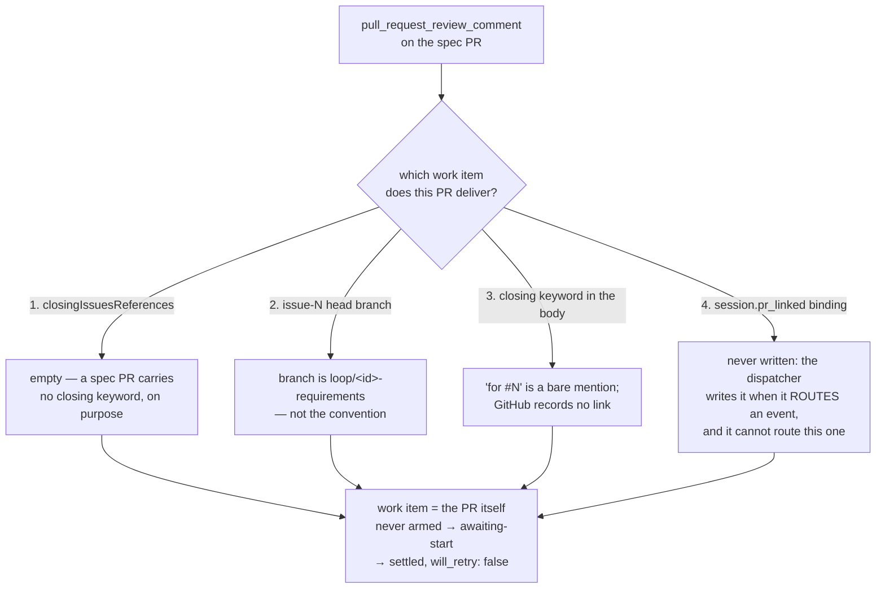

# Bugfix spec: the-loop opens a pull request and tells nobody it opened it

> Phase 1 of 3 for a bug (bugfix → design → tasks). This phase MUST be reviewed and
> approved before the design is derived from it.

## Summary

A review comment on a spec pull request **the-loop's own session opened** never reaches
that session. The router has four ways to answer "which work item does this pull request
deliver?", and the-loop's own spec PR satisfies none of them — so the comment resolves to
the pull request as a standalone work item nobody armed, and is refused with
`awaiting-start`. Since [#270](https://github.com/MadaraUchiha-314/the-loop/issues/270)
that refusal is *settled*, so the comment is baselined and never re-evaluated: repairing
the linkage afterwards recovers nothing.

The phase gate the-loop itself asks for — *"please review the requirements on the spec PR;
comments there route back to this session"* — is therefore a dead letter. The reviewer
answers where they were told to, and the loop never answers back.

Ticket: [#274](https://github.com/MadaraUchiha-314/the-loop/issues/274). The ticket
proposes three fixes; the owner chose
[fix 1](https://github.com/MadaraUchiha-314/the-loop/issues/274#issuecomment-5352537110)
— *author linkable pull requests* — and that is what this spec covers. Fixes 2 (teach the
router the `loop/…` branch convention) and 3 (make suppressions retryable) are out of
scope, deliberately, and are recorded as such below.

## Steps to reproduce

A GitHub-ticketed work item, the poll ingress, `routing.control.enabled: true` (default):

1. Arm work item `#N` (`the-loop start`) and let its session run far enough to open the
   Phase-1 spec pull request: branch `loop/<id>-requirements`, body *"Spec PR — Phase 1
   (requirements) for #N"*, **no** closing keyword (a spec PR must not close the ticket).
2. As an authorized human, leave a review comment (a `discussion_r…` thread) on that pull
   request, exactly as the-loop's own gate comment instructed.
3. `the-loop poll --once`.

## Expected vs actual

| | Expected | Actual |
|---|---|---|
| the router's answer | `#N` — the work item the PR delivers | `#<pr>` — the pull request, as a work item of its own |
| the dispatch | delivered into `#N`'s existing session | `dispatch.dropped`, `reason: awaiting-start` |
| the ledger | the comment is delivered | `poll.comment_settled`, `outcome: awaiting-start`, `will_retry: false` — baselined forever |
| after the operator repairs the linkage | the withheld comment arrives | nothing; the comment id is in `seenComments` and is never evaluated again |

```json
{"event": "dispatch.dropped", "reason": "awaiting-start",
 "work_items": ["github://<owner>/<repo>#<pr>"],
 "gh_event": "pull_request_review_comment"}
{"event": "poll.comment_settled", "outcome": "awaiting-start", "will_retry": false}
```

## Root cause (confirmed)

**The component that writes the pull request and the component that routes events for it
disagree about what a linked pull request looks like — and the one component that
*knows* the answer never writes it down.**

`linked_work_item_sources` (`cli/the_loop/webhook/router.py`) offers three inference
sources, most authoritative first, and `SessionRegistry.record_owning` offers a fourth,
durable one. The-loop's own spec PR misses all four:



Source 4 is the circular one, and it is the fix. `Dispatcher._record_pr_binding` writes
the binding *"at the two moments a routing decision is actually made"* — an event
delivered into an existing session, and a session spawned for a linked issue. Both
require the linkage to already be derivable. For a pull request the-loop authored itself
there is a third, earlier moment nobody uses: **the moment the-loop opened it.** At that
moment the session holds the fact directly — it is in the session's own execution log and
in the gate comment it posts on the ticket — and there is no surface on which to record
it. `SessionRegistry.link_pull_request` exists and is exactly the right write; nothing
outside the dispatcher can reach it.

Two consequences follow from the same gap, and both are the ticket's:

- the ticket's defect 2 ("no durable `session.pr_linked` fallback was written") is this
  missing surface, not a bug in the store;
- the ticket's defect 3 (a suppression settled irrevocably) only *bites* because defect 2
  let a deliverable comment reach the suppression path at all. Fixing the authoring step
  means the comment is never suppressed in the first place, which is why the owner chose
  fix 1 and why fix 3 stays a separate judgement.

## Requirements

### Requirement 1 — a session can record the pull requests it opens

The-loop's own sessions must stop depending on inference for pull requests they authored.
There is exactly one thing missing: a way to say *"this pull request delivers this work
item"* from the session that just opened it, reaching the same durable binding the
dispatcher writes.

#### Acceptance criteria (EARS)

1. The system SHALL expose an operation that records a pull request as delivering a work
   item, on **every** surface the other session-registry operations are reachable from —
   the CLI, the control-plane HTTP API and the MCP tool set — implemented once in
   `the_loop.core.sessions` as R2.2 requires.
2. WHEN the operation is invoked with a work item that has a session record and a pull
   request not yet listed on it THEN the system SHALL add the pull request as an endpoint
   of that record, SHALL emit `session.pr_linked`, and SHALL report success.
3. WHEN the operation is invoked twice for the same pair THEN the second invocation SHALL
   change nothing on disk, SHALL NOT emit a second `session.pr_linked`, and SHALL report
   success — an authoring step that is re-run (a retried command, a resumed session) is
   not an error.
4. WHEN the named work item has no session record on this machine THEN the system SHALL
   report that, with exit code 1, and SHALL write nothing. Recording an endpoint for a
   record that does not exist would invent a work item.
5. WHEN the pull request and the work item are the same ref THEN the system SHALL refuse
   with the caller-mistake exit code (2): a work item does not deliver itself.
6. WHEN the pull request is given as a bare number THEN it SHALL be resolved in the work
   item's own repository and host; WHEN it is given as a full ref THEN that ref SHALL be
   used unchanged, so a pull request in **another** repository (the multi-repo shape,
   issue-183) can be linked.
7. WHEN either ref is malformed, or the pull-request number is not a positive integer,
   THEN the system SHALL refuse with exit code 2 and write nothing.

### Requirement 2 — the workflow uses it, at the moment the pull request is opened

An operation nothing calls fixes nothing. The rule must land where the agent opening the
pull request reads it, in the same breath as the two rules it already follows there
(label every PR, list every PR in the execution log).

#### Acceptance criteria (EARS)

1. The bundled skill's automation reference SHALL state that every pull request a session
   opens for a work item is recorded against that work item **in the same step as
   opening it**, SHALL give the command, and SHALL say why inference is not enough for a
   PR the-loop authored (a spec PR carries no closing keyword, and `loop/…` is not the
   `issue-N` branch convention).
2. The two commands that open pull requests for a work item (`work-on`, `execute-tasks`)
   and the execution-log template's **Pull requests** section SHALL carry the same rule,
   beside the labelling rule they already carry.
3. The rule SHALL be stated as best-effort in the same sense registration already is: a
   failure to record the binding SHALL NOT block the session's own work.
4. The capability documentation for webhook/poll routing SHALL document the binding as a
   linkage source the-loop **writes** rather than infers, with the provenance row every
   other behaviour there carries.

### Requirement 3 — a regression test per layer

1. The fix SHALL include tests that fail before it and pass after it, covering every
   acceptance criterion in R1: the happy path and its event, idempotence, the missing
   record, the self-link refusal, bare-number and cross-repository resolution, and
   malformed input.
2. The reproduction in this document SHALL be covered end-to-end by an integration test
   carrying a Gherkin docstring (`testing.gherkinDocstrings: required`): a review comment
   on a the-loop-authored spec pull request — no closing reference, no `issue-N` branch,
   no closing keyword — SHALL be delivered into the work item's existing session once the
   authoring step has recorded the binding, and SHALL be dropped as `awaiting-start`
   without it.

## Security considerations

**No new trust boundary. The new operation writes one entry the dispatcher already
writes, through the same store method, and it can only ever be reached by someone who
already controls the machine or holds an API credential.**

| Boundary | Where | How it fails closed |
|---|---|---|
| Untrusted payload → the binding | there is none | the operation's inputs are two refs supplied by the **operator or the local session**, never by a webhook payload; the dispatcher's payload-derived path (`_record_pr_binding`) is unchanged |
| Ref → filesystem | `WorkItemRef.parse` + `slug` | both refs are parsed before anything is touched; a malformed ref is refused (R1.7) and `slug` is the same sanitised form the registry has always used for file names |
| Linking a work item you do not own | `find_by_work_item(work_item)` | the write is scoped to an **existing local session record**; no record, no write (R1.4). The operation cannot create a record, cannot arm a work item, and cannot start a session |
| Widening event delivery | the endpoint it adds | the entry states which pull request's events reach a record that is **already live and already armed**. It cannot arm anything; `routing.control` still gates every delivery, and the authorization check on control keywords is untouched |
| HTTP surface | `POST /api/v1/sessions/link-pr` | same authentication, CORS and error mapping as the sibling `register`/`close` routes; it takes two refs and no filesystem path, matching the deliberate rule that arbitrary paths are not accepted over HTTP |

The abuse case worth stating: an attacker who can call this operation can point a pull
request's events at a session they do not own. They can already do strictly more than
that — the operation requires local shell access or an API credential, either of which
also reaches `sessions start`, `sessions stop` and `sessions register --force`. The
operation adds no reachability that those do not already grant, and unlike them it
performs no remote action and destroys nothing.

## Out of scope

- **Fix 2 — teaching the router the `loop/<id>-…` branch convention.** The owner chose
  fix 1. Inferring from a branch name is what issue-269 had to add an existence check
  for; a durable binding written by the component that knows the answer is strictly
  better evidence, and adding a second inference source would leave two places to be
  wrong.
- **Fix 3 — making `awaiting-start` / `session-paused` settles retryable.** A real
  defect, and independent: it is about a *suppression* being permanent, not about
  linkage. Fixing the authoring step means the comment in this reproduction is never
  suppressed, so this bug is closed without it. It belongs to the judgement issue-270
  deliberately left open.
- **Linking the issue in GitHub's Development panel with a non-closing reference.** The
  ticket offers it as an alternative half of fix 1. GitHub exposes no API for a
  non-closing Development-panel link — `closingIssuesReferences` is populated by closing
  keywords or by the web UI — so it cannot be automated, and a closing keyword on a spec
  PR would close the ticket at Phase 1.
- **The companion bug** (the phase-selection gate never running / `no-spec-dir`), which
  the ticket names as the reason the graph never froze the pull request as an endpoint.
  Separate ticket, separate cause.

## Open questions

None. The one product decision — which of the ticket's three fixes to take — was answered
on the ticket.
