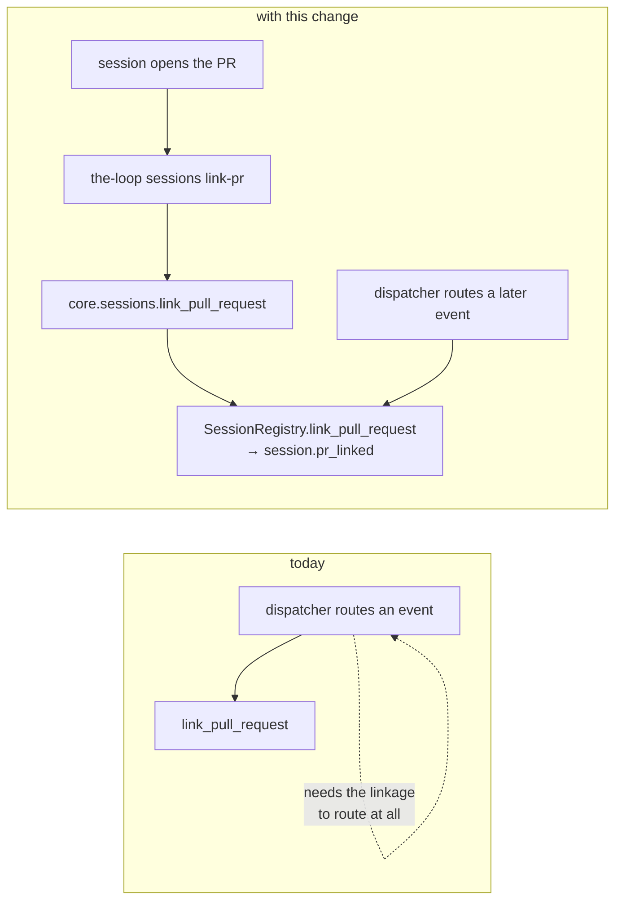

# Design: the session that opens a pull request is the one that records it

> Phase 2 of 3 (bugfix → design → tasks). Derives from the approved `bugfix.md`. MUST be
> reviewed and approved before the tasks breakdown.

## Overview

**One new core operation, exposed on the three surfaces that already carry the session
registry, plus the workflow rule that calls it.** Nothing in the router changes, nothing
in the dispatcher changes, and no new inference is added: the binding the router already
prefers is simply written at the one moment it is known for free.

`SessionRegistry.link_pull_request` is the right write and has been since issue-172. It
is reachable from exactly one caller — `Dispatcher._record_pr_binding`, which runs when a
routing decision is made and therefore only after the linkage is *already* derivable. The
fix adds the earlier caller: the session that opened the pull request.



## Architecture

The operation lands where every other session verb lands, and the layering rule
(`docs/specs/issue-161/design.md` §2: core owns the logic, surfaces render it) decides
the shape without further judgement.

```mermaid
flowchart TB
  CLI["the-loop sessions link-pr<br/>--work-item REF --pull-request REF|N"] -->|routed()| API
  MCP["MCP tool link_pull_request"] --> CORE
  API["POST /api/v1/sessions/link-pr<br/>operationId linkSessionPullRequest"] --> CORE
  CLI -.->|"THE_LOOP_SERVICE_LOCAL=1<br/>(the test seam)"| CORE
  CORE["core.sessions.link_pull_request()"] --> REG["SessionRegistry.link_pull_request()"]
  REG --> REC[("local/<slug>.json<br/>pullRequests[]")]
  REG --> EV["eventlog: session.pr_linked"]
```

The CLI goes through `routed()` like its siblings, so the write lands in the state the
**service** is configured with — which is the state the daemon routes from, and therefore
the only state where writing the binding accomplishes anything.

## Components & interfaces

### A — `core.sessions.link_pull_request` (the whole of the logic)

```python
def link_pull_request(
    ref: str,
    pull_request: str,
    config: Optional[dict] = None,
    registry_dir: str = "",
) -> Dict[str, Any]:
    """Record that ``pull_request`` delivers ``ref``'s work item (issue-274)."""
```

Order of operations, each step answering one acceptance criterion:

| Step | Rule | Failure |
|---|---|---|
| 1 | `WorkItemRef.parse(ref)` | `ValueError` → exit 2 (R1.7) |
| 2 | resolve `pull_request`: a bare `\d+` (or `#\d+`) becomes `replace(work_item, number=n)`; anything else is parsed as a full ref | `ValueError` → exit 2 (R1.6, R1.7) |
| 3 | refuse `pr.ref == work_item.ref` | `ValueError` → exit 2 (R1.5) |
| 4 | `registry.find_by_work_item(work_item)` — no record → message + `exitCode: 1`, nothing written (R1.4) | not an exception: "no session recorded" is exit 1 everywhere in this module |
| 5 | `registry.link_pull_request(work_item, pr)` | returns the endpoint, or `None` when already listed |
| 6 | render: linked → *"recorded … as delivering …"*; already listed → *"… is already recorded …"* | still `exitCode: 0` either way (R1.3) |

`ValueError` is the module's established "caller mistake": the CLI maps it to exit 2 and
the API to a 400, so all three surfaces agree without any per-surface code. The bare
`None` from the store already means *"nothing to do"* — idempotence is a property of the
store (issue-172), and this design does not re-implement it.

Two refs, one `replace`: a bare number is deliberately resolved against the **work
item's** owner/repo/host rather than the local checkout's, so the multi-repo shape
(issue-183) is served by passing the full ref and nothing has to guess.

### B — the surfaces

- **CLI** (`commands/sessions_cmd.py`): a `link-pr` action beside `register`, with
  `--work-item`, `--pull-request`, `--registry-dir`, `--portable-dir`; the body is the
  same six lines every routed verb has (`routed(remote, local)` → `_render`, exceptions
  through `_report`).
- **HTTP** (`api/routes.py`): `SessionLinkPrBody {ref, pullRequest}` and
  `POST /api/v1/sessions/link-pr`, `operationId: linkSessionPullRequest`. The authored
  contract `docs/api-specs/openapi/the-loop.v1.yaml` gains the same path and schema —
  the contract is the source of truth and the parity test compares them (issue-161 R3.2).
- **MCP** (`api/mcp.py`): a `link_pull_request` tool, one delegating line, registered in
  the tool list. It belongs there for the same reason `register_session` does: an agent
  is the caller this operation exists for.
- **SDK** (`sdk/client.py`): `sessions.link_pr`. Not in R1's list, added during
  implementation for one reason — the namespace mirrors core's session operations one for
  one, so leaving this one out is exactly the drift `test_sdk_docs_parity` exists to
  catch. Four lines and a documentation row.

### C — the workflow rule (R2)

The rule is *"record every PR you open, in the same step as opening it"*, and it goes
beside the rule it is the twin of — *"label every PR you open"* — in all four places that
rule already appears:

| File | What it gains |
|---|---|
| `skills/the-loop/reference/automation.md` | the command, in the "session registration is a workflow step" block, plus why inference is not enough for a PR the-loop authored |
| `commands/work-on.md` | one line in the "a work item may be delivered by several PRs" bullet |
| `commands/execute-tasks.md` | one line in the "stay monitorable" paragraph |
| `skills/the-loop/templates/execution-log.md` | one clause in the **Pull requests** note |
| `docs/capabilities/webhook-triggers.md` | the binding as a linkage source the-loop **writes**, with its history row |

Stated as best-effort, exactly as registration is: a failed `link-pr` is reported and the
session carries on. The binding is how events *find* the session; it is not a
precondition for doing the work.

## Data models

None added. The endpoint written is the `Session` the registry has held in
`pullRequests[]` since issue-172 — no tmux target, no conversation id, spawned on first
need — and `session.pr_linked` keeps its documented shape (`work_item`,
`pull_request`). The event catalogue entry gains one sentence naming the new writer.

## Error handling

| Condition | Exit | Wire | Message |
|---|---|---|---|
| malformed `--work-item` / `--pull-request` | 2 | 400 | the parser's own sentence |
| a work item linked to itself | 2 | 400 | *"a work item does not deliver itself"* |
| no session record for the work item | 1 | 404-equivalent (`exitCode: 1` in the body, as `close` does) | *"no session recorded for …"* |
| already linked | 0 | 200 | *"… is already recorded as delivering …"* |
| the registry write fails (`OSError`) | propagates | 500 | unchanged from every other registry write |

`close_session` is the precedent for the "not found" row: it returns `exitCode: 1` in the
body rather than raising, and the CLI renders it. This follows it exactly so the two read
alike.

## Security design

Restated from `bugfix.md` § *Security considerations*, with the design detail:

- **No payload reaches this code.** The dispatcher's payload-derived binding path is
  untouched. The new operation's two inputs come from an operator's shell or an
  authenticated API client.
- **Parse before touch.** Both refs are `WorkItemRef.parse`d before the registry is
  opened; the file name is `slug`, the same sanitised derivation already in use.
- **No creation, no arming.** Step 4 refuses when no record exists, so the operation
  cannot bring a work item into being. It writes an endpoint on a record that is already
  live and already armed; `routing.control` still gates every delivery.
- **No remote action.** Unlike the control verbs it sits beside, this posts no comment
  and starts no process.
- **Not destructive.** The store only ever appends an endpoint; there is no unlink verb
  in this change, so a mistaken link is corrected with `sessions reset`, which already
  exists and is already documented as the remover.

## Testing strategy

Per layer, per criterion — the shape `testing-plan.md` expands:

- **Unit (`test_core_sessions.py`)**: the happy path and its `session.pr_linked`,
  idempotence (no second event, no rewrite), the missing record (exit 1, nothing
  written), self-link (exit 2), bare-number resolution, `#N` resolution,
  cross-repository full-ref resolution, malformed refs.
- **CLI (`test_cli.py` / the sessions command tests)**: `link-pr` parses, routes through
  `routed()`, and renders core's messages and exit code unchanged.
- **Contract (`test_api_contract_parity.py`)**: passes only when the authored YAML and the
  served schema both carry `linkSessionPullRequest` — the existing test, doing its job.
- **Integration (Gherkin docstring, R3.2)**: the reproduction end to end — a
  `pull_request_review_comment` on a pull request with no closing reference, a
  `loop/<id>-requirements` branch and a body that only mentions the issue is **dropped**
  as `awaiting-start` without the binding, and **delivered into the work item's existing
  session** with it.
- **Docs parity (`test_docs_parity.py`, `test_harness_usage.py`)**: unchanged tests that
  fail if the new action is undocumented or the skill and its docs drift.

## Trade-offs & decisions

- **A new verb, not a flag on `register`.** The two facts are recorded at different
  moments: registration happens when the session starts, and the pull request does not
  exist yet. Overloading `register` would mean re-registering to link, which the
  one-active-session invariant makes awkward and `--force` makes dangerous.
- **The agent calls it; nothing detects it.** The alternative — watching for PRs the-loop
  authored and inferring the binding — is fix 2 wearing a different hat, and inherits the
  same problem: inference. The authoring session holds the fact with certainty, so it is
  the right writer. The cost is honest: an agent that skips the step gets today's
  behaviour, which is why R2 puts the rule in four places and the capability doc says
  what happens without it.
- **No `unlink`.** Nothing in the reproduction needs one, and `sessions reset` already
  removes the record. Adding a remover to fix a bug about a missing writer is scope this
  change has not earned.
- **Bare number allowed.** `--pull-request 275` is what an agent that just ran
  `gh pr create` has to hand. Requiring the full ref would add a formatting step whose
  only failure mode is a wrong repository — the thing the bare form cannot get wrong.

## Open questions

None.

## Review comments

*(Populated during review; findings recorded per `reference/reviewing.md`.)*
