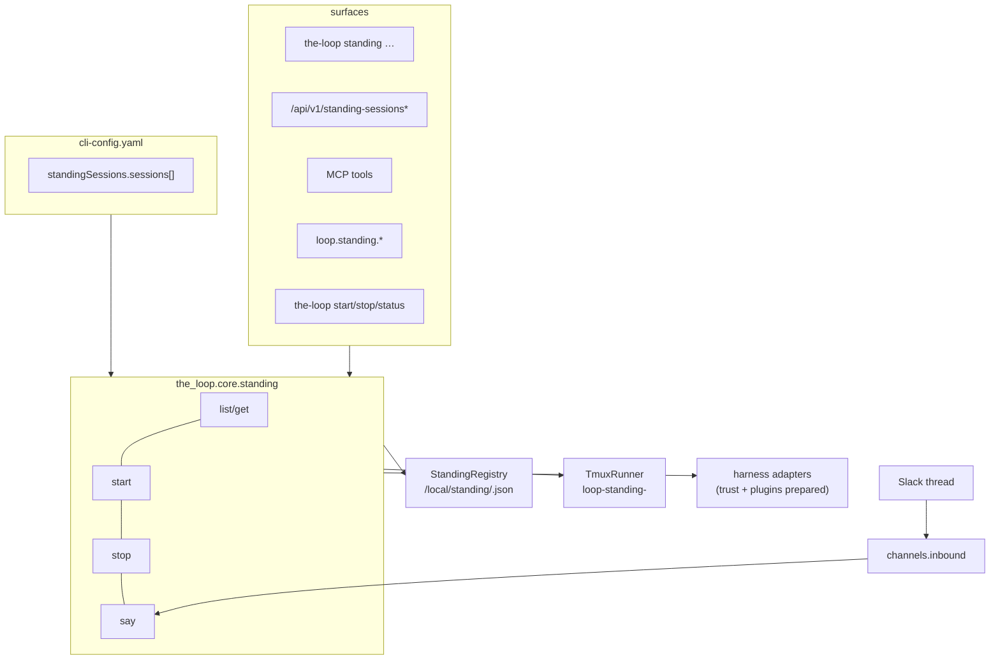
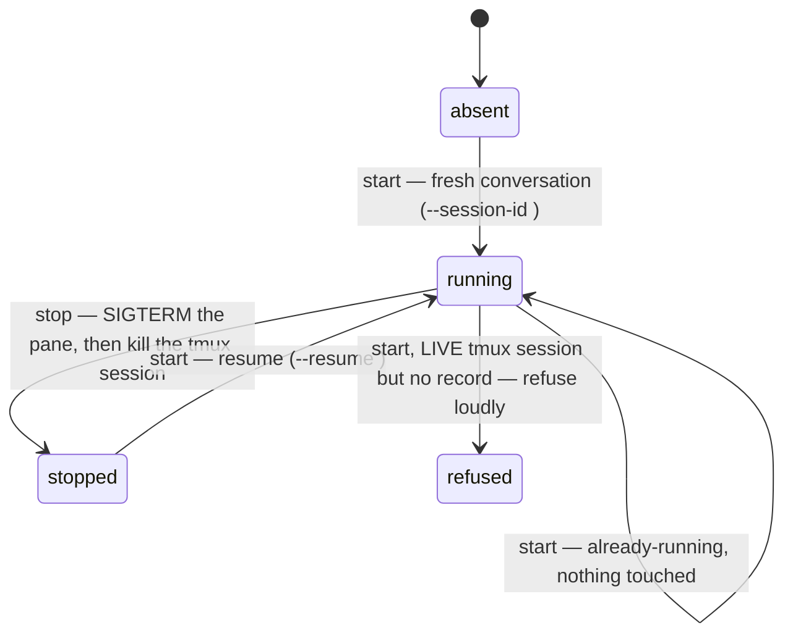
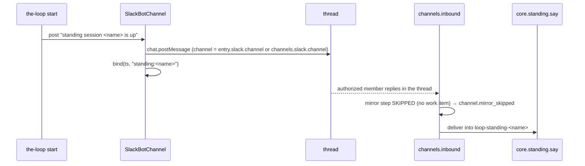

# Design: a second kind of session, in its own namespace

> Phase 2 of 4 (requirements → design → testing plan → tasks). Derives from the approved
> `requirements.md`. MUST be reviewed and approved before the testing plan and the tasks
> breakdown are derived from it.

## Overview

**A standing session is a new namespace, not a work item with a fake ref.** It gets its
own declaration (`standingSessions` in the CLI config), its own record store
(`<root>/local/standing/<name>.json`), its own tmux name (`loop-standing-<name>`), its own
core module and its own verbs. The two things it shares with a work item's session are the
two that are genuinely the same job: the **tmux runner** and the **harness adapters**, both
of which are refactored to be addressed by *target* rather than by work item.

Everything else stays where it is. The router, the dispatcher, the poller, the session
registry and every work-item verb are untouched — which is the point of the separation
(R3.1, R3.2): a GitHub event has no path into a standing session, and a standing session
has no path onto a ticket.



## Design decisions

### D1 — A separate registry, not a widened `WorkItemRef`

`WorkItemRef` is `provider:[host/]owner/repo#number`, and every one of its consumers —
the router's linkage resolution, the poll ledger, the browser URL, the registry file name
— assumes that shape means *a ticket exists*. Teaching it a non-ticket form would put a
value that has no owner, no repo and no number through code whose whole job is to decide
which ticket an event belongs to. So standing sessions get `StandingRegistry`, a
file-per-name store with the same atomic-write discipline as `SessionRegistry` and none
of its shared identity.

The cost is a second store. The benefit is R3.2 for free: `the-loop sessions list` cannot
show a standing session because it never reads that directory, and no event can be routed
into one because the router resolves refs, not names.

### D2 — The runner learns targets; the work-item methods delegate

`TmuxRunner.spawn`, `deliver`, `kill` and `terminate_harness` each take a work item or a
`Session` for exactly one reason: to get a tmux target string out of it. Each is split:

| today | becomes | work-item entry point |
|---|---|---|
| `spawn(work_item, …)` | `spawn_in(target, …)` | `spawn` → `spawn_in(self.target_for(item), …)` |
| `deliver(session, …)` | `deliver_to(target, …)` | `deliver` keeps its ref-specific refusals, then delegates |
| `kill(session)` | `kill_target(target)` | `kill` → `kill_target(session.tmux_target)` |
| `terminate_harness(session, …)` | `terminate_harness_in(target, label, …)` | `terminate_harness` → passes `session.work_item.ref` as the label |

`label` exists only so the refusal log line ("refusing to terminate processes in tmux
target X for Y") keeps naming *what* the target belonged to. No behaviour changes on the
work-item side; every existing test of these methods must keep passing untouched, which is
the check that the refactor is a refactor.

### D3 — `loop-standing-<name>`, and why it cannot collide

`WorkItemRef.slug` is `<provider>-<path…>-<number>`, so every work-item target ends in
`-<digits>`; `name` is `^[a-z0-9][a-z0-9-]{0,39}$`, and a name ending in digits still
produces `loop-standing-foo1` while the only work item that could reach that string would
need provider `standing`, which does not exist. The name is inside `_LOOP_TARGET_RE`
(`^loop-[A-Za-z0-9_-]+$`), so the guard that stops the-loop signalling processes in a
tmux session it did not create keeps working unchanged, and `tmux_session_name` is a no-op
on it (no `.`, no `:`) — the issue-154 rewrite has nothing to rewrite.

### D4 — Start resumes; stop keeps the record

A supervisor session that forgets everything on `the-loop restart` is not a supervisor. So
the record outlives the process:



`stop` terminates the harness **gracefully first** (`terminate_harness_in`: SIGTERM, then
SIGKILL after `routing.tmux.harnessKillGraceSeconds`) and only then kills the tmux
session. The order is load-bearing for the resume in D4: Claude Code flushes its
conversation on exit, and a `kill-session` straight to SIGHUP is how a resumable id
becomes an unresumable one.

The resume is probed the way the respawn path probes it (`survived`,
`routing.tmux.resumeProbeSeconds`): `claude --resume <unknown-id>` exits in well under a
second, so a resume that did not take falls back to a fresh conversation instead of
registering a corpse.

### D5 — One health answer

`the-loop start`, `stop` and `status` each grow a `standingSessions` list beside their
`services` list, and standing sessions **count toward `ok`**. A session that `start` would
have started (`standingSessions.enabled` and the entry's `autoStart`) and that is not
running makes `the-loop status` exit non-zero, because that is what an operator scripting
a health check means by "is the-loop up". A session that is declared but not `autoStart`,
or one that is only in the registry because it was started by hand, is reported and does
not affect `ok`.

The `services` list keeps its exact current shape — nothing that reads it today has to
change.

### D6 — Slack: the announcement message *is* the session's chat thread

The existing Slack bot already does exactly what a standing session needs, keyed on a
string it treats as opaque: `ChannelState.bind(ts, work_item, channel)` binds a thread,
and `fetch_replies` reads back only bound threads. So a standing session's Slack surface
is one announcement post, bound under the ref string **`standing:<name>`**:



Two branches are added to the inbound pipeline, both keyed on
`standing.parse_standing_ref(reply.work_item)`:

1. `_mirror` returns early for a standing target and emits `channel.mirror_skipped` with
   `reason="standing-session"`. The paper trail does not vanish — the event log is where
   a session with no ticket keeps it.
2. `_deliver` calls `core.standing.say` instead of `core.sessions.reply_session`.

Everything before those two — the bot drop, the authorization allow-list, the cursor
advance — is untouched and applies unchanged (R4.4). The bot still cannot read the channel
at large: it reads bound threads only, and the only thread it binds for a standing session
is the one it posted itself.

`slack.channel` per entry, empty meaning `channels.slack.channel`, is implemented as
`dataclasses.replace(SlackChannelConfig.from_mapping(cfg), channel=entry.slack.channel)`
— no second parser, and every other Slack setting (tokens, verbosity, allow-list, read
mode) stays centrally declared, which is the "link to an existing one" half of the
ticket's ask.

### D7 — The directive is not configurable

A standing session's boot prompt is `_DIRECTIVE` (in code) followed by the operator's own
`prompt`/`promptFile` text. There is deliberately no `promptTemplate` key: the directive
states the boundary R5.1 requires — you own no work item, do not answer a phase gate, do
not post a control keyword on any ticket — and a template key would exist only to let an
operator delete it. This is the same reasoning `$interaction_directive` already follows
for work-item prompts, where a custom template that omits the placeholder gets the
directive appended anyway.

## Components and interfaces

### `the_loop/standing.py` — declaration, ref grammar, record store

```python
STANDING_PREFIX = "standing:"
NAME_RE = re.compile(r"^[a-z0-9][a-z0-9-]{0,39}$")

def standing_ref(name: str) -> str                      # "standing:<name>"
def parse_standing_ref(ref: str) -> Optional[str]       # name, or None if not one
def tmux_target_for(name: str) -> str                   # "loop-standing-<name>"

@dataclass(frozen=True)
class SlackBinding:      enabled: bool; channel: str
@dataclass(frozen=True)
class StandingSession:   name, description, harness, harness_args, cwd, prompt,
                         prompt_file, auto_start, slack
@dataclass(frozen=True)
class StandingConfig:
    enabled: bool
    sessions: Tuple[StandingSession, ...]
    @classmethod
    def from_mapping(cls, cli_config) -> "StandingConfig"   # ValueError on a bad block
    def get(self, name) -> Optional[StandingSession]

@dataclass
class StandingRecord:    name, harness, harness_session_id, cwd, tmux_target,
                         status ("running" | "stopped"), created_at, started_at,
                         last_message_at, slack_thread, slack_channel

class StandingRegistry:  read(name) / write(record) / delete(name) / list()
```

`StandingConfig.from_mapping` **raises** — it is the one place that can refuse a whole
block, and R1.1/R1.3/R1.5 all say refuse rather than resolve. Every verb lets it raise,
with one deliberate exception: **`stop`**, which parses tolerantly because it is the
*recovery* verb. `stop` works off the registry rather than the declaration, and an
operator whose config broke after a start still has to be able to stop what is running.
The lifecycle catches the raise and renders it as a single `misconfigured` row, exactly as
it does for an enabled poller with no sources.

### `the_loop/core/standing.py` — the capability

| function | returns | refusals |
|---|---|---|
| `list_standing(config)` | one row per declared **or** recorded session, merged by name | `ValueError` on a malformed block — a read that answers "none" for a config with a typo in it is a wrong answer that looks like a fact |
| `get_standing(name, config)` | that row | the above, plus `LookupError` when neither declared nor recorded |
| `start_standing(name="", config=…, auto_only=False)` | `{"sessions": [row…], "ok": bool}` | `ValueError` on a malformed block, `LookupError` on an undeclared name; a single session that fails to start is a per-session `outcome: failed` with a detail, never an exception |
| `stop_standing(name="", config=…)` | same shape | — (the tolerant parse; see above) |
| `restart_standing(name, config)` | same shape | `LookupError` on an unknown name |
| `say_standing(name, text, actor, config)` | `{"name", "delivered", "exitCode", "messages"}` | `LookupError` (unknown / not running), `ValueError` (empty text) |

`start_standing("")` starts every declared session; with `auto_only=True` it starts only
the `autoStart` ones, which is what the lifecycle calls. `stop_standing("")` stops every
**recorded** one — R2.6's "regardless of `enabled`" falls out of reading the registry
rather than the config.

Row shape, one per session, used by all three verbs and by `status`:

```json
{"name": "supervisor", "declared": true, "autoStart": true, "harness": "claude",
 "tmuxTarget": "loop-standing-supervisor", "cwd": "/home/me/dev",
 "running": true, "status": "running", "harnessSessionId": "…",
 "slackChannel": "C0…", "slackThread": "1712…", "outcome": "started", "detail": "…"}
```

### Lifecycle integration

`core/lifecycle.py` gains three calls and one key:

- `start_all` → after the service/ingress rows, `standing.start_standing(auto_only=True)`
  when `standingSessions.enabled`; its rows land under `report["standingSessions"]` and
  its `ok` is ANDed into the report's.
- `stop_all` → `standing.stop_standing()` **first**, before the ingresses and the service,
  so a session is taken down while the control plane it may be talking to is still up.
- `status_all` → `standing.list_standing()` rows under `report["standingSessions"]`, and
  `ok` is false when a would-be-autostarted session is not running (D5).

### Surfaces

| surface | shape |
|---|---|
| CLI | `the-loop standing list \| start [name] \| stop [name] \| restart <name> \| say <name> --text …` (`--json` on `list`) |
| REST | `GET /api/v1/standing-sessions`, `GET /api/v1/standing-sessions/one?name=`, `POST /api/v1/standing-sessions/control` `{name, verb}`, `POST /api/v1/standing-sessions/say` `{name, text, actor}` |
| MCP | `list_standing_sessions`, `get_standing_session`, `say_to_standing_session` — **`control` is not exposed**: an agent that could stop or restart a standing session could stop the one supervising it, which is the same reasoning that keeps `restart` and `sessions reset` off MCP |
| SDK | `loop.standing.list() / get() / control() / say()` |

The authored OpenAPI contract (`docs/api-specs/openapi/the-loop.v1.yaml`) gains the four
REST operations; `test_api_contract_parity` proves the served app matches it.

## Error handling

| situation | behaviour |
|---|---|
| `standingSessions` malformed | every verb but `stop` raises with the offending key named; `the-loop start` renders it as one `misconfigured` row, and `stop` still works off the registry so what is running stays stoppable |
| duplicate `name` | whole block refused, both positions named |
| `prompt` **and** `promptFile` | that entry refused by name |
| `promptFile` unreadable at start | that session `failed`, others still start (R1.6) |
| `cwd` does not exist | that session `failed`, naming the path — never spawned into a missing directory |
| harness binary missing | `standing.spawn_failed` at `error`, row `failed`, naming the binary |
| `cursor` as the harness | `UnsupportedRunnerError` from the adapter → row `failed` with the adapter's message (cursor has no pre-assignable conversation id; unchanged from work items) |
| **live** tmux session, no record | refused loudly, naming `tmux attach -r -t …` and the remedy (R2.9); `stop` refuses to signal it too — the-loop releases what the-loop started |
| **dead** retained pane | cleared and respawned, with or without a record: nothing is running in it, so the cost is the scrollback |
| tmux does not answer the probe | nothing spawned — silence is not absence (issue-146) |
| resume did not survive the probe | fall back to a fresh conversation; `standing.resume_failed` at `warning`, then `standing.started` |
| Slack post fails | `standing.announce_failed` at `warning`; the session is up regardless (R4.5) |
| `say` into a stopped session | `LookupError` naming `the-loop standing start <name>` (R3.4) |

## Testing strategy

Unit tests around the parser (every refusal), the registry (round-trip, atomicity,
unreadable file), the ref grammar and the runner split (that a work-item spawn still
produces the identical argv). Integration tests, with Gherkin docstrings, for the four
scenarios that are the actual feature: start→resume across a stop, the lifecycle rows,
a Slack thread reply reaching the pane without touching a ticket, and the refusal to
spawn over a live unaccounted-for session. Fully detailed in `testing-plan.md`.

## Security considerations

Design-level enforcement of the requirements' trust boundaries:

- **The config is executable-adjacent.** `harnessArgs` and `cwd` name what runs and where.
  This is the posture `reviews.critics` and `routing.harnessArgs` already carry; the
  config docs say so explicitly, and `standingSessions` is added to nothing that would
  let an agent edit it — `/api/v1/config` is already off the MCP surface for exactly this
  reason.
- **No cross-namespace addressing.** `parse_standing_ref` is the *only* way a
  `standing:` string is recognised, and it is called in two places: the two inbound
  branches. Nothing in the router, the dispatcher or `SessionRegistry` learns the prefix,
  so a crafted ref cannot make a work-item path resolve to a standing session or the
  reverse.
- **Slack authorization is not re-implemented.** The standing branches sit *after* the
  bot-drop and the allow-list check in `process_reply`; there is no second entry point
  into the pipeline.
- **`say` is not a spawn.** It refuses rather than starting a session, so neither the API
  nor a Slack message can bring a harness process into existence — starting one stays an
  operator's act on the control plane or the terminal.
- **The event log is the paper trail** for a session with no ticket: `standing.*` for
  every transition, and `channel.mirror_skipped` where a work item would have had a
  mirrored comment.
