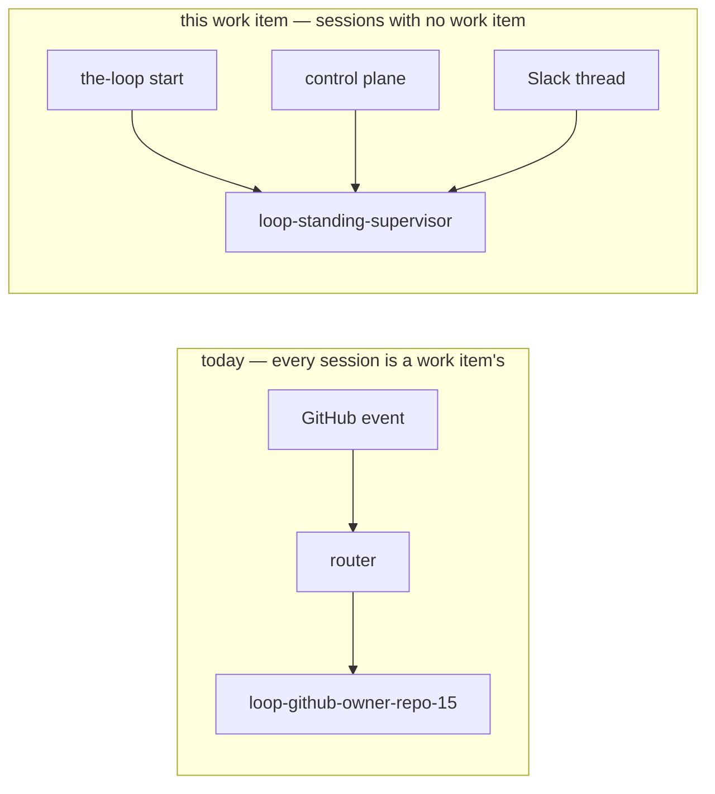

# Requirements: sessions that outlive every work item

> Phase 1 of 4 (requirements → design → testing plan → tasks). This phase MUST be
> reviewed and approved before the design is derived from it.

## Introduction

Everything the-loop spawns today is owned by a work item. `loop-<slug>` is minted from a
`WorkItemRef`, the registry file is named after one, every control verb takes one, and
every question the agent asks goes back to the ticket it came from. That is right for
delivery work and wrong for everything else — and
[#277](https://github.com/MadaraUchiha-314/the-loop/issues/277) names the everything
else: watching the work items *in flight*, noticing one that is stuck, and letting an
operator talk an agent through recovering it. None of that has a ticket, so today it has
nowhere to run.

This work item adds **standing sessions**: named, long-lived tmux + harness sessions
declared in the CLI config, brought up by `the-loop start`, addressed by name rather than
by ref, and talked to on the two surfaces that exist for a session with no ticket — the
control plane and Slack.

**On the name.** The ticket calls them *ad-hoc sessions*. "Ad-hoc" is already taken in
this codebase, by something close enough to be confusing: `pdlc-adhoc-loop` /
`the-loop do` (issue-225) is a **tactical work item that skips the PDLC** — it still has
a ticket, still gets a `loop-<slug>` session, still finishes. What #277 describes is the
opposite: no ticket, no completion, running as long as the-loop does. They are called
**standing** sessions here to keep the two apart, and the ticket's vocabulary is recorded
in [decision-099](../../decisions/decision-099.md).

## Requirements

### Requirement 1 — Declared in the CLI config

**User story:** As an operator, I want to declare the sessions the-loop keeps for itself
in the same file that declares its daemons, so that a new non-work-item use case is a
config entry rather than a code change.

#### Acceptance criteria (EARS)

1. WHEN the CLI config carries a `standingSessions` block THEN the system SHALL validate
   it against `.the-loop/cli-config.schema.json`, and a config that fails validation
   SHALL be refused with the offending key named — never partially applied.
2. WHEN an entry declares `name` THEN the system SHALL require it to match
   `^[a-z0-9][a-z0-9-]{0,39}$`, because the name is interpolated into a tmux target and a
   file name.
3. IF two entries declare the same `name` THEN the system SHALL refuse the whole block
   with both positions named, rather than resolve the collision itself.
4. WHEN an entry omits `harness` THEN the system SHALL use `routing.defaultHarness`; WHEN
   it omits `harnessArgs` THEN it SHALL use `routing.harnessArgs[<harness>]`; WHEN it
   omits `cwd` THEN it SHALL use `routing.spawnWorkdir`.
5. WHEN an entry declares both `prompt` and `promptFile` THEN the system SHALL refuse the
   entry: two sources for one boot prompt has no defined precedence.
6. WHEN an entry declares `promptFile` and the file cannot be read at start time THEN the
   system SHALL refuse to start **that** session, naming the path, and SHALL still start
   the others.

### Requirement 2 — Brought up and taken down with the-loop

**User story:** As an operator, I want `the-loop start` / `stop` / `status` to cover these
sessions too, so that "is the-loop up?" has one answer.

#### Acceptance criteria (EARS)

1. WHEN `the-loop start` runs AND `standingSessions.enabled` is true THEN the system SHALL
   start every entry whose `autoStart` is true, **after** the control-plane service, and
   SHALL report one row per session alongside the service rows.
2. IF `standingSessions.enabled` is false THEN `the-loop start` SHALL start none of them
   and SHALL report the block as disabled.
3. WHEN a session is started AND its tmux session is live THEN the system SHALL leave it
   untouched and report `already-running` — a start SHALL never spawn over a live pane.
4. WHEN a session is started AND a record exists carrying a harness conversation id AND no
   live tmux session holds its name THEN the system SHALL spawn the harness with its
   **resume** argv, continuing that conversation.
5. WHEN a session is started AND no record exists THEN the system SHALL spawn a fresh
   conversation with a pre-assigned session id and write the record.
6. WHEN `the-loop stop` runs THEN the system SHALL stop every **recorded** standing
   session regardless of `enabled` and `autoStart` — a session disabled after it was
   started must still be stoppable.
7. WHEN a standing session is stopped THEN the system SHALL keep its record with
   `status: stopped` and its conversation id intact, so the next start resumes rather
   than forgets.
8. WHEN `the-loop status` runs THEN the system SHALL report each declared or recorded
   standing session with its name, harness, tmux target, running flag and conversation
   id; and `ok` SHALL be false when a session `start` **would have started** (the block
   is enabled and the entry's `autoStart` is true) is not running. A session that is
   declared without `autoStart`, or that is only in the registry because it was started
   by hand, SHALL be reported without affecting `ok`.
9. WHEN a start finds a **live tmux session** holding the name but **no record** THEN the
   system SHALL refuse loudly and name the remedy, exactly as the work-item spawn path
   does — never kill an agent it cannot account for.

### Requirement 3 — Addressable by name, on the control plane

**User story:** As an operator, I want to list, start, stop, restart and talk to these
sessions from the control plane, because they have no ticket to comment on.

#### Acceptance criteria (EARS)

1. WHEN a caller addresses a standing session THEN it SHALL be addressed **by name**, and
   a work-item ref SHALL NOT resolve to one.
2. WHEN `the-loop sessions list` runs THEN standing sessions SHALL NOT appear in it: the
   two registries are separate namespaces, so nothing routes a GitHub event into a
   standing session by accident.
3. WHEN an authorized caller sends text to a running standing session THEN the system
   SHALL bracket-paste it into that session's TUI, submit it, emit `standing.said`, and
   SHALL post the text to no ticket anywhere.
4. IF the addressed session is not running THEN the send SHALL be refused with an error
   naming `the-loop standing start <name>` — a message SHALL never spawn a session.
5. WHEN the control plane exposes these operations THEN the CLI, the REST API, the MCP
   endpoint and the SDK SHALL all reach the same core functions, and the authored OpenAPI
   contract SHALL describe the REST half.

### Requirement 4 — Reachable from Slack

**User story:** As an operator away from my terminal, I want to talk to a standing session
in Slack, so that recovering a stuck work item does not require a shell.

#### Acceptance criteria (EARS)

1. WHEN a standing session with `slack.enabled` starts AND `channels.slack` is enabled
   THEN the system SHALL post an announcement into that session's channel — its own
   `slack.channel`, or `channels.slack.channel` when it declares none — and SHALL bind the
   resulting thread to the session.
2. WHEN an authorized Slack member replies in that thread THEN the reply SHALL be
   delivered into the standing session's pane, and `channel.reply_received` SHALL record
   it against the session.
3. WHEN a Slack reply is addressed to a standing session THEN the system SHALL NOT mirror
   it onto any work item — it has none — and SHALL record `channel.mirror_skipped` with
   the reason.
4. WHEN a Slack reply is unauthorized, bot-authored or unmapped THEN it SHALL be dropped
   exactly as it is today: the existing fail-closed authorization SHALL apply unchanged.
5. IF `channels.slack` is disabled, or the announcement cannot be posted, THEN the session
   SHALL still start — the Slack surface is best-effort and never gates the session.

### Requirement 5 — A session that knows what it is not

**User story:** As an operator, I want a standing session to know it owns no work item, so
that it does not answer a phase gate or run a control keyword on somebody else's ticket.

#### Acceptance criteria (EARS)

1. WHEN a standing session is spawned THEN its boot prompt SHALL state its name, that it
   owns no work item, that it MUST NOT answer a phase-selection gate or post a control
   keyword on any ticket, and which surfaces its operator speaks to it on.
2. WHEN the entry supplies `prompt` or `promptFile` THEN that text SHALL be **appended to**
   the directive above, never substituted for it — the same rule
   `$interaction_directive` follows for work-item prompts.

## Non-functional requirements

- **Observability.** Every transition is an event: `standing.started`, `standing.resumed`,
  `standing.stopped`, `standing.said`, `standing.spawn_failed`, `standing.announced`.
  Nothing about a standing session is inferable only from a logfile.
- **Isolation.** No change to how a work item's event is routed, delivered or respawned.
  The runner gains target-addressed entry points; the work-item paths keep their exact
  behaviour.
- **Idempotence.** `start` and `stop` are idempotent in both directions, as the service
  and daemon verbs already are.

## Security considerations

- **Actors & trust.** Three inputs reach a standing session: the **CLI config** (the
  operator's own file — trusted, and the same trust `reviews.critics` already carries,
  since both name a program the-loop runs), the **control plane** (already governed by
  the exposure guard and the deploying gateway, decision-059) and **Slack** (untrusted
  until it clears `channels.slack.authorizedUsers`, which fails closed on an empty list).
- **What the config can do.** An entry names a harness binary's arguments and a working
  directory, and the session runs with the operator's own credentials. That is the
  existing posture for `routing.harnessArgs` and `reviews.critics`; it is called out in
  the config docs so an operator reviews a `standingSessions` entry like code. `cwd` is
  resolved and must exist — a session is never spawned into a directory that is not there.
- **What it must not do.** A standing session is never armed by a control keyword, never
  addressed by a work-item ref, and never appears in the session registry the router
  reads — so no GitHub event can be delivered into one, and no standing session can be
  mistaken for a work item's.
- **No ticket, so the event log is the trail.** A Slack reply into a standing session is
  not mirrored onto a work item because there is none. The paper-trail rule is not waived:
  it moves to the event log, which is why `channel.mirror_skipped` records the reason
  rather than the pipeline staying silent.
- **Abuse case.** *An authorized Slack member sends a message that reads as an
  instruction to act on an unrelated repository.* The session's boot prompt states the
  boundary (R5.1), the operator's allow-list is the gate, and the harness's own
  permission mode is unchanged by this work item — the-loop does not widen permissions
  here, exactly as it does not in `harnessTrust`.

## Out of scope

- **Reading a Slack channel at large.** The bot still reads only threads it is bound to
  (`fetch_replies`). A standing session gets a thread of its own; it does not get
  permission to read the channel.
- **Spawning standing sessions on lifecycles other than `start`.** The ticket says "on
  start or other lifecycles"; only `start` (and the explicit verbs) exist here. The
  config shape leaves room — `autoStart` is a per-entry boolean, not a global one.
- **A standing session driving the work-item loop for you.** What a supervisor session
  *does* is its prompt's business. This work item gives it somewhere to live and someone
  to talk to.
