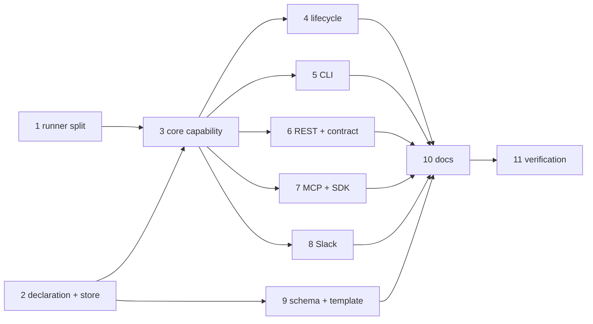

# Tasks: sessions that outlive every work item

> Phase 4 of 4. A DAG, not a list: tasks with no edge between them are independent.
> Each `_Requirements:_` names the acceptance criteria it delivers; each `_Test:_` names
> a row of `testing-plan.md`.

- [x] 1. **Split the tmux runner by target.** `spawn_in`, `deliver_to`, `kill_target`,
      `terminate_harness_in(target, label, …)`; the four work-item methods delegate and
      keep their exact refusals and messages. No behaviour change.
      _Requirements: (design D2)_ · _Test: T1_

- [x] 2. **`the_loop/standing.py`.** The ref grammar (`standing:<name>`, `NAME_RE`,
      `tmux_target_for`), the declaration parser (`StandingConfig.from_mapping`, raising
      on a bad name, a duplicate, or both prompt sources; inheriting harness/args/cwd
      from `routing`), and `StandingRegistry` — file-per-name under
      `<root>/local/standing/`, atomic writes, an unreadable file skipped not fatal.
      Add `StateLayout.standing_dir` + its `GENERATED_PATHS` entry.
      _Requirements: R1.1–R1.5, R2.7_ · _Test: T1_

- [x] 3. **`the_loop/core/standing.py`.** `list_standing`, `get_standing`,
      `start_standing`, `stop_standing`, `restart_standing`, `say_standing`; the boot
      directive and its append rule; adapter construction with trust/plugin preparation;
      the resume probe and its fallback; the refusal to spawn over a live unaccounted-for
      session; every `standing.*` event.
      _Requirements: R2.2–R2.4, R2.6, R2.9, R3.3, R3.4, R5.1, R5.2_ · _Test: T1, T2, T8_

- [x] 4. **Lifecycle.** `start_all` (auto-start after the service), `stop_all` (first,
      before the ingresses), `status_all` (rows + the `ok` rule), and the CLI's rendering
      of the new section in `start`/`stop`/`status`.
      _Requirements: R2.1, R2.5, R2.8_ · _Test: T2_

- [x] 5. **`the-loop standing` command.** `list --json`, `start [name]`, `stop [name]`,
      `restart <name>`, `say <name> --text …`.
      _Requirements: R3.3_ · _Test: T2_

- [x] 6. **REST + authored contract.** The four operations, their request bodies, and the
      matching hand-authored entries in `docs/api-specs/openapi/the-loop.v1.yaml`.
      _Requirements: R3.5_ · _Test: T3_

- [x] 7. **MCP + SDK.** Three MCP tools (no `control`, per design D-surfaces) and the
      `loop.standing` namespace with its reference-doc entries.
      _Requirements: R3.5_ · _Test: T1, T3_

- [x] 8. **Slack.** The announcement post and its thread binding at start; the two
      `parse_standing_ref` branches in `channels/inbound.py` (`_mirror` skip →
      `channel.mirror_skipped`, `_deliver` → `say_standing`); the per-entry channel
      override.
      _Requirements: R4.1–R4.5_ · _Test: T2, T8_

- [x] 9. **Schema + shipped template.** `standingSessions` in
      `.the-loop/cli-config.schema.json`, copied byte-identically into
      `cli/the_loop/schemas/`, and a commented block in
      `skills/the-loop/templates/cli-config.yaml`. Bump the CLI config `version`.
      _Requirements: R1.1_ · _Test: T1, T10_
      **`CURRENT_CONFIG_VERSION` was deliberately NOT bumped**: the block is purely
      additive, so a config without it is valid and behaves exactly as before, and a bump
      would push every existing config through `/the-loop:upgrade-the-loop` for nothing.
      `pattern` had to be implemented in the hand-written validator for the name
      constraint to be enforced at all (see `testing-plan.md` § Verification results).

- [x] 10. **Documentation.** A new capability doc (`docs/capabilities/standing-sessions.md`)
      and its index row; `docs/config/cli/standing-sessions-options.md` with a heading per
      schema leaf; `docs/cli/commands/standing.md` and the command index; the state page's
      classification row and prose; the SDK reference; the `start`/`stop`/`status` command
      pages; `docs/decisions/decision-099.md` and the decisions index; the capability docs
      of the surfaces this touches (`interactive-sessions`, `control-plane`, `channels`,
      `cli`).
      _Requirements: (the ready-to-ship gate)_ · _Test: T1 (docs-parity)_

- [x] 12. **The owner's ruling (decision-100).** Withdraw the control-plane-as-channel
      option and the outbound-verb option; add `create`/`delete`: the `_entry_for` seam so
      a definition can come from the config **or** the registry, the record carrying the
      whole definition, `start_all` restoring created sessions that auto-start, and the
      two verbs on the CLI, REST (with the authored contract) and SDK — but **not** MCP.
      _Requirements: R6.1–R6.7_ · _Test: T1, T2, T8_

- [x] 11. **Verification.** Run every activity in `testing-plan.md`, record the results and
      commit the evidence.
      _Requirements: all_ · _Test: all_
