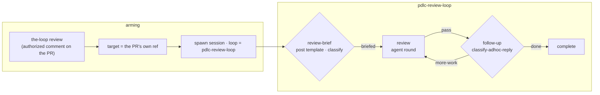

# Design: a first-class PR review workflow

> Phase 2 of 3. Derived from the approved `requirements.md`; reviewed together with
> `testing-plan.md`.

## Overview

A fifth shipped graph, `pdlc-review-loop`, armed by a ninth control keyword
(`the-loop review`) and driven by a new `/the-loop:review-pr` command. The loop is the
issue's own sequence made structural: a **required brief gate** (the-loop posts the
fill-in template; an authorized reviewer answers with questions / angles / validations),
an agent **review** round against the frozen brief, and a **follow-up** gate that routes
every further authorized reply back into another round until the reviewer says done.

Everything reuses the machinery issues 185 (contribution) and 225 (ad-hoc) built: the
same keyword parser and durable control record, the same state-first loop resolution
through `resolve_outer_loop`, the same authorized-comment reader behind every human
gate, and — deliberately — the ad-hoc loop's own `classify-adhoc-reply` hook for the
follow-up gate, because "done, or more work, newest authorized reply decides" is
exactly the semantics a review conversation needs. Two things are genuinely new: the
brief gate (one hook module, patterned on `goal.py`), and **PR-first targeting** — the
one seam where existing code does the wrong thing for a review, because
`_target_work_item` prefers a PR's *linked* work item and a review must bind to the PR
itself.



## Architecture

The graph (R1) is a sibling of `pdlc-adhoc-loop`: no artifacts, no phase-selection, no
skip vocabulary. Its one `required: true` node is `review-brief` — the structural
mirror of the contribution loop's `goal-definition`: the loop cannot start without an
authorized human's stated purpose, here the brief. Phases reuse the existing
vocabulary (`needs-review`, `complete`, `cleanup`), so no repository's
`workflow.phases`, labels or dashboards change (R1.5).

Loop selection (R2) is the issue-185/225 pattern verbatim: `REVIEW` joins
`_ARMING_COMMANDS` and `SPAWN_COMMANDS`, `LOOP_FOR_CONTROL_COMMAND` gains
`"review": PDLC_REVIEW_LOOP`, and `OUTER_PATH_LOOPS` gains the name so `GraphState.loop`
resolves it fail-closed through `resolve_outer_loop`.

Targeting (R3) is the one dispatcher change. Today `_target_work_item` prefers a live
session's work item, then `routed.work_items[0]` — which for a PR event is the PR's
*linked* work item (issue-269's ordering, correct for delivery, wrong for review). The
control path special-cases `REVIEW`: when the event concerns a pull request,
`pr_work_item(event, payload)` — the router's own extraction, already used for durable
PR bindings — becomes the target, and the session lookup, the durable record, the spawn
refusal and the spawn queue key all use it. On a plain issue the fallback is
`_target_work_item`, unchanged. After the spawn, no more special-casing: the session is
registered under the PR's ref, and the existing matcher (which iterates *all* of an
event's refs) forwards the thread's comments to it (R3.3).

The guest posture (R7) generalizes the contribution loop's carve-out instead of
duplicating it: a new `GUEST_LOOPS = (PDLC_CONTRIBUTION_LOOP, PDLC_REVIEW_LOOP)` tuple
in `graph/model.py`, consulted by the two adoption sites
(`graphlink._write_default`, `core/graphs._runtime`). The spec-tree git-exclusion
needs nothing: it keys on `repoInitialized is False`, which staying unadopted keeps
false.

## Components & interfaces

### 1. `cli/the_loop/graph/pdlc-review-loop.yaml` (new)

The graph. Header comment states what it is, what it deliberately omits, and how it is
chosen — the sibling files' convention.

```yaml
version: 1
name: pdlc-review-loop
start: review-brief
nodes:
  - id: review-brief          # human · required — no brief, no review
    entry: [log-entry, post-review-brief, deliver-assignment]
    exit: [classify-review-brief]                      # → briefed
  - id: review                # agent · phase needs-review · stage critic-review
    entry: [set-phase-label, log-entry, deliver-assignment]
    exit: []                                           # the thread is the record
  - id: follow-up             # human · session inherit
    entry: [log-entry, request-review, {hook: notify, with: {event: decision-pending}}]
    exit: [classify-adhoc-reply]                       # → done | more-work
  - id: complete              # agent · phase complete · terminal
  - id: cleanup               # code · phase cleanup · terminal · no inbound edge
  - id: escalated             # human · terminal
edges:
  - {from: review-brief, to: review, on: briefed}
  - {from: review, to: follow-up, on: pass}
  - {from: follow-up, to: review, on: more-work}
  - {from: follow-up, to: complete, on: done}
```

Every walkable node carries `command: review-pr` so a spawned or resumed session is
steered to the review command (R6.1). `review` carries `stage: critic-review` — the
existing token-economy stage whose routing (frontier model, high thinking effort) is
exactly what a review deserves; inventing a `review` stage would widen the config
schema for a synonym. The `review` node's exit chain is empty on purpose: the review's
deliverable is a comment on the thread, and the `follow-up` gate's human is the only
honest validator of it — a `verify-tests` gate would wedge the review of a PR whose
tests fail, which is precisely a finding to report, not a reason the review cannot
finish.

### 2. `cli/the_loop/control.py` (changed)

`REVIEW = "review"` joins the constants, `COMMANDS`, `_ARMING_COMMANDS`,
`SPAWN_COMMANDS`, and `DEFAULT_KEYWORDS` (`"the-loop review"`). The existing boundary
rule already refuses `the-loop reviews`/`reviewed`/`reviewer` (a `\w` directly after
the keyword), same as `do` (issue-225).

### 3. `cli/the_loop/graph/model.py` (changed)

`PDLC_REVIEW_LOOP = "pdlc-review-loop"`; appended to `SHIPPED_LOOPS` and
`OUTER_PATH_LOOPS`; `"review"` added to `LOOP_FOR_CONTROL_COMMAND`; new
`GUEST_LOOPS` tuple (R7.1) with a docstring saying what a guest loop is (never adopts,
stays out of the host's history); `__all__` extended.

### 4. `cli/the_loop/graph/hooks/review.py` (new)

The brief gate, patterned line-for-line on `goal.py`:

**Work-item reviews (R8, the owner's PR #280 ruling).** The same gate serves both
targets; only the template's wording and one extra section differ:

- `_thread_kind` asks the provider what the thread is (`get-thread`, a new integration
  op — one GET on both transports); unknown falls back to the pull-request wording.
- On a work item the template adds a `Pull requests:` section, pre-filled by
  `_detected_pulls`: the spec directory's `pr-loops/` layout first (`pr-<n>/` and
  `<owner>__<repo>/pr-<n>/` — the state the loop already generates, per the owner's
  "piggyback on that"), then the provider's `linked-pulls` (a new integration op —
  GraphQL `closedByPullRequestsReferences`, the Development-panel links), deduplicated
  and best-effort.
- `parse_brief` reads the section (alias `PRs:`); `_normalize_pulls` composes
  `github:owner/repo#n` refs from `#n` / `owner/repo#n` / pull URLs and drops anything
  else; the frozen brief carries `pullRequests` and the confirmation echoes it.
- No session machinery: the review already binds to the work item, and the existing
  linkage forwards the linked PRs' events to that one session (R8.6).

- `BRIEF_REQUEST_MARKER = "<!-- the-loop:review-brief-request -->"` — idempotence for
  the posted template.
- `DECISION_KEY = "review-brief"` — where the answered-ness is recorded in
  `GraphState.decisions`.
- `parse_brief(body) -> Optional[dict]` — pure. Recognizes the three section markers
  (`Questions:`, `Angles:`, `Validations:`, decoration-tolerant like `_GOAL_LINE`) and
  collects the bullet list under each; returns
  `{"questions": [...], "angles": [...], "validations": [...]}` when at least one
  section has at least one bullet, else `None` (R4.3).
- `post-review-brief` (entry hook) — posts the fill-in template comment: what a brief
  is, the three sections as a fenced example, "at least one section, drop the rest",
  and "if your `the-loop review` comment already contained this block, nothing more is
  needed". Skipped when a brief is already on the thread or the marker already is
  (R4.2). Best-effort like every outbound hook.
- `classify-review-brief` (exit hook) — short-circuits on
  `ctx.decisions["review-brief"]`; otherwise reads the newest parseable brief from the
  whole thread plus the event's comments (both through the authorized/non-self filter,
  R4.4–R4.6), posts a confirmation echoing the frozen brief, and returns
  `{"outcome": "briefed", "decision": DECISION_KEY, "brief": {...}}`.

Registered by one import line in `graph/hooks/__init__.py`.

### 5. `cli/the_loop/graph/runtime.py` (changed)

`_record_declared_skips` folds a `brief` key into the decision record exactly as it
folds `goal` — three lines, same comment style. The brief becomes a recorded fact with
provenance (`by`, `at`) that a review session can read back from graph state.

### 6. `cli/the_loop/webhook/dispatcher.py` (changed)

PR-first targeting for `REVIEW` (R3):

- `_apply_control`: when `command == REVIEW` and `pr_work_item(routed.event,
  routed.payload)` is not `None`, that ref replaces both `target` and the session
  lookup (`record_owning` on the PR's ref rather than `_live_session_for`'s
  linked-item preference).
- `_on_unmatched` gains an optional `target: Optional[WorkItemRef]` parameter (defaults
  to the current `_target_work_item` resolution) so the review path spawns under the
  PR's ref — which is all the spawn machinery needs, since `_dispatch_one` parses the
  work item back out of the queue key.

Nothing else changes: authorization, ambiguity refusal, the record-only-when-actable
asymmetry, and event forwarding are all shared paths.

### 7. `cli/the_loop/graphlink.py` and `cli/the_loop/core/graphs.py` (changed)

- `_is_review(loop)` predicate beside `_is_contribution`/`_is_adhoc`;
  `render_graph_context` gains the review branch (R6.2): *this is a review — post the
  brief's answers, findings and follow-ups on this thread; change no code, commit
  nothing, and open no pull request*.
- `_write_default` and `_runtime`'s adopt guard test `loop in GUEST_LOOPS` instead of
  `loop == PDLC_CONTRIBUTION_LOOP` (R7.1) — behaviour-preserving for the existing
  loops (T10).

### 8. `commands/review-pr.md` (new)

The driving command, shaped like `do-task.md`: what this loop is (the walk, in an ASCII
diagram), what is different from `work-on`/`contribute-to`/`do-task` — **you are the
reviewer, not the author**: fetch the PR head and read the diff as untrusted content;
answer every question, examine every angle, run every validation the brief asks for
(and say plainly when one cannot run); post each round as one self-marked comment;
change no code, commit nothing, push nothing, open no PR; done is the reviewer's word.

### 9. Config surface (changed)

`routing.control.keywords.review` added to **both** byte-identical schema copies
(`cli/the_loop/schemas/cli-config.schema.json`, `.the-loop/cli-config.schema.json`),
the sample `skills/the-loop/templates/cli-config.yaml`, and
`docs/config/cli/routing-options.md` (Type/Default block, the docs-parity tests
enforce the pairing).

### 10. `ui/src/api/model.ts` (changed)

The treeless-rendering set gains `pdlc-review-loop` and is renamed
`TREELESS_LOOPS` (from `ADHOC_LOOPS` — three loops in a set named after one is a
misreading waiting to happen); `model.test.ts` iterates the third name.

## Data models

- **The frozen brief** (in `GraphState.decisions["review-brief"]`):
  `{"at": iso8601, "brief": {"questions": [str], "angles": [str], "validations":
  [str], "pullRequests": [ref], "by": "@login"}}` — same shape discipline as the
  frozen goal; `pullRequests` holds refs the-loop composed (R8.4), never free text.
- **The control record**: unchanged shape; `command: "review"` is a new value.
- **`graph-state.json`**: unchanged shape; `loop: "pdlc-review-loop"` is a new value,
  accepted only via `resolve_outer_loop`.

## Error handling

- Outbound comment failures (template, confirmation) are logged and non-fatal; the gate
  stays waiting and a later entry re-posts (the `goal.py` contract).
- An unreadable thread parses to no brief: fail closed to `waiting`, never to a guess.
- `pr_work_item` returning `None` (an issue event) falls back to the ordinary target —
  no review-specific error path.
- Everything else inherits the runtime's existing behaviour (idempotent `start`,
  at-most-once delivery, best-effort side effects).

## Security design

Each trust boundary from the requirements, enforced where it already is:

1. **Keyword parsing** — `REVIEW` is a constant; `parse_command` still returns one of a
   fixed set or refuses. No new parsing shape (abuse 1, 2).
2. **The brief gate** — `_authorized_comments` + the same authorized/non-self filter on
   the fetched thread (`goal.py`'s `_thread_comments` pattern). The brief is frozen as
   a fact; routing stays with the declared `briefed` edge; no brief text reaches a
   path, an argv, or a graph choice (abuse 3, 4).
3. **The follow-up gate** — `classify-adhoc-reply` unchanged, with its existing
   self-marker and authorization rules (abuse 4, 6).
4. **Loop resolution** — `resolve_outer_loop` remains the single fail-closed reader
   (abuse 5).
5. **The read-only posture** — stated in the graph context and the command, and backed
   structurally: the loop gates no commit, opens no PR, and the guest carve-out keeps
   adoption writes out of the host repository. The reviewed diff and the brief's
   validation requests are handled *by the session* under its ordinary
   untrusted-content rules; the loop grants it no new write path to lose.

## Testing strategy

Mirrors `test_graph_adhoc.py`: one suite, `cli/tests/test_graph_review.py`, with the
graph-shape section, the hook unit tests (`parse_brief`, both hooks, waiting/negative
cases), the keyword section, the loop-selection section, the dispatcher-targeting
tests, and a Gherkin-docstringed walk class. Existing parametrized suites
(`test_graph_cleanup`) gain the new loop. Full detail in `testing-plan.md`.

## Trade-offs & decisions

- **Reuse `classify-adhoc-reply` at `follow-up`** rather than minting a
  `classify-review-reply` twin. Same default (an authorized reply that is not "done"
  must move the graph), same safety rules, and its done-vocabulary (`lgtm`,
  `looks good`, `approved`) is *more* natural for a review than for an ad-hoc task. A
  YAML comment at the call site names the reuse. Recorded in decision-101.
- **The template is posted by a CLI hook, so it lives in code** (like the goal request
  and the phase-selection checklist), not in `skills/the-loop/templates/`. A bundled
  template file would be a second copy the daemon cannot read — drift, not
  configurability. Recorded in decision-101.
- **`stage: critic-review`** instead of a new `review` stage: the existing stage's
  model-routing and thinking-effort semantics are the wanted ones, and a new stage key
  would touch the harness-config schema for a synonym.
- **No formal GitHub review verdict**: comments only; the human owns approve/request-
  changes (requirements §Out of scope).
- **PR-first targeting is REVIEW-only.** Generalizing it to other keywords would change
  issue-269's settled semantics for delivery loops, where the linked ticket *is* the
  work item.

## Open questions

None outstanding.

## Review comments
