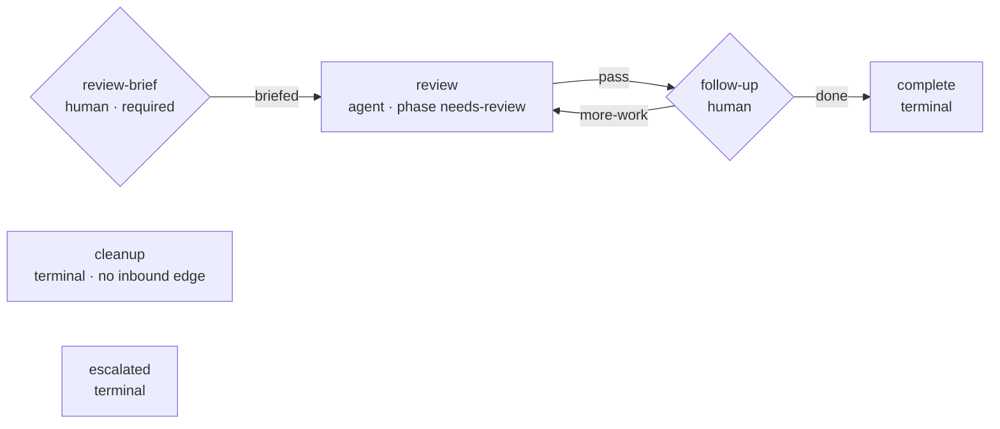

# Requirements: a first-class PR review workflow

> Phase 1 of 3 (requirements → design → tasks). Following the Kiro spec approach
> (https://kiro.dev/docs/specs/). This phase MUST be reviewed and approved by the
> required collaborators before moving to design.

## Introduction

[Issue #279](https://github.com/MadaraUchiha-314/the-loop/issues/279): *"Currently
the-loop is used to develop end to end features, contribute to an existing PR, do ad-hoc
tasks etc. Let's introduce a first class support for PR reviews. An authorized user can
come and add `the-loop review` … the-loop replies on the PR with a particular template
that the reviewer has to fill up … once the reviewer fills up the template … the actual
review process begins. The reviewer can have multiple follow ups, back and forth etc …
Create a new graph for the reviewer workflow."*

None of the four shipped loops fits a review. The outer loop and the ad-hoc loop
*deliver changes*; the contribution loop *joins someone's delivery*; the inner PR loop
is the path a pull request the-loop is **delivering** walks — it has no place for
the-loop as the **reviewer** of a change somebody else made. A review differs from all
four in one structural way: the loop's product is *judgement posted on the thread*, not
a diff — the session must change no code at all.

| | the four shipped loops | a review |
|---|---|---|
| Product | a change (spec chain, commits, PRs) | findings, answers and validations, posted as comments |
| Start condition | an instruction to build/fix something | a **brief**: the reviewer's questions, angles and validations |
| Definition of done | gates/criteria met, or the requester's word | the reviewer's word, after any number of follow-ups |
| Writes to the repository | yes — that is the point | none (state cache aside) |
| Target thread | an issue (the ticket), PRs as delivery | the **pull request under review** itself |

So this work item ships a fifth shipped graph, `pdlc-review-loop`, armed by a new
control keyword (`the-loop review`) and driven by a new command. Its shape follows the
issue's own sequence: ask the reviewer for a brief, review against it, converse until
the reviewer says done.

## Requirements

### Requirement 1 — a fifth shipped loop, sized for a review

**User story:** As a reviewer, I want the-loop to run a review as its own small process
— brief, review, follow-ups — so that a review is a first-class workflow rather than an
ad-hoc task pretending to be one.

#### Acceptance criteria (EARS)

1. The system SHALL ship a fifth process graph, `pdlc-review-loop`, as package data
   beside the other four, compiled and validated by the same runtime, with the same
   hook vocabulary and the same state files.
2. The graph SHALL declare exactly four walkable nodes — `review-brief`, `review`,
   `follow-up`, `complete` — plus the terminal `cleanup` and `escalated` nodes every
   work-item-level loop declares.
3. The graph SHALL declare **no** artifact gate: no node SHALL name `produces`, and no
   `validate-artifacts` entry SHALL appear in any chain — the review's record is the
   thread, not a file.
4. The graph SHALL declare **no** `phase-selection` node (arming with `the-loop review`
   is the named, authorized, durably recorded declaration that this item runs the review
   process and nothing else), and SHALL therefore declare no `skipSets` and mark no node
   `skippable`.
5. The graph SHALL reuse the existing phase vocabulary — `review` carries phase
   `needs-review`, `complete` carries `complete`, `cleanup` carries `cleanup` — so that
   adopting it requires no change to `workflow.phases` in any repository's harness
   config.
6. WHEN a repository supplies its own `pdlc-review-loop.yaml` THEN the system SHALL
   ignore it with a warning, exactly as it does for the other shipped loops.

### Requirement 2 — the mode is declared by an authorized human, never inferred

**User story:** As a repository owner, I want a review to start only on an authorized
user's explicit keyword, so that who invited the reviewer — and when — is always on the
record.

#### Acceptance criteria (EARS)

1. The system SHALL define a ninth control keyword, `review` (default `the-loop review`,
   configurable at `routing.control.keywords.review`), which arms and spawns exactly as
   `start` does — same durable record, same named-actor authorization, same refusal of a
   comment carrying two different commands — and additionally selects `pdlc-review-loop`
   for the work item's walk.
2. The system SHALL NOT infer the review mode from any property of the thread (a PR
   being open, a review being requested on GitHub, labels, or the text of the body).
3. The choice SHALL be recorded durably and resolved **state-first**: `GraphState.loop`
   once the walk has started, then the portable control record's command, then the
   default. A walk in progress SHALL NOT be re-shaped by a later control command.
4. IF `graph-state.json` records a loop name that is not a shipped **outer-path** loop
   THEN the system SHALL fall back to the default outer loop with a warning, and SHALL
   NOT load the named graph.
5. `the-loop check`, `the-loop graph` and the daemon SHALL address a review work item
   through its recorded loop with no new flags.

### Requirement 3 — the review binds to the pull request itself

**User story:** As a reviewer, I want `the-loop review` typed on a pull request to
review **that pull request**, so that the review conversation lives where the change
lives — even when the PR links a ticket.

#### Acceptance criteria (EARS)

1. WHEN the arming comment arrives on a pull request (a conversation comment, a review,
   or a review-thread comment) THEN the control record, the spawned session and the
   graph state SHALL bind to the pull request's **own** ref — not to a linked work
   item's — even when the pull request links one or more work items.
2. WHEN the arming comment arrives on a plain issue THEN that issue SHALL be the review
   work item, unchanged from how every other keyword targets it.
3. Comments on the reviewed thread SHALL keep reaching the review session through the
   existing forwarding rules — authorized users' comments forwarded, self-marked
   comments dropped — with no new forwarding machinery.

### Requirement 4 — no brief, no review

**User story:** As a reviewer, I want the-loop to ask me what to look at — my questions,
my angles, the validations I want run — before it reviews anything, so that the review
answers what I actually care about.

#### Acceptance criteria (EARS)

1. The loop SHALL start at a `review-brief` human gate that is `required: true`: the
   review cannot begin until an authorized user states the brief.
2. WHEN the gate is entered and no brief exists on the thread THEN the system SHALL post
   a fill-in template comment asking for the reviewer's **questions**, **angles** and
   **validations** — idempotently (a marker in its own comment prevents re-posting), and
   not at all if a brief already rode in on the arming comment.
3. WHEN an authorized, non-self-authored comment contains the filled template (at least
   one section with at least one bullet) THEN the system SHALL freeze the parsed brief
   into graph state as a decision with provenance, post a confirmation comment echoing
   it, and release the gate with outcome `briefed`.
4. WHILE no authorized, non-self-authored brief exists the gate SHALL stay open and the
   node SHALL report `waiting`. The gate SHALL read no unauthorized text at all, and the
   system SHALL NOT accept a brief from its own self-marked comments.
5. The gate SHALL re-read the whole thread as well as the event's comments, because the
   comment most likely to carry the brief — the arming comment — is consumed by the
   control path and never forwarded as an event.
6. A restated brief SHALL win: the most recent parseable authorized statement is the one
   frozen.

### Requirement 5 — the conversation is the loop

**User story:** As a reviewer, I want to reply with follow-up questions and get answers,
round after round, and to end the review by saying it is done, so that the review is a
dialogue rather than a one-shot report.

#### Acceptance criteria (EARS)

1. After each review round the loop SHALL park at a `follow-up` human gate whose exit
   chain classifies the reviewer's reply into exactly two outcomes, `done` and
   `more-work`, both routed by the graph's own declared edges.
2. WHEN an authorized human's reply declares the review finished THEN the classification
   SHALL be `done` and the graph SHALL advance to `complete`.
3. WHEN an authorized human replies with anything else THEN the classification SHALL be
   `more-work` and the graph SHALL route back to `review` — another round, against the
   frozen brief plus the new reply.
4. WHILE no authorized, non-self-authored reply exists the gate SHALL stay open and the
   node SHALL report `waiting`.
5. The system SHALL NOT require new machinery for "the reviewer closes the thread": the
   existing close path (a closed issue, or a merged/closed PR) already ends the session,
   and this loop SHALL inherit it unchanged.

### Requirement 6 — a command that drives it, and a read-only posture

**User story:** As an agent session spawned for a review, I want one command that tells
me I am the reviewer — not the author — so that I never fall back on `work-on`'s spec
chain or push "fixes" to the change I am reviewing.

#### Acceptance criteria (EARS)

1. The plugin SHALL ship a `/the-loop:review-pr <id>` command, and every node of
   `pdlc-review-loop` that renders a resume hint SHALL name it.
2. The `$graph_context` block for a review item SHALL state that this is a review with
   no spec chain — findings, answers and follow-ups are posted on the thread — and that
   the session changes no code, commits nothing and opens no pull request.
3. The command SHALL instruct the session to review against the frozen brief — answer
   every question, examine every angle, run every requested validation — and to post
   each round as a self-marked comment on the reviewed thread.

### Requirement 7 — a review is a guest

**User story:** As the owner of a repository the-loop was invited to review in, I want
the review to leave no trace in my repository, so that inviting a reviewer costs
nothing.

#### Acceptance criteria (EARS)

1. The system SHALL NOT adopt (scaffold `.the-loop/harness-config.yaml` into) a
   repository for a review work item, on any path that adopts for the other loops — the
   contribution loop's no-adopt carve-out SHALL be generalized to a named set of guest
   loops rather than duplicated.
2. WHEN the reviewed repository has not adopted the-loop THEN the spec tree (the graph
   state cache) SHALL be excluded from git exactly as it is for a contribution — via the
   existing `repoInitialized` seam, with no new machinery.
3. Adding the fifth loop SHALL NOT change any behaviour of the other four.

## Non-functional requirements

- **No new configuration surface beyond one keyword.** One new property in the CLI
  config schema (`routing.control.keywords.review`), documented on the routing options
  page. No harness-config change, no new phase, no new label.
- **Observability unchanged.** The review loop emits the same `graph.*` events, writes
  the same `graph-state.json`, and reports through the same `the-loop check`.
- **Cost.** A review item's only filesystem footprint in the reviewed repository is
  `<specDir>/<id>/graph-state.json` — a cache, never an authority (decision-041), and
  git-excluded in an unadopted repository.

## Security considerations

- **Actors & trust.** The untrusted input is the same as every other loop's: comment
  bodies on a public thread, reaching the gates through the webhook/poller. The trusted
  actors are the users in `routing.authorizedUsers`. New here: the review session reads
  the **diff under review**, which is untrusted content authored by whoever opened the
  PR — the command doc says so explicitly, and the read-only posture (R6.2) bounds what
  acting on it could do.
- **Trust boundaries & data.** Three boundaries, all pre-existing and reused unchanged:
  (1) the control-keyword parser — adding `review` widens the *vocabulary* by one word,
  not the *shape* of what a comment can cause; (2) the human-gate classifier — the
  brief and every follow-up are read only from authorized, non-self-authored comments,
  via `feedback.py`'s `_authorized_comments`; (3) the loop-name resolver —
  `resolve_outer_loop` stays the one fail-closed reader of the agent-writable `loop`
  field. The frozen brief is a **fact with provenance**, never a destination: routing
  stays with the graph's declared edges, and no brief text reaches a path or an argv.
- **The real new risk, stated plainly.** The review session is pointed at an arbitrary
  pull request and told to run the reviewer's "validations". A malicious diff plus a
  credulous validation request is an execution vector — the same one every CI system
  has. The mitigations: only **authorized** users can arm a review or state a brief;
  the session is a guest with a read-only posture (it pushes nothing, so the blast
  radius is the session's own sandbox); and the arming comment plus the frozen brief
  leave the *who asked for what* on the record.
- **Abuse cases (EARS).**
  1. WHEN an unauthorized user comments `the-loop review` THEN the system SHALL neither
     arm the work item nor select the review loop, exactly as it refuses `start`.
  2. WHEN a comment carries `the-loop review` **and** another control keyword THEN the
     system SHALL refuse the comment outright rather than resolving by precedence.
  3. WHEN an unauthorized user posts a filled brief THEN the `review-brief` gate SHALL
     NOT read it and SHALL stay waiting.
  4. WHEN a self-authored (marker-carrying) comment contains a brief or declares the
     review done THEN the gate SHALL NOT read it, so the harness can neither brief nor
     end its own review.
  5. WHEN `graph-state.json` names an invented loop THEN the system SHALL walk the
     default outer loop and log a warning, never load a path derived from that value.
  6. WHEN an unauthorized reply arrives at the `follow-up` gate THEN the gate SHALL stay
     open and SHALL NOT classify it as `more-work`.
- **Fail closed.** An empty `authorizedUsers` accepts no arming command, no brief and no
  gate reply, so an unconfigured deployment runs no review at all.

## Out of scope

- **Posting formal GitHub review verdicts** (approve / request changes). the-loop posts
  its findings as ordinary self-marked comments; the human reviewer owns the verdict.
  Wiring `pull-request-review` API calls is a separate work item if ever wanted.
- **Fixing what the review finds.** The review session changes no code. A finding worth
  fixing becomes a normal work item (`start`/`contribute`/`do`) — the honest move, and
  the existing loops already model it.
- **A CLI-side `the-loop sessions review` verb.** `contribute` and `do` deliberately
  have no CLI verb (decision-070, decision-083); `review` follows the same call.
- **New poller discovery.** The poll path arms a review on threads it already watches,
  exactly as it does for the other keywords; teaching the poller to discover arbitrary
  PRs is not this work item.
- **Per-repository policy to forbid the review loop.** Not built: YAGNI, and the empty
  keyword already disables the word.

## Open questions

None outstanding. The issue's asks map one-to-one onto R1–R6; the guest posture (R7) is
the one addition, argued in [decision-101](../../decisions/decision-101.md).

## Review comments
