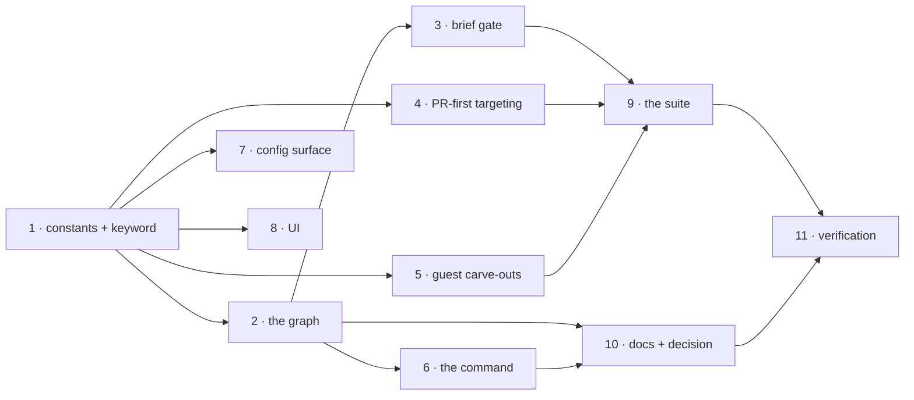

# Tasks: a first-class PR review workflow

> Phase 3 of 3. A DAG of small, verifiable tasks; each task's `_Test:_` names a row of
> `testing-plan.md`.

## Task list

- [x] 1. Names, constants and the keyword
  - `cli/the_loop/control.py`: `REVIEW` in the constants, `COMMANDS`,
    `_ARMING_COMMANDS`, `SPAWN_COMMANDS`, `DEFAULT_KEYWORDS`.
  - `cli/the_loop/graph/model.py`: `PDLC_REVIEW_LOOP`, `SHIPPED_LOOPS`,
    `OUTER_PATH_LOOPS`, `GUEST_LOOPS` (new), `LOOP_FOR_CONTROL_COMMAND`, `__all__`.
  - Security-relevant (trust boundaries 1 and 4, `design.md` §Security design):
    the keyword stays a constant; `resolve_outer_loop` stays the one reader.
  - _Depends on:_ none
  - _Requirements:_ R2.1, R2.3, R2.4
  - _Test:_ `T1 — pytest tests/test_graph_review.py -k "keyword or loop"` (red→green)

- [x] 2. The graph
  - `cli/the_loop/graph/pdlc-review-loop.yaml`: the six nodes, four edges, header
    comment stating what is omitted and why.
  - _Depends on:_ 1
  - _Requirements:_ R1.1–R1.6, R5.1, R6.1
  - _Test:_ `T1 — pytest tests/test_graph_review.py -k graph` (red→green)

- [x] 3. The brief gate
  - `cli/the_loop/graph/hooks/review.py`: `parse_brief`, `post-review-brief`,
    `classify-review-brief`; import in `graph/hooks/__init__.py`.
  - `cli/the_loop/graph/runtime.py`: fold `brief` into the decision record beside
    `goal`.
  - Security-relevant (trust boundary 2, `design.md` §Security design): authorized,
    non-self-authored comments only; the brief is a fact, never a destination.
  - _Depends on:_ 2
  - _Requirements:_ R4.1–R4.6
  - _Test:_ `T1 — pytest tests/test_graph_review.py -k brief` (red→green)

- [x] 4. PR-first targeting
  - `cli/the_loop/webhook/dispatcher.py`: `_apply_control`'s REVIEW branch
    (`pr_work_item` as target and session lookup), `_on_unmatched`'s optional
    `target` parameter.
  - _Depends on:_ 1
  - _Requirements:_ R3.1–R3.3
  - _Test:_ `T2 — pytest tests/test_graph_review.py -k target` (red→green)

- [x] 5. The guest carve-outs and the session's posture
  - `cli/the_loop/graphlink.py`: `_is_review`, the `render_graph_context` review
    branch, `_write_default` via `GUEST_LOOPS`.
  - `cli/the_loop/core/graphs.py`: `_runtime`'s adopt guard via `GUEST_LOOPS`.
  - _Depends on:_ 1
  - _Requirements:_ R6.2, R7.1–R7.3
  - _Test:_ `T1/T10 — pytest tests/test_graph_review.py -k "guest or context"` plus the
    existing `test_graphlink.py` / `test_core_graphs.py` unchanged (red→green)

- [x] 6. The command
  - `commands/review-pr.md`: the reviewer-not-author posture, the walk, the brief.
  - _Depends on:_ 2
  - _Requirements:_ R6.1, R6.3
  - _Test:_ T11 n/a — prose; the graph's `command:` values are asserted in T1's shape
    test

- [x] 7. The config surface
  - `cli/the_loop/schemas/cli-config.schema.json` and `.the-loop/cli-config.schema.json`
    (byte-identical): `routing.control.keywords.review`.
  - `skills/the-loop/templates/cli-config.yaml`, `docs/config/cli/routing-options.md`.
  - _Depends on:_ 1
  - _Requirements:_ R2.1, non-functional §config
  - _Test:_ `T10 — pytest tests/test_config_schema_parity.py tests/test_docs_parity.py`
    (red→green)

- [x] 8. The UI rendering path
  - `ui/src/api/model.ts`: `ADHOC_LOOPS` → `TREELESS_LOOPS` + the new name;
    `ui/src/api/model.test.ts`, `ui/src/views/Sessions.tsx` as needed.
  - _Depends on:_ 1
  - _Requirements:_ design §10
  - _Test:_ `T5 — bun run test` (red→green)

- [x] 9. The suite
  - `cli/tests/test_graph_review.py` mirroring `test_graph_adhoc.py`: graph shape,
    hooks, keyword, loop selection, targeting, the Gherkin walk, the abuse cases.
  - `cli/tests/test_graph_cleanup.py`: add the review loop to the cleanup-node
    parametrizations.
  - _Depends on:_ 3, 4, 5
  - _Requirements:_ all; abuse cases 1–6
  - _Test:_ `T1/T2/T8 — the suite itself`

- [x] 10. Documentation and the decision record
  - `docs/capabilities/process-graph.md`, `docs/capabilities/webhook-triggers.md`,
    `skills/the-loop/SKILL.md`, `skills/the-loop/reference/workflow.md`, `README.md`
    (Four loops → Five loops), `docs/guide/*`, `docs/reference/commands.md`,
    `docs/config/harness-config.md`, `docs/decisions/decision-101.md` + index row.
  - _Depends on:_ 2, 6
  - _Requirements:_ R1–R7 (documentation of record)
  - _Test:_ `T10 — markdownlint + the docs-parity tests`

- [x] 11. Verification
  - Execute `testing-plan.md`'s activities; tick them; fill `## Verification results`;
    commit evidence under `evidence/`.
  - _Depends on:_ 9, 10
  - _Requirements:_ all
  - _Test:_ `the plan itself`

## Dependency graph (DAG)

## Checkpoints

- After task 9: full `make test` run and an execution-log append.
- After task 11: `make check` (lint, format, typecheck, validate, test) and the final
  evidence capture.

## Review comments
