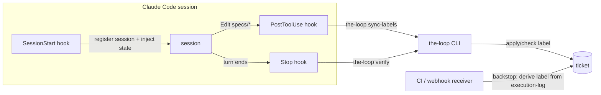

# Brainstorm: enforce the-loop's mandatory behaviours with harness hooks

> Root artifact for issue #28. The trigger bug: work items' phase labels are not being
> kept in sync, despite six command files instructing it. The issue asks three
> questions: (1) can hooks (https://code.claude.com/docs/en/hooks) enforce such
> behaviour instead of relying on the LLM to follow prose? (2) is that a good idea?
> (3) which of the-loop's functionalities can and should be hook-enforced — an audit.
> This also resolves the open design question at the end of `reference/workflow.md`
> ("Predictability & guarantees").

## Problem / opportunity

the-loop's phase state machine is tracked on the ticket via labels
(`<workflow.phaseLabelPrefix><phase>`), and *every* transition command instructs the
harness to keep the label in sync (`work-on`, `create-ticket`, `create-design`,
`create-tasks-plan`, `execute-tasks`, `finish-tasks`). Yet labels drift or never get
applied — issue #28 itself sat at zero labels while being worked.

This is a recurrence of **learning-007** ("a mandatory behavior needs a trigger point,
not just a rule"): a rule written in prose, with no step that blocks progress when it
didn't happen, silently no-ops. Two distinct failure modes produce it:

1. **The rules never enter context.** Sessions that start outside the-loop's commands
   (e.g. a GitHub-triggered remote session working an issue directly) may never read
   the skill or `reference/workflow.md`. The SessionStart reminder only fires where the
   plugin is installed and enabled.
2. **The rules are in context but not followed.** Label sync is a side-task; over a
   long session, instruction-following on side-tasks decays. Nothing verifies the
   postcondition, so the miss is invisible until a human notices.

The opportunity: Claude Code hooks have grown far beyond the SessionStart event the
plugin uses today (`hooks/hooks.json`) — PreToolUse can allow/deny/rewrite tool calls,
PostToolUse can verify results and inject feedback, Stop can block a turn from ending
with a reason, and hooks can run commands (the CLI!) at each of these points. That is
exactly the "trigger point wired into the workflow" learning-007 demands.

## Context & constraints

- Current hook usage: one SessionStart reminder (`hooks/hooks.json`); Cursor gets the
  equivalent via the always-applied rule `rules/the-loop.mdc`.
- Claude Code hook events relevant here: `SessionStart` / `SessionEnd` (session
  lifecycle side-effects, context injection), `UserPromptSubmit` (per-prompt context
  injection, can block), `PreToolUse` (allow / deny / rewrite a tool call, matcher per
  tool), `PostToolUse` (verify a result, inject feedback, block), `Stop` (block the
  turn ending — "you are not done"), plus `prompt`/`agent` hook types (LLM-judge
  hooks). Hooks ship with the plugin via `hooks/hooks.json`.
- **Cross-harness parity is a real constraint**: the same plugin serves Cursor, whose
  hook surface differs (no SessionStart equivalent today). Whatever we build must
  degrade gracefully to the rule-reminder there.
- **`.claude/rules/` (https://code.claude.com/docs/en/memory#organize-rules-with-claude/rules/)
  is the injection counterpart to hooks**: markdown rules checked into the *consumer
  repo*, optionally **path-scoped** via `paths` front-matter so they load exactly when
  matching files are touched (e.g. the phase/label rules whenever `docs/specs/**` is
  edited). Because they live in the repo — not the plugin — they reach sessions that
  never loaded the plugin, and they mirror Cursor's `rules/*.mdc` almost 1:1. The docs
  are explicit about the boundary, and it is this brainstorm's boundary too: rules are
  "context, not enforced configuration — to block an action regardless of what Claude
  decides, use a PreToolUse hook instead."
- **Hooks only help where the plugin is loaded.** A session that never loaded the
  plugin fires none of them — an enforcement layer *outside* the harness (CI /
  the webhook receiver) is the only harness-independent backstop.
- The Python CLI (`cli/`, zero runtime deps) already exists as the natural home for
  deterministic logic hooks can call; precedent: Conventional Commits are already
  enforced deterministically (commitizen via git hook), not by prose — and it works.
- Config already knows everything a verifier needs: `workflow.phaseLabelPrefix`,
  `workflow.phases`, `workflow.specDir`, ticketing coordinates; specs carry
  machine-readable front-matter (`phase`, `status`).

## The audit — what can and should be hook-enforced

Classification of the-loop's mandatory behaviours into three enforcement tiers. The
governing principle: **the more deterministic the behaviour, the less it should depend
on the LLM at all.**

### Tier 1 — do it in code (hook triggers the action itself)

Side-effectful, fully deterministic steps. Asking the LLM to do them and then checking
is strictly worse than just doing them.

| Behaviour | Where it lives today | Hook trigger |
|---|---|---|
| Phase label sync on the ticket | prose in 6 commands | derive label from the spec's `execution-log.md` / front-matter `phase` and apply it via the ticketing API whenever that file changes (PostToolUse on Edit/Write of specs; CI/webhook as backstop) |
| Session registration / close (`the-loop sessions register/close`) | prose in `automation.md` | SessionStart / SessionEnd command hooks |
| Surfacing the-loop state into context | SessionStart reminder (exists) | keep; extend with current work-item phase ("label says X, log says Y — out of sync") |

### Tier 2 — verify in code, enforce in hook (deterministic postconditions)

Checkable from checked-in state; a hook blocks or warns when the invariant is violated.
One implementation (a CLI verifier, e.g. `the-loop verify`) — hooks are thin adapters.

| Invariant | Check | Hook point |
|---|---|---|
| Iterate-until-locked: no downstream artifact against an unlocked upstream | front-matter `status: approved` of the upstream spec | PreToolUse on Write/Edit of `design.md` / `tasks.md` |
| Artifact chain order (requirements before design before tasks) | file existence + front-matter in `docs/specs/<id>/` | PreToolUse / Stop |
| Label ↔ phase consistency (if not Tier-1-automated) | ticket label vs execution-log `phase` | Stop (block turn end with reason) |
| Execution log kept current | spec files / code edited but `execution-log.md` untouched this turn | Stop (warn) |
| `tasks.md` checkmarks current | task claimed done in log but unchecked | Stop (warn) |
| PR briefing posted before human review requested | briefing comment exists before review-request call | PreToolUse on the review-request tool call (matcher is fuzzy — best-effort) |
| Quality gates (lint/typecheck/test) | already enforced | keep at git/CI level (pre-commit + CI parity, decision-006) — no harness hook needed |
| Conventional Commits | already enforced (commitizen) | keep at git level |

### Tier 3 — judgment: keep as prose, hooks only remind

Not deterministically checkable; hooks must NOT block on these. Spec quality (EARS
phrasing, design completeness), minimalism-ladder choices, review-finding quality,
reviewer education content, learnings quality, collaborator selection. `prompt`-type
(LLM-judge) hooks *could* score these, but that reinjects the nondeterminism this
issue exists to remove — rejected for now, revisit with evidence. What this tier *can*
get is better **delivery**: `/the-loop:init` scaffolds path-scoped `.claude/rules/`
into the consumer repo (e.g. spec-writing rules gated on `docs/specs/**`) so the right
prose loads exactly when matching files are touched — checked in, so it reaches
sessions that never loaded the plugin, and it maps 1:1 to Cursor's `.mdc` rules.
Hooks complement this with in-flight injection (UserPromptSubmit / PostToolUse
`additionalContext`) instead of hoping the skill was read at session start.

## Ideas & options

- **Option A — status quo (prose + SessionStart reminder).** Zero build cost; already
  demonstrably insufficient (this bug, learning-007 before it). ✗
- **Option B — hook-enforce everything, including judgment steps via LLM-judge
  hooks.** Maximal predictability on paper; in practice reintroduces nondeterminism at
  the enforcement layer, adds cost/latency to every tool call, and misfiring blocking
  hooks cause thrash loops. ✗
- **Option C — tiered enforcement (do-it-in-code → verify-in-code → remind), CLI as
  the single implementation, hooks as thin adapters, warn-first rollout.** Matches the
  existing deterministic-enforcement precedent (commitizen, pre-commit); keeps
  judgment where the LLM is genuinely needed; degrades gracefully on Cursor (the CLI
  check can also run from git hooks / CI there). ✅ chosen direction.

## Sketches & notes

Key design idea for the label bug specifically: make the checked-in
`execution-log.md` front-matter `phase` the **single source of truth** and *derive*
the ticket label from it mechanically. Then the label can never silently drift — in
the worst case (no plugin loaded, no hooks fired), the CI/webhook backstop still
converges it after push.

## Open questions

1. **Label sync mechanism:** in-session hook that applies the label, a CI/webhook
   backstop that derives it from the execution log, or both? (Leaning: both — hook for
   immediacy, backstop for harness-independence.)
2. **Default enforcement level:** should Tier-2 checks warn or block out of the box?
   (Leaning: `warn` first, per-check escalation to `block` via a new config section,
   e.g. `enforcement: off | warn | block`.)
3. **Cursor parity:** implement Cursor's hook surface now, or keep the rule-reminder
   plus git-hook/CI enforcement until there's demand? (Leaning: latter; the CLI
   verifier makes the eventual adapter trivial.)
4. **First slice:** the label bug end-to-end (Tier 1 row 1 + backstop), or the whole
   Tier-2 verifier? (Leaning: label bug first — it is the reported defect and proves
   the pattern.)

## Leaning / working hypothesis

Adopt Option C. Every rule the-loop marks *mandatory* must name its **trigger point**
and its **enforcement tier** (learning-007, now structural): deterministic
side-effects are performed by the CLI via hooks (Tier 1); deterministic postconditions
are verified by a single CLI verifier wired to PreToolUse/Stop hooks, warn-first
(Tier 2); judgment stays prose, with hooks injecting context at the right moment
(Tier 3). Harness-independent invariants (labels) additionally get a CI/webhook
backstop that derives state from checked-in artifacts. First slice: fix the label bug
end-to-end.

## Hand-off → requirements

Carries forward: the three-tier enforcement model and the audit tables above; the
label-sync fix (Tier 1 + backstop) as the first implementation slice; a CLI `verify` /
`sync-labels` surface; an `enforcement` config knob; path-scoped `.claude/rules/`
scaffolding in `/the-loop:init` as Tier-3 delivery; the "mandatory rule ⇒ named
trigger point + tier" documentation rule for `workflow.md`/`automation.md`. Stays
here: LLM-judge enforcement (Option B) and full Cursor hook parity, as considered-and-
deferred records.
