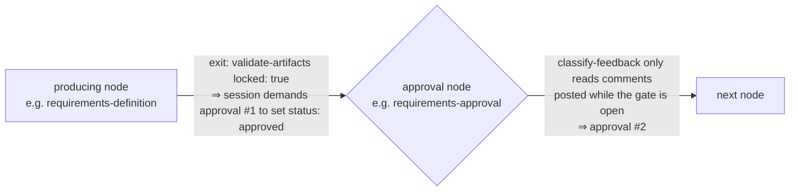

# Bugfix spec: every phase demands the same human approval twice

> Phase 1 of 3 for a bug (bugfix → design → tasks). Reviewed with the PR that carries
> the spec chain (tier 3, `human-approves-pr`).

## Summary

[Issue #281](https://github.com/MadaraUchiha-314/the-loop/issues/281): walking
`pdlc-work-item-loop` end-to-end with only the default gates selected (requirements
approval + design approval), the human approved **5 times** instead of the expected
**2**. Each artifact phase consumes one approval to *lock* the artifact
(`status: approved` in front matter, demanded by `validate-artifacts` with
`locked: true` on the producing node's exit) and a second to *pass* the graph's human
approval node — and `tasks-breakdown` consumes an approval even though the graph
deliberately gives it no approval node at all.

## Steps to reproduce

1. Start a work item on `pdlc-work-item-loop` with the default phase selection
   (brainstorming skipped, `design-critic-review` not opted in).
2. Author `requirements.md`; the skill instructs the session to request human review
   and not proceed until approved, so the session blocks on a human "approved" —
   outside any gate — then sets `status: approved` and runs `the-loop graph complete`.
3. The pointer advances to `requirements-approval`, whose `request-review` asks the
   same human the same question again; `classify-feedback` only reads comments arriving
   while the gate is open, so the pre-gate approval is discarded.
4. Repeat for `design` + `test-planning` (one gate, but a skill-level stop each), and
   for `tasks-breakdown` (a skill-level stop with **no** gate behind it).

## Expected vs actual

- **Expected:** one human approval at `requirements-approval`, one at `design-approval`
  — 2 total. `tasks-breakdown` has no approval node, so no approval at all.
- **Actual:** 5 approvals — one per artifact to satisfy `locked: true` on the producing
  node's exit, plus one per human gate; a prompt pre-gate reply is guaranteed to be
  rejected ("the gate only counts feedback posted while it is open").

## Root cause (confirmed)

Two approval mechanisms are stacked per phase:

1. **Graph layer:** every producing node's exit runs `validate-artifacts` with
   `locked: true`, requiring `status: approved` **before the node can complete** —
   necessarily before the approval node is entered. The approval node can therefore
   never be the thing that locks the artifact.
2. **Skill layer:** the skills instruct the session to obtain human approval before
   setting that status ("iterate until locked"; `create-tasks-plan` step 4: "request
   human review. Do not start implementation until approved").
3. The gate then re-asks, and its classification deliberately discards feedback that
   arrived before it opened.

The same stacked shape exists in `pdlc-contribution-loop` (`scoped-plan` demands
`locked: true`; `plan-approval` follows).

## Requirements

### Requirement 1 — approvals are owned by approval nodes

**User story:** As the human approver, I want each default gate to cost me exactly one
approval, so that responding promptly is never punished with a re-ask.

#### Acceptance criteria (EARS)

1. WHEN a producing node (`brainstorming`, `requirements-definition`, `design`,
   `test-planning`, `tasks-breakdown`, and `scoped-plan` in the contribution loop)
   completes THEN the system SHALL NOT require the artifact's front matter to say
   `status: approved` — `validate-artifacts` on those nodes SHALL check shape
   (sections, lint) only.
2. WHEN an approval node (`requirements-approval`, `design-approval`, `plan-approval`)
   classifies authorized feedback as `approved` or `approved-with-comments` THEN the
   system SHALL lock the gated artifact(s) itself: set front-matter
   `status: approved` and record the approving authors in `approvedBy`.
3. WHEN the classification is `changes-requested` (or no decisive feedback has
   arrived) THEN the system SHALL NOT change the artifact's lock state.
4. WHEN a gated artifact is absent because its authoring phase was declared skipped
   THEN the lock step SHALL skip that artifact rather than block the gate.
5. The fix SHALL include a regression test that fails before the fix and passes after:
   an end-to-end walk in which artifacts are emitted **unlocked** (`status: draft`)
   and reach `implementation` locked, having consumed exactly one approval per gate.

### Requirement 2 — gate-less phases need no human sign-off

**User story:** As the work item's author, I want phases the graph gives no approval
node (`tasks-breakdown`, `brainstorming`) to proceed without a human stop, matching
the graph's declared intent ("one human gate approves both").

#### Acceptance criteria (EARS)

1. WHEN `tasks-breakdown` completes with a `tasks.md` carrying its required sections
   THEN the system SHALL advance to `implementation` without any human approval.
2. The plugin skills and commands SHALL NOT instruct the session to request a human
   approval, or to block until one arrives, for any phase — approvals belong to the
   graph's approval nodes (`request-review` + `classify-feedback`), which the skills
   defer to.
3. The skills SHALL instruct the session never to set `status: approved` itself: the
   lock is the gate's act.

## Security considerations

- **The lock step must not widen who can approve.** `lock-artifacts` acts only on the
  outcome `classify-feedback` produced in the same chain run, and `classify-feedback`
  already reads only authorized, non-self-authored comments. No new input surface is
  added; the artifact edit is a local file write within the spec directory.
- **Fail closed.** A lock that cannot be written (unreadable file, ambiguous artifact
  slot) blocks the gate rather than reporting an approval that was not durably
  recorded.
- Removing `locked: true` from producing nodes does not remove any human decision:
  every artifact that had a human gate still has it; artifacts that lose their lock
  requirement (`brainstorm.md`, `tasks.md`, pre-approval `contribution.md`) never had
  a graph-level approval node — their "lock" was a session-invented stop the graph
  never asked for.

## Out of scope

- Widening `classify-feedback`'s window to count pre-gate feedback (the issue's
  suggested fix 2) — moving the lock to the gate removes the pre-gate ask entirely,
  so there is no pre-gate approval left to count.
- The `pdlc-pr-loop`, `pdlc-adhoc-loop` and `pdlc-review-loop` graphs: none of them
  gates `locked:` anywhere.

## Open questions

None — the issue names the fix ("move locking to the gate") and the graph's own
comments state the intent it restores.

## Review comments
