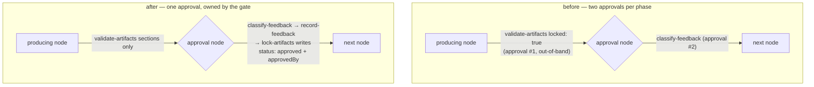

# Design: lock artifacts at the approval gate, not before it

## Architecture

One new hook and two edited graphs. The producing nodes stop demanding
`status: approved`; the approval nodes gain a `lock-artifacts` step that flips the
status **as part of classifying the human's one approval**. The skills stop
re-implementing approvals in prose.

### The `lock-artifacts` hook (`cli/the_loop/graph/hooks/feedback.py`)

- Declared as `{hook: lock-artifacts, with: {artifacts: [...]}}`; entries use the same
  alternation vocabulary as `produces` (`requirements.md|bugfix.md`) and resolve
  through the same `resolve_produces`, so presence and ambiguity policy cannot drift.
- Reads the most recent `classify-feedback` result from the same chain run
  (`ctx.results`, the `record-feedback` pattern). Outcome `approved` /
  `approved-with-comments` → lock; anything else → `skipped` (the gate stays a pure
  classifier on the `changes-requested` path, whose edge routes backward).
- Locking = splice the artifact's front-matter block in place: `status:` value becomes
  `approved`, `approvedBy:` merges the approving authors (inline comments and every
  other line preserved — the yamlpatch principle applied to front matter). A missing
  `approvedBy` key is inserted after `status`; a missing front-matter block is created.
- After writing, the hook re-reads the front matter and verifies the lock landed;
  a splice that cannot prove itself blocks (fail closed), as does an ambiguous slot
  (two names present) or an unreadable file.
- An absent artifact is skipped: with `design` declared away, `design-approval` still
  has only `testing-plan.md` to lock. The hook never declares `data["outcome"]`, so
  `classify-feedback`'s classification keeps routing the edge.

### Graph changes

`pdlc-work-item-loop.yaml`:

| Node | Change |
|------|--------|
| `brainstorming`, `requirements-definition`, `design`, `test-planning`, `tasks-breakdown` | drop `locked: true` (sections/lint checks stay) |
| `requirements-approval` | exit gains `{hook: lock-artifacts, with: {artifacts: ["requirements.md\|bugfix.md"]}}` |
| `design-approval` | exit gains `{hook: lock-artifacts, with: {artifacts: [design.md, testing-plan.md]}}` — one gate, two artifacts, exactly as its comment declares |

`pdlc-contribution-loop.yaml`: `scoped-plan` drops `locked: true`; `plan-approval`
gains `{hook: lock-artifacts, with: {artifacts: [contribution.md]}}`.

Hook order on a gate: `classify-feedback → record-feedback → lock-artifacts` — the
feedback is recorded into the document first, then the status flip seals it; both read
the same classification, and only the lock is conditional on it being an approval.

### Skill / command changes

- `skills/the-loop/SKILL.md` + `reference/workflow.md`: "iterate until locked" becomes
  "iterate with feedback **at the gate**; the approval node locks". Sessions never set
  `status: approved` and never post approval requests of their own — `request-review`
  on the gate is the one ask.
- `commands/create-tasks-plan.md` step 4 and the matching lines in `new-requirement.md`,
  `create-design.md`, `create-testing-plan.md`, `work-on.md`, `brainstorm.md`: the
  "request human review / do not proceed until approved / record the approver" steps
  are removed or rewritten to defer to the graph's gates; gate-less artifacts
  (`brainstorm.md`, `tasks.md`) proceed on shape alone.
- `docs/capabilities/process-graph.md` and `spec-workflow.md` updated to match.

## Interfaces

- New hook name `lock-artifacts` in the shipped registry; params:
  `artifacts: [<name-or-alternation>, ...]` (required — no artifacts, no lock).
- No CLI, API or state-file changes. `HookResult` vocabulary unchanged.

## Data models

Front matter gains no new keys: `status` and `approvedBy` already exist in every
bundled template; the hook now maintains them instead of the session.

## Error handling

| Failure | Behaviour |
|---------|-----------|
| No prior `classify-feedback` in the chain, or outcome not an approval | `skipped` — the gate's own classification routes |
| Declared artifact absent | that slot skipped (planned absence); lock proceeds for the present ones |
| Two names of one slot present | `block` (the `validate-artifacts` ambiguity rule) |
| Unreadable/unwritable file, or the splice does not re-parse to a locked state | `block`, fail closed |

## Security design

The trust boundary is unchanged: only `classify-feedback` reads comments, only
authorized non-self-authored authors are counted, and `lock-artifacts` consumes that
verdict in-process. The abuse case "attacker comment flips an artifact to approved"
still requires an authorized author, exactly as before. Recording `approvedBy` from
the classified comments *improves* the paper trail the skills previously kept by hand.

## Testing strategy

See `testing-plan.md`: unit tests for the new hook (approve/lock, changes-requested
skip, absent-artifact skip, ambiguity block, splice verification), graph-shape
assertions, and the e2e suite reworked so fixtures are emitted **unlocked** — the
happy path now *proves* the gate locks them (the regression test of AC 1.5), and
`gate-rejection` pivots to a missing-section block.

## Review comments
