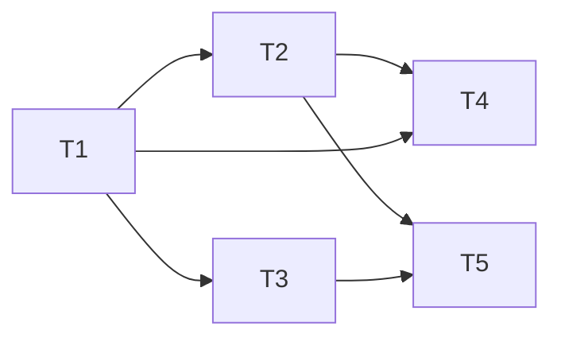

# Tasks: lock artifacts at the approval gate

## Task list

- [x] **T1 — `lock-artifacts` hook** (`cli/the_loop/graph/hooks/feedback.py`): lock on
  an approval classification, skip otherwise, splice front matter in place, verify the
  splice, record `approvedBy`. _Req: 1.2, 1.3, 1.4._ _Test: unit row._
- [x] **T2 — graph rewiring** (`pdlc-work-item-loop.yaml`,
  `pdlc-contribution-loop.yaml`): drop `locked: true` from producing nodes; add
  `lock-artifacts` to the three approval gates; update the graphs' comments.
  Depends on T1. _Req: 1.1, 1.2, 2.1._ _Test: integration row._
- [x] **T3 — skills and commands**: SKILL.md, `reference/workflow.md`, and the six
  command docs stop demanding session-owned approvals; gate-less phases proceed on
  shape. _Req: 2.2, 2.3._ _Test: e2e row (no scripted pre-gate approval steps remain)._
- [x] **T4 — tests**: unit tests for T1; e2e fixtures to `status: draft`;
  `gate-rejection` pivots to a missing-section block; happy-path drops `tasks.md` from
  `lockedBeforeImplementation`. Depends on T1–T2. _Req: 1.5._ _Test: all rows._
- [x] **T5 — docs**: `docs/capabilities/process-graph.md`, `spec-workflow.md`,
  execution-log `Documentation` section. Depends on T2–T3. _Req: 2.2._ _Test: markdown
  lint row._

## Dependency graph

## Review comments
