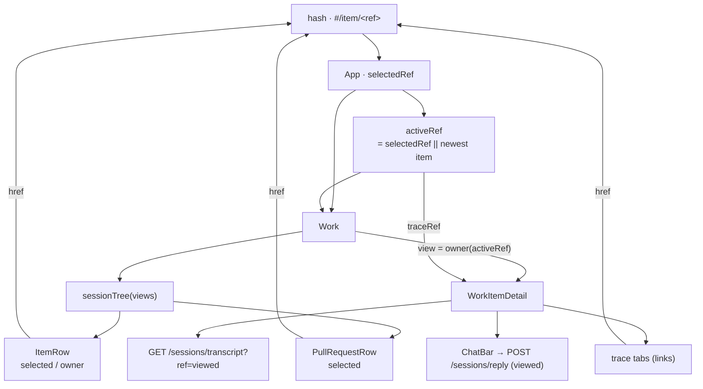

# Design: nest each work item's pull requests under it in the sidebar

> Phase 2 of 3. Derived from the locked `requirements.md`; reviewed together with
> `testing-plan.md`.

## Overview

Three changes, none of them new machinery:

1. **The sidebar renders `sessionTree`.** The two-level join already exists in
   `src/api/model.ts` — it was written for the pre-298 Sessions screen and has been
   dead production code since that screen retired (its only remaining caller is its own
   test). It knows the thing this work item needs and nothing else does: which items
   are treeless, and which PR endpoints hang off an item. It gains two fields for the
   row (`label`, `lastActivity`) rather than a competing function being written beside
   it (R5.2).
2. **The viewed trace becomes route state.** `WorkItemDetail` held it in `useState`,
   seeded once from a prop. That was sound while the *only* way to change traces was
   the pane's own tabs; the moment the sidebar can select a PR too, a `useState` seeded
   at mount is a second source of truth that silently ignores the route. It becomes a
   prop derived from the hash, and the tabs become links (R4.1, R4.2).
3. **Two CSS rules and a marker class** for the indent, the gutter hairline and the
   "your canvas is on this item" tint.



## The join: `sessionTree` gains two fields

```ts
export interface SessionNode {
  ref: string;          // what /sessions/transcript and /sessions/reply are called with
  shortRef: string;
  label: string;        // NEW — what the row prints
  scope: "outer" | "inner";
  state: SessionState;
  tmuxTarget: string;
  lastActivity: string; // NEW — the row's relative time
}
```

`label` is where R2.2/R2.3 lives, and it lives **in the join rather than in the row**
because the decision is about the data, not about the pixels: `PullRequestView.prRepo`
is already computed as "this PR is somewhere other than its work item" (issue-183 set it
so the graph call targets the right `pr-loops/` directory). The label reads that same
answer — `prRepo ? shortRef : "#" + number` — so the sidebar and the graph state can
never disagree about which PRs are foreign.

`lastActivity` is `endpoint.lastEventAt ?? ""`, matching how a work item's own
`lastActivity` is derived, so `relativeTime` renders both the same way.

Treelessness needs no new code: `sessionTree` already returns `inner: []` for
`pdlc-adhoc-loop`, `pdlc-contribution-loop` and `pdlc-review-loop` (R1.4), and
`Work` renders no list for an empty `inner` (R1.2).

## The sidebar

`Work` sorts the views as it always did (newest activity first, R1.5), then wraps them:

```tsx
const tree = sessionTree(sorted);
…
{tree.map(({ view, inner }) => (
  <div className="lp-side-item" key={view.ref}>
    <ItemRow view={view} selected={activeRef === view.ref}
             owner={inner.some((pr) => pr.ref === activeRef)} />
    {inner.length > 0 ? (
      <ul className="lp-side-prs" aria-label={`Pull requests for ${view.shortRef}`}>
        {inner.map((pr) => <li key={pr.ref}><PullRequestRow node={pr} … /></li>)}
      </ul>
    ) : null}
  </div>
))}
```

`<ul>` / `<li>` rather than a run of sibling `<a>`s: the nesting is structure, and a
screen reader gets it from the list and its accessible name ("Pull requests for
loop-lab#214") instead of from an indent it cannot see (R1.1). The rows stay ordinary
links (R3.3) — same `hrefFor({ name: "work", ref })` the item rows use, so a PR row is
bookmarkable and middle-clickable like everything else on this surface.

### `activeRef` — one resolved selection

```ts
const selected  = selectedRef ? findOwner(views, selectedRef) : sorted[0];
const activeRef = standing ? "" : selectedRef || selected?.ref || "";
```

`selectedRef` is the hash's ref, which may name a work item **or** a PR; `findOwner`
already resolved either to the item that owns it (that is how the pre-283
`#/sessions/<pr-ref>` permalink lands, R4.4). `activeRef` adds the one thing the flat
list never needed: the empty hash's fallback made explicit, so exactly one row is marked
current whether or not the URL names it.

Three row states, and each says something different:

| Row state | Class | Means |
|---|---|---|
| item selected | `current` + `aria-current="page"` | the hash names this item; the canvas shows its own session |
| item owning the selection | `owner` | the hash names one of its PRs; the canvas shows this item, with that PR's trace |
| PR selected | `current` + `aria-current="page"` | the hash names this PR |

The `owner` tint (R3.4) is deliberately lighter than `current`. Without it, selecting a
PR leaves every work-item row unmarked and the sidebar reads as "nothing is open" while
the canvas is plainly showing an item.

## The canvas: the route owns the viewed trace

`WorkItemDetail`'s `initialTraceRef?: string` becomes `traceRef?: string`, and the
`useState` behind it goes away:

```ts
const viewed =
  traceRef && (traceRef === view.ref || view.pullRequests.some((pr) => pr.ref === traceRef))
    ? traceRef
    : view.ref;
```

That guard is R4.3 and abuse case A1 in one expression: a hash naming a session this
item does not own renders the item's own trace instead of asking the transcript route
for somebody else's file. The service's fail-closed path resolution (issue-209) is still
the boundary that *enforces* it; this keeps the page from knocking on the door.

`viewed` then feeds all four consumers that were reading the old state — the transcript
fetch, the trace caption's session, the event-log fallback's filter, and **the chat
bar's target** — so a reply cannot land in a session other than the one on screen (A2).

The tabs become `<a href={hrefFor(...)}>` with the same `lp-tab` class (element-agnostic
CSS; `aria-current="page"` still marks the active one). This is what makes R4.2 true by
construction rather than by a synchronising effect: there is no second state to sync.

One consequence worth naming: the stream's watched transcript
(`useControlPlane`'s `watchTranscript`, fed from the same hash ref) now follows the
**viewed trace**, not just the selected item. Switching to a PR tab used to leave the
stream watching the work item's transcript, so the PR transcript's growth was never
pushed — you saw it on the next poll or refresh. It now reconnects the way selecting a
different item already did, and the panel you are reading is the one that streams.

`Work` still keys the pane on `selected.ref`, not on `activeRef` — switching *items*
remounts the pane (in-flight action state belongs to one item), while switching *traces
within* an item does not, which is the pre-existing tab behaviour and keeps the
transcript's scroll container alive.

## Styling

```css
.lp-side-pr { padding-left: 38px; position: relative; }   /* past the dot column */
.lp-side-pr::before { …; left: 26px; top: 0; bottom: 0; width: 1px; }
.lp-side-row.owner { background: color-mix(in srgb, var(--color-accent-100) 45%, transparent); }
```

The gutter rule is drawn per row and stretched to its full height, so a run of PR rows
draws one continuous hairline down from the item above without the list needing a border
of its own — and a selected row's tint sits over it rather than breaking it. Everything
else (row grid, dot, ref, relative time) is the existing `.lp-side-row` vocabulary; the
PR row only shrinks its ref and drops two children.

## Alternatives considered

| Option | Why not |
|---|---|
| Show a PR count chip on the item row instead of rows | The chip column already carries attention (`needs input`, `human gate`, `blocked`); a second chip competes with the one that means "a human is owed something". And a count is not navigable — R3 is the point of the issue |
| Nest only the selected item's PRs | Keeps the list short, but hides which items carry PRs — the structural question the issue opens with. The board's PR counts are small; the height cost is a few rows |
| Add a collapse/expand toggle per item | Out of scope by requirements; a disclosure that always starts open and is never closed is a control that pays no rent. Revisit if a real board grows deep |
| Keep the pane-local trace state and sync it from a prop with an effect | Two sources of truth plus an effect to make them agree. The bug this work item would otherwise ship — clicking a PR of the *already-open* item changing nothing, because the state was seeded at mount — is exactly what that shape produces |
| Write a fresh `prRows(view)` helper in `Work.tsx` | A second, divergent notion of "this item's PRs", with `sessionTree`'s treeless rule to re-derive or forget |

## Security design

No trust boundary moves. The three abuse cases in `requirements.md` are answered by the
`viewed` guard (A1), by `viewed` being the chat bar's target as well as the panel's (A2),
and by React's escaping plus a label derived from the parsed ref rather than free text
(A3). No credential, no storage, no new request.
