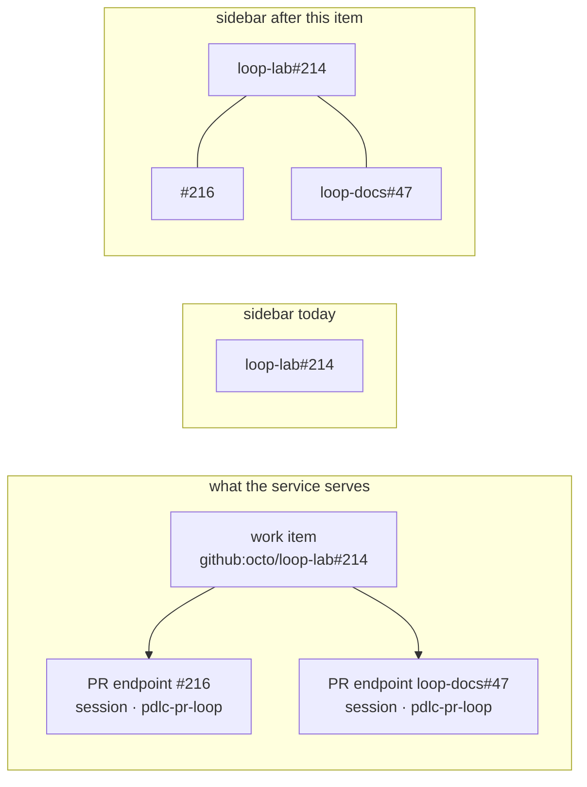

# Requirements: nest each work item's pull requests under it in the sidebar

> Phase 1 of 3 (requirements → design → tasks). Following the Kiro spec approach
> (https://kiro.dev/docs/specs/). Tier 3 (`human-approves-pr`): the owner approves the
> PR, not each phase — this is one screen's structure, not a contract change.

## Introduction

[Issue #300](https://github.com/MadaraUchiha-314/the-loop/issues/300): *"the-loop's
sidebar UI shows all the items as a single list without nesting. I want the list to be
per work item and within each work item the PRs related to the work item."*

The sidebar the issue-298 redesign shipped is the whole navigation, and it is flat by
construction: one row per work item, nothing else. But the board's data is not flat.
A work item's outer loop spawns a **`pdlc-pr-loop` per pull request**, each with its own
session, its own transcript and its own chat — `SessionEndpoint.pullRequests` in the
registry, `WorkItemView.pullRequests` in the join. Those sessions are real, addressable
and reachable by `POST /sessions/reply`; on this surface they had **no row at all**.

Two consequences the issue is pointing at:

- **The structure is invisible.** Which item owns which PR, how many PRs an item is
  carrying, whether a PR's session is running — none of it is on the sidebar. The
  hierarchy exists in the records and is flattened away at the last step.
- **The PR sessions are reachable only by accident.** They appear as unlabelled tabs
  *inside* an item's canvas, so you must first guess which item owns a PR and open it.

Nesting is not a new projection of what the rows already say — the decluttering
direction on PR #299 removed several of those. It is the one level of the board's own
data that the surface does not draw.

## Requirements

### Requirement 1 — the sidebar is a two-level list

**User story:** As an operator reading the board, I want each work item's pull requests
under it, so that I can see what an item is carrying without opening it.

#### Acceptance criteria

1.1 WHEN the sidebar renders a work item that has one or more PR sessions, the UI SHALL
render one row per PR, beneath that item's row and visually subordinate to it.

1.2 WHEN a work item has no PR session, the UI SHALL render its row exactly as before,
with no nested list and no empty affordance.

1.3 The nesting SHALL be **two levels and no more** — a pull request has no pull
requests, so no third level exists to draw.

1.4 WHEN the work item runs a loop with no outer/inner split — `pdlc-adhoc-loop`,
`pdlc-contribution-loop`, `pdlc-review-loop` — the UI SHALL render it treeless, even if
the registry record carries a linked PR endpoint.

1.5 The work-item rows SHALL keep their existing order (newest activity first) and their
existing content: dot, ref, age, title, and the attention chip.

### Requirement 2 — a PR row says what a PR row needs to say

**User story:** As an operator, I want a PR row to be legible at a glance and quieter
than the item above it, so that nesting reduces noise instead of adding it.

#### Acceptance criteria

2.1 A PR row SHALL show its session state (the same dot vocabulary as a work item), its
identity, and its last activity as a relative time.

2.2 WHEN the PR is in the **same repository** as its work item, the row SHALL print the
number alone (`#216`) — the parent row already names the repository.

2.3 WHEN the PR is in a **different** repository (issue-183's multi-repo delivery), the
row SHALL print the qualified short ref (`loop-docs#47`), because the repository is then
information and not repetition.

2.4 A PR row SHALL NOT carry a title or an attention chip: the work item's own row
carries the attention that needs a human.

### Requirement 3 — selecting a PR opens that PR's session

**User story:** As an operator, I want to click a nested PR and land on its transcript,
so that the row is navigation and not decoration.

3.1 WHEN a PR row is activated, the UI SHALL show the **owning work item's** canvas with
the **PR's** session as the viewed trace.

3.2 The chat bar SHALL then post into that PR's session (`POST /sessions/reply` with the
PR's ref), as it already does for a PR trace tab.

3.3 The selection SHALL be addressable: the PR row SHALL be an ordinary link to a hash
that can be bookmarked, opened in a new tab and shared.

3.4 WHEN a PR row is the selected row, its work item's row SHALL remain visibly marked
as the item on the canvas, and SHALL NOT itself claim the selection.

### Requirement 4 — one source of truth for what the canvas shows

**User story:** As a maintainer, I want the sidebar and the canvas's trace tabs to be the
same navigation, so that they cannot disagree.

4.1 The viewed trace SHALL be derived from the route, not held as pane-local state
beside it.

4.2 The canvas's trace tabs SHALL navigate to the same hashes the sidebar's rows use.

4.3 WHEN the hash names a ref the shown work item does not own (a stale deep link), the
canvas SHALL fall back to the work item's own session rather than requesting a
transcript for a session belonging to somebody else.

4.4 Every existing deep link SHALL keep working: `#/item/<ref>` for an item, and the
pre-283 `#/sessions/<pr-ref>` permalink, which names a PR endpoint's session.

### Requirement 5 — no contract, connector or verb changes

5.1 This work item SHALL add no endpoint, request shape or response shape; it reads
`GET /work-items`, `GET /sessions`, `GET /attention` and the graph reports exactly as
before.

5.2 The join in `src/api/model.ts` SHALL NOT grow a second notion of "this item's PRs":
`sessionTree` already computes it (written for the pre-298 Sessions screen and left
unrendered by that screen's retirement) and is the function to reuse.

## Security considerations

The change is client-side rendering and hash routing over records the page already
holds. No new trust boundary is crossed, and no credential is involved (the dashboard
holds none — see `docs/capabilities/control-plane.md`).

| # | Abuse case | Boundary | Mitigation |
|---|------------|----------|------------|
| A1 | A hash names a session ref belonging to another work item (a hand-edited or stale link), and the canvas fetches a transcript for it under the wrong item's heading | browser → `GET /sessions/transcript` | R4.3: the viewed ref is accepted only if the shown item owns it, else it falls back to the item's own session. The service's own fail-closed path resolution (issue-209) remains the enforcing boundary; this is defence in depth |
| A2 | A reply is typed against one trace and delivered into a different session | browser → `POST /sessions/reply` | The chat bar's target is the *same* resolved ref the trace panel renders — one value, not two (R4.1) |
| A3 | A ticket title or ref renders as markup in a nested row | untrusted ticket data → DOM | Unchanged: React escapes text children, and the PR label is derived from the parsed ref (repo + number), never from free text |

## Out of scope

- Collapsing / expanding an item's PR list, and remembering that per browser. Nothing in
  the issue asks for it, PR counts per item are small (1–3 in every observed board), and
  a disclosure that starts open and is never closed is a control that pays no rent.
- Grouping the work items themselves (by phase, by state). PR #299 removed exactly that;
  the issue asks for nesting *within* an item, not headers above them.
- Any change to the canvas beyond where the viewed trace comes from.
