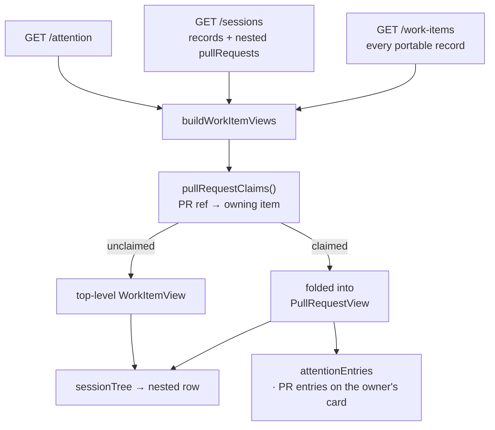

# Design: a pull request appears once on the board, under the item it delivers

> Phase 2 of 3. Derived from the locked `requirements.md`; reviewed together with
> `testing-plan.md`.

## Overview

Two changes, in the two places the wrong answer is produced:

1. **The join reconciles the two identities** (`ui/src/api/model.ts`). A ref that some
   work item's row will draw as a nested pull request is not itself a top-level work
   item. What the removed row carried — the portable record, the attention, the open
   question — is folded onto the nested `PullRequestView` so the drop moves information
   instead of deleting it.
2. **`list_attention` looks for a session where a PR's session actually is**
   (`cli/the_loop/core/attention.py`). Liveness is currently tested against top-level
   session records only, so every linked, labeled PR reports `armed-without-session`
   forever. Three lines widen the lookup to nested endpoints.



## The claim

```ts
function pullRequestClaims(
  sessions: SessionRecord[],
  recordByRef: Map<string, WorkItemRecord>,
): Map<string, string>   // PR ref → the work item whose row draws it
```

One pass over the sessions the join already has. Three rules, each a requirement:

- **Treeless owners do not claim** (R1.3). `sessionTree` renders `inner: []` for
  `pdlc-adhoc-loop`, `pdlc-contribution-loop` and `pdlc-review-loop`, so their linked
  endpoints never become rows. Honouring such a claim would erase the PR from the board
  rather than move it. The predicate is *extracted*, not duplicated: `sessionTree` and
  the claim read one `treeless(record)` (R4.2).
- **A ref with a session record of its own does not get claimed** (R1.4). It was worked
  standalone before it was linked, so the top-level record is the live one and the nested
  endpoint is `link_pull_request`'s stub. `record_owning` resolves it the same way.
- **A self-claim is ignored** (R1.5). `link_pull_request` already refuses to record one
  ("a work item does not deliver itself"); the join refuses to act on one, so a record
  that says otherwise cannot delete its own row.
- **A claim by a claimed ref is discarded** (R1.5, abuse case A1). The registry nests
  exactly one level — `Session.from_dict` drops a nested endpoint's own `pullRequests`
  — so a two-level claim can only come from a hand-edited or hostile record. The join
  fails closed to "top-level".

`buildWorkItemViews` then skips a claimed ref when it builds its rows. A PR **no** session
claims is untouched (R1.2): the standalone-PR path keeps its top-level row.

## The fold

`PullRequestView` gains the three things the removed row was the only holder of:

```ts
export interface PullRequestView {
  …
  /** The PR's own portable record — its poll ledger and cached title, `{ ref }` when none. */
  record: WorkItemRecord;
  /** The service's attention for this PR's ref; surfaced on its work item's card. */
  attention: AttentionItem[];
  /** The PR loop's open `the-loop ask` question, when one is open. */
  question: EventRecord | null;
  /** Newest first: the endpoint's own event, else the record's poll stamp. */
  lastActivity: string;
}
```

The fold is gated on the claim (`claimed.get(prRef) === workItemRef`, R2.5). A PR whose
claim was refused — a treeless owner, a discarded two-level claim — still has a top-level
row, and reporting its wait in both places would re-create the duplicate under another
name. `record` is folded unconditionally because it only ever *adds* an age fallback to a
row that would otherwise print none.

`lastActivity` is the same expression a work item's row uses
(`endpoint.lastEventAt ?? record.poll?.lastPolledAt ?? ""`), which is R2.1 — and it moves
`sessionTree`'s inner node onto the view's value rather than re-deriving `lastEventAt`
beside it.

Two consumers read the folded fields:

- **`attentionEntries`** already emits `human gate · PR` entries against the *owner's*
  ref with the *PR's* short ref. The folded attention and question follow that exact
  precedent — `needs input` (Reply) and one collapsed entry per kind, suffixed `· PR`
  (R2.2, R2.3). The per-kind collapse (newest wins, the rest become a count) is the
  block already written for a work item's own attention, extracted to `collapseByKind`
  so the two cannot drift.
- **`rowFlag`** gains exactly one clause: a PR with an open question raises the owner's
  `needs input` chip (R2.3). Nothing else is promoted (R2.4) — a PR's human gate never
  had a top-level row to lose, so adding it would be a new feature wearing a bug fix's
  clothes.

## The service side

```python
by_ref = {}
for s in sessions:
    by_ref[s["ref"]] = s
    for endpoint in s.get("pullRequests") or []:
        by_ref.setdefault(str(((endpoint.get("workItem") or {}).get("ref")) or ""), endpoint)
```

`armed-without-session` asks "is this ref being worked on this machine?" and answered it
against top-level records only — which is the wrong question for a ref whose endpoint is,
by design, nested. A nested endpoint carries the same `status`, so the existing
`active`/`paused` test is unchanged (R3.1, abuse case A3). `setdefault` keeps a ref's own
record winning over an endpoint claiming it, matching `record_owning`'s precedence in the
registry.

The `session-paused` loop above it is deliberately untouched: promoting nested paused
endpoints to their own attention rows would *add* reporting (R2.4), and a paused PR loop
is visible on its work item's card already.

## Alternatives considered

| Option | Why not |
|--------|---------|
| **Record parentage on the portable record** (`isPr` / `parent`, written by `link_pull_request`, filtered out of `list_work_items`) — the issue's second suggested direction | It copies a fact the session registry already owns into a second store that can go stale (the binding changes when a PR is re-routed or a session is forgotten), it puts `core/workitems.py` — a read over the portable store alone — in the business of reading the registry, and it changes what `GET /work-items` serves for every other client. The join is where these two sources are *supposed* to meet: `buildWorkItemViews` exists for exactly that |
| **Stop the poller flushing a ledger for a labeled PR** | The ledger (`poll.seenComments`) is what makes a poll cycle idempotent. Dropping it re-delivers every comment on the PR each cycle |
| **Dedup in `sessionTree` only** (the sidebar's own projection) | `buildWorkItemViews` feeds the inbox and the canvas too, so the duplicate would survive everywhere but the sidebar — and the shell row's `armed-without-session` would keep crying wolf on the inbox |
| **Drop the claimed row without folding** | Cheapest, and it silently loses a PR loop's open question and its poll errors. R2 exists because "the duplicate was the only thing reporting that" is a real regression, not a hypothetical |
| **Fold the PR's attention under the PR's own ref in the inbox** | `attentionByItem` groups by `entry.ref`; a PR ref would open a card for a row that no longer exists. The owner's ref is the one that navigates somewhere |

## Files

| File | Change |
|------|--------|
| `ui/src/api/model.ts` | `treeless()` extracted; `pullRequestClaims()`; `buildWorkItemViews` skips claimed refs; `buildPullRequests` folds record/attention/question/lastActivity; `collapseByKind()` extracted; `attentionEntries` emits `· PR` entries; `rowFlag` reads PR questions; `sessionTree` reads `pr.lastActivity` |
| `ui/src/api/model.test.ts` | the cases in `testing-plan.md` |
| `cli/the_loop/core/attention.py` | nested endpoints count as sessions for liveness |
| `cli/tests/test_core_attention.py` | the R3.1 case |
| `docs/capabilities/control-plane.md` | the behaviour and a history row |
