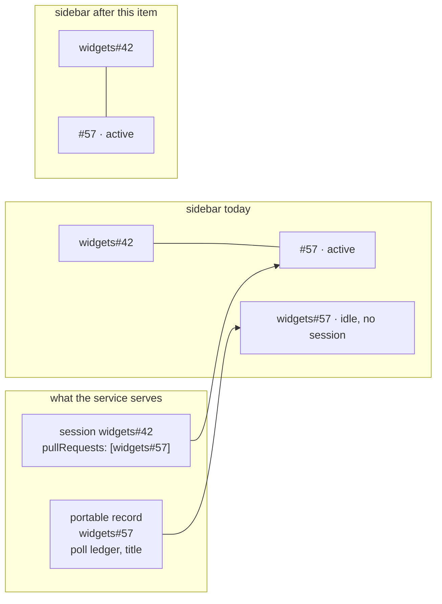

# Requirements: a pull request appears once on the board, under the item it delivers

> Phase 1 of 3 (requirements → design → tasks). Following the Kiro spec approach
> (https://kiro.dev/docs/specs/). Tier 3 (`human-approves-pr`): a join-layer defect in one
> screen plus a three-line correction in a derived read — no contract change.

## Introduction

[Issue #302](https://github.com/MadaraUchiha-314/the-loop/issues/302): a pull request that
is linked to a work item renders **twice** in the control-plane sidebar — nested under its
parent (from the parent session's `pullRequests`), *and* as an independent top-level
work-item row of its own.

A labeled pull request has two identities on this machine, and **both are written on
purpose**:

1. **A portable record keyed by the PR's own ref.** `GithubPollingSource.list_work_items`
   lists labeled PRs alongside labeled issues, and every polled item's ledger is flushed
   under its own ref (`self.state.flush(item.ref)`, `poller/poller.py`). That ledger is
   what stops the poller re-reading the same comments each cycle; it is not a claim that
   the PR is a work item.
2. **A session endpoint nested under the item it delivers.** When a PR event routes to the
   issue's session, `link_pull_request` appends an endpoint to the parent record's
   `pullRequests` — one level deep, by design (issue-172).

`buildWorkItemViews` joins the two sources by *unioning* their refs
(`new Set([...workItems, ...sessions])`) and never asks whether a top-level ref is already
somebody's pull request. The join was invisible until PR #301 started rendering
`sessionTree`; the double identity predates it.

The top-level copy is a shell: the PR's live session lives nested under the parent, so the
row finds no session, shows a grey dot, sorts into the idle end of the list, and — because
the poller's label armed it — the service reports `armed-without-session` against it, which
is a false negative about a PR that is being actively worked.

## Requirements

### Requirement 1 — one row per pull request

**User story:** As an operator reading the board, I want a pull request to appear once, so
that the sidebar counts the work that exists and not the records that describe it.

#### Acceptance criteria

1.1 WHEN a ref is drawn as some work item's nested pull-request row, the join SHALL NOT
also emit a top-level work item for that ref, whether or not the ref has a portable
record of its own.

1.2 WHEN a pull request is claimed by **no** session — a PR linked to no issue, which
`extract_work_items` deliberately routes as its own work item — it SHALL remain a
top-level row. This is the standalone-PR path and it is not a duplicate.

1.3 WHEN the claiming work item runs a loop with no outer/inner split
(`pdlc-adhoc-loop`, `pdlc-contribution-loop`, `pdlc-review-loop`), whose row draws **no**
nested PR list at all, the claimed ref SHALL stay top-level: a claim that is never drawn
would delete the pull request from the board rather than move it.

1.4 WHEN the claimed ref has a **session record of its own**, it SHALL stay top-level.
Such a ref was worked standalone before it was linked: its own record is the live one and
the nested endpoint is the stub `link_pull_request` writes, with no tmux target and no
conversation id. `SessionRegistry.record_owning` resolves the ref the same way, and
hiding a running session behind a row that cannot reach it is a worse answer than an
extra row.

1.5 A work item SHALL NOT be removed by its own record — a self-claim (a session listing
itself among its pull requests) SHALL be ignored, and so SHALL a claim by a ref that is
itself claimed. The registry nests exactly one level; the join SHALL fail closed to
"top-level" rather than drop both rows for a record that says otherwise.

### Requirement 2 — nothing the removed row carried is lost

**User story:** As an operator, I want removing the duplicate to move information, not
delete it, so that a PR that needs me still reaches me.

#### Acceptance criteria

2.1 The nested pull-request row SHALL carry the PR's own portable record, so that a PR
whose endpoint has never recorded an event still shows an age — its `poll.lastPolledAt`,
the same fallback a work item's row already uses.

2.2 WHEN the service reports attention against a claimed PR's ref (`recent-error`,
`awaiting-input`), the inbox SHALL surface it on the **owning work item's** card, named
for the pull request — the way a PR's human gate already surfaces there.

2.3 WHEN an agent working a claimed PR has an open `the-loop ask` question, the owning
work item's sidebar row SHALL carry the `needs input` chip, and the inbox SHALL offer the
Reply action against the PR's ref.

2.4 No other chip SHALL be newly promoted from a pull request to its work item's row.
This work item restores what the removed row showed; it does not add reporting the board
never had.

2.5 The fold SHALL apply **only** to a pull request whose top-level row was actually
removed. A PR that keeps a row of its own (R1.2–R1.5) SHALL keep reporting there
and SHALL NOT also report on its work item — that would be the same duplication in
different clothes.

### Requirement 3 — a nested pull request is not "armed without a session"

**User story:** As an operator, I want the attention list to answer "is this being
worked?" against the place the session actually is, so that every linked, labeled PR
does not permanently report a stall.

3.1 WHEN `list_attention` tests whether a work item has a live session, it SHALL count a
live **pull-request endpoint** nested under another session's record as a session for
that ref.

3.2 The check SHALL remain a read over what the machine already knows; no new store, no
new endpoint, no change to what `GET /api/v1/attention` returns for any other kind.

### Requirement 4 — no contract change

4.1 This work item SHALL add no endpoint, request shape or response shape.
`GET /api/v1/work-items` SHALL keep returning every portable record: the ledger for a PR
is a legitimate record, and the client is where the two sources meet.

4.2 The reconciliation SHALL live in the existing join (`buildWorkItemViews`) and reuse
the existing notion of a treeless loop rather than growing a second one.

## Security considerations

Client-side reconciliation of records the page already holds, plus one liveness lookup
widened on the service. No new trust boundary, no credential (the dashboard holds none —
see `docs/capabilities/control-plane.md`).

| # | Abuse case | Boundary | Mitigation |
|---|------------|----------|------------|
| A1 | A hand-edited or hostile session record lists another work item among its `pullRequests`, hiding that item from the board | service → browser join | R1.5: a self-claim is ignored, and a claim by a ref that is itself claimed is discarded, so the join cannot be walked into removing a chain of rows. The claim only ever *moves* a row under the claimant, which stays visible |
| A2 | A session record claims a PR it does not deliver, so the PR's attention is reported on the wrong item's card | service → browser join | The claim is exactly the routing binding the dispatcher already trusts to deliver events into that session (`link_pull_request`). A record that can misattribute a card can already misroute a reply; this adds no authority |
| A3 | The widened liveness lookup lets a closed PR endpoint suppress a genuine `armed-without-session` | service, `core/attention.py` | Only `active`/`paused` count, the same test top-level sessions get; a closed endpoint changes nothing |

## Out of scope

- **Recording parentage server-side** (a `kind`/`parent` field on the portable record, or
  filtering `list_work_items`). Rejected in `design.md` with reasons: the session registry
  already carries the binding, `core/workitems.py` is a read over the portable store
  alone, and a persisted field would be a second copy of a fact that can go stale.
- **Stopping the poller writing a ledger for a labeled PR.** The ledger is what makes the
  poll idempotent; deleting it would re-deliver comments.
- Collapsing, counting or grouping the sidebar's rows (issue-300 drew that boundary).
- Promoting a PR's human gate to its work item's row (R2.4) — the inbox already carries it.
