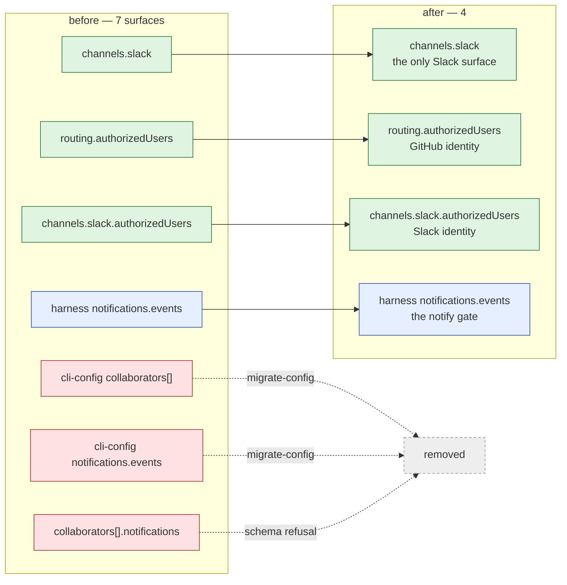

# Design: one Slack surface, two identity allow-lists

> Phase 2 of 3. Derived from the locked `requirements.md`; `testing-plan.md` is derived
> from this and reviewed with it.

## Overview

Seven declarable surfaces, three of them read. The change deletes the four that are not,
and it deletes them the way this codebase has already deleted three other config keys —
`ghBinary`, `polling.stateFile`, `integrations.slack` — because a removal without a
migration is just a config that stops working on upgrade day.



The two removals are not symmetric, and the difference decides the mechanism.

| | `collaborators[].notifications` | cli-config `collaborators` / `notifications` |
|---|---|---|
| Lives in | a **repository's** `collaborators.yaml` | the **operator's** `cli-config.yaml` |
| Versioned? | no version gate — the file has a `version` field nothing enforces | yes — `CURRENT_CONFIG_VERSION`, `assert_current`, `migrate_cli_config` |
| Retired by | schema refusal at validation time | the versioned migration, exactly as `integrations.slack` was |

So: the collaborator file gets a **better error**, the CLI config gets a **migration**.

## The collaborator file: a retired-key registry in the validator

`additionalProperties: false` already refuses a collaborator carrying `notifications` —
but it refuses it as `collaborators[0].notifications: unknown key`, which tells an operator
that a key is wrong and nothing about where the thing they wanted now lives. R1.2 asks for
better, and the cheapest honest way to get it is a small table beside the validator:

```python
RETIRED: Dict[str, str] = {
    "collaborators[].notifications": "…configure `channels.slack` … `the-loop migrate-config`",
    "collaborators":  "…",   # cli-config's top-level block
    "notifications":  "…",
}
```

`_check_object` already knows the path it is about to call unknown. It normalises the
array indices out of that path (`collaborators[0].notifications` →
`collaborators[].notifications`) and, on a hit, appends the guidance to the message. Three
properties make this worth its ~15 lines:

1. **It is a lookup, not a code path.** No branch in the validator changes; an entry that
   never matches costs one dict `get` per unknown key, and unknown keys are the error path.
2. **It reads as documentation.** The table is the list of things the-loop used to accept,
   with what replaced each — the same job `migrations.py`'s module docstring does for the
   CLI config.
3. **It generalises the next removal.** The next retired key adds a row.

The alternative — keeping `notifications` in the schema with a `deprecated` marker — was
rejected: `deprecated` is not in `SUPPORTED`, adding it means teaching the validator a
keyword that constrains nothing, and a schema that still *accepts* the key is exactly the
silent-acceptance failure R2.2 exists to prevent.

## The CLI config: one more entry in the migration ledger

`migrations.py` already carries four retirements. This adds a fifth in the same shape —
site constant, `needs_migration` probe, `assert_current` refusal, `migrate_cli_config`
removal — and bumps `CURRENT_CONFIG_VERSION` to **0.6.0**.

```mermaid
sequenceDiagram
  participant Op as operator
  participant CLI as the-loop
  participant M as migrations.py
  Op->>CLI: the-loop poll   (config 0.5.0, collaborators + notifications)
  CLI->>M: assert_current(config)
  M-->>CLI: ConfigTooOld("still declares `collaborators` … `channels.slack` … run /the-loop:upgrade-the-loop")
  CLI-->>Op: refuses to start, naming the fix
  Op->>CLI: the-loop migrate-config
  CLI->>M: migrate_cli_config(config)
  M-->>CLI: report: 2 removals + version 0.5.0 → 0.6.0, note: configure channels.slack
  CLI-->>Op: wrote cli-config.yaml (previous kept at cli-config.yaml.bak)
  Op->>CLI: the-loop migrate-config      (again)
  CLI-->>Op: config is already current; nothing to migrate
```

Both blocks are removed by one pass over a tuple of top-level keys, so the note is emitted
once however many of them were present. The note fires **only when the removed block
carried something** (R3.4): an operator whose `collaborators: []` was the shipped empty
default is told the key went away, not lectured about a Slack setup they never had.

`_dig`/`_parts`/`MigrationReport` are reused verbatim; nothing in the existing four
retirements is touched.

## What the removal does to the schema graph

`cli-config.schema.json`'s `collaborators` was the **only** cross-schema `$ref` in the
tree (`collaborators.schema.json#/$defs/collaborator`). After the removal the CLI config
schema has no `$ref` at all, and `collaborators.schema.json` keeps only same-document ones
(`#/$defs/role`, `#/$defs/collaborator`).

The cross-document resolution in `configschema._dereference` and the `RefResolver` store in
`scripts/validate_config.py` therefore stop being exercised by production data. They are
**kept**: both are ten lines, both are covered by their own tests, and removing a working
generalisation because today's only user went away is how the next `$ref` gets added
wrong. What must change is the two tests that assert *cli-config* resolves a
cross-schema ref — they assert a property the CLI config no longer has, and are re-pointed
at the collaborators schema (which still has refs) plus the invariant that actually
matters: no `$ref` survives in a served schema.

## Files

| File | Change |
|------|--------|
| `.the-loop/collaborators.schema.json` | drop `$defs/notificationChannel` and `collaborator.notifications`; rewrite the title/description and the `roles` description to stop describing delivery |
| `.the-loop/cli-config.schema.json` | drop top-level `collaborators` and `notifications` |
| `cli/the_loop/schemas/*.schema.json` | byte-identical copies (parity test) |
| `cli/the_loop/configschema.py` | `RETIRED` table + the `_check_object` lookup |
| `cli/the_loop/migrations.py` | `CURRENT_CONFIG_VERSION` → `0.6.0`; the fifth retirement |
| `.the-loop/cli-config.yaml`, `.the-loop/collaborators.yaml` | drop the blocks; `version: "0.6.0"` |
| `skills/the-loop/templates/{cli-config,collaborators}.yaml` | same, commented examples included |
| `skills/the-loop/reference/collaboration.md` | the notification section says channel, not per-person |
| `docs/config/cli/observability-options.md` | reduced to `eventLog`; the two blocks' sections removed |
| `docs/config/cli/index.md` | the map row for that page |
| `docs/config/harness-config.md` | the `collaborators` section drops the channel prose |
| `docs/capabilities/channels.md` | a behaviour line + a History row |
| `commands/upgrade-the-loop.md` | the retired-shape checklist |
| `cli/tests/*` | new refusal/migration tests; two re-pointed ref assertions |

## Alternatives considered

| Alternative | Why not |
|-------------|---------|
| Wire per-collaborator delivery instead of removing it | It is deferred scope by an explicit design decision (issue-245). Building it to justify the config is the tail wagging the dog, and a delivery path nobody asked for is worse than none. |
| Leave the config, document it as "not implemented" | The failure mode is silence. A doc note does not reach the operator who reads only the YAML comments — which is most of them, since that is where every other option is explained. |
| Keep the keys, warn at load | A warning on a daemon that runs detached is a line in a log nobody tails. The codebase's own precedent (`assert_current`) is to refuse. |
| Mark them `deprecated: true` in the schema | Teaches the hand-rolled validator a keyword that constrains nothing, and still accepts the key. |
| Delete without a migration | Breaks every existing config on upgrade with a bare "unknown key". The four prior removals all shipped a migration; this one is not special. |
| Also remove the now-unused cross-schema `$ref` machinery | Scope creep, and it deletes a tested generalisation to save ten lines. |
