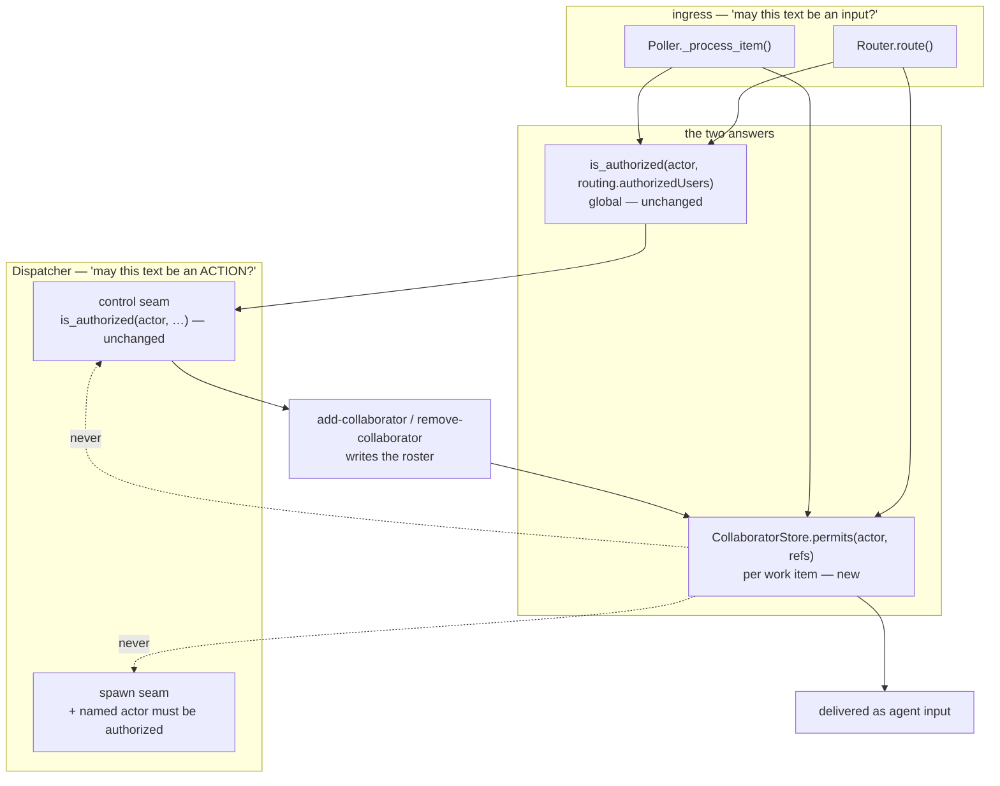

# Design: per-work-item collaborators

> Phase 2 of 3. Derived from the locked `requirements.md`; reviewed together with
> `testing-plan.md`.

## Overview

One new store, two guarded seams, two new words in an existing vocabulary. Nothing is
rewritten: the authorization model gains a *second, narrower* answer at the one question
both ingress paths already ask.



The shape of the change is deliberately the mirror of issue-63's: that work item made
**one** list the answer to "may this text be an input?", and this one adds a second list
that answers the same question for **one work item** — while every question about *actions*
(control commands, spawning, arming, human gates) keeps consulting the first list alone.

## 1. The store — `the_loop/collaborators.py`

A fourth section of the portable work-item record, beside `control`, `poll` and `graph`
(`the_loop.workitem.SECTIONS`), for the reason issue-128 gives for the other three: *"an
authorized user invited Dana onto this item"* is true on any machine.

```json
"collaborators": {
  "users": [
    {
      "login": "dana",
      "addedBy": "MadaraUchiha-314",
      "addedAt": "2026-08-31T16:20:11Z",
      "source": "comment",
      "note": "https://github.com/owner/repo/issues/307#issuecomment-1"
    }
  ]
}
```

```python
COLLABORATORS = "collaborators"                     # the section name (workitem.py)
LOGIN_RE = re.compile(r"[A-Za-z0-9](?:[A-Za-z0-9]|-(?=[A-Za-z0-9])){0,38}")

def normalize_login(raw: str) -> str                # "@Dana" -> "dana"; "" when invalid
def parse_logins(text: str) -> List[str]            # the @login run at the head of `text`

class CollaboratorRecord: login, added_by, added_at, source, note
class CollaboratorStore:
    def list(work_item) -> List[CollaboratorRecord]
    def add(work_item, login, actor, source, note) -> bool     # False = already there
    def remove(work_item, login) -> bool                       # False = wasn't there
    def is_collaborator(actor, work_item) -> bool
    def permits(actor, refs: Sequence[ref]) -> bool             # any of them
    def clear(work_item) -> bool
```

Four decisions live in those signatures:

- **`normalize_login` is the whole parser.** GitHub's login grammar (1–39 of
  `[A-Za-z0-9]`, interior single hyphens) is the only shape that survives; everything else
  returns `""` and the caller refuses. This is the R4.2 mitigation for A3, and it is one
  function so the comment path and the CLI path cannot disagree about what a login is.
- **Case-folding on write and on compare** (R1.5). GitHub logins are case-insensitive;
  storing `@Dana` and then failing to recognise `dana` would be a silent revocation.
  (`routing.authorizedUsers` stays exact-match — this work item does not change how the
  *global* list compares, and saying so is the point.)
- **`permits` takes the refs the event already named**, and answers "any". That, plus the
  fact that the caller passes only the event's own refs, *is* R3.7: a grant reaches the
  work item and its linked pull requests because those refs travel on one event, and
  reaches nothing else because no other ref is ever asked about.
- **`add` returns whether it changed anything**, so "already a collaborator" is reported
  rather than duplicated (R1.4) and the CLI can exit honestly.

Writes go through `WorkItemStore.write_section`, which is read-modify-write on the record
and atomic on the file, so a grant cannot clobber a control command recorded a moment
earlier by the other ingress.

## 2. The vocabulary — `the_loop/control.py`

Two constants join the nine: `ADD_COLLABORATOR = "add-collaborator"` and
`REMOVE_COLLABORATOR = "remove-collaborator"`, defaulting to `the-loop add-collaborator`
and `the-loop remove-collaborator`, and a third command class beside `GRAPH_COMMANDS` and
`TEARDOWN_COMMANDS`:

```python
COLLABORATOR_COMMANDS = (ADD_COLLABORATOR, REMOVE_COLLABORATOR)
```

They are their own class because they are the only commands that act on **neither** the
session registry nor the graph, and — a first for this vocabulary — the only ones that
carry an argument.

`ControlResult` gains `subjects: List[str]`. `parse_command` still returns one command from
a fixed set or nothing; when that command is a collaborator command it additionally walks
every occurrence of the keyword and collects the `@login` run that follows, stopping at the
first token that is not one (R4.3). The narrowness the module's docstring promises is
preserved by construction: what reaches the caller is a command constant plus zero or more
strings that matched `LOGIN_RE` — never a substring of the body.

The ambiguity rule is untouched: two *different* commands in one body is still a refusal
(R4.5), and the two new ones are ordinary members of `COMMANDS` for that purpose.

`command_comment` grows a `subject` and an `invocation` parameter, because these two verbs
are top-level CLI commands rather than `the-loop sessions <verb>`, and the comment the CLI
posts has to carry the login for the thread to mean anything (R5.2).

## 3. The webhook path — `webhook/router.py`, `webhook/dispatcher.py`

**Router.** One `elif` at the existing authorization guard:

```python
if not is_lifecycle_close and not is_authorized(actor, self.authorized_users):
    if not (actor and self.collaborators and self.collaborators.permits(actor, work_items)):
        <drop, exactly as today>
    <else: emit routing.collaborator and fall through>
```

The store arrives by injection (`Router(collaborators=dispatcher.collaborator_store)`) so
the router keeps knowing nothing about the state layout, and a router built without one
behaves precisely as it did before this work item — which is what makes the change safe to
reason about from the daemon outward.

**Dispatcher — the control seam is already right.** `handle()` re-checks
`is_authorized(actor, self.config.authorized_users)` before executing any command, and that
check is *why* a collaborator cannot issue one (R2.2, R3.4, A1, A2). It was written as
belt-and-braces for actor-less poll comments; this work item makes it load-bearing, so the
tests assert it directly rather than by inheritance.

**Dispatcher — the spawn seam gets a check of its own.** `_spawn_refusal` gains:

```python
actor = event_actor(routed.event, routed.payload)
if (actor
        and not is_authorized(actor, self.config.authorized_users)
        and self.collaborator_store.permits(actor, routed.work_items)):
    return "collaborator-no-spawn"
```

Both halves of the test are stated, rather than inferring the second from the first,
because the inference is the kind that rots: *today* a named actor outside
`authorizedUsers` can only have reached dispatch through a grant, since a comment gets in
through one of those two lists and no other — but a seam that says what it means survives
the next admission path, and reads as the rule it is. Actor-less events are untouched (CI
status, and the poller's own presence, whose `_item_payload` writes no `sender`), which is
what keeps decision-074 intact: an unauthorized author's item still starts on an authorized
user's recorded `start`. The reason joins `SETTLED_SUPPRESSED`, so a refused delivery is
settled rather than retried until the issue-80 budget is spent (A6, R3.2).

The **dangerous** half of the same question — a control command — is not guarded here at
all, and deliberately: it is guarded upstream by the control seam's unconditional
named-and-allowlisted-actor check, which refuses whoever the actor turns out to be.

**Dispatcher — executing the two verbs.** A third branch beside `GRAPH_COMMANDS`:

```python
elif control.command in COLLABORATOR_COMMANDS:
    self._apply_collaborator(control, routed, actor); return
```

`_apply_collaborator` refuses a body with no login (`missing-collaborator`, R4.4), applies
each login to the roster, emits one `control.command` per applied login naming it, and
settles the delivery (R4.7). It never touches `ControlStore`: these commands do not arm,
disarm or select a graph, and recording them as the work item's control state would make an
item look started because somebody was invited to it.

**Closure.** Where `handle()` already calls `control_store.clear(session.work_item)` on a
closed item, `collaborator_store.clear(...)` joins it (R1.6), and `reset.py` gains the
section so `sessions reset` forgets it too. `the-loop cleanup` is deliberately **not** a
clearer: it releases local resources and keeps the portable record by contract (issue-186),
and it disarms the item anyway, so a kept roster has nothing to reach.

## 4. The poll path — `poller/poller.py`

Two edits, mirroring the webhook path:

- the comment-candidate filter accepts a comment whose author is authorized **or** a
  collaborator on this item's refs (R3.1);
- `spawn_authorized` and `_pending_control_ids` are left exactly as they are — the first
  because a collaborator may not arm (R3.3), the second because a collaborator may not
  command (R3.4). Their unchangedness is asserted by test, not assumed.

The store is reached the way the control store already is — `self.dispatcher.collaborator_store`
unless one was injected — so both daemons read one roster from one directory.

## 5. The CLI — `commands/collaborators_cmd.py`, `core/collaborators.py`

```
the-loop add-collaborator @LOGIN [@LOGIN …] --work-item github:OWNER/REPO#N
the-loop remove-collaborator @LOGIN [@LOGIN …] --work-item github:OWNER/REPO#N
```

`core.collaborators.manage_collaborators(ref, verb, logins, …)` does the work in the order
`core.sessions.control_session` established and for the same reason: **local effect first,
ticket comment last**, because the comment is a report and a failing `gh` must never leave
the thread claiming something the-loop did not do (R5.3).

The command runs **in-process**, not through the control-plane service. This is the
`the-loop ask` / `sessions reset` exception class, quoted from `ask_cmd`'s own docstring:
the logic lives in `core/`, "so a route or MCP tool later is a binding, not a port". The
grant is a small write on a tracked record plus a comment; requiring a running service for
it would make the roster unfixable in exactly the situation an operator most wants to fix
it (decision-102).

## 6. What deliberately does not change

| Not changed | Why |
|-------------|-----|
| `graph/hooks/*` (`feedback`, `goal`, `selection`, `review`) | They read `config.authorizedUsers`; approval is not delegated (R3.5, A5) |
| `graph/bootstrap.py` | Nothing new is put into the graph's config: the hooks must not be able to see a roster they are not allowed to honour |
| `channels/slack.py`, `channels/inbound.py` | A separate surface with a separate allow-list (issue-304). The new keywords are defanged in Slack replies automatically, because that defanging reads `DEFAULT_KEYWORDS` |
| `routing.authorizedUsers` semantics, including exact-match comparison | Widening the global list's matching is a different decision, and not this one |
| `.the-loop/collaborators.yaml` and its schema | The project-roles file is a plugin concept the daemon never reads (decision-032, decision-035) |

## 7. Alternatives considered

1. **Put collaborators in the CLI config, keyed by work item.** Rejected: the config is the
   daemon's *policy*, edited by hand and reloaded; a roster is per-item *state* with a
   lifecycle (granted, revoked, cleared on closure), which is what the portable record is
   for. It would also put a work item's people on a machine rather than on the work item.
2. **A `collaborator:<login>` label on the ticket.** Tempting — GitHub already stores it,
   and it is visible. Rejected: labels are writable by anyone with triage rights, which is
   a *wider* set than `authorizedUsers`, so the grant's authorization would be GitHub's
   rather than the-loop's. The auto-execute label is safe precisely because it is
   necessary-not-sufficient; a grant has no second gate behind it.
3. **Let collaborators satisfy human gates with a reduced outcome set** (they may request
   changes, not approve). Rejected as scope: it needs a second notion of provenance inside
   `classify-feedback` and an answer for "what if a collaborator and an authorized user
   disagree in the same round". Recorded as out of scope, not as impossible.
4. **A `RoutedEvent.collaborator_only` flag** set by the router and read at the spawn seam.
   Rejected in favour of re-checking the actor at the seam itself: the poller builds
   `RoutedEvent`s by hand (`provider.comment_event`), so a flag would have to be set in two
   places and would fail open if a third appeared. The re-check reads the payload the
   dispatcher already has and cannot be forgotten by a new producer.
5. **Filtering `routed.work_items` down to the refs a collaborator holds.** Rejected: the
   refs on one event are the refs that already share one session (issue-172), so the filter
   would change which item a comment is attributed to without changing who can reach it —
   more moving parts for the same boundary.
6. **A control-plane route + dashboard editor for the roster.** Deferred, deliberately
   (R5.5): the core function is written so adding one is a binding.

## 8. Risk

Tier 4. The failure mode that matters is not "a collaborator cannot comment" — it is a
collaborator reaching an action. Three assertions carry that weight, and each is tested
directly rather than inherited: the control seam's named-actor re-check (A1, A2), the spawn
seam's new one (A6), and the graph hooks' unchanged `authorizedUsers` read (A5).
`security.review.humanSignOffMinTier: 4` therefore applies: this needs a named human
security sign-off before merge.
