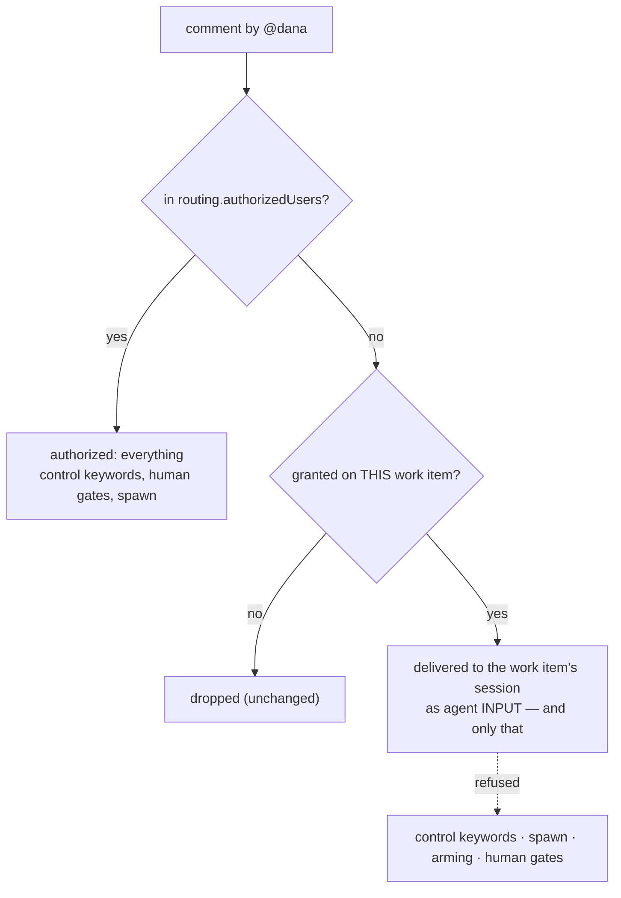

# Requirements: per-work-item collaborators

> Phase 1 of 3 (requirements → design → tasks). Following the Kiro spec approach
> (https://kiro.dev/docs/specs/). Tier 4 (`human-approves-pr` **plus** a named human
> security sign-off, `security.review.humanSignOffMinTier: 4`): this widens the
> prompt-injection boundary that `routing.authorizedUsers` has been the whole of since
> issue-63.

## Introduction

[Issue #307](https://github.com/MadaraUchiha-314/the-loop/issues/307): the-loop has exactly
one runtime identity allow-list for GitHub, `routing.authorizedUsers`, and it is
**global** — a login is either able to direct every work item this daemon watches, or able
to direct none of them. There is no way to say "Dana is answering questions on this one
issue".

Today the consequence is not "Dana has less power"; it is that Dana is **invisible**. Both
ingress paths drop her comment before anything reads it (`Router.route`,
`Poller._process_item`), so an agent that asked a question and is waiting for the person
who actually knows the answer never hears it. The operator's two options are both wrong:
add Dana to `authorizedUsers` — which hands her every work item, including
`the-loop cleanup` on all of them — or relay her answers by hand.

This work item adds the missing middle: a **work-item collaborator**. An authorized user
grants a GitHub login collaborator status on one work item; that login's comments on that
work item become input the-loop acts on, and nothing else changes hands.

> **Two things are called "collaborators" in this repository, and they are unrelated.**
> `.the-loop/collaborators.yaml` names the project's stewards and their *roles*
> (architect, approver, …) for the **plugin**; the CLI daemon never reads that file
> (decision-032, decision-035). A **work-item collaborator** — this work item's subject —
> is a runtime identity grant, per work item, held in that work item's portable record and
> read by the daemon. Where the distinction matters, the docs say "work-item collaborator"
> in full.

## Requirements

### Requirement 1 — a roster that belongs to one work item

**User story:** As an operator, I want to name the people who may speak to *this* piece of
work, so that inviting a domain expert onto one issue does not hand them the daemon.

#### Acceptance criteria

1.1 the-loop SHALL keep, per work item, a list of GitHub logins granted work-item
collaborator status on it, stored in a `collaborators` section of that work item's
portable record (`<state.root>/portable/<slug>.json`).

1.2 A grant SHALL be scoped to exactly one work-item ref. It SHALL NOT extend to any other
work item; granting the same login elsewhere SHALL require a fresh grant by an authorized
user.

1.3 Each entry SHALL record the login, who granted it, when, through which surface
(`comment` or `cli`), and the granting comment's URL when there is one.

1.4 A login SHALL appear at most once per work item. Adding a login already on the roster
SHALL be a no-op that reports itself as one; removing a login that is not on the roster
SHALL likewise change nothing and say so.

1.5 Logins SHALL be compared case-insensitively and stored without the leading `@`, so
`@Dana`, `dana` and `@dana` are one person — the way GitHub itself treats them.

1.6 WHEN the work item's issue or pull request **closes**, the roster SHALL be cleared,
exactly as the control record is; and `the-loop sessions reset` SHALL forget it with the
rest of the portable record. A grant is scoped to the work item's active life; the ticket
thread and the event log remain the record that it was made. `the-loop cleanup` SHALL
**keep** it, because cleanup releases *local resources* and keeps the portable record by
contract (issue-186) — the roster is tracking, not a resource.

1.7 The roster SHALL survive a daemon restart and SHALL travel with the work item's
portable record, because "an authorized user invited Dana onto this item" is true on any
machine.

### Requirement 2 — only an authorized user may grant

**User story:** As the operator, I want the grant itself to stay mine, so that a
collaborator cannot widen their own reach or bring others in.

2.1 Adding or removing a work-item collaborator SHALL require a **named** actor present in
`routing.authorizedUsers` — the same stricter re-check every control command already makes
(a nameless actor is refused, an empty allow-list authorizes nobody).

2.2 A work-item collaborator SHALL NOT add or remove work-item collaborators, on any work
item, including the one they are granted on. There is no transitive grant.

2.3 An add/remove attempt by anyone else SHALL execute nothing, forward nothing to the
agent, and be recorded as `control.rejected` with the reason `unauthorized-actor`.

2.4 The CLI surface (R5) SHALL be authorized by shell access to the machine running
the-loop, as `the-loop sessions start|stop|pause|resume|cleanup` already are.

### Requirement 3 — what a work-item collaborator may do, and may not

**User story:** As an operator, I want a collaborator's reach to be one sentence I can hold
in my head, so that granting one is a decision I can make quickly and safely.

**The sentence:** *a work-item collaborator supplies input on one work item; an authorized
user directs the loop.*

3.1 WHEN a work-item collaborator comments on a work item they are granted on, that comment
SHALL be delivered to that work item's session as agent input, on **both** ingress paths —
the webhook receiver and the poller.

3.2 A work-item collaborator's comment SHALL NOT spawn a session, on either path. Where no
session exists, the event SHALL be refused with a reason of its own
(`collaborator-no-spawn`) and settled, not retried.

3.3 A work-item collaborator's comment SHALL NOT arm or disarm a work item, and SHALL NOT
satisfy `routing.control.requireStartCommand`. Only an authorized user's recorded command
does that (issue-106, decision-074), and that is unchanged.

3.4 A work-item collaborator SHALL NOT issue any control command — `start`, `stop`,
`pause`, `resume`, `execute`, `contribute`, `do`, `review`, `cleanup`, or the two this work
item adds. Such a comment SHALL be refused per R2.3 and SHALL NOT be forwarded to the agent
either: a recognised keyword is an instruction to the-loop, whoever typed it.

3.5 A work-item collaborator's text SHALL NOT satisfy a human gate the graph reserves for
an authorized user — `phase-selection`, `goal-definition`, the review brief and its
follow-up, artifact approval, or a security sign-off. Those gates read
`config.authorizedUsers` and SHALL keep reading exactly that.

3.6 Nothing an authorized user can do today SHALL change.

3.7 A grant SHALL cover the work item **and the objects the loop already treats as that
work item** — the pull requests linked to it — because an event on a linked pull request
already routes to the same session. A grant SHALL NOT reach a work item that shares no
event with the granted ref.

### Requirement 4 — the vocabulary

**User story:** As an authorized user, I want to grant collaboration where the work is,
so that I do not have to reach a terminal to add someone to a thread I am already reading.

4.1 Two keywords SHALL be declared in `routing.control.keywords` alongside the existing
nine, defaulting to `the-loop add-collaborator` and `the-loop remove-collaborator`, and
matched by the same whole-token, case-insensitive rule.

4.2 The login SHALL be read only as a strictly validated GitHub login token immediately
following the keyword and introduced by `@` (GitHub's own shape: 1–39 characters of
`[A-Za-z0-9]` and interior single hyphens). No other text from the body SHALL reach the
store, a path, an argv, a prompt or a comment.

4.3 Several `@login` tokens MAY follow one keyword, and the keyword MAY appear more than
once in a body; each named login SHALL be applied. Scanning SHALL stop at the first token
after the keyword that is not an `@login`, so ordinary prose after the names is ignored
rather than rejected.

4.4 A body carrying a collaborator keyword and no valid `@login` SHALL be refused with the
reason `missing-collaborator`, recording nothing.

4.5 A body carrying two **different** control commands SHALL remain refused as ambiguous —
the existing rule, unchanged, and it SHALL cover the two new commands.

4.6 Setting either keyword to `""` SHALL disable that command, as it does for every other.

4.7 A comment carrying one of these keywords SHALL be **executed, never forwarded** to the
agent, and its delivery SHALL be settled so neither a redelivery nor the next poll cycle
applies it twice.

### Requirement 5 — the same two verbs from the CLI

**User story:** As the operator, I want to grant from the terminal too, so that I can fix a
roster when GitHub is unreachable or when I am already in the checkout.

5.1 `the-loop add-collaborator @LOGIN --work-item <ref>` and
`the-loop remove-collaborator @LOGIN --work-item <ref>` SHALL apply exactly the effect the
keyword does.

5.2 Each SHALL post the same keyword and login back to the work item, carrying the
loop-prevention marker, so the thread stays the complete record of who granted what — the
contract `the-loop sessions start` already keeps.

5.3 The local effect SHALL be applied first and the comment posted after, as a report: a
failing `gh` SHALL NOT fail the grant, and SHALL be said out loud.

5.4 A malformed login or work-item ref SHALL exit 2 and change nothing.

5.5 The verbs SHALL run in-process, with their logic in `the_loop.core`, the same exception
class `the-loop ask` and `the-loop sessions reset` are documented under: they must work
when no service is running.

### Requirement 6 — the paper trail

6.1 Every applied grant or revocation SHALL emit a `control.command` event carrying the
work item, the command, the actor, the surface and the effect; every refusal SHALL emit
`control.rejected` with its reason.

6.2 The event log SHALL name the login the grant is about, and SHALL NOT carry any other
text from the comment.

## Security considerations

This work item widens, for the first time since issue-63, the set of people whose text
the-loop will act on. The boundary it adds is deliberately one-way: a work-item
collaborator can reach the **agent's input**, and nothing that reaches the **daemon's
actions**.

| # | Abuse case | Boundary | Mitigation |
|---|------------|----------|------------|
| A1 | A commenter grants themselves collaborator status | comment → control path | R2.1: the collaborator commands are control commands, and the control path re-checks for a *named* login in `routing.authorizedUsers` **after** the ingress check. A collaborator now passes ingress, so this re-check is what stops them — it is asserted directly, not inherited |
| A2 | A granted collaborator escalates by typing `the-loop start`/`cleanup`/`execute` | comment → control path | R3.4, same re-check; refused and **not** forwarded, so the agent never reads it as instruction either |
| A3 | Prompt injection through the login argument (a path, an argv fragment, a prompt) | comment body → store/CLI | R4.2: the only text extracted is a token matching GitHub's login grammar; everything else in the body is ignored. Nothing built from it reaches a shell (`comment_argv` passes bodies as arguments, never through a shell) |
| A4 | A grant on one work item is used to reach another | store → ingress | R1.2 and R3.7: membership is looked up **only** against the refs the event itself names, which are the refs that already share a session |
| A5 | A collaborator approves a phase, defines the goal, or answers phase-selection | comment → graph hooks | R3.5: the hooks read `config.authorizedUsers`, which this work item does not touch. Asserted as a regression test, because "we didn't change it" is not evidence |
| A6 | A collaborator's comment spawns a session on an armed-but-unstarted item | comment → spawn seam | R3.2: the spawn seam re-checks global authorization for any **named** actor, mirroring the control seam. Actor-less events (CI, the poller's own presence) are unaffected, which is what keeps decision-074 working |
| A7 | The portable record is edited directly to add a collaborator | filesystem / a tracked file in a pull request | Same trust as the `control` section beside it: a writer who can forge `control: {command: start}` can already arm the item. The roster is in the same tracked, human-readable record and shows up in a pull-request diff; the derived `index.json` is rebuilt on every write |
| A8 | A revoked collaborator keeps reaching the session | store → ingress | Membership is read per event, never cached in the session; the next comment after the removal is dropped |
| A9 | A closed work item's roster is reused when it reopens | lifecycle | R1.6: the roster is cleared on closure with the control record. A `cleanup` keeps it, as it keeps the control record — and also disarms the item, so nothing re-spawns for it to reach |

## Out of scope

- **Any collaborator power beyond input.** Approving artifacts, answering `phase-selection`,
  defining a goal, arming a session: all reserved, deliberately (R3.5). If a collaborator
  should approve, the operator has `authorizedUsers`.
- **Slack.** `channels.slack.authorizedUsers` is a separate identity allow-list for a
  separate surface (issue-304); a Slack reply still needs a Slack member id on that list,
  and control keywords in a Slack reply stay defanged.
- **Org/team grants, wildcards, expiry.** A grant is one login on one work item, made by a
  human, cleared when the item ends.
- **A control-plane route or dashboard surface.** The core function is written where a
  route later is a binding rather than a port (R5.5), and none is added here.
- **Migrating `.the-loop/collaborators.yaml`.** The project-roles file is a plugin concept
  the daemon does not read; it is untouched.
