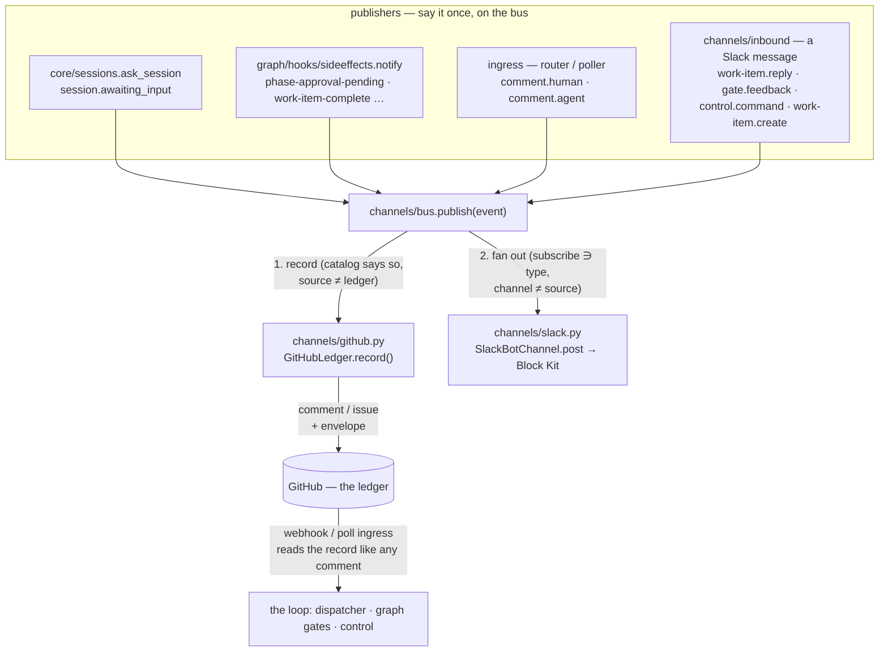
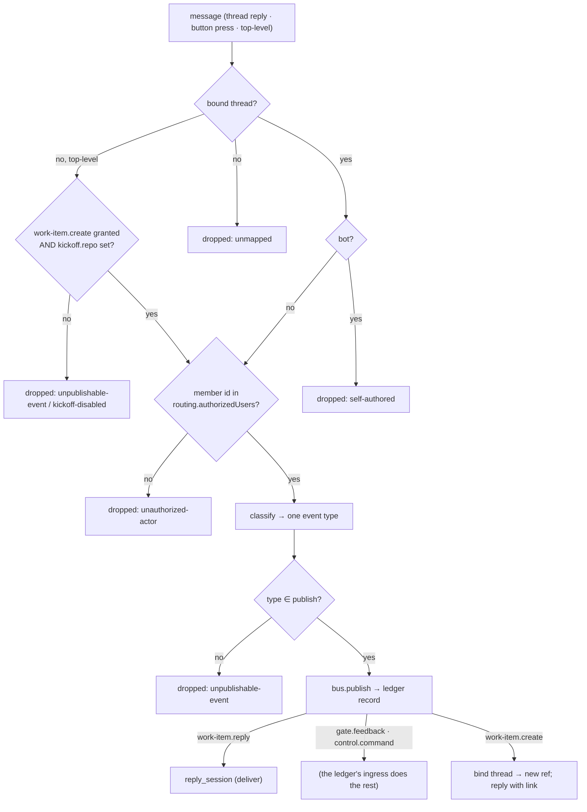

# Design: one event bus, many channels, one ledger

> Phase 2 of 3. Derived from [`requirements.md`](requirements.md); reviewed together
> with [`testing-plan.md`](testing-plan.md). Tier 4.

## Overview

The channels package (issue-245) already had the right nouns and the wrong verbs. A
channel filtered event types and rendered at a verbosity — but `ask` and `notify` each
called `broadcast()` themselves, the mirror was a step inside the Slack pipeline rather
than a property of the ledger, and a Slack reply could only ever be one thing. This
work item keeps the package and inverts the control: **the bus is the only caller of a
channel**, the **ledger is a channel with one extra duty** (record what came from
elsewhere), and what an inbound message *may become* is a **grant** read from the
catalog, not a branch in a pipeline.



The shape of the change is three moves:

1. **`Event` replaces `OutboundEvent`** and gains `source` and `actor`. Everything on
   the bus is one dataclass; the old name stays as an alias.
2. **`bus.publish()` replaces `broadcast()`** and grows the record step. `broadcast`
   stays as a one-line wrapper (`record=False`) so nothing outside the package moves in
   the same commit.
3. **The Slack pipeline classifies, then publishes.** `process_reply` becomes
   *classify → grant check → publish (record) → deliver-if-reply*. Two of the three new
   event types have **no handler in the pipeline at all**: their ledger record is a plain
   comment the ledger's ingress then judges. That is the whole of gap 3.

## 1. The catalog — `channels/events.py`

One table, four flags per row. `SUBSCRIBABLE_EVENTS` and `NOTIFICATION_EVENTS` keep
their names and their consumers; `PUBLISHABLE_EVENTS` and `RECORDED_EVENTS` are new
views of the same rows.

| Event | Origin | subscribable | publishable | recorded | Description |
|-------|--------|:-:|:-:|:-:|-------------|
| `session.awaiting_input` | cli | ✓ | | ✓ | the ask; its record **is** the question comment |
| `decision-pending` … `conflict-escalated` | loop | ✓ | | | the graph's notifications; `request-review` already comments |
| `work-item-complete` | loop | ✓ | | | now fired by the `complete` node |
| `comment.human` | github | ✓ | | | an accepted human comment (authorized or collaborator) |
| `comment.agent` | github | ✓ | | | a marker-stamped, envelope-less comment — the agent's own |
| `work-item.reply` | channel | | ✓ | ✓ | session input; recorded as the marked mirror, delivered by the pipeline |
| `gate.feedback` | channel | | ✓ | ✓ | an answer to an open gate; recorded **unmarked**, judged by ingress |
| `control.command` | channel | | ✓ | ✓ | a control keyword; recorded **unmarked**, executed by ingress |
| `work-item.create` | channel | | ✓ | ✓ | a new work item; the record is the issue |
| `standing.started` | loop | ✓ | | | a standing session's announcement (issue-277); no ticket |

```python
@dataclass(frozen=True)
class EventSpec:
    description: str
    subscribable: bool = True
    publishable: bool = False
    recorded: bool = False

EVENTS: Dict[str, EventSpec]
SUBSCRIBABLE_EVENTS: Dict[str, str]   # name -> description, unchanged shape
PUBLISHABLE_EVENTS: Tuple[str, ...]
def is_recorded(event_type) -> bool
```

`recorded` answers one question: *when this event did not start on the ledger, does the
ledger write it down?* The notifications are not recorded because the graph's own
`request-review` / `escalated` hooks already post the comment the human replies to;
recording them again would double every gate.

## 2. The event and the bus — `channels/base.py`, `channels/bus.py`

```python
@dataclass(frozen=True)
class Event:                      # OutboundEvent = Event (alias kept)
    event_type: str
    work_item: str
    text: str
    url: str = ""
    detail: Mapping[str, str] = {}
    source: str = "loop"          # loop | cli | github | slack | …
    actor: Optional[Principal] = None

@dataclass(frozen=True)
class PublishResult:
    record: Optional[PostResult]  # the ledger's write, None when not recorded
    posts: List[PostResult]       # one per subscribed channel

def publish(event, cli_config, *, channels=None, client_factory=None,
            record: Optional[bool] = None) -> PublishResult
```

`publish` does exactly R1.4: resolve the ledger, record when `record` (default: the
catalog's `recorded` flag) and `event.source != ledger.name`, then post to every enabled
channel with `subscribes(event.event_type)` and `name != event.source`. A record failure
is a `PostResult(ok=False)` and a `bus.record_failed` event — the caller decides what it
means (the ask's exit code still says the post failed; a reply's pipeline still
delivers). The channel `Protocol` grows `subscribes()`/`may_publish()`; `wants()` stays
as the old spelling of `subscribes()`.

## 3. The ledger — `channels/github.py`

```python
class GitHubLedger:
    name = "github"
    def subscribes(self, event_type) -> bool: return False   # the ledger is written to, not subscribed
    def record(self, event: Event) -> PostResult              # comment, or issue for work-item.create
```

Three record shapes, chosen by event type — and the choice is the security design:

| Event | Body | Marker | Envelope | Who then reads it |
|-------|------|:-:|:-:|-------------------|
| `session.awaiting_input` | the question | ✓ | ✓ | nobody — ingress drops it; a channel already got the event |
| `work-item.reply` | quoted, scrubbed, defanged | ✓ | ✓ | nobody — the pipeline delivered it |
| `gate.feedback`, `control.command` | quoted, scrubbed, **not** defanged | ✗ | ✓ | **ingress**, as a comment by the operator's login |
| `work-item.create` | title + body of the new issue | ✗ | ✓ | ingress, as a new labelled item |

The unmarked rows are the point. The-loop writes with the operator's own credentials
(decision-023), so a comment it posts without the marker is, to both ingresses, a comment
by an authorized user — and every guard that exists for such a comment runs on it: the
self-marker check (passes), `authorizedUsers` (the poster is listed), the control seam's
named-actor re-check, `classify-feedback`'s authorized-author filter. Nothing new
authorises anything; the record is the request.

The envelope is one HTML comment beside the visible attribution:

```html
<!-- the-loop:event {"type":"gate.feedback","source":"slack","actor":{"slack":"U0456","github":"MadaraUchiha-314"},"ts":"2026-09-02T10:00:00Z"} -->
```

`channels/envelope.py` owns both halves — `stamp(body, event)` and
`parse(body) -> Optional[Envelope]` — for the reason `authz.py` gives for the marker:
what the-loop writes and what it recognises must be the same lines of code. The parser
accepts only a JSON object with string values under fixed keys; anything else is "no
envelope".

`work-item.create` uses one new `gh` call (`issue create --repo --title --body
--label …`) in `comments.py`'s style: coordinates validated, argv never a shell, best
effort. The title is the message's first line capped at 80 characters; the body is the
message plus an attribution line and the envelope; the labels are `kickoff.labels` **and
only those** (A7). The ledger returns the new ref and URL; the pipeline binds the thread.

## 4. Identity — `identity.py`

```python
@dataclass(frozen=True)
class Principal:
    ids: Mapping[str, str]        # channel -> native id, e.g. {"github": "octocat", "slack": "U01"}
    name: str = ""

def parse_authorized_users(raw) -> List[Principal]      # str -> {github: str}; mapping -> ids
def github_logins(principals) -> List[str]
def ids_for(principals, channel) -> List[str]
def principal_for(principals, channel, native_id) -> Optional[Principal]
```

`authz.resolve_authorized_users(configured)` keeps its signature and its output (GitHub
logins) by calling `parse_authorized_users` first, so the router, poller and dispatcher
change nothing. `RoutingConfig` gains `principals`; `SlackChannelConfig.from_mapping`
takes its `authorized_users` from `ids_for(principals, "slack")` and refuses a
`channels.slack.authorizedUsers` key (load-time refusal, migration below). Comparison
stays exact-match on every channel, as it is for GitHub logins today.

```yaml
routing:
  authorizedUsers:
    - MadaraUchiha-314                 # a GitHub login: the ledger's identity
    - github: jc1993                   # one person, every channel they act on
      slack: U0456GHIJKL
      name: John
```

## 5. The inbound pipeline — `channels/inbound.py`



Classification is a fixed order and yields one type:

1. `parse_command(text)` names a control keyword → `control.command`;
2. the work item's graph is parked at a human-actor node (`GraphState.current_node`
   with `actor: human` and a parked reason) → `gate.feedback`;
3. otherwise → `work-item.reply`.

The order matters: an approval word inside a control comment must not become a gate
answer, and a gate answer must not become session-only input when the operator granted
the channel more. Reading the graph is a **read of state the daemon already keeps**
(`graph-state.json` under the session's checkout, via the registry's cwd); when there is
no session or no graph the answer is "not at a gate" and the message is a reply — the
fail-closed direction.

`gate.feedback` and `control.command` deliberately stop at the record. Delivering them
into the session too would hand the session the text twice — once from the pipeline,
once when ingress forwards the record — and would let the pipeline execute a control
command without the dispatcher's seam. The cost is stated in the requirements: the gate
moves on the ledger's next ingress.

The **kickoff** read is a second fetch beside `fetch_replies`: `conversations.history`
on the configured channel, top-level messages only, newer than a channel-level cursor
kept under the key `channel:<id>` in the same `ChannelState.cursors`. Socket Mode
converges on the same function: a `message` event without `thread_ts` is a kickoff
candidate, an `interactive` `block_actions` envelope is a reply carrying the pressed
button's `value` as its text.

## 6. Rendering — `channels/slack.py`

```python
def render_blocks(event: Event, verbosity: str, *, interactive: bool, max_chars: int) -> List[dict]
```

One function, one table of shapes: a `header` block (event and work item), a `section`
with the text (capped at `maxChars`, the remainder replaced by "… (n more characters —
see the link)"), a `context` line for `verbose` detail, and an `actions` block holding a
**link button** whenever `event.url` is set and — only when `interactive` and the event
is approval-shaped — **Approve** / **Request changes** buttons whose `value` is the
literal text the classifier will read (`approved`, `changes requested`). The plain-text
`render()` stays as the notification fallback (`text=`), so a client that cannot show
blocks still reads the message. `interactive` is `read.mode == "socket"` and
`"gate.feedback" in publish` — both, or no action button.

## 7. Ingress publishes — `webhook/router.py`, `poller/poller.py`

Both ingresses get an optional `publisher` (a callable the daemons build over the
config holder, so a reload is honoured). The router calls it at two existing points: the
self-authored drop (`comment.agent`, unless an envelope is present) and just before
`routing.routed` (`comment.human`, for a comment event by an authorized or collaborator
actor, unless an envelope is present). The poller does the same in its candidate loop,
publishing a human comment only on its first sight (`comment_attempts == 0`) so a retried
forward never re-publishes. The publisher builds the `Event` (author, body, URL) and
calls `bus.publish` with `record=False` — these events originate on the ledger.

`graphlink.comments_from` gains an `authorized` parameter: when the comment's poster is
in it **and** the body carries an envelope naming a `github` id that is also in it, the
author is rewritten to that id. Both conditions, so a collaborator's forged envelope
(A3) rewrites nothing, and an envelope can only ever narrow from one authorized person to
another. `GraphLink` threads its `authorized_users` through.

## 8. The graph — `pdlc-work-item-loop.yaml`, `sideeffects.notify`

- `complete` gains `{hook: notify, with: {event: work-item-complete}}`.
- `requirements-approval` and `design-approval` name the artifact:
  `with: {event: phase-approval-pending, artifact: requirements.md}` /
  `design.md`; `human-approval` keeps `pr-review-pending`.
- `notify` publishes an `Event` with `url = WorkItemRef.parse(ref).url` and
  `detail = {"node": …, "roles": …, "excerpt": <artifact body after front matter,
  capped>}`. It no longer skips when `notifications.events` names no role: the roles were
  never resolved to anyone (issue-304), and whether the event goes anywhere is now the
  channel's subscription. A missing artifact is an empty excerpt, never a failure.

## Data models

- **Config** (`cli-config.schema.json`, version `0.7.0`): `channels.ledger` (enum
  `[github]`, default `github`); `channels.slack.subscribe` (was `events`);
  `channels.slack.publish` (default `[work-item.reply]`); `channels.slack.maxChars`
  (integer ≥ 200, default 1500); `channels.slack.kickoff.repo` / `.labels`;
  `routing.authorizedUsers` items `oneOf` string / object with `additionalProperties:
  string` and `name`. Removed: `channels.slack.events`, `channels.slack.authorizedUsers`.
- **Channel state** (`<state.root>/channels/slack.json`): cursors gain the key
  `channel:<id>` for the kickoff read; bindings unchanged.
- **The envelope**: fixed keys `type`, `source`, `actor` (object of channel → id), `ts`.

## Error handling

Every seam keeps the posture of the seam it extends: a channel failure is a
`PostResult` and a `channel.post_failed`; a record failure is `bus.record_failed`; an
unknown ledger is a load-time refusal; a kickoff whose `gh issue create` fails is
`channel.dropped` with `reason: create-failed` and the cursor still advances (a retried
create would duplicate an issue — the member sees no link and posts again if they mean
it); a Block Kit action with an unrecognised `value` is a reply with that value as text.

## Security design

- **AuthN/AuthZ.** One list, `routing.authorizedUsers`, read per channel through
  `ids_for`. Slack member ids, never display names. The ledger writes under the
  operator's credential, so a relayed record is authorised by the *poster* at ingress
  and by the *member* at the pipeline — two checks, both fail-closed, both existing.
- **Input validation & injection surfaces.** Slack text reaches: the session (as today,
  framed), a ledger comment (quoted; scrubbed by `redact.scrub`; defanged unless the
  channel holds `control.command`/`gate.feedback`), an issue title/body (capped, quoted,
  `gh` argv never a shell). Button `value`s are compared against the two the-loop
  renders; anything else is text. The envelope parser accepts one JSON object with
  string leaves under four fixed keys.
- **Secrets.** Unchanged: env-named tokens read at call time; never in config, state,
  status or the log.
- **Least privilege.** Grants are per channel, default `[work-item.reply]`; the kickoff
  needs a grant **and** a target; approve buttons render only where a press can be
  received.
- **Fail-closed.** Table in `requirements.md` § Security considerations; each row has a
  negative test in `testing-plan.md` T8.
- **Abuse-case coverage.**

| Abuse case | Mechanism | Negative test |
|------------|-----------|---------------|
| A1 unauthorized member | `ids_for(principals, "slack")` allow-list at the pipeline's head; empty denies | `test_unlisted_member_id_is_denied`, `test_kickoff_from_an_unauthorized_member_creates_nothing` |
| A2 keyword without the grant | classification precedes the grant check; `unpublishable-event` is a drop, never a downgrade | `test_a_control_keyword_without_the_grant_is_dropped_not_delivered` |
| A3 forged envelope by a collaborator | `comments_from(authorized=…)` rewrites only when poster ∈ authorized ∧ named ∈ authorized | `test_an_envelope_from_a_collaborator_reattributes_nothing` |
| A4 envelope from an unauthorized poster | router/poller drop before the envelope is read (unchanged guards) | `test_an_unauthorized_envelope_never_reaches_dispatch` |
| A5 relayed control shortcut | the record is a comment; `Dispatcher.handle`'s named-actor seam is the only executor | `test_a_relayed_control_command_is_executed_by_ingress_not_the_pipeline` |
| A6 kickoff with no repo | `kickoff.repo == ""` → `kickoff-disabled` before any write | `test_kickoff_without_a_repo_is_disabled_whatever_the_grant_says` |
| A7 kickoff arms itself | labels come from config only; body unmarked but enveloped | `test_a_kickoff_issue_carries_only_configured_labels` |
| A8 actor claimed by the message | `principal_for` resolves from config; the message's own ids are never read into the envelope | `test_the_envelope_names_the_configured_person_not_the_message` |
| A9 crafted button value | values outside `{approved, changes requested}` are text | `test_an_unknown_button_value_is_plain_text` |
| A10 cross-channel echo | `parse(body)` at both ingress publish points suppresses `comment.*` | `test_an_enveloped_record_is_never_republished` |

## Testing strategy

Unit tests cover the catalog views, `Principal` parsing, the envelope round-trip,
`render_blocks` shapes, classification order, grant filtering and the migration both
ways. Integration scenarios (Gherkin-documented, `cli/tests/test_channels_integration.py`
and a new `test_bus_integration.py`) run the real modules with the process boundaries
faked: `Scenario: A Slack reply with the gate grant is recorded unmarked and the gate
classifies it on ingress`, `Scenario: An agent's comment reaches the Slack thread and a
human's reaches it only when subscribed`, `Scenario: A top-level DM becomes a labelled
issue bound to its thread`, `Scenario: The complete node announces work-item-complete`.
Contract rows: the schema parity test and the docs↔catalog pin. Details in
`testing-plan.md`.

## Trade-offs & decisions

Recorded as [`decision-103`](../../decisions/decision-103.md):

- **Through the ledger, not around it** (D1). A channel advances the loop by writing the
  ledger a comment ingress already knows how to judge. Cost: one ingress hop of latency;
  gain: zero new authorization code on the action side.
- **Grants are event types** (D2), not booleans per feature. `publish: [gate.feedback]`
  reads as what it does, and a future channel needs no new keys.
- **Identity entries are mappings keyed by channel name** (D3), and a bare string is a
  GitHub login. Alternatives: a top-level `people` block (moves the one list operators
  already know); `collaborators.yaml` (the plugin's file, never the daemon's;
  decision-032/035).
- **The record of a channel event is attributed to the person, with the poster as the
  proof** (D4): `approvedBy` names the entry's GitHub login because the envelope says so
  *and* the comment was posted by an authorized credential.
- **Approve buttons only where a press can arrive** (D5).
- **`request-review` stays; notifications are not recorded** (D6).

## Open questions

Raised on the ticket and linked here as they are answered.

## Review comments

> Appended by the-loop's `record-feedback` hook when a human gate approves with
> comments (issue-109). Append-only and attributed: an approval never silently
> discards a reviewer's suggestions, and the feedback travels with the document
> it concerns rather than living in a side-channel tracker.
